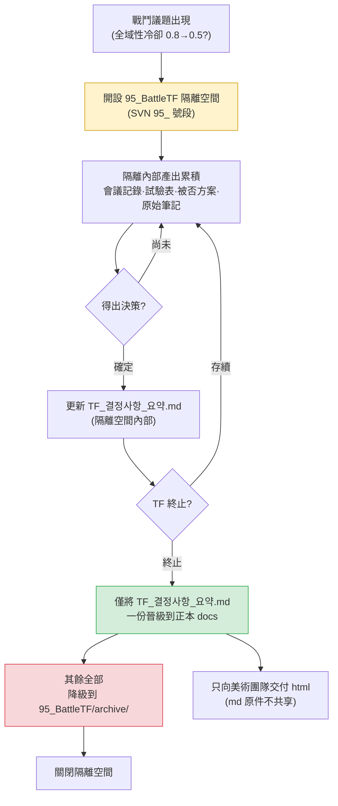

# 16.1 戰鬥 TF 運營 —— 在隔離的工作空間裡,只讓決策進入正本

週四下午4點。戰鬥 TF 會議結束,7個人各自回到工位。白板上留著關於是否要把全域性冷卻(GCD)從0.8秒下調到0.5秒的痕跡。資深數值策劃說"在我的模擬裡0.5才對",程式碼主程說"0.5的話伺服器 tick 跟不上"。UI 設計師說"兩邊我都說不好,只知道冷卻條的寬度會變得太窄"。

三個人說的都對。而一旦三個人都開始把各自的結論寫進自己領域的文件,下週這三份文件就會相互衝突。數值表裡寫著0.5,程式碼規格里寫著0.8,UI 指南里寫著0.6。誰看都分不清哪一份才是正本。

戰鬥 TF 存在的理由,正是在一個地方吸收這種衝突。而這種吸收的產物——唯一的一個決策——才應當進入正本文件。其餘討論的殘渣都應當止步於隔離的工作空間之內。本章討論的就是這種隔離與吸收的機制。

---

## 16.1.1 TF 不是常設部門,而是隔離的工作空間

戰鬥系統的大改不會只涉及一個工種。只要動一個全域性冷卻,平衡(數值)、程式碼(伺服器 tick)、UI(計量條呈現)、動畫(動作時長)、音效(打擊感)就會同時受到牽動。如果把這類議題按領域各自推進,決策會拖上2\~4周,而且即便做出決策,各領域之間也會彼此錯位。

TF(TaskForce,專項組)就是為了防止這種錯位,把多個工種暫時聚到一個工作空間裡的單位。關鍵在於"暫時"和"隔離"。如果把 TF 的討論原樣流入公司的正本文件體系,未經驗證的討論、被否決的方案、正在試驗中的數值就會汙染正本。因此我們在 SVN 裡建立一個以 `95_` 編號開頭的隔離工作空間。

`95_BattleTF`。95 號段的編號是一個約定,表示短期 TF 工作空間。一般的正本 docs 使用 10 號段、20 號段的編號,而 90 號段是"臨時·隔離·計劃終止"的訊號。只看資料夾編號,就能立刻傳達出"這裡不是正本,不要引用在這裡看到的數值"。

隔離的規則很簡單。

- TF 內部產出的所有文件(會議記錄、試驗表、被否決的方案、原始筆記)只存在於 `95_BattleTF` 之內。
- TF 終止時,只把 `TF_결정사항_요약.md` **唯一一份**晉級到正本 docs。
- 其餘全部下沉到 `95_BattleTF/archive/`,僅作留存。

TF 固化為常設部門之所以危險,原因就在這裡。一旦隔離被打破,TF 工作空間裡未經驗證的數值就會開始被當作正本引用,同樣的決策每個季度都會在別的場合被重新推翻。

---

## 16.1.2 從隔離到吸收:整體流程

戰鬥 TF 的一個週期,結構上就是:開啟一個隔離空間,在其中積累討論、試驗與決策,終止時只把決策吸收進正本。



議題從左上角進來,在黃色的隔離空間裡處理掉所有雜音,只有綠色的那一格——決策摘要——離開進入正本。紅色代表降級。這一張圖就是 95 號段工作空間運營的全部。

---

## 16.1.3 實操記錄(worked transcript)—— 把決策摘要整理成可吸收的形態

TF 終止時最費手的事,是從一個季度的會議記錄、試驗表裡篩出"只有要晉級到正本的決策"。討論很長,被否決的方案和已確定的方案混在一起,同一個數值在每次會議裡寫得都略有不同。這件事若由人手工整理,光是終止工作就要花掉一整天。

以下是我實際執行的提示詞、Claude 的原始輸出,以及我如何驗證、否決、再請求它的全過程。這份實操記錄(worked transcript,完整保留的真實操作過程記錄)不做摘要,原樣刊出。

### 第一次提示詞(全文)

```
從下面 95_BattleTF 的 6 份會議記錄中,只挑出要晉級到正本的已確定決策,
生成 TF_결정사항_요약.md 的草稿。TF 即將終止。
只要已確定的(排除被否決、試驗中、"下次再說"的),每條決策
按 決策ID·主題·確定值·依據(資料來源)·決策者·確定日期 的格式。
同一主題若在每次會議裡數值有變,只保留最終值,捨棄之前的。
是否確定若不明確,不要捨棄,單獨歸入 [需複核];若沒有依據來源,標註 [依據未記錄]。

會議記錄:
--- 會議記錄 2026-W14-mon ---
議題1:全域性冷卻 0.8→0.5 評估。數值模擬(sim_gcd_0407.xlsx)顯示
0.5 使 DPS 方差 -12%。程式碼主程:0.5 因伺服器 tick(33ms)上限,請求暫緩。
決策:初步一致同意 0.6(暫定)。下次會議前由程式碼側做 0.6 負載測試。
議題2:閃避 i-frame 12f→10f。動畫總監稱動作為 8f,10f 會造成視覺斷裂。
決策:確定維持 12f。決策者 策劃主管。
...(無省略,實際放入的是 6 份會議記錄全文)...
--- 會議記錄 2026-W16-thu ---
議題1:全域性冷卻。0.6 負載測試通過(伺服器 tick 餘量 18%)。
決策:確定 0.6。決策者 策劃主管。依據 sim_gcd_0407.xlsx + load_0415.log。
議題3:擊殺獎勵金幣 1.2 倍。數值提案,無依據。暫緩。
```

### Claude 的原始輸出(原樣)

```markdown
# TF_결정사항_요약.md(草稿)

## 已確定決策

### D-GCD-01 | 全域性冷卻
- 確定值:0.6 秒(原 0.8 秒)
- 依據:sim_gcd_0407.xlsx(DPS 方差影響)、load_0415.log(伺服器 tick 負載餘量 18%)
- 決策者:策劃主管
- 確定日期:2026-W16-thu
- 備註:W14 曾提出 0.5,但因伺服器 tick 上限收斂到 0.6。0.5 方案作廢。

### D-IFRAME-01 | 閃避 i-frame
- 確定值:維持 12 幀
- 依據:[依據未記錄] —— 僅記錄了"動畫動作 8f 會造成視覺斷裂"這一定性判斷
- 決策者:策劃主管
- 確定日期:2026-W14-mon

## [需複核]

### R-COIN-01 | 擊殺獎勵金幣 1.2 倍
- 狀態:暫緩(數值提案,無依據資料)
- 判斷:因未提交依據無法確定。建議 TF 終止後轉為數值團隊的單獨議題。
```

### 我的驗證 —— 接受了什麼,拒絕了什麼

我逐條看了三個專案。

**D-GCD-01 原樣通過。** 捨棄 W14 的 0.5/0.6 暫定方案、只留下 W16 的 0.6 確定值,這是準確的。規則 3 得到了正確執行。把兩個依據來源合在一起也沒錯。

**D-IFRAME-01 被我拒絕了。** Claude 把它歸類為"確定",但依據是 `[依據未記錄]`。僅憑定性判斷(視覺斷裂)就放進確定決策,看正本的其他人就找不到"為什麼是 12f"的依據。這是規則 1 與規則 5 的衝突情形——Claude 因為決策者已確定就當作"確定",而我必須應用"沒有依據的確定不能進正本"這條我們的 docs 政策。這條政策沒有寫在會議記錄裡,Claude 自然無從知曉。

**R-COIN-01 分類正確,但開的"處方"過頭了。** "建議轉為數值團隊的單獨議題"是 Claude 編造出來的流程。我們公司沒有那樣的轉交軌道。分類(需複核)予以採納,處方句子則捨棄。

### 第二次再請求提示詞

```
把驗證結果反映進去,重做一遍。D-GCD-01 原樣保留,
D-IFRAME-01 因為依據只有定性判斷,從確定裡拿掉,移到 [補充依據後晉級]。
R-COIN-01 保留分類,但去掉"建議轉交"之類的處方句子——我們公司的流程你不清楚,只寫狀態和事實。
另外,不要編造會議記錄裡沒有的流程、軌道、團隊名稱,不確定就用 [需策劃主管判斷] 留空。
// (意圖:D-IFRAME-01 晉級正本的條件 = 會議記錄附上動畫總監的動作幀測量資料)
```

### 第二次輸出(最終版)

```markdown
# TF_결정사항_요약.md

## 已確定決策(晉級正本物件)

### D-GCD-01 | 全域性冷卻
- 確定值:0.6 秒(原 0.8 秒)
- 依據:sim_gcd_0407.xlsx、load_0415.log(伺服器 tick 負載餘量 18%)
- 決策者:策劃主管 / 確定日期:2026-W16-thu
- 備註:0.5 方案因伺服器 tick 上限作廢。

## [補充依據後晉級]

### D-IFRAME-01 | 閃避 i-frame 維持 12f
- 僅記錄了定性判斷(相比動畫動作 8f 的視覺斷裂)。
- 晉級條件:會議記錄附上動作幀測量資料。

## [需策劃主管判斷]

### R-COIN-01 | 擊殺獎勵金幣 1.2 倍
- 狀態:暫緩。數值提案,無依據資料。無確定值。
```

在這份最終版裡,只有"已確定決策"這一節——D-GCD-01 一條——晉級到了正本 docs。其餘兩節都下沉到了 `archive/`。一個季度的 6 份會議記錄,就此被吸收成正本里的一行。

AI 做到的和做不到的,在這裡分野。AI 橫跨 6 份會議記錄,追蹤同一主題的數值變化,分離被否方案,標註依據缺失——把六份會議記錄一行一行對照的這種簡單重複,恰恰是最容易從人手裡漏掉的環節。但"沒有依據的確定不能進正本"的政策適用、"沒有轉交軌道"這一公司事實、"確定/暫緩"的最終判斷,全都由人來做。抹去 AI 那部分,抽取與整理的勞動就消失了;但正本里放什麼,這個決定仍留在人的手裡。

---

## 16.1.4 外部請求以 3-track 分類後進入

進入 TF 的議題並非都來自內部。發行商、美術外包、商務團隊會提出"幫忙做一下這個戰鬥相關的事"的請求。如果不加甄別地都當作 TF 議題接下來,TF 就會淪為對外的接訴視窗。

因此,外部請求一收到就分成三條支線。只有需要戰鬥決策的才投入 95_BattleTF,一個領域就能了結的由負責人單獨處理,超出範圍、依據不足的則寫明理由後回覆、暫緩。進入 TF 的只有第一條支線——這是防止 TF 變質為接訴視窗的第一道防線。分類本身是人的判斷,但讀一讀收到的請求文本、先給"這件事牽涉幾個領域"打上初步標籤這種程度,可以先讓 AI 過一遍。

這套三角分類(`request-triangulate`)的判定順序、實操記錄、各軌道的後續處理,由下一章 16.2 專門講。這裡只點明"TF 只接第一條支線"這條入口規則。

---

## 16.1.5 只向美術團隊交付 html —— md 無需學習

TF 決策晉級為正本後,就把它共享給相關團隊。這裡存在一種不對稱。對美術團隊不給 Markdown 原件(.md),只交付渲染後的 html。

理由很簡單。美術團隊只需要知道決策的**結果**。"冷卻條請按 0.6 秒為基準重新確定寬度"——這一句就是他們需要的全部。md 原件裡含有決策 ID 體系、atom 引用、被否決的 0.5 方案的痕跡、依據資料的檔名。這些是策劃與程式碼共享的工作語言,並不是美術需要去學習的東西。

若原樣把 md 給過去,美術團隊要付出兩種成本。其一,為解讀與自己無關的標註體系而耗費時間。其二,可能把未經驗證、已被否決的資訊誤當成決策。html 擋住了這兩點——只呈現乾淨渲染後的決策結果,內部標註在構建過程中被過濾掉。

寫成原則就是:**工作語言(md)只在使用它的工種內部流轉,對外只輸出成果物(html)。** 這與 TF 工作空間隔離(95 號段)是同一套哲學。內部使用的原始素材留在內部,對外只送出被吸收後的結果。

---

## 16.1.6 TF 運營的根基 —— 五條原則

隔離·吸收機制要運轉起來,底下必須鋪著五條運營原則。缺了任何一條,TF 都會垮成一個清談場。

- **決策權明確** —— 會議上,誰是最終決策者,必須按議題型別事先定好。戰鬥規則歸策劃主管,數值歸資深數值策劃,實現方式歸程式碼主程,領域間衝突升級(escalate)到遊戲總監。決策權一旦含糊,會議就會拖成清談。
- **會議記錄義務** —— 沒有會議記錄的決策不算決策。它必須作為記錄留在隔離空間裡。終止時要吸收的原材料,正是這些會議記錄。
- **資料優先** —— 輸入的是資料,而不是意見。"我覺得"一多,TF 就會失效。前面實操記錄中讓系統自動標註 `[依據未記錄]`,也是這條原則的延伸。
- **時限** —— 給每個議題都附上決策、試驗、實現、驗證的時限。沒有時限的議題會漂上一兩週。
- **定期再評估** —— TF 不是永久的。每個季度重新審視是否存續。當季度決策數跌到一定數量以下,就解散或縮編。不過若預計下個季度議題會激增,則事先約定延長一個季度。

五條原則捆在一起運作時,隔離的 95 號段空間就不再是清談場,而成為決策工廠。

---

## 16.1.7 常見陷阱

整理 TF 運營中期以後反覆出現的陷阱與處方。

| 陷阱 | 症狀 | 處方 |
|---|---|---|
| 變質為清談場 | 只交換意見,不出決策 | 每次會議強制留 N 個決策槽位 |
| 越權 | TF 干預其他領域的決策 | 明確決策權表 |
| 成員負擔過重 | 重複參加 5\~6 個 TF,侵蝕本職工作 | TF 參與合計每週上限 8 小時 |
| 永久化 | 不解散,反覆開同樣的會 | 季度再評估 |
| 隔離洩漏 | 95 號段未經驗證的數值被當作正本引用 | 晉級正本只限決策摘要一份 |
| 對外脫節 | 決策不向外部共享 | 晉級正本 + 交付 html |

隔離洩漏最安靜,也最危險。資料夾編號的約定一旦崩塌,一切都會崩塌。

---

## 16.1.8 度量 —— TF 所吸收的東西

僅從作者專案A的運營記錄中摘取方向與比例。下面的數值不是絕對值,而是相對於沒有 TF 時、運營 TF 後的變化方向——絕對週期因團隊規模、構建週期而異(基於作者環境的觀察)。

| 專案 | 無 TF | 運營 TF | 方向 |
|---|---|---|---|
| 單條戰鬥決策的週期 | 各領域分頭,數週 | 數天量級 | 縮短 |
| 決策後領域間衝突 | 每季度多起 | 每季度少數 | 減少 |
| 遊戲總監升級(escalation) | 每週多起 | 每週 1\~2 起 | 減少 |
| 領域間資訊共享 | 零散 | 靠會議記錄、晉級正本固定下來 | 體系化 |

回收最多的,是遊戲總監的時間。領域間的決策被 TF 在隔離空間裡吸收掉,因此上升到總監層面的衝突就減少了。TF 歸根結底是一個裝置:把"過去由總監逐一調解的領域間共識",下放到一個工作空間裡來處理。

---

## 本章要點

- TF 是以 95 號段隔離的臨時工作空間,終止時只有一份決策摘要被吸收進正本。
- AI 橫跨會議記錄抽取、整理決策,但是否晉級正本由人來定。
- 外部請求以 3-track 分類,對美術團隊只送出成果物 html。

---

> **遊戲之外的應用。** "在隔離的工作空間裡,只讓決策進入正本"這一原理,原封不動地適用於所有與遊戲無關的跨部門專案。比如設想一個由市場、法務、銷售一起討論新版條款修訂的 TF。把會議記錄、評審意見、被否決的措辭草稿放在共享雲盤的臨時資料夾(像 `95_약관TF` 這樣的隔離空間)裡,TF 結束後只把 `최종_확정문구.docx` 一份上傳到公司正本文件庫,其餘下沉到歸檔。這樣一來,六個月後當有人問"這條條款當初為什麼這麼定"時,就能避免未確定的草稿冒充正本混進來的事故。

---

## 動手試試 —— 季度終止時的決策吸收

**setup**
- 在 SVN(或資料夾)裡建立 `95_BattleTF/` 隔離空間,把一個季度的會議記錄都收進去。
- 預先建好 `95_BattleTF/archive/`(降級物件要去的地方)。

**prompt**
- 把本章第一次提示詞連同會議記錄全文一起貼上。核心規則:① 只要已確定決策 ② 同一主題只留最終值 ③ 不明確時不要捨棄,分開標註 ④ 無依據就寫明 ⑤ 不要編造公司流程、團隊名稱。

**verify**
- 逐條檢視輸出中的"確定"分類。依據只有定性判斷的專案,從"確定"里拉下來(適用晉級正本政策)。
- 檢查 AI 生成的處方句子(轉交、軌道、建議)裡是否混入了並不存在的流程,發現就刪掉。
- 只把"已確定決策"這一節複製到正本 docs,其餘下沉到 `archive/`。

---

## 16.1.9 單人精簡版

對獨自工作的單人開發者,隔離·吸收同樣有效。把"TF"換成"我腦子裡的多個角色"就行了。

- 決定一個功能時,挖一個 `95_temp_결정/` 之類的臨時資料夾,把模擬、筆記、被否方案全都倒進去。
- 決定敲定後,只把 `결정요약.md` 一份移到主工作資料夾,臨時資料夾整個下沉到 `archive/`。
- 交給外部(美術外包、譯者)時,把決策摘要渲染成 html 只交付結果,自己的工作筆記(md)不要給。

有了隔離空間,僅憑資料夾位置就能區分"這個數值是已確定還是還在試驗中"。即使是一個人,這也是不把同樣的混亂留給未來的自己的最便宜的方法。
