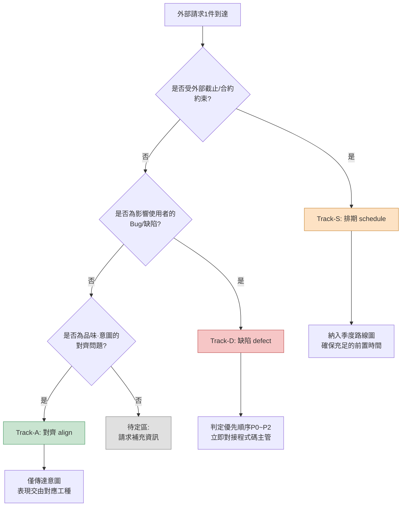

# 16.2 與其他工種的協作 —— 把外部請求分入三條軌道（3-track）

週二上午,即時通訊工具幾乎同時響了三次。

美術主管:"戰鬥特效的配色,現在的色調太暗沉了,可以做得更明快一些嗎?"

QA主管:"存在公會簽到獎勵發放兩次的情況。附上覆現影片。"

發行商負責人:"請在東南亞版本中落實伊斯蘭文化圈的指南。要在下個季度稽核之前完成。"

三條訊息的字數相近。然而,一條是30分鐘就能搞定的事,一條是必須立刻拉住程式碼主管處理的事故,一條是要塞進季度計劃裡的外部排期。僅僅因為它們落進了同一個收件箱就以同等分量對待的話,就會在30分鐘的小事上耗掉半天,而真正的事故卻被擱置到傍晚。

湧向策劃的請求,性質各不相同,差異之大不亞於工種的多樣。問題在於,它們全都以"一行訊息"這種相同的形態到達。本章討論的,就是在收到這些一行訊息的瞬間將其分入三條軌道的工作。軌道一旦分清,該立刻停下手頭做什麼、又該把什麼推到之後,就隨之確定了。

---

## 16.2.1 協作左右著本職工作

策劃既不直接寫程式碼,也不直接做美術和音效。他只是撰寫規格說明、傳達意圖、驗證結果。所有產出都要經由其他工種之手才能問世。因此,協作的質量直接決定策劃產出的質量。

在筆者擔任總監的專案A（移動優先的MMORPG,中等規模（10\~50人）團隊）中,策劃日常協作的工種鋪開來看是這樣的。

<svg viewBox="0 0 720 300" xmlns="http://www.w3.org/2000/svg" font-family="sans-serif" font-size="13">
  <rect x="300" y="120" width="120" height="60" rx="8" fill="#2b3a55" stroke="#1a2433"/>
  <text x="360" y="146" fill="#fff" text-anchor="middle" font-weight="bold">策劃</text>
  <text x="360" y="166" fill="#cdd6e5" text-anchor="middle" font-size="11">時間的40~60%</text>

  <g fill="#e8edf5" stroke="#9fb0c9">
    <rect x="40" y="30" width="130" height="44" rx="6"/>
    <rect x="40" y="100" width="130" height="44" rx="6"/>
    <rect x="40" y="170" width="130" height="44" rx="6"/>
    <rect x="40" y="240" width="130" height="44" rx="6"/>
    <rect x="550" y="30" width="130" height="44" rx="6"/>
    <rect x="550" y="100" width="130" height="44" rx="6"/>
    <rect x="550" y="170" width="130" height="44" rx="6"/>
  </g>
  <g fill="#1a2433" text-anchor="middle">
    <text x="105" y="50">開發（程式碼·工具）</text><text x="105" y="66" font-size="10" fill="#5a6a82">每天</text>
    <text x="105" y="120">美術</text><text x="105" y="136" font-size="10" fill="#5a6a82">每週2~3次</text>
    <text x="105" y="190">音效</text><text x="105" y="206" font-size="10" fill="#5a6a82">每週1~2次</text>
    <text x="105" y="260">動畫</text><text x="105" y="276" font-size="10" fill="#5a6a82">每週1~2次</text>
    <text x="615" y="50">QA</text><text x="615" y="66" font-size="10" fill="#5a6a82">每週1次+MS</text>
    <text x="615" y="120">運營·CS</text><text x="615" y="136" font-size="10" fill="#5a6a82">每週1次</text>
    <text x="615" y="190">外部（發行·平臺）</text><text x="615" y="206" font-size="10" fill="#5a6a82">每季度1~2次</text>
  </g>

  <g stroke="#9fb0c9" stroke-width="1.2" fill="none">
    <path d="M170 52 C 240 90, 270 120, 300 135"/>
    <path d="M170 122 C 230 130, 260 140, 300 148"/>
    <path d="M170 192 C 230 175, 260 162, 300 158"/>
    <path d="M170 262 C 240 210, 270 180, 300 170"/>
    <path d="M550 52 C 480 90, 450 120, 420 135"/>
    <path d="M550 122 C 490 130, 460 142, 420 150"/>
    <path d="M550 192 C 490 175, 460 162, 420 160"/>
  </g>
</svg>

策劃要與七個工種從每天到每季度不等地相互咬合。策劃在工位上花費的時間裡,有40\~60%都投入到這類協作中。花在本職(設計)上的時間,不過是剩下的那一半而已。既然如此,壓縮協作時間,就等於延長本職工作的時間。而吞噬協作時間的最大原因,在於無法對收到的請求分類,把精力耗在了不該耗的地方。

---

## 16.2.2 一行請求所隱藏的三種性質

回到前面的三條訊息。從表面上看,它們都是"請幫我……"。但在這背後,隱藏著三種不同的性質。

- 美術主管的配色請求屬於**品味與意圖的範疇**。它不是對錯問題,而是對齊(達成一致)的問題。幾乎不需要程式碼,也不需要排期協調。
- QA的重複獎勵Bug是**須立即處理的缺陷**。它直接關係到使用者資源,因此優先順序高,必須馬上安排程式碼主管介入。
- 發行商的指南落實是**受外部排期約束的變更**。它範圍廣,有季度稽核這一外部截止期,且牽涉多個工種。

筆者用一個詞分別稱呼這三種性質:**對齊 (align)**、**缺陷 (defect)**、**排期 (schedule)**。把收到的請求先塞進這三者之一 —— 在專案A中,這項工作被固化為一個名為 `request-triangulate` 的工作流。之所以取名三角測量 (triangulate),是取其用三個基準點(工種性質·緊急度·外部依賴)將一個點(請求)包圍起來、從而確定其位置之意。

分類流程如下。



提問的**順序**是關鍵。之所以最先追問排期依賴,是因為對於有外部截止期的事,前置時間優先於內部判斷。如果把距季度稽核還剩3周的事歸類為"以後對齊一下就行",那麼等對齊完成時,截止期已近在眼前。把缺陷放在第二位的理由是,已經在影響使用者的事,永遠優先於品味層面的討論。對齊排在最後。只有既不緊急、又不受外部約束、也不傷害使用者的事,"慢慢對齊"才成立。

如果三個問題的答案都是"否",那不是分類失敗,而是**資訊不足**。這種時候不要硬給它定軌道,而是放進待定區並反問回去。"這個是必須進下一個版本,還是先評估一下就好?"這樣一句話,通常就能定下軌道。

---

## 16.2.3 實操記錄（worked transcript）:把收件箱分入軌道

如果這套分類只在腦子裡做,忙碌的日子就會崩掉。因此,筆者的做法是把收到的一批請求整個丟給AI做初步分類,再對結果加以驗證·修正。下面幾乎原樣照搬了實際跑過的一輪。不做概括,連AI出錯的地方和筆者否決的部分都一併保留。

### 提示詞全文

```text
請把下面這些外部請求分入三條軌道 —— Track-S（排期:受外部截止·合約·稽核約束的）,
Track-D（缺陷:影響使用者的Bug,P0~P2判定）、Track-A（對齊:品味·意圖,以對齊收尾）。
按外部依賴 → 使用者影響 → 品味/意圖 的順序審視,歸入最先命中的軌道並據此確定,
三者都不是則放入待定,並給出1個反問的問題。
輸出按每條請求列出 | 軌道 | 依據(1行) | 下一步行動(1行) |。

[請求列表]
1. 美術主管:戰鬥特效配色暗沉。可否做得更明快?
2. QA主管:公會簽到獎勵重複發放Bug。有復現影片。
3. 發行商:在東南亞版本中落實文化圈指南。下個季度稽核前。
4. 音效總監:Boss BGM的前奏比戰鬥開始時機晚了0.5秒。
5. 運營團隊:多名使用者反饋"公會聊天字型太小"。
```

### Claude原始輸出

```text
| # | 軌道 | 依據 | 下一步行動 |
|---|------|------|-----------|
| 1 | Track-A | 配色色調屬品味·意圖範疇,與外部/Bug無關 | 僅傳達意圖(戰鬥的緊張感),飽和度決定交由美術 |
| 2 | Track-D | 獎勵重複=直接影響使用者資源,可復現 | 判定P0,立即對接程式碼主管,評估熱修復 |
| 3 | Track-S | 受季度稽核這一外部截止期約束 | 納入季度路線圖,拆解指南條目後估算前置時間 |
| 4 | Track-A | BGM時機看似是演出品味問題 | 與音效總監對齊 |
| 5 | Track-D | 字型可讀性屬UI缺陷 | 登記為P2 Bug |
```

### 人工驗證 / 否決

在第4條和第5條上,筆者停了下來。

**否決第4條。** AI把BGM前奏延遲看成了"演出品味(Track-A)"。但"比戰鬥開始時機晚0.5秒"不是品味,而是**同步缺陷**。問題很可能不在於更換音源本身,而在於BT(行為樹)上的觸發時點與音訊提示 (cue) 錯位。這件事不會靠對齊了結,而是要動到動畫·程式碼那邊的時序資料。→ **更正為Track-D。** 但因不影響使用者資源,定為P2。

**第5條降級為待定。** AI把"字型太小"徑直斷定為UI缺陷(Track-D)。然而,這到底是缺陷還是品味,僅憑訊息本身無法分清。如果字型是按設計規格渲染的、只是"感覺偏小",那更接近對齊(Track-A);如果是渲染得比規格更小、顯示出錯,那就是缺陷(Track-D)。→ **待定。向運營團隊反問:**"是相對於規格中的字號實際顯示偏小,還是希望把規格本身調大?"

### 再次請求

把否決的兩條納入考慮後再次投出的提示詞,追加指令很簡短。

```text
將第4條的'相對戰鬥開始延遲0.5秒'重新歸類為同步缺陷(Track-D, P2)。
補充1個問題,確認時序是在BT觸發/音訊提示中的哪一處錯位。
將第5條作待定處理,並明確寫出詢問'是否為相對規格的實際渲染'的問題。
```

再次輸出將第4條更正為 `Track-D / P2 / "確認BT戰鬥開始節點的音訊提示偏移量是否為0,或BGM片段本身是否含有0.5秒靜音"`,將第5條更正為 `待定 / "由運營團隊再確認:是相對規格渲染偏小,還是請求上調規格"`,如此回傳。至此,分類宣告完成。

在這裡,AI做的事和人做的事被清晰地區分開來。AI快速地對五條做了初步分配,給出了一張**沒有空格的表**。人則揪出了其中**軌道邊界微妙的兩條**(看似品味實為同步缺陷的BGM,看似缺陷卻可能是品味的字型)。把五格無遺漏地填滿,和察覺其中兩格填錯了,是兩種不同的能力;這份實操記錄正是把這兩件事分別交給各自擅長的一方來做。

---

## 16.2.4 每條軌道的處理各不相同

分類結束後,每條軌道都進入完全不同的後續工作。雖然從同一張表出發,終點卻各不相同。

被歸入 **Track-A（對齊）** 的請求,按"只傳達到意圖為止,表現交由委託"的原則處理。對於美術的配色請求,筆者給出的回答不是飽和度數值,而是意圖。"這場戰鬥是Boss第1階段,緊張感是核心。希望壓迫感優先於明快感。在此前提下,飽和度交由美術判斷。"策劃一旦直接指定飽和度數值,美術的自主性就被削減,產出的責任歸屬也隨之模糊。守住意圖與表現之間的界線,就是對齊軌道的全部。

被歸入 **Track-D（缺陷）** 的請求,接下來是優先順序判定與對接程式碼。公會獎勵重複(P0)當場移交給了程式碼主管,BGM同步(P2)則登記進待辦列表 (backlog),同時附上推測原因的問題。在缺陷軌道中,策劃的工作不是"修復",而是**排定優先順序並給出準確的輸入**。區分P0與P2的標準是"當下是否影響使用者資源·遊戲進度"。獎勵重複直接關係到資源,故為P0;BGM延遲0.5秒雖令人不適,卻不妨礙進度,故為P2。

被歸入 **Track-S（排期）** 的請求,進入季度路線圖。發行商的文化圈指南雖是一行請求,實際上卻會拆解成多個條目 —— 宗教象徵物的表現、色彩禁忌、文本方向、角色服飾。關鍵在於,一收到它就回復"會評估",並將其整體擱上季度計劃。有外部截止期的事,哪怕看著不大,前置時間也是命脈,一旦起步太晚,必定出事故。

把這三條岔路一目瞭然地對比,是這樣的。

<svg viewBox="0 0 720 240" xmlns="http://www.w3.org/2000/svg" font-family="sans-serif" font-size="13">
  <g>
    <rect x="20" y="30" width="210" height="180" rx="10" fill="#c9e4d0" stroke="#4f9d6a"/>
    <rect x="255" y="30" width="210" height="180" rx="10" fill="#f6c6c6" stroke="#c25151"/>
    <rect x="490" y="30" width="210" height="180" rx="10" fill="#fde2c4" stroke="#c98a3a"/>
  </g>
  <g text-anchor="middle" font-weight="bold" fill="#1a2433">
    <text x="125" y="58">Track-A · 對齊</text>
    <text x="360" y="58">Track-D · 缺陷</text>
    <text x="595" y="58">Track-S · 排期</text>
  </g>
  <g text-anchor="start" fill="#23303f" font-size="12">
    <text x="38" y="92">判定問題</text>
    <text x="38" y="112" fill="#3c5a45">是品味·意圖嗎?</text>
    <text x="38" y="142">策劃的工作</text>
    <text x="38" y="162" fill="#3c5a45">僅傳達意圖,</text>
    <text x="38" y="180" fill="#3c5a45">表現交由委託</text>

    <text x="273" y="92">判定問題</text>
    <text x="273" y="112" fill="#7a2e2e">影響使用者的Bug?</text>
    <text x="273" y="142">策劃的工作</text>
    <text x="273" y="162" fill="#7a2e2e">P0~P2判定,</text>
    <text x="273" y="180" fill="#7a2e2e">對接程式碼主管</text>

    <text x="508" y="92">判定問題</text>
    <text x="508" y="112" fill="#7a5320">受外部截止期約束?</text>
    <text x="508" y="142">策劃的工作</text>
    <text x="508" y="162" fill="#7a5320">拆解條目,</text>
    <text x="508" y="180" fill="#7a5320">確保前置時間</text>
  </g>
</svg>

分類準確時,同一收件箱裡的五行就會乾淨利落地分散到三條不同的處理線上。分類出錯時,缺陷會被拖進對齊會議白白耗掉時間,或者排期事項起步太晚,在截止期前夕爆發。

---

## 16.2.5 用TF隔離來協作

有時請求不是一兩條,而是成團湧來。比如發行商稽核前的那幾周,或戰鬥系統全面改版這樣的局面。這種時候,把工作本身隔離到 `95_BattleTF` 這樣的臨時工作空間裡,結束後只把決定提升為正本。那套隔離·吸收機制,以及"只向美術團隊交付html(md學習為0)"的做法,已在前一章16.1中全部講過。

從分類(3-track)的角度再補一句,是這樣的。膨脹成一整團的協作,大多是Track-S(排期)事項跨越多個工種被拆解的局面;當逐條按軌道處理已應付不來時,就把它挪進"隔離工作空間"這個高一層的容器裡盛放。也就是說,如果3-track分類是入口,那麼TF隔離就是容納通過入口的那一大團的房間。

---

## 16.2.6 常見失敗與處方

| 失敗模式 | 處方 |
|---|---|
| 把所有請求以同等分量處理 | 一收到就做3-track分類,從外部依賴開始問 |
| 把排期事項誤分為對齊 | 把判定順序的第1位固定為外部截止期的提問 |
| 把看似品味的同步缺陷當作對齊處理 | "時機/數值錯位"先懷疑是缺陷 |
| 把看似缺陷的品味斷定為缺陷 | 反問"是否為相對規格的實際渲染",轉入待定 |
| 在對齊軌道中策劃連表現也一併決定 | 只到意圖為止,表現交由工種委託 |
| 排期事項起步太晚 | 立即納入季度路線圖,確保前置時間 |

這張表的一半是分類階段的失誤,另一半是分類之後處理的失誤。即便分類準確,若各軌道的處理手法出錯,效果也會煙消雲散。(與TF隔離·提升·媒介相關的陷阱,參見16.1的陷阱表。)

---

### 本章要點

- 外部請求分為對齊·缺陷·排期三條軌道;若以同等分量對待,就會在30分鐘的小事上耗掉半天。
- 判定順序是外部截止期→使用者影響→品味;順序一旦搞錯,排期事項就會在截止期前夕爆發。
- AI擅長做沒有空格的初步分配,而軌道邊界的判定則由人更準確。

---

> **遊戲之外的應用。** 一行請求僅因落進同一個收件箱就被以同等分量對待,這個問題並非遊戲獨有,而是所有服務策劃·PM的日常本身。把湧入的請求分為"對齊(品味·方向)·缺陷(影響使用者的Bug)·排期(外部截止期)"三條軌道的分類法,換個領域照樣奏效。比如,某位Web服務PM的即時通訊工具裡同時落進"把按鈕顏色調亮一點(對齊)""支付收據被重複傳送(缺陷)""個人資訊保護法修訂落實截止還剩3周(排期)",那麼按外部截止期→使用者影響→品味的順序,歸入最先命中的軌道,就能立即為支付Bug安排人手,而法律修訂則從確保前置時間做起。

---

### 動手試試

**Web聊天機器人最簡路徑(無需終端)** —— 本章的核心不在於工作流指令碼,而在於"把一行請求分入對齊·缺陷·排期三條軌道"這一構想。這個構想,即使沒有CLI·hook·atom這套基礎設施,僅憑Web聊天機器人(ChatGPT或Claude網頁版)也能原樣再現。下面兩個步驟是主幹。
1. 把當天收到的請求不拘格式地一行行彙集起來。從即時通訊工具·郵件·備忘錄哪裡扒來都行。
2. 在Web聊天機器人的輸入框裡貼上下面的提示詞,再在其下貼上彙集好的請求列表。這就是把 `request-triangulate` 所做的初步分類,用手工做一遍。
   ```
   請把下面這些請求分入Track-A(對齊)/Track-D(缺陷)/Track-S(排期)。
   按外部截止期 → 影響使用者的Bug → 品味·意圖 的順序審視,歸入最先命中的軌道並確定,
   三者都不是則放入待定,並給出1個反問的問題。輸出為 | 軌道 | 依據1行 | 下一步行動1行 |。
   [貼上請求列表]
   ```
   接下來,只需人工驗證輸出表中的兩格 —— 如果"時機·數值錯位"被歸為對齊,就懷疑是同步缺陷;如果"某某偏小/偏慢"這類主觀感受上的不滿被斷定為缺陷,就反問"是否為相對規格的實際渲染",將其降為待定。指令碼·工作流,只需等到這套分類做熟了、每天的批次開始吃力時,再引入即可。

**setup.** 把湧入的外部請求彙集到一處(頻道·文件)。把三條軌道的定義各寫一行 —— 對齊(品味·意圖)、缺陷(影響使用者的Bug)、排期(外部截止期)。

**prompt.** 把彙集好的請求批次丟給AI,並固定判定順序。

```text
請把下面這些請求分入Track-A(對齊)/Track-D(缺陷)/Track-S(排期)。
按外部截止期 → 影響使用者的Bug → 品味·意圖 的順序審視,歸入最先命中的軌道並確定,
三者都不是則放入待定,並給出1個反問的問題。輸出為 | 軌道 | 依據1行 | 下一步行動1行 |。
[貼上請求列表]
```

**verify.** 在輸出表中親自驗證兩處。(1)如果"時機·數值錯位"被歸為對齊,就懷疑它是不是同步缺陷。(2)如果"某某偏小/偏慢"這類主觀感受上的不滿被斷定為缺陷,就反問"是否為相對規格的實際渲染",將其降為待定。只要人把握住這兩處邊界,其餘的就可以信任。

### 單人精簡版

如果你是既沒有團隊也沒有TF的單人開發者,那就保留軌道不變,只更換物件。把商店評論、Discord反饋、Beta測試者的備註彙集到一份文件裡,每週1次用上面的提示詞批次分類。對齊(品味)按"只要不與我的願景衝突就採納",缺陷(Bug)在當週處理,排期(商店稽核·活動截止)則連同前置時間一起錄入日曆。集中整備期間的隔離資料夾運作,照16.1的單人精簡版做即可。
