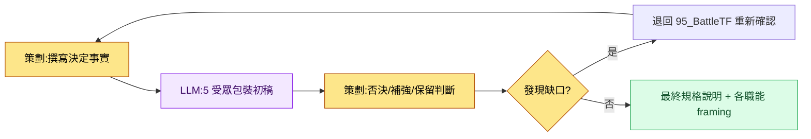

# 16.3 一個決定,三種包裝 —— 按職能包裝產出物的 framing

95_BattleTF 會議室。把公會簽到獎勵確定為資源 +5 的那天下午,我把同一個決定分發到了三個地方。策劃組頻道里放的是一份規格說明 markdown,程式組那裡是一行資料欄位,美術組那裡是一張單屏 html。三邊幾乎同時給了回應。主程問"觸發時機在哪裡",美術總監問"簽到按鈕的位置和 06_UI 指南對得上嗎",動畫師則什麼都沒說。明明是同一個決定,三個人看到的卻完全不同。

本章正是把這種"看法各異"從事故變成設計的記錄。把同一個決定按職能包裝成不同形態 —— 這就是 framing。

---

## 16.3.1 同一個決定,五個人各讀各的

公會簽到獎勵這一個決定,牽涉的受眾有五類。他們讀同一句話,也只挑自己領域的部分讀,其餘的都略過。被略過的地方就會出事故。

| 受眾 | 會專注去讀的 | 本能會跳過的 |
|---|---|---|
| 主程 | 資料欄位·介面·觸發時機 | 色調·敘事·演出 |
| 美術總監 | 介面佈局·元件·風格指南 | 資料完整性·觸發 |
| 音效總監 | 行為觸發·氛圍·時長 | 資料細節 |
| 動畫師 | 動作·時序·狀態轉換 | 視覺基調·數值 |
| QA | 驗收標準·風險·邊緣場景 | 實現方式的內部 |

問題不在資訊的量,而在呈現的方式。把一份厚厚的規格說明一模一樣地擺到五個人的桌上,五個人各自翻開不同的頁、合上不同的頁。framing 不把這種"翻開"交給偶然,而是有意去安排。

下面這張 framing 矩陣,展示同一個決定在跨越職能邊界時會換上怎樣的形態。

<svg viewBox="0 0 720 360" xmlns="http://www.w3.org/2000/svg" role="img" aria-label="同一個決定按職能拆分為不同產出物的 framing 矩陣">
  <rect x="0" y="0" width="720" height="360" fill="#fbfbfd"/>
  <!-- source decision -->
  <rect x="270" y="20" width="180" height="52" rx="8" fill="#1f2d3d"/>
  <text x="360" y="42" text-anchor="middle" fill="#ffffff" font-family="sans-serif" font-size="14" font-weight="bold">決定:簽到獎勵 = 資源 +5</text>
  <text x="360" y="60" text-anchor="middle" fill="#aeb9c6" font-family="sans-serif" font-size="11">95_BattleTF / 單一事實</text>
  <!-- arrows -->
  <line x1="360" y1="72" x2="120" y2="140" stroke="#9aa7b4" stroke-width="1.5"/>
  <line x1="360" y1="72" x2="360" y2="140" stroke="#9aa7b4" stroke-width="1.5"/>
  <line x1="360" y1="72" x2="600" y2="140" stroke="#9aa7b4" stroke-width="1.5"/>
  <!-- three framings -->
  <rect x="30" y="140" width="180" height="86" rx="8" fill="#e8f0fe" stroke="#4a73b8" stroke-width="1.5"/>
  <text x="120" y="162" text-anchor="middle" fill="#1f2d3d" font-family="sans-serif" font-size="13" font-weight="bold">策劃 → markdown</text>
  <text x="120" y="182" text-anchor="middle" fill="#33414f" font-family="sans-serif" font-size="11">意圖·規則·依據全文</text>
  <text x="120" y="200" text-anchor="middle" fill="#33414f" font-family="sans-serif" font-size="11">含供學習的上下文</text>
  <text x="120" y="218" text-anchor="middle" fill="#7a8794" font-family="sans-serif" font-size="10">spec_guild_attendance.md</text>

  <rect x="270" y="140" width="180" height="86" rx="8" fill="#fdeee8" stroke="#b8674a" stroke-width="1.5"/>
  <text x="360" y="162" text-anchor="middle" fill="#1f2d3d" font-family="sans-serif" font-size="13" font-weight="bold">美術 → html</text>
  <text x="360" y="182" text-anchor="middle" fill="#33414f" font-family="sans-serif" font-size="11">單屏·佈局·元件</text>
  <text x="360" y="200" text-anchor="middle" fill="#33414f" font-family="sans-serif" font-size="11">md 學習 0(僅傳達)</text>
  <text x="360" y="218" text-anchor="middle" fill="#7a8794" font-family="sans-serif" font-size="10">guild_screen_v3.html</text>

  <rect x="510" y="140" width="180" height="86" rx="8" fill="#e8f6ec" stroke="#4a9a5e" stroke-width="1.5"/>
  <text x="600" y="162" text-anchor="middle" fill="#1f2d3d" font-family="sans-serif" font-size="13" font-weight="bold">程式 → 資料</text>
  <text x="600" y="182" text-anchor="middle" fill="#33414f" font-family="sans-serif" font-size="11">欄位·介面·觸發</text>
  <text x="600" y="200" text-anchor="middle" fill="#33414f" font-family="sans-serif" font-size="11">明示校驗 lint 項</text>
  <text x="600" y="218" text-anchor="middle" fill="#7a8794" font-family="sans-serif" font-size="10">guild_table 1 row</text>
  <!-- invariant band -->
  <rect x="30" y="262" width="660" height="72" rx="8" fill="#ffffff" stroke="#c7ced6" stroke-width="1.2"/>
  <text x="360" y="286" text-anchor="middle" fill="#1f2d3d" font-family="sans-serif" font-size="12" font-weight="bold">不變事實(三種包裝都必須保留的內容)</text>
  <text x="360" y="308" text-anchor="middle" fill="#33414f" font-family="sans-serif" font-size="11">數值 = +5 · 時點 = 每日首次登入 · 範圍 = 全體公會成員</text>
  <text x="360" y="326" text-anchor="middle" fill="#7a8794" font-family="sans-serif" font-size="10">包裝可以不同,但這三個值只要對不上,framing 就失敗</text>
</svg>

包裝因受眾而異,但墊在底層的不變事實(數值·時點·範圍)在任何一種包裝裡都不能動搖。framing 的技藝不在於"呈現得不一樣",而在於"呈現得不一樣的同時,保留同樣的核心"。

---

## 16.3.2 實操記錄 —— 把一個決定做成三種包裝

如果每次都靠手工重新塑造 framing,負擔太大,最後就乾脆不做了。所以我採用這樣一種方式:丟擲一個決定,一次性拿到各職能的包裝初稿。下面是圍繞公會簽到獎勵這個決定實際往來的完整記錄。未加修飾,原樣搬來。

### 提示詞全文

```
[決定事實 —— 在 95_BattleTF 上確定]
- 公會簽到獎勵 = 公會資源 +5
- 觸發:公會成員當天首次登入時 1 次
- 範圍:該公會的全體公會成員各自
- UI:公會介面頂部顯示資源總量 + "簽到"按鈕

把這一個決定按三個職能分別包裝一下。
策劃用 markdown 寫意圖·規則·資料影響;美術把要放進 html 的介面規格
以佈局·元件·風格指南引用為中心(禁止提及資料·觸發);
程式用一行資料·介面·觸發·校驗項。
三種包裝都要把不變值(+5、首次登入 1 次、全體公會成員)一模一樣地釘進去,
不確定的值不要編造,用 [待確認] 標出。
```

### Claude 原始輸出(未做摘要與整理)

```
1) 策劃 → markdown

## 公會簽到獎勵
- 意圖:把每天 1 次的登入換算成公會層面的協作資源,以提升留存率。
- 規則:公會成員當日首次登入時,公會資源 +5。每天 1 次。以公會為單位累計。
- 資料影響:guild_resource_total 增加。需監控資源通脹 [待確認:上限未定]。

2) 美術 → 介面規格(放進 html 的內容)
- 在公會介面頂部區域顯示資源總量(progress_bar + 數字 badge)。
- 右側放"簽到"按鈕。按下時的狀態變化遵循 06_UI 指南的按鈕狀態規則。
- 樣式:符合 06_UI 指南。顏色 [待確認:公會主題色 token 未指定]。
- (資料數值·觸發在本包裝中有意排除)

3) 程式 → 資料/介面
- 資料:在 guild_table 中新增欄位 —— guild_resource_total (int, default 0)
- 介面:GuildResourceManager.add(guild_id, amount)
- 觸發:在每日首次登入事件鉤子中呼叫 add(guild_id, 5) 1 次
- 校驗:integrity_check_guild_resource(不可為負 / 攔截每日超過 1 次的呼叫)
- 併發:同一公會成員在多裝置同時登入時的重複累加 [待確認]
```

### 人工驗證·否決

原始輸出沒有直接採用。我抓出了三處。

- **否決**:美術包裝裡"按下按鈕時的狀態變化遵循 06_UI 指南"這句話。95_BattleTF 的原則是不讓美術組學習 md、只給它 html,而這種引用指南的措辭會誘使人跳轉到外部文件。為了讓內容在一張介面裡閉合,我決定把狀態示例內聯寫進去。
- **要求補強**:程式包裝裡的 `[待確認]` 兩處(資源上限、多裝置重複累加)是決定事實裡原本沒有的缺口。AI 沒有編造而是標了出來,這個判斷是對的;但這在 framing 之前先是決定本身的漏洞,應當退回 95_BattleTF。
- **保留**:三個不變值(+5、首次登入 1 次、全體公會成員)在三種包裝裡都被一致地寫入了。唯獨這部分我沒有動。

### 再次請求

```
修改一下美術包裝:
- 把"遵循 06_UI 指南"這類引用外部文件的措辭全部刪除。
- 把按鈕按下/等待/完成 3 種狀態的視覺差異直接寫進介面規格里。
- 以美術組只看這一張就開工為前提,做到自足,不跳轉到其他文件。

程式包裝裡的 [待確認] 2 項從產出物中拿掉,
改為在最上面單獨放一個"需 95_BattleTF 重新確認的項"區塊。
```

經過這一次的否決·再次請求,產出物變成了三個職能各自在自己崗位上拿來就能用的形態。AI 塑造出了三份包裝初稿,還在缺口處標了記號;但在哪一種包裝裡刪掉什麼 —— 從美術包裝裡去掉外部引用、從程式包裝裡剔除未定項 —— 這一刀終究還是落在我手裡。framing 的核心判斷不在於納入,而在於排除。

---

## 16.3.3 三種 framing 方式與回本時點

包裝放在哪裡,方式就隨之分岔。三種之中用哪一種,取決於規格說明的體量和運營的餘力。

**(1) 同一文件內的按受眾摘要。** 在正文之後附上各職能的摘要小節。五個人共享同一個檔案,但各自只讀自己那一節。

```markdown
## 按受眾摘要

### 程式碼(實現)
- 資料:guild_table.guild_resource_total (int)
- 介面:GuildResourceManager.add(guild_id, amount)
- 觸發:每日首次登入 1 次
- 校驗:integrity_check_guild_resource

### 美術(視覺)
- 介面:公會頂部資源總量 + 簽到按鈕
- 元件:progress_bar、badge、button(3 狀態)
- 優先順序:本次里程碑

### QA(驗證)
- 驗收標準:簽到後公會資源 +5 生效,攔截每日超過 1 次
- 風險:資源通脹、多裝置重複累加
```

**(2) 按受眾拆分的獨立產出物。** 在一個正文之外,再為各職能各自分出檔案。95_BattleTF 裡只給美術組發 html、不發 md 的做法,就是這種方式的實戰形態 —— 同一個決定,不同職能連媒介本身都不同。

```
spec_guild_attendance.md     — 策劃正文(完整上下文)
guild_screen_v3.html         — 美術(僅 html,md 學習 0)
guild_table 1 row + add()    — 程式(資料/介面)
qa_guild_attendance.md       — QA(驗收標準·風險)
```

適合體量大的規格說明,而且媒介能直接進入各職能的工具。代價是一個決定一改,就得連著修改多個產出物,運營負擔很大。

**(3) Wikilink 圖。** 正文裡只放各職能的起點連結,各人沿著自己的分支去探索。

```
[[spec_guild_attendance]]
   ├── [[code_guild_table]]
   ├── [[ui_guild_screen_v3]]
   └── [[qa_guild_attendance]]
```

三種方式的成本與回本如下。下表數值中的"效果"為作者估算(未經驗證),只應信賴方向與相對比例。

| 方式 | 成本 | 回本時點 |
|---|---|---|
| (1) 按受眾摘要 | 正文篇幅 +30% 上下 | 幾乎所有規格說明中都能立刻回本 |
| (2) 獨立產出物 | 運營 N 份產出物 | 僅當體量大且媒介按職能不同時才回本 |
| (3) Wikilink 圖 | 前期投入圖譜基礎設施 | 當規格說明累積到圖本身成為資產時才回本 |

大多數規格說明適用 (1)。成本最小,回本最快。(2) 只在像美術 html 這樣媒介已經分岔的場合使用;(3) 則在規格說明積累足夠、連結圖能產生探索價值時才開啟。

---

## 16.3.4 把受眾固定為五類

如果每份規格說明都重新定義受眾,framing 就每次都要重新塑造。所以要把代號固定下來。

| 受眾代號 | 領域 |
|---|---|
| code | 程式碼·系統·資料 |
| art | 美術·視覺·UI |
| sound | 音效·音響 |
| anim | 動畫·動作 |
| qa | QA·驗證 |

這五類就是內部運營標準。外包·法務這類外部受眾,在這套標準之外另行處理。固定為五類之後,把 framing 交給 LLM 時,就不必每次重寫受眾定義,還能用清單抓出被漏掉的受眾。

---

## 16.3.5 自動化及其陷阱

如果每份規格說明都手工寫五個職能的摘要,最後就不寫了。所以我把流程這樣串了起來。



策劃只寫決定事實,LLM 就生成五份包裝初稿,策劃再判斷否決·補強·保留。一旦出現缺口(`[待確認]`),就不在 framing 階段處理,而是退回決定階段 —— 因為 framing 不是填補決定漏洞的工具,而是搬運既定決定的工具。

在這個迴圈裡反覆踩中的四個陷阱,連同對策一併列在下面。

| 陷阱 | 症狀 | 對策 |
|---|---|---|
| 資訊重複 | 同樣的內容在正文·摘要裡重複,加重運營負擔 | 正文寫 1 次,摘要只寫差異項 |
| 資訊遺漏 | 對某個職能至關重要的值整塊缺失 | 用 5 受眾固定清單檢查遺漏 |
| 忽略正文 | 只看摘要,漏掉正文的上下文 | 在摘要末尾註明"依據見正文" |
| 媒介錯配 | 給美術發 md,增加學習負擔 | 固定職能媒介原則(美術=html) |

自動化能把撰寫負擔降到每份規格說明 5 分鐘上下,但否決·補強·保留的判斷並不會隨之自動化。那份判斷才是人的位置。

---

## 16.3.6 度量 —— 開啟 framing 之後

下面是作者所運營的專案A中,framing 引入前後的對比數值。絕對數值為作者估算(未經驗證),值得信賴的是變化的方向與相對比例。

| 指標 | 無 framing | 有 framing | 方向 |
|---|---|---|---|
| 各職能誤讀事故 | 每季度 15\~20 起 | 每季度 3\~5 起 | 大幅減少 |
| 受眾閱讀規格說明的時間 | 15\~30 分鐘 | 5\~10 分鐘(只讀自己那節) | 減少 |
| 從決定到開工 | 1\~2 天 | 4\~8 小時 | 縮短 |
| 各職能間的解讀衝突 | 每季度 8\~12 起 | 每季度 2\~3 起 | 減少 |
| 規格說明的撰寫時間 | 1\~2 小時 | 1.5\~2.5 小時(LLM 輔助) | 小幅增加 |

規格說明的撰寫本身會稍微變長,因為要疊加各職能的包裝。但在那之後,各職能的作業週期縮短,從決定到開工的整體時間隨之減少。這一權衡正是引入 framing 的核心依據。如果團隊覺得 LLM 輔助審校負擔重,那麼先在方式 (1) 中把手寫的 5 受眾摘要固定下來、再疊加自動化,這個順序更穩妥。

---

> **遊戲之外的應用。** 把同一個決定按受眾包裝成不同形態、而不變事實(數值·時點·範圍)在任何地方都保留,這套 framing 不只用於遊戲,也原樣適用於任何組織的公告與釋出溝通。比方說,如果決定了"訂閱費從 7 月 1 日起上調到 9,900 韓元(約 50 元人民幣)"這一件事,那麼對開發組是計費表字段·生效時點這類資料,對設計組是一張通知橫幅介面,對客服組則是預估諮詢的應答話術,包裝就此分岔。三種包裝各不相同,但"9,900 韓元·7 月 1 日·新老訂閱使用者全體"這三個數字,只要在任何一種包裝裡對不上,那一刻客戶糾紛就會爆發。

---

## 16.3.7 動手試試

**setup**

- 把 5 種職能受眾(code·art·sound·anim·qa)作為固定定義錄入團隊 wiki。
- 定好各職能的媒介原則(例:美術=html、程式=資料 row、策劃=md)。
- 把一份規格說明按決定事實的形式準備好(不變值 = 明示數值·時點·範圍)。

**prompt**

```
[決定事實]
(數值·時點·範圍逐行寫)

把這個決定按 code·art·sound·anim·qa 中相應的職能來包裝。
每種包裝都去掉該職能不關心的資訊,但不變值(數值·時點·範圍)在任何包裝裡都一模一樣地釘進去,
美術包裝不引用其他文件、僅憑這一張就自足;不確定的值不要編造,用 [待確認] 標出。
```

**verify**

- 逐行對照三種包裝,確認不變值(數值·時點·範圍)是否全都一致。
- 如果出現 `[待確認]`,不要在 framing 處理,而要退回決定階段(95_BattleTF 類的 TF)。
- 如果美術包裝裡還留有引用外部文件的措辭,請刪除。

**單人精簡版**

如果你是一個人工作,就把受眾減到兩類 —— "以後的我"(實現)和"審校者"(QA)。寫下一行決定事實,請 LLM"把它拆成實現備忘和審校清單兩份",然後只需對照這兩份裡的核心數值是否一致即可。哪怕受眾只有兩類,"把同一個決定包裝成不同形態、但保留不變值"這一 framing 骨架照樣運作。

---

### 本章要點
- 把同一個決定按職能包裝成不同形態、同時保留不變值,這就是 framing 的本質
- framing 的核心判斷不在於放進什麼,而在於在哪種包裝裡刪掉什麼
- LLM 能做到包裝初稿與缺口標註為止,否決·補強·保留的判斷則歸於人
