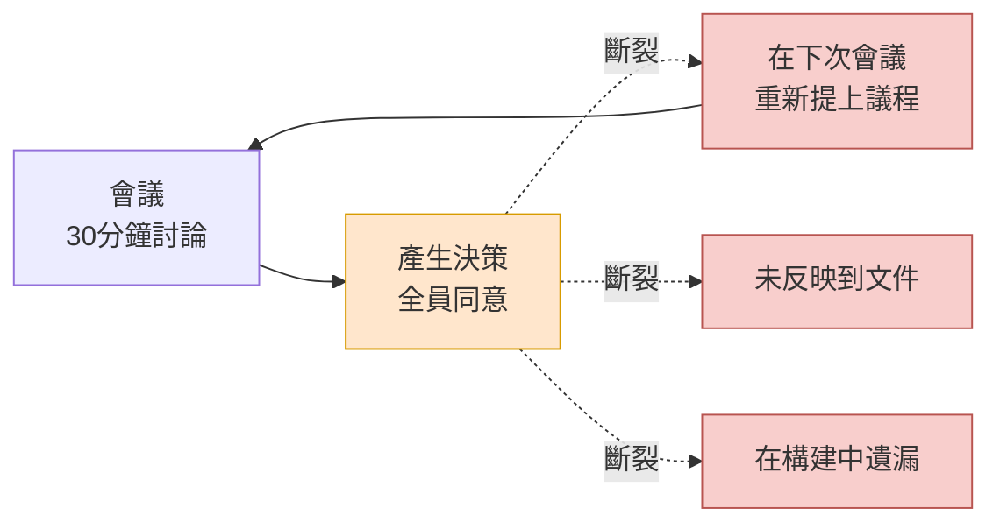
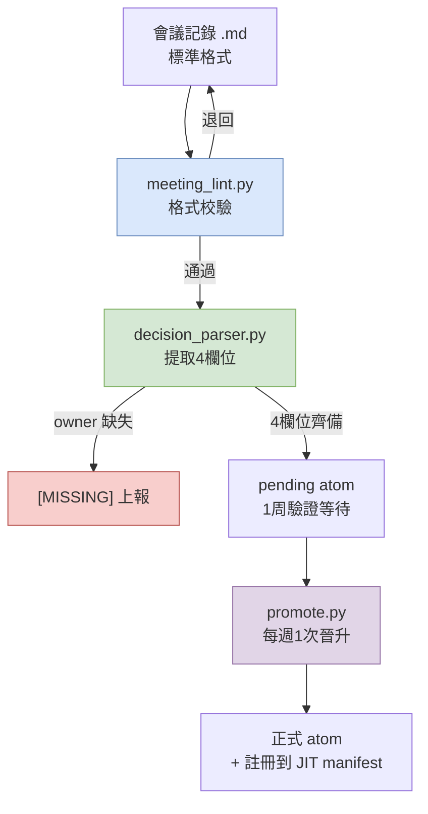

# 17.1 會議記錄為何是最大的痛點

會議結束已過去5分鐘。會議室的白板上還留著字跡。"戰鬥受擊判定,採用客戶端先行處理。但伺服器驗證的優先順序放到下一個衝刺。"這是5個人花了30分鐘才得出的結論。所有人都點了頭,有人還拍了照片。

3周後,同樣的5個人再次聚到同一間會議室。議程列表的第一行寫著:"戰鬥受擊判定 —— 客戶端先行處理 vs 伺服器驗證,需要決策。"沒有人記得3周前的結論。白板照片存在某人的相簿裡的某個角落,而那個人今天休假。又花了30分鐘。這次得出了相反的結論。

這就是會議記錄之所以是最大痛點的全部原因。會議上會作出決策。然而那個決策卻**無法流轉(propagate)**到下一次會議、下一份文件、下一個構建。決策作出了,卻無法傳播。本章講的正是用資料接續那道斷裂環節的故事。

---

## 17.1.1 會議 → 決策 → 執行,斷在何處

筆者運營的個人 RnD 系統分成了17份文件:atom 命名規範、關係圖自動化、Layer 對映指南、JIT 注入基礎設施等。其中吞掉最多時間的單一文件,是會議記錄改進計劃。它的分量之大,足以與其他16份加在一起相提並論。

起初我感到不解。會議記錄嘛,不就是照著記下來就行了嗎?然而實際測量後發現,痛點的位置不在會議記錄的*撰寫*,而在會議記錄*之後*。會議上決策確實作出了。問題在於:這個決策由誰負責、依據什麼、期限到何時、接續到什麼 —— 這些在走出會議室門的那一刻就蒸發了。

把這道斷裂畫成一個場景,便是如此。



虛線就是斷裂的傳播。決策(橙色)作出了,卻沒有流向三條分支(紅色)中的任何一條。無法流出的決策會在3周後回到會議上。箭頭向上彎折、重新回到會議的那個迴圈,正是痛點的本體。

一旦傳播斷裂,四件事會同時發生。

失去決策的歷史。面對"當初為什麼那麼定?",只能以"記不清了,再約一次會吧"來回答。重複會議增多。同一議題每個季度都被重新提上議程。新加入者抓不住上下文。由於看不到決策的累積,每次都得一對一地解釋。而且 AI 輔助變得無力。因為沒有上下文,回答只停留在泛泛之談。會議記錄一旦散落各處,就無法把"我們團隊以前對這個議題是怎麼決策的"提供給 AI,於是 AI 只會返回網際網路上的平均值。

這四件事都出自同一個根源。**因為決策被當作備忘,而非當作資料來對待。**備忘會揮發,而資料會流動。

---

## 17.1.2 把會議記錄看作決策資料庫,而非產出物

這裡需要把視角翻轉一次。若把會議記錄看作"會議的產出物",那麼記下來、存檔,任務就結束了。存檔的會議記錄就像桌上的便籤紙。當天看得見,到了下週就不知道去哪兒了。

若把會議記錄看作"決策資料庫",它就變成了一項完全不同的工作。資產不是會議記錄本身,而是從會議記錄中提取出來的**決策**;這個決策必須可檢索、可引用、可傳播。會議記錄只不過是一條把決策開採上來的礦脈罷了。

用程式碼強制推行這一轉變,正是第17部分的主幹。筆者的系統裡有一個支撐這一轉變的 atom,名為 `decision_summary_not_clickup_mirror`。展開來說,它是"會議記錄的決策摘要不是 ClickUp(任務追蹤器)的映象"這一原則。

這個 atom 為何必要,正戳中了痛點的要害。很多團隊會把會議記錄的決策槽直接謄抄到任務看板上。這樣一來,"要做的事"留下了,"為什麼那麼定(依據)"卻消失了。任務追蹤器裝的是*要做什麼*,而不裝*為什麼那麼定*。3周後會議重複的原因,恰恰就是這個。要做的事已經關閉,卻沒有依據,於是有人問起"話說這個當初為什麼決定要這麼做來著",卻沒人答得上來。所以決策摘要不能成為追蹤器的映象,而必須是一份懷有依據(rationale)的獨立資產。atom 名稱本身就是這條禁止線。

---

## 17.1.3 把決策拆成四個欄位

能夠傳播的決策與會揮發的決策,差別在於結構。會揮發的決策是"採用客戶端先行處理"這樣一個句子。能夠傳播的決策則被分解成4個欄位。

<svg viewBox="0 0 720 300" xmlns="http://www.w3.org/2000/svg" font-family="sans-serif">
  <rect x="0" y="0" width="720" height="300" fill="#fbfbfb" stroke="#ddd"/>
  <text x="360" y="32" font-size="17" font-weight="bold" text-anchor="middle" fill="#333">一條決策 = 4個欄位</text>
  <!-- decision -->
  <rect x="30" y="60" width="310" height="80" rx="6" fill="#dae8fc" stroke="#6c8ebf"/>
  <text x="46" y="86" font-size="14" font-weight="bold" fill="#1f3a5f">decision</text>
  <text x="46" y="108" font-size="12" fill="#333">定了什麼</text>
  <text x="46" y="128" font-size="11" fill="#666">"受擊判定 客戶端先行處理"</text>
  <!-- owner -->
  <rect x="380" y="60" width="310" height="80" rx="6" fill="#d5e8d4" stroke="#82b366"/>
  <text x="396" y="86" font-size="14" font-weight="bold" fill="#2d5016">owner</text>
  <text x="396" y="108" font-size="12" fill="#333">誰來負責</text>
  <text x="396" y="128" font-size="11" fill="#666">團隊成員 A(沒有則 [MISSING])</text>
  <!-- rationale -->
  <rect x="30" y="160" width="310" height="80" rx="6" fill="#ffe6cc" stroke="#d79b00"/>
  <text x="46" y="186" font-size="14" font-weight="bold" fill="#7a4f00">rationale</text>
  <text x="46" y="208" font-size="12" fill="#333">為什麼那麼定</text>
  <text x="46" y="228" font-size="11" fill="#666">"體感響應速度優先,承受外掛風險"</text>
  <!-- follow_up -->
  <rect x="380" y="160" width="310" height="80" rx="6" fill="#e1d5e7" stroke="#9673a6"/>
  <text x="396" y="186" font-size="14" font-weight="bold" fill="#4a2d5f">follow_up</text>
  <text x="396" y="208" font-size="12" fill="#333">接續到什麼</text>
  <text x="396" y="228" font-size="11" fill="#666">"下一個衝刺的伺服器驗證任務"</text>
  <!-- caption -->
  <text x="360" y="278" font-size="12" text-anchor="middle" fill="#555">owner 為空時管線以 [MISSING] 上報 —— 強制傳播的責任線</text>
</svg>

4個欄位中最重要的是 `owner`。決策若沒有負責人,那個決策就不是任何人的事;而不是任何人之事的決策,不會傳播到執行。所以筆者的提取管線在 owner 為空時不會就那樣放過,而是用 `[MISSING]` 明確上報。它把"責任線為空"這一事實本身抬升到表面上來。

`rationale` 是前面所說的 `decision_summary_not_clickup_mirror` 原則所棲身的地方。沒有依據,3周後會議就會重複。`follow_up` 是決策通向實際執行的橋。這個欄位一旦為空,決策就只停留為決策,觸及不到構建。

---

## 17.1.4 提取管線 —— 從會議記錄中開採決策

這4個欄位由人每次手動填寫也是可行的,但那樣強制力就弱。筆者的系統使用一條從會議記錄中自動提取決策、並上報缺失欄位的管線。3個指令碼序列相接。



第一步 `meeting_lint.py` 檢查會議記錄是否遵循標準格式:是否有 frontmatter,議題/決策/行動/下次會議這4個槽是否已填。格式損壞的會議記錄會在這裡被退回,回到撰寫者手中。自動解析器只能處理格式受強制約束的輸入,因此這道 lint 充當整條管線的入口關卡。

第二步 `decision_parser.py` 是核心。它讀取決策槽,分解為4個欄位(decision/owner/rationale/follow_up)。這裡若找不到 owner,不會丟棄那個決策,而是以 `[MISSING]` 上報。因為讓沒有負責人的決策悄然通過是最危險的。

第三步是:被提取出來的決策不會立刻成為正式資產,而是以 `pending` 狀態等待1周。這段驗證期就是可逆關卡。若在1周內暴露出"這不是決策,而是討論"或者"依據錯了",就將其廢棄。然後 `promote.py` 在每週1次的評審中,只把存活下來的決策移到正式 atom 資料夾,並註冊到 JIT manifest。被註冊的決策會從下一次會話起自動注入到相關工作中。至此,決策才開始流動。

可逆與不可逆的邊界就在這裡。到 pending 廢棄為止都是可逆的。然而一旦 promote 結束、決策傳播到其他文件、資料表、構建,從那時起就是不可逆的。因為團隊成員的認知會改變,而從屬決策會在其之上層層堆積。所以一切審校都必須在 promote 之前 —— 也就是 pending 的可逆區間內 —— 完成。

---

## 17.1.5 實操記錄 —— 讓一份損壞的會議記錄通過

只講抽象難以體會,所以這裡原樣搬來一份把實際損壞的會議記錄放進管線跑一遍的實操記錄(worked transcript)。輸入是一份格式塌了一半的會議記錄。

**輸入 —— `2026-06-02-battle.md`(格式不良)**

```markdown
---
type: meeting_note
date: 2026-06-02
category: battle
---

## 議題
1. 受擊判定位置(客戶端 vs 伺服器)

## 決策
- 受擊判定決定在客戶端先行處理。體感響應速度比伺服器往返
  更重要的意見佔了上風。外掛風險予以承受。
- 伺服器驗證放到下一個衝刺,作為獨立任務。

## 行動項
- [ ] 伺服器驗證設計
```

這份會議記錄雖然寫了決策,但 owner 哪裡都沒有。誰來負責伺服器驗證是空的。下次會議的日程槽也整個缺失。我把它放進解析器,看看會得出什麼。

**提示詞(附加在 decision_parser.py 上的 LLM 輔助提示詞全文)**

```
讀取以下會議記錄的 "## 決策" 槽,為每條決策提取4個欄位:
decision、owner、rationale、follow_up。
- 若無法從正文中確定 owner,必須標註為 "[MISSING]"。
  不要靠推測填充。
- rationale 只引用正文中寫明的依據。沒有則填 "[MISSING]"。
- follow_up 與行動項或下一個衝刺的提及相關聯。
僅以 JSON 陣列輸出。

[貼上會議記錄正文]
```

**Claude 原始輸出(不作摘要,原樣呈現)**

```json
[
  {
    "decision": "受擊判定在客戶端先行處理",
    "owner": "[MISSING]",
    "rationale": "體感響應速度比伺服器往返更重要。外掛風險予以承受",
    "follow_up": "伺服器驗證作為下一個衝刺的獨立任務推進"
  },
  {
    "decision": "把伺服器驗證分離為下一個衝刺的獨立任務",
    "owner": "[MISSING]",
    "rationale": "[MISSING]",
    "follow_up": "與行動項'伺服器驗證設計'關聯(負責人未指定)"
  }
]
```

在這裡停下,檢查了輸出。兩條決策的 owner 都被判為 `[MISSING]`。準確 —— 會議記錄裡哪裡都沒有負責人,所以沒有靠推測填充是對的。第二條決策的 rationale 也是 `[MISSING]`,實際上正文中確實沒有第二條決策的依據。這意味著解析器沒有編造,讓人放心。

不過有一處含糊。第一條決策的 follow_up 是"把伺服器驗證放到下一個衝刺",這與第二條決策內容重疊。解析器把兩條決策的邊界看得略微模糊了。這是需要人介入的地方。

**人工否決 + 重新請求**

```
第一條決策的 follow_up 與第二條決策正文重複。
把第一條的 follow_up 收窄為"建立伺服器驗證任務",
伺服器驗證的具體內容移交給第二條決策。
並且兩條決策的 owner 都是 [MISSING],因此
在把這份會議記錄放上 pending 之前,需要確定 owner 這一點,
把該警告行加到輸出的最頂端。
```

**Claude 重新輸出(原始)**

```
⚠️ 警告:2條決策的 owner 均為 [MISSING]。pending 晉升前
   需請會議主持人確定 owner。

[
  {
    "decision": "受擊判定在客戶端先行處理",
    "owner": "[MISSING]",
    "rationale": "體感響應速度優先,承受外掛風險",
    "follow_up": "建立伺服器驗證任務(詳情見決策 #2)"
  },
  {
    "decision": "把伺服器驗證分離為下一個衝刺的獨立任務",
    "owner": "[MISSING]",
    "rationale": "[MISSING]",
    "follow_up": "關聯'伺服器驗證設計'行動項"
  }
]
```

這段實操記錄展示的正是第17部分的核心。解析器把決策開採了上來,卻沒有隱藏 owner 這條責任線為空的事實。`[MISSING]` 被標了兩次,而這作為"請確定 owner"的訊號回到了會議主持人那裡。決策要傳播到執行,就必須有負責人;沒有負責人時,系統會把它推到表面上來。一份損壞的會議記錄要通過這道關卡,人就只能把 owner 填進去。傳播的第一個結,就在這裡打上。

順帶一提,上面輸出中的 `⚠️` 只是控制台的警告行,並非正文格式的一部分。會議記錄本身仍然是乾淨的4槽 Markdown。

---

## 17.1.6 剪去旁枝,立起脊柱

第17部分原本設計為6章(動機·提取·分類·圖注·同步·AI 輔助),後來合併精簡為4章。因為影像圖注與同步是會議記錄的旁枝,而把最大的痛點"決策傳播"歸攏為一章、立在前面才是對的。我把最大的痛點(會議 → 決策 → 執行 傳播)提到 §17.1,再把紓解這一痛點的管線(meeting_lint → decision_parser → promote)緊隨其後安排。

把會議記錄當作資料庫來對待的視角、把決策拆成4欄位的結構、owner 為空時以 `[MISSING]` 上報的關卡、pending 1周的可逆驗證 —— 這四者把斷裂的傳播重新接續起來。決策作出了卻不流動的痛點,只要把決策做成能夠流動的形態,就能紓解。

---

### 本章要點
- 痛點的本體不是會議記錄的撰寫,而是會議 → 決策 → 執行 傳播的斷裂。
- 決策要拆成4欄位(decision/owner/rationale/follow_up)才會流動。沒有 owner 就以 [MISSING] 上報。
- 會議記錄不是產出物,而是決策資料庫(DB)。不能成為追蹤器的映象。

---

> **遊戲之外的應用。** "會議上決策作出了,那個決策卻無法流轉到下一次會議"這一痛點,不只發生在遊戲開發,而是每週在所有職場的會議室裡重複上演。把決策不寫成一句話的備忘,而是拆成四個欄位(做什麼·誰·為什麼·下一步行動)來記錄,負責人為空時以 `[MISSING]` 抬升到表面 —— 這種做法可以原樣搬到任何會議中。比如在營銷週會上,如果達成了"下一次活動以 Instagram 為中心"的共識,那就為它附上 owner(誰來執行)、rationale(為什麼是 Instagram —— 依據上季度的轉化率)、follow_up(編寫預算方案)。3周後"那件事誰說要做來著"這樣的疑問,就再也不會出現。

---

## 動手試試

**Web 聊天機器人最簡路徑(無需終端)** —— 本章的核心不是指令碼,而是"把決策拆成4欄位、讓它流動"這一構想。這一構想無需 CLI、hook、atom 基礎設施,僅憑 Web 聊天機器人(ChatGPT 或 Claude 網頁版)也能原樣重現。以下三個步驟才是主線。
1. 會議結束後,把會議記錄(或會議備忘)原樣複製。沒有格式也沒關係。
2. 在 Web 聊天機器人的輸入框裡貼上下面的提示詞,並在其下方貼上會議記錄(`[會議記錄正文]` 處)。這就是把 `decision_parser.py` 所做的事手動做一遍。
   ```
   從以下會議記錄中,為每條決策以表格形式提取4個欄位:
   decision(做什麼)、owner(誰負責)、rationale(為什麼)、follow_up(下一步行動)。
   - 無法確定 owner 時必須填 "[MISSING]"。禁止推測。
   - rationale 只取正文中寫明的依據。沒有則填 "[MISSING]"。
   [會議記錄正文]
   ```
3. 在輸出表中,把標了 `[MISSING]` 的格子向會議主持人確認後填上。把完成的表格按日期順序追加堆疊到 `decisions.md` 這樣一份文件裡,這份文件就是決策資料庫(DB)。檢索用文件內查詢(Ctrl+F)就夠了。指令碼、atom、JIT 等,等到這個習慣積累起來、檢索變得吃力時再引入即可。

**setup**(基礎設施版本 —— 在上面的最簡路徑上手之後)
- 確定一份會議記錄標準格式。frontmatter(type/date/category)+ 4個槽(議題/決策/行動/下次會議)。
- 準備3個指令碼:用於格式校驗的 `meeting_lint.py`、用於決策提取的 `decision_parser.py`、用於晉升的 `promote.py`(起初僅有 lint 與 parser 就夠了)。
- 明確決策的4個欄位:decision、owner、rationale、follow_up。把 owner 為空時強制 `[MISSING]` 的規則放進 parser。

**prompt**(附加在 decision_parser 上的 LLM 輔助提示詞)
```
讀取以下會議記錄的 "## 決策" 槽,為每條決策提取4個欄位:
decision、owner、rationale、follow_up。
- 無法確定 owner 時必須填 "[MISSING]"。禁止推測。
- rationale 只引用正文中寫明的依據。沒有則填 "[MISSING]"。
- follow_up 與行動項、下一個衝刺的提及相關聯。
僅以 JSON 陣列輸出。
[會議記錄正文]
```

**verify**
- 確認輸出中每條決策的 owner 都已填上。只要還有一個 `[MISSING]`,就必須先向會議主持人請求確定 owner,之後才放上 pending。
- 檢視 rationale 是否編造了正文中沒有的依據(沒有時應為 `[MISSING]` 才正常)。
- 在 pending 放置1周後,只把每週1次評審中存活下來的決策用 `promote.py` 晉升為正式 atom。

## 17.1.7 單人精簡版

如果3個指令碼讓你覺得負擔,就這樣精簡。只把會議記錄格式統一為4個槽,會議結束後僅取出決策槽,用上面的提示詞在 LLM 上跑一次。只對 owner 顯示為 `[MISSING]` 的決策,當場把負責人填進去。即使沒有自動化,僅做這一點,也能擋住"決策沒有負責人"這一最常見的傳播斷裂。lint、promote 等,等到會議記錄堆積、需要檢索時再新增即可。
