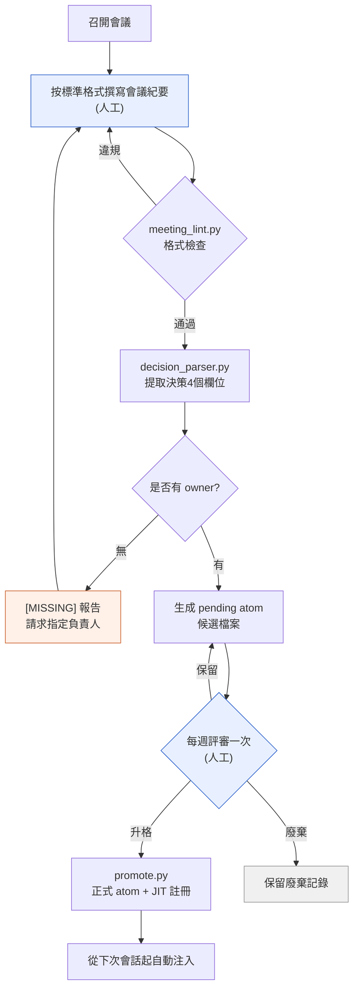

# 17.2 從會議紀要中挖掘決策的提取管線

週三早上,剛到公司,團隊即時通訊工具裡就彈出一條提醒。"上週不是定好把背包格子數增加到30格了嗎?誰負責改資料表來著?"沒有人能在這條討論串裡給出答案。會議紀要肯定是有的,在某個資料夾裡。開啟一看,議題和討論密密麻麻,可"到底決定了什麼、誰來負責"卻化在了字裡行間。結果下一次會議上,又把同一個議題從頭再提一遍。

本章講的是填補那三天空白的機器。一份會議紀要進來後,通過格式檢查,提取出決策的四個欄位,沒有負責人的決策會被貼上 [MISSING] 標籤,生成候選檔案,一週後經過評審,成為可自動注入的資產。人工只觸及兩端兩處——撰寫會議紀要的入口,以及每週評審一次的出口。

---

## 17.2.1 管線整體流程

先用一張圖看全貌。每一個方框要麼是一段小指令碼,要麼是人的判斷。需要人工經手的方框只有兩個,其餘都自動流轉。



只有兩個藍色方框(撰寫會議紀要、每週評審一次)是人工,其餘都是指令碼。橙色方框([MISSING] 報告)是自動檢查重新把人叫回來的地方。當決策沒有負責人時,管線並不是就此停下,而是把決策退回到撰寫會議紀要的步驟,直到定下誰來負責為止。這正是這條管線的核心設計——不悄悄放過空白,而是大聲報告出來。

整個資產的資料夾結構是這樣安排的。

<svg xmlns="http://www.w3.org/2000/svg" viewBox="0 0 720 300" font-family="monospace" font-size="13">
  <rect x="10" y="10" width="700" height="280" fill="#fafafa" stroke="#cccccc"/>
  <text x="24" y="38" font-weight="bold">meeting_pipeline/</text>
  <line x1="40" y1="48" x2="40" y2="270" stroke="#bbbbbb"/>
  <text x="52" y="68">scripts/</text>
  <text x="80" y="92" fill="#3366cc">meeting_lint.py</text>
  <text x="300" y="92" fill="#777777">格式·必需章節檢查</text>
  <text x="80" y="116" fill="#3366cc">decision_parser.py</text>
  <text x="300" y="116" fill="#777777">提取決策4個欄位 + owner [MISSING] 報告</text>
  <text x="80" y="140" fill="#3366cc">promote.py</text>
  <text x="300" y="140" fill="#777777">pending → 正式 atom + 更新 JIT manifest</text>
  <text x="52" y="172">meetings/</text>
  <text x="80" y="196" fill="#999999">2026-05-18_battle_tf.md</text>
  <text x="300" y="196" fill="#777777">標準格式會議紀要(輸入)</text>
  <text x="52" y="228">atoms/pending/</text>
  <text x="80" y="252" fill="#cc6633">meeting_decision_2026-05-18_D1.md</text>
  <text x="300" y="252" fill="#777777">候選(等待1周驗證)</text>
</svg>

---

## 17.2.2 第1步 —— 強制格式的 lint

要能提取,會議紀要就得是機器可讀的樣子。如果沒有 "## 決策" 章節,或者決策混在一整段行文裡,解析器就什麼都提不出來。所以最先加入的是格式檢查。`meeting_lint.py` 做的事很簡單:是否有必需的 frontmatter,是否有必需的章節,決策槽位是否以 `D1`、`D2` 的格式填好。

```python
# meeting_lint.py 骨架
REQUIRED_FRONTMATTER = ["type", "date", "category", "attendees"]
REQUIRED_SECTIONS = ["## 議題", "## 決策", "## 行動項", "## 下次會議"]
ALLOWED_CATEGORIES = ["art", "battle", "daily", "issue", "review"]

def lint(meeting_note_path):
    fm, body = parse_markdown(meeting_note_path)
    errors = []
    for key in REQUIRED_FRONTMATTER:
        if key not in fm:
            errors.append(f"缺少 frontmatter: {key}")
    if fm.get("category") not in ALLOWED_CATEGORIES:
        errors.append(f"category 值不合法: {fm.get('category')}")
    for section in REQUIRED_SECTIONS:
        if section not in body:
            errors.append(f"缺少章節: {section}")
    if "## 決策" in body:
        block = extract_section(body, "## 決策")
        if not any(l.strip().startswith("- D") for l in block.split("\n")):
            errors.append("決策槽位為空(需要 D1、D2… 格式)")
    return errors
```

把這項檢查掛到會議紀要的提交前鉤子上。一旦違反格式,提交本身就會被攔下。若只當作建議,忙的時候就會悄悄跳過,而跳過一次的格式到了下週就會垮掉。只要被攔上1\~2周,格式就會成為習慣。不過,要是太嚴苛,連撰寫會議紀要本身都會被拖延,所以在適應期之後把 false positive 集中清理一次,才是現實的運營方式。

---

## 17.2.3 第2步 —— 挖掘決策四個欄位的解析器

在通過格式檢查的會議紀要中,`decision_parser.py` 讀取決策槽位。從一條決策裡要提取的,正好是四樣東西。**決定了什麼(decision)、誰來負責(owner)、為什麼這麼定(rationale)、接下來該做什麼(follow_up)。** 這四個欄位讓決策成為資產。尤其是 owner。沒有負責人的決策不是決策,而是一廂情願的希望。所以當 owner 為空時,解析器不會悄悄留個空格,而是填入 `[MISSING]` 予以報告。

從這裡到最後,我們不跳過任何一行,跟著一份會議紀要變成資產的全過程走一遍。這是從輸入到 atom 升格的單一連貫示例。

```text
================ 輸入: meetings/2026-05-18_battle_tf.md ================
---
type: meeting
date: 2026-05-18
category: battle
attendees: [이민수, teammate_a, teammate_b]
related_atoms: [combat_global_cooldown_constant]
---
## 議題
- 統一戰鬥全域性冷卻(GCD)值
- 回覆技能是否作為 GCD 例外

## 決策
- D1: 將戰鬥全域性冷卻統一為0.5秒。(負責人: teammate_a) [依據: 與 refgame 對比的輸入響應體感測試中,0.5秒最為穩定]
- D2: 回覆技能從全域性冷卻中排除。[依據: 擔心回覆迴圈被打斷]

## 行動項
- @teammate_a: 將戰鬥資料表的 cooldown 列批次設為0.5 (~MM-DD)

## 下次會議
- MM-DD 14:00,評審回覆迴圈1周測試結果

================ $ python meeting_lint.py meetings/2026-05-18_battle_tf.md ================
[OK] frontmatter 4/4,章節 4/4,檢測到2條決策槽位。允許提交。

================ $ python decision_parser.py meetings/2026-05-18_battle_tf.md ================
[
  {
    "id": "D1",
    "decision": "將戰鬥全域性冷卻統一為0.5秒。",
    "owner": "teammate_a",
    "rationale": "與 refgame 對比的輸入響應體感測試中,0.5秒最為穩定",
    "follow_up": "將戰鬥資料表的 cooldown 列批次設為0.5 (~MM-DD)",
    "source_meeting": "2026-05-18_battle_tf.md",
    "category": "battle",
    "related_atoms": ["combat_global_cooldown_constant"]
  },
  {
    "id": "D2",
    "decision": "回覆技能從全域性冷卻中排除。",
    "owner": "[MISSING]",          # ← 未填寫負責人。解析器予以報告
    "rationale": "擔心回覆迴圈被打斷",
    "follow_up": null,             # ← 也沒有後續行動
    "source_meeting": "2026-05-18_battle_tf.md",
    "category": "battle",
    "related_atoms": ["combat_global_cooldown_constant"]
  }
]
[WARN] D2: owner=[MISSING] —— 沒有負責人的決策。暫緩生成 pending,退回會議紀要撰寫者。

================ 生成 pending: 僅 D1 通過 ================
$ cat atoms/pending/meeting_decision_2026-05-18_D1.md
---
name: meeting_decision_2026-05-18_D1
description: 戰鬥全域性冷卻統一為0.5秒的決策
status: pending
type: decision
source_meeting: 2026-05-18_battle_tf.md
owner: teammate_a
category: battle
related_atoms: [combat_global_cooldown_constant]
created: 2026-05-18
---
## 決策
將戰鬥全域性冷卻統一為0.5秒。
## 依據
與 refgame 對比的輸入響應體感測試中,0.5秒最為穩定。
## 後續行動
- [ ] @teammate_a: 將 cooldown 列批次設為0.5 (~MM-DD)

================ 1周後的每週評審 ================
$ python promote.py atoms/pending/meeting_decision_2026-05-18_D1.md
[PROMOTE] → atoms/combat_global_cooldown_constant_decisions/meeting_decision_2026-05-18_D1.md
[JIT] manifest 註冊: trigger=(전투|쿨다운|GCD|cooldown), atom 18個 → 19個
[OK] 從下次會話起,輸入"全域性冷卻"時自動注入該決策。
```

這一個方框就是管線的全部。值得注意的是 D2。決策內容沒問題,依據也有,可 owner 是空的。解析器不會就這麼放它通過。它填入 `[MISSING]`,暫緩生成 pending,並退回給撰寫者。D2 會在幾天後"評審回覆迴圈1周測試結果"的會議上獲得負責人,再次進入流程。正是這一次攔下空白的退回,讓三天後團隊即時通訊工具裡"那件事到底誰負責來著?"永遠不再出現。

"沒有 owner 就報告"這條規則本身,用一個 atom 固化了下來(`decision_summary_not_clickup_mirror`,§17.1.2)。任務工具裡也許掛著一條"修改資料表"的待辦,但這條待辦為什麼、是哪個決策的結果,只留在會議紀要 atom 裡。

---

## 17.2.4 第3步 —— 在 pending 裡靜置一週

經解析器通過的決策不會立刻成為正式 atom,而是在 `pending/` 裡等待一週。因為在會議上信心十足定下的事,運營一週後被推翻是常有的。上面例子裡的 D2 正處在這樣的危險地帶。"回覆技能排除在 GCD(全域性冷卻)之外"這一決策,若在1周測試中回覆迴圈出現問題,就可能再次被推翻。pending 就是強制留出讓墨水變乾的時間的那一格。

而且,廢棄也要作為資產留存。假如像 D2 這樣的決策在1周測試中垮掉了,不是直接刪除,而是生成一個廢棄記錄 atom。

```markdown
---
name: meeting_decision_2026-05-18_D2_DISCARDED
status: discarded
discarded_reason: 1周測試結果顯示回覆迴圈 DPS 曲線崩潰
---
## 原決策
對回覆技能也應用0.5秒的全域性冷卻。
## 廢棄原因
1周測試中回覆迴圈 DPS 下降,導致整體平衡崩潰。回退為排除決策。
## 教訓
"回覆排除在 GCD 之外為標準" → 升格為 combat_healing_skill_cooldown_exception atom。
```

廢棄記錄會成為下次會議上"這個議題以前沒試過嗎?"的答案。它是防止同樣的錯誤犯第二遍的最廉價的工具。不過廢棄記錄堆積起來會變成檢索噪聲,因此需要每季度清理重複項、只留下教訓的整理。

---

## 17.2.5 第4步 —— 每週評審一次與升格

每週在固定的時間集中檢視 pending 候選。結果是三者之一。

| 結果 | 處理 |
|---|---|
| 升格 | pending → 移動到正式 atom 資料夾,註冊 JIT manifest |
| 廢棄 | 決策被推翻 → 從 pending 移除,保留廢棄記錄 atom |
| 保留 | 資訊不足 → pending 延長1周 |

評審大約每10個 atom 花15分鐘。一旦決定升格,`promote.py` 會一次性處理檔案移動和 manifest 更新。

```python
# promote.py 骨架
def promote(pending_path):
    fm, body = parse_markdown(pending_path)
    target = ATOM_BASE / f"{fm['related_atoms'][0]}_decisions" / f"{fm['name']}.md"
    move(pending_path, target)
    manifest = json.load(open(JIT_MANIFEST))
    manifest['atoms'].append({
        "name": fm['name'],
        "path": str(target),
        "trigger_regex": build_trigger(fm),   # related_atoms + category 關鍵詞
        "description": fm['description'],
        "added": today(),
    })
    json.dump(manifest, open(JIT_MANIFEST, "w"), indent=2)
    log_promotion(fm['name'])
```

當 `trigger_regex` 在下次會話中與使用者輸入匹配時,這條決策就會被自動注入。在上面的例子裡,輸入"全域性冷卻",D1 決策及其依據就會一併進來。這正是過去靠手工謄抄的決策,在需要的那一刻自動浮現、成為資產的轉折點。

---

## 17.2.6 度量 —— 與手工謄抄相比有何不同

這是筆者在專案A的運營經驗中,把只定下標準格式的階段與啟動了管線的階段作對比後的印象。下面的數字並非精確計量,而是運營中體感到的方向和大致比例,其中摻有筆者的推測(未經驗證)。

| 專案 | 僅格式(手動提取) | 啟動管線 |
|---|---|---|
| 會議紀要 → 決策提取時間 | 每次會議 20\~30分鐘 | 不到1分鐘 |
| 決策的 atom 升格比例 | 5\~10%(整理時間不足) | 60\~80%(全量審查) |
| "以前不是決定過嗎?"的重複會議 | 每季度 5\~10次 | 每季度 0\~2次 |
| 負責人不明的決策 | 無法追蹤 | 通過 [MISSING] 報告即時可見 |

變化最大的是升格比例。靠手工整理時,由於沒有時間,90%以上的決策都揮發掉了。一自動化,全量審查成為可能,有價值的決策便一條不落地留存下來。方向是明確的。比例的精確數值則隨團隊規模和會議頻率而變化。

---

## 17.2.7 常見失敗與處方

| 模式 | 處方 |
|---|---|
| 只把 lint 當作建議來運營 | 用提交鉤子強制 |
| 在決策槽位裡連討論也寫進去 | 決策只寫一句話,依據放到單獨欄位 |
| 讓 owner 空白就這麼通過 | [MISSING] 報告 + 暫緩 pending 予以退回 |
| pending 評審一再拖延 | 在周覆盤裡設固定槽位,哪怕5分鐘也每週做 |
| 不留廢棄記錄 | 廢棄也作為單獨 atom 保留 |

這五行幾乎就是全部。儘可能減少需要靠人的意志力去堅守的環節,把格式檢查和 owner 檢查交給機器,這就是這套系統的穩定點。

---

## 本章要點
- 一份會議紀要經 lint → 解析器 → pending → 評審 → JIT 註冊自動流轉,成為資產。
- 決策的四個欄位中,若 owner 為空,解析器會填入 [MISSING] 予以退回。
- pending 靜置1周與廢棄記錄的留存,強制留出讓決策的墨水變乾的時間。

---

> **遊戲之外的應用。** 把一份會議紀要送上"格式檢查→決策提取→1周驗證→正式註冊"的傳送帶,人只在入口(撰寫)和出口(每週評審一次)兩處經手——這套結構不止適用於遊戲,也能移植到任何知識勞動團隊的文件運營中。比如諮詢團隊處理客戶會談筆記時,只要統一筆記格式,用 LLM 先把"決策·負責人·依據·下一步行動"這些槽位做一次初步提取,負責人為空就彈出 `[MISSING]` 予以退回,只把靜置了一週的決策升格為正式的行動追蹤器即可。手工整理時揮發掉90%以上的會議決策,一旦放上傳送帶,就成為全量審查的物件,一條不落地留存下來。

---

## 動手試試

**setup.** 在會議紀要資料夾裡放一份標準格式模板,把 `meeting_lint.py` 掛到提交前鉤子上。把 frontmatter 的4個欄位和4個章節設為必需。

**prompt.** 把一份會議紀要交給解析器,像下面這樣下達指令。

> 從這份會議紀要的 `## 決策` 章節中,為每條決策提取 decision / owner / rationale / follow_up 四個欄位,輸出為 JSON。對於沒有明確寫出 owner 的決策,把 owner 標記為 `[MISSING]`,並單獨彙總到警告行裡。不要靠推測來填。

**verify.** 若輸出的 JSON 中有決策被填入了 `[MISSING]`,就不要為該決策生成 pending,而是退回給會議紀要撰寫者。只為 owner 全部填好的決策生成 pending 候選檔案,一週後在每週評審中定下升格·廢棄·保留。

### 單人精簡版
如果是一個人工作,三個指令碼加提交鉤子就太重了。只把會議紀要的 `## 決策` 章節標準化,每條決策用一行寫下 `D1: 什麼 / 負責人: 我 / 依據: 為什麼`。每週一次,把那一週會議紀要裡的決策行摘出來,彙集到一個檔案(`decisions.md`)裡,負責人為空的行就親手留個 `[MISSING]` 標記,下週補上。指令碼以後手忙不過來時再加也不遲。關鍵是"決策一行·寫明負責人·每週彙集一次"這三個習慣。
