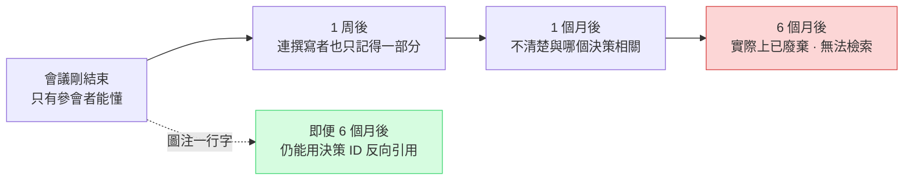
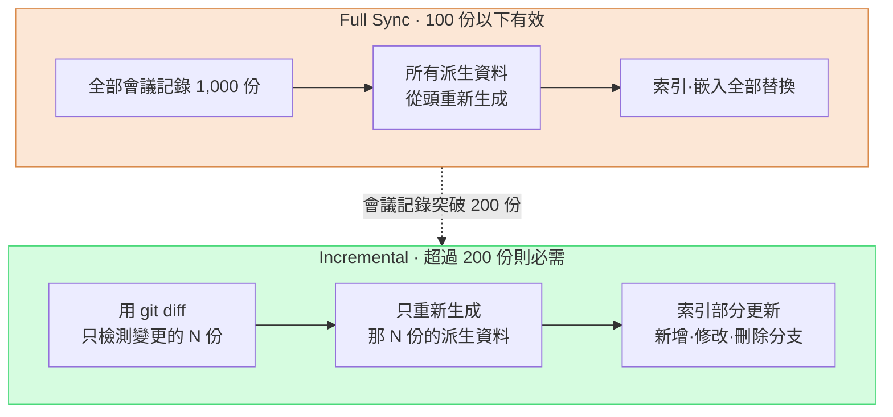

# 17.3 會議分類·圖注·同步 —— 讓會議記錄成為資產的三條主軸

> 會議記錄的目的不是堆積。真正的目的是:半年後仍能被檢索到、能引向決策、並在兩臺 PC 上呈現為相同的狀態。

---

週二下午。我想起來,一年前的一次會議上明明約定過,要把角色服裝的飽和度降低一檔。可是那份會議記錄怎麼也找不到。開啟資料夾一看,`meeting_0413.md`、`회의_수정본_final.md`、`IMG_2034.png` 之類的兩百來個檔案只是按日期堆在一起。既沒有分類,沒有圖注,也沒有統一的命名。決策就在某個地方,但通往那個決策的路徑已經消失了。

會議記錄要成為資產,需要三件事同時運轉。**分類**建立檢索的第一入口,**圖注**(caption)讓一半的影像保持可檢索狀態,**同步**則讓處理成本即便在超過 1,000 份時也只繫結在變更部分上。這三者只要缺一,會議記錄就會淪為越堆越沉的死堆。

在 §17.1·§17.2 中,我們搭建了把會議記錄轉換為提取管線的流程 —— 用 `meeting_lint.py` 檢查格式,`decision_parser.py` 提取決策的四個欄位(`decision` / `owner` / `rationale` / `follow_up`),owner 缺失時以 `[MISSING]` 上報,先匯入 pending atom,再由 `promote.py` 提升。本章講的是支撐這條管線長期不崩壞的三項運營標準。

---

## 17.3.1 分類 —— 檢索的第一入口

會議記錄隨著時間推移會累積到數百、數千份。檢索不到的資料不是資產。分類就是檢索的第一個分岔口。這就像在辦公室的檔案櫃上貼標籤。沒有標籤的櫃子,最終沒有人會去開啟。

筆者負責的專案A(MMORPG 開發)把分類歸為五個。關鍵在於保持**小而正交**。

<svg viewBox="0 0 720 220" xmlns="http://www.w3.org/2000/svg" font-family="sans-serif" font-size="13">
  <rect x="10" y="10" width="130" height="190" rx="8" fill="#fce7d6" stroke="#d98a4a"/>
  <text x="75" y="34" text-anchor="middle" font-weight="bold">art</text>
  <text x="75" y="58" text-anchor="middle" font-size="11">視覺·美術方向</text>
  <text x="75" y="78" text-anchor="middle" font-size="10" fill="#666">概念評審</text>
  <text x="75" y="94" text-anchor="middle" font-size="10" fill="#666">環境色調共識</text>
  <text x="75" y="120" text-anchor="middle" font-size="10" fill="#a05a20">→ 圖注佔比↑</text>

  <rect x="150" y="10" width="130" height="190" rx="8" fill="#d6e7fc" stroke="#4a7ad9"/>
  <text x="215" y="34" text-anchor="middle" font-weight="bold">battle</text>
  <text x="215" y="58" text-anchor="middle" font-size="11">戰鬥·平衡</text>
  <text x="215" y="78" text-anchor="middle" font-size="10" fill="#666">冷卻時間·DPS</text>
  <text x="215" y="94" text-anchor="middle" font-size="10" fill="#666">傷害曲線</text>
  <text x="215" y="120" text-anchor="middle" font-size="10" fill="#2050a0">→ atom 提取↑</text>

  <rect x="290" y="10" width="130" height="190" rx="8" fill="#d6fce0" stroke="#4ad97a"/>
  <text x="355" y="34" text-anchor="middle" font-weight="bold">daily</text>
  <text x="355" y="58" text-anchor="middle" font-size="11">例行進度共享</text>
  <text x="355" y="78" text-anchor="middle" font-size="10" fill="#666">站會</text>
  <text x="355" y="94" text-anchor="middle" font-size="10" fill="#666">今日待辦</text>
  <text x="355" y="120" text-anchor="middle" font-size="10" fill="#207040">→ 幾乎無決策</text>

  <rect x="430" y="10" width="130" height="190" rx="8" fill="#fcd6d6" stroke="#d94a4a"/>
  <text x="495" y="34" text-anchor="middle" font-weight="bold">issue</text>
  <text x="495" y="58" text-anchor="middle" font-size="11">緊急問題處理</text>
  <text x="495" y="78" text-anchor="middle" font-size="10" fill="#666">構建失敗</text>
  <text x="495" y="94" text-anchor="middle" font-size="10" fill="#666">上線前事故</text>
  <text x="495" y="120" text-anchor="middle" font-size="10" fill="#a02020">→ 必須事後整理</text>

  <rect x="570" y="10" width="130" height="190" rx="8" fill="#ece6fc" stroke="#7a4ad9"/>
  <text x="635" y="34" text-anchor="middle" font-weight="bold">review</text>
  <text x="635" y="58" text-anchor="middle" font-size="11">里程碑·QA</text>
  <text x="635" y="78" text-anchor="middle" font-size="10" fill="#666">MS 驗收</text>
  <text x="635" y="94" text-anchor="middle" font-size="10" fill="#666">季度覆盤</text>
  <text x="635" y="120" text-anchor="middle" font-size="10" fill="#502090">→ 摘要 atom</text>

  <text x="360" y="172" text-anchor="middle" font-size="11" fill="#444">五格互不重疊 —— 一次會議正好歸入一格</text>
  <text x="360" y="192" text-anchor="middle" font-size="11" fill="#444">一旦擴到六格,"這算 art 還是 battle?"就會每週堵住會議</text>
</svg>

五個並不是所有團隊的標準答案。如果是以非戰鬥系統為核心的專案,就需要把 `battle` 換成 `system` 這樣的調整。關鍵不在於數字,而在於**把分類保持得足夠小,小到分類決定本身不會堵住會議**這一原則。

### 一次會議一個分類

會議橫跨兩個格子的情況經常發生。如果在評審角色概念時順帶敲定了戰鬥動作,那算 art 還是 battle?原則是**只以主產出物為準取其一**。如果概念是主產出物,就歸為 art,戰鬥動作則用 `sub_topic` 欄位作輔助記錄。

```yaml
---
type: meeting_note
category: art
sub_topic: [character, battle_motion]
date: 2026-05-18
attendees: [teammate_a, teammate_b, teammate_c, 李旼洙]
related_atoms: [character_concept_kim, battle_motion_kim]
confidential: internal
---
```

`sub_topic` 只是檢索的第二層過濾,不用於路由決策。路由始終只以 `category` 這一個值運作。一旦這條單值原則被破壞,§17.2 的 `promote.py` 就無法判斷該把 atom 送往哪個資料夾,各分類統計之和也會對不上。正交性不是美觀問題,而是管線完整性的前提。

### 每個分類的運營各不相同 —— 這才是拆分的真正價值

把它分成五格的真正理由,並不是檢索標籤。而是因為每一格的運營方式都不同,只有拆開,差異化運營才能自然而然地被設計出來。

`art` 的附件影像多,下一節的圖註標準是必需的。由於決策以視覺為中心,決策槽裡會放入 `` 這樣的影像引用。`battle` 的決策是數值·規則,atom 自動提升的比例最高,而且一行決策會牽動配置表的批次變更,因此影響範圍的視覺化(第11部分的關係圖)很重要。`daily` 幾乎沒有決策才是常態,又因累積很快,故按周拆入自動資料夾(`daily/2026-W21/`)。`issue` 的會議記錄較為雜亂,因此把事後 24 小時內整理定為義務,並把防止復發的 atom 提取到 `issue_postmortem/`。`review` 篇幅長,故另行撰寫 5\~10 行的摘要 atom,讓它在下一次季度覆盤中被自動引用。

新增分類要極為謹慎。每季度發生 5 次以上、運營方式與既有五個明顯不同、需要單獨的路由資料夾、且一個月後仍能維持 5 次以上 —— 只有全部通過這四個條件才予以考慮。就筆者的運營經驗而言,五個維持了一年以上,即便 `tech_review` 或 `external` 這樣的候選一度浮現,最終也都被 `sub_topic` 吸收了。

### AI 分類器只應作為輔助

分類以人在撰寫時直接錄入為主。只有像從外部收到的資料那樣存在缺失的會議記錄,才用 AI 分類器來輔助。用關鍵詞詞典能捕獲約 90%,剩下的 `uncertain` 才交給 LLM 或人來判定。

委託給 LLM 時,施加強約束的提示詞更穩定。下面是實際使用的提示詞全文。

```
以下是會議記錄。請歸入 5 個分類之一。

分類:
- art: 視覺·美術方向
- battle: 戰鬥系統·平衡
- daily: 例行進度共享
- issue: 緊急問題處理
- review: 里程碑·QA 評審

會議記錄:
[全文或前 500 字]

響應格式:只給一個分類單詞。禁止任何說明·依據·不確定表述。
若響應不是 5 個分類之一,則視為系統失敗。
```

把同一份會議記錄(下面是 art 會議的開頭)輸入進去時,Claude 的原始輸出是這樣的。

> 輸入的會議記錄:
> `角色 K_007(學者)概念 v3 評審。有意見認為服裝色調的飽和度過高。達成一致:降低一檔。約定下次會議一併檢查戰鬥動作的色調。`

> Claude 輸出:
> `art`

乾淨利落地只輸出了一個單詞。然而,把 daily 會議記錄餵給同一個提示詞時,也發生過這樣的情況。

> 輸入:`今天的構建在凌晨掛了,原因看起來是配置表合併衝突。計劃先熱修復,之後再正式修改。`

> Claude 輸出:
> `issue`

表面上這是 daily 站會里冒出的一句話,但 Claude 根據內容把它分到了 `issue`。**這正是不能把分類器當作首選的原因。** 人會做出這樣的運營判斷:"這是 daily 當中突然冒出的構建事故,應該拆成單獨的 issue 會議。"而 AI 只看文本就貼標籤。標籤也許沒錯,但要不要拆分會議,它決定不了。所以人為主,LLM 只止步於對缺失部分的輔助。

在季度覆盤中,會統計各分類的會議數量,以觀察"時間花在哪裡"。下面的分佈是筆者的估算(未經驗證),絕對數量只是示例,只有比例的大小關係與實際運營的體感一致。

| 分類 | 佔比(估算) | 備註 |
|---|---|---|
| `daily` | 約 1/3 | 每日例行,幾乎沒有決策 |
| `battle` | 約 1/5 | 戰鬥 TF 每週 2 次 |
| `art` | 約 1/7 | 美術評審 + 外部會議 |
| `issue` | 低 | 構建事故等 |
| `review` | 最低 | 里程碑·季度覆盤 |
| 其他 | 約 1/5 | 1:1、外部等非分類 |

如果 `issue` 在某個季度格外突出,那麼改善構建·CI 穩定性就會浮上為下一個優先事項。分類不僅用於檢索,也是映照組織時間分配的一面鏡子。

---

## 17.3.2 圖注 —— 讓一半影像存活下來的一行字

`art` 會議記錄的正文有一半是影像。而沒有圖注的影像,就像堆在桌上的一疊照片。當天什麼都記得,可一個月後,只有在背面寫了一行備註的照片才能存活下來。



影像佔了會議記錄的一半,若無法檢索,就等於會議記錄資產的一半消失了。讓那一半存活下來的,就是一行圖注。

### 圖注三要素

專案A 的圖註標準三行就寫完。

```markdown


**[圖 1]** 角色 K_007(學者)概念 v3 —— 服裝色調飽和度降低一檔
*決策:D2(服裝飽和度 -10%) | 下一步行動:v4 製作(~MM-DD)*
```

三個要素各自開啟不同的檢索路徑。**編號 + 一行說明**留下在正文中以"參見圖 1"引用的路徑,**決策 ID 引用(D2)**留下"與此決策關聯的影像"這一反向引用,**下一步行動**留下後續工作的線索。三行都能在 1 分鐘內寫完。"即時附加"並不意味著"在會議中撰寫"。現實的做法是:會議中只整理決策,結束後立刻在 10 分鐘內補齊圖注。

### 檔名和資料夾是第一入口

和圖注同樣重要的是檔名。因為資料夾和檔名本身就是檢索的第一入口。

```
會議記錄資料夾/
├── 2026-05-18_art_review.md
└── images/
    └── 2026-05-18_art_review/
        ├── character_kim_concept_v3.png
        ├── env_palette_comparison.png
        └── reference_external_game_a.png
```

規則是 `<主題>_<條目>_<版本 or 備註>.<ext>`,禁止使用韓文·空格·特殊字元(防止路徑編碼事故)。`IMG_2034.png`(毫無含義)、`김캐릭터 v3.png`(韓文·空格)、`final_final_v3_real.png`(版本無意義)、`untitled.png`(廢棄候選)全都是反模式。與其依賴人的自覺,不如在 `meeting_lint.py` 里加一條檢查規則來強制執行更好 —— 在 §17.2 中把格式檢查自動化的那個 lint 上,再疊加一行檔名檢查就夠了。

### 外部資料出處與 confidential 等級

會議中經常會引用外部遊戲·美術作為參考。若沒有出處,就會直接釀成版權事故。

```markdown


**[圖 3]** 參考影像 —— refgame(Developer Y, 2024)
*引用理由:比較相似概念的飽和度處理。無直接借用。*
```

出處(遊戲名·開發商·年份)·引用理由·是否直接借用,都要一一註明。而且影像比文本的洩露風險更大,因此在 frontmatter 中標註等級。

```yaml
confidential: internal   # internal / restricted / external_ok
images:
  - file: character_kim_concept_v3.png
    confidential: restricted
    reason: 未公開的角色設計
```

`internal` 指公司內部共享,`restricted` 指僅限該 TF·負責人,`external_ok` 指獲准用於營銷·外部共享。會議記錄構建時按等級分離輸出,非 `external_ok` 的影像在外部共享版中自動做模糊處理。這一自動分離帶來的直接效果,是把外部共享的遮罩事故實質上降為 0。

### 圖注也讓 AI 打初稿

給 50 張影像手寫 50 條圖注是個負擔。把正文和檔名交給 AI,批次拿到初稿。

```
以下是會議記錄正文 + 影像檔案列表。

[會議記錄正文]
[10 個影像檔名]

請為每張影像撰寫圖注初稿。

格式:
- [圖 N] <說明> —— <核心決策或變化>
- *決策:D? | 下一步行動:?*

對於在正文中找不到依據的影像,標註為"內容不明 —— 需撰寫者確認"。
```

這裡最後一行才是關鍵。輸入同一份會議記錄時,Claude 對正文中有依據的影像都加了圖注,但對 `reference_external_game_a.png` 則這樣回答。

> Claude 輸出(節選):
> `[圖 3] reference_external_game_a.png —— 內容不明,需撰寫者確認。正文中未註明這張外部參考影像的引用理由。`

這是 AI 把不知道的事情如實上報為"不知道"。撰寫者據此補上引用理由。若僅憑正文上下文仍不夠,就只挑核心的 5\~10 張送入 Vision 模型(由於影像 token 成本高,不會全部跑一遍)。

```python
# 只選用核心的 5~10 張影像 —— 每張影像的 token 成本很高
response = client.messages.create(
    model="claude-opus-4-8",
    messages=[{
        "role": "user",
        "content": [
            {"type": "image", "source": {"type": "base64", "data": img_b64}},
            {"type": "text", "text": "用一行中文描述這張影像。禁止猜測,只描述看到的。"},
        ],
    }],
)
```

撰寫者把這一行整理成圖注格式。沒必要對所有影像都跑 Vision。僅核心的 5\~10 張,就足以顯著提升可檢索性。

圖注寫得好的一年份會議記錄,本身就成為一份視覺開發文件(visual development document)。`character_kim` v1 → v2 → v3 的視覺變化可以用決策 ID 追溯,只篩選 `external_ok` 等級就能自動整理出對外匯報資料,把各領域的核心影像 + 圖注彙集起來則成為新團隊成員的入職資料。若以筆者的估算(未經驗證)來表達引入圖注前後的變化,**方向**是這樣的 —— 半年前會議記錄的檢索成功率大幅上升,"這張圖我在哪見過?"這類重複提問大幅減少,外部共享的遮罩事故收斂於 0。絕對數值因團隊而異,但僅憑階段 1·2(檔名標準 + 圖注格式),那個方向就已經清晰地顯現出來。

---

## 17.3.3 同步 —— 不是全量,而是隻處理變更部分

會議記錄本身是文本檔案,用 git 就夠了。同步真正的物件,是從會議記錄中**派生出的資料** —— §17.2 的 pending atom 候選、JIT manifest、分類統計、決策索引(`decision_index.json`)、圖注索引、按 confidential 等級的構建輸出,以及用於向量檢索的 LLM 嵌入(embedding)。這些資料都必須對會議記錄的變更做出響應。

問題在於:會議記錄一旦超過 1,000 份,每次都重新處理全量的成本會佔到運營的一半。這就像停下整條生產線,把所有零件重做一遍 —— 明明只改了一個零件。



Full Sync 實現簡單,狀態不一致的風險為 0,在引入初期(100 份以下)反而更安全。這並不是說 Full 是壞做法。只是與會議記錄數量成線性正比的成本,會從超過 200 份的那個位置開始成為瓶頸。到那時就切換到 Incremental。

### 變更檢測以 git diff 為準

Incremental 的第一步,是準確判定"哪些檔案發生了變更"。檔案 mtime 雖快,但只要 `touch` 一下就會被當作變更,精度低。檔案雜湊以內容為準,準確,但對新增·刪除的區分較弱。筆者推薦基於 **git diff**。記錄下最後一次 sync 時的提交雜湊,只處理其後發生變更的檔案。它能準確捕獲新增·修改·刪除,同時額外的狀態管理負擔最小。

```python
# incremental_sync.py 骨架
def get_changed_files(last_sync_commit):
    result = subprocess.run(
        ["git", "diff", "--name-only", last_sync_commit, "HEAD", "--", "meetings/"],
        capture_output=True, text=True
    )
    return result.stdout.strip().split("\n")

def sync():
    last_commit = read_state("last_sync_commit")
    for path in get_changed_files(last_commit):
        if not os.path.exists(path):
            handle_deletion(path)        # 批次刪除 atom·索引·嵌入
        elif is_new(path, last_commit):
            handle_creation(path)        # lint → 提取決策 → pending atom → 索引 → 嵌入
        else:
            handle_modification(path)    # 使既有派生失效後重新處理
    write_state("last_sync_commit", get_current_commit())
```

這裡還有一個對成本影響最大的分支。即會議記錄是**正文**也變了,還是隻有 **frontmatter** 變了。

```python
def detect_change_scope(file_path, last_commit):
    diff = subprocess.run(
        ["git", "diff", last_commit, "HEAD", "--", file_path],
        capture_output=True, text=True
    ).stdout
    fm_lines, body_lines = split_diff_by_section(diff)
    return {"frontmatter_changed": bool(fm_lines), "body_changed": bool(body_lines)}

scope = detect_change_scope(path, last_commit)
if scope["body_changed"]:
    full_reprocess(path)          # 含嵌入重新生成
elif scope["frontmatter_changed"]:
    metadata_only_update(path)    # 嵌入重新生成為 0
```

如果只是 `category` 或 `confidential` 這類後設資料變了,就沒必要重新生成 LLM 嵌入。嵌入通常是同步成本中最大的一塊,因此這一次分支能大幅降低成本。嵌入以 `content_hash` 為準做快取 —— 正文雜湊相同就直接複用快取的嵌入,而僅修改 frontmatter 時,嵌入呼叫為 0。

成本差異的**方向**很明確(下面是筆者估算,並非絕對值)。在每週變更 50 份左右的運營中,相比每週 Full re-embed,Incremental 的嵌入成本降到了幾十分之一的水平。會議記錄越增加,Full 的成本就與累積量成正比地變大,而 Incremental 的成本只繫結在每週的變更份數上,與累積量無關,幾乎是平的。這種"與累積無關"的性質,正是 Incremental 的本質價值。

### 兩道安全網 —— 定期 Full re-sync 與單 PC sync

Incremental 快,但代價是揹負著累積性不一致的風險。若因一個小 bug 漏掉了一條 atom,這個遺漏不會在下一次 Incremental 中自行修復。因此加裝護欄 —— 每天 Incremental,每週對最近 1 周份做 Partial Full(驗證),**每月一次全量 Full re-sync** 來檢查索引·嵌入的一致性。若在每月檢查中發現不一致,就加固變更檢測邏輯。這每月一次,是長期運營的最後一道安全網。

在此之上,還疊加一層 PC 分離運營。筆者在公司 PC 和家裡 PC 兩處處理會議記錄。原則是 **sync 作業只在一臺 PC 上**執行。

| 流程 | 處理 |
|---|---|
| 公司 PC → git push | 由公司 PC 負責 sync 作業(重新生成派生資料) |
| 家裡 PC → git pull | 只更新 `last_sync_commit`,無需重新處理 |
| 兩側都變更後 merge | 以 merge 結果為準重新計算 changed 檔案 |

若兩側同時 sync,`last_sync_commit` 狀態就會衝突,而這種衝突會悄悄地讓索引錯位。把一臺 PC 固定為 sync 主體這條簡單的規則,才是最可靠的防禦。

---

## 17.3.4 三條主軸在同一條管線中交匯之處

分類·圖注·同步並不是各自為政的標準。三者在 §17.2 的提取管線之上被擰成一條流。

會議記錄一經撰寫,`category` 就決定 `promote.py` 的路由,圖注的決策 ID 與 `decision_parser.py` 提取的決策四欄位相連線,而如此生成的所有派生資料,再由 Incremental sync 只挑變更部分來更新。本章運營的出發點是 `decision_summary_not_clickup_mirror`(§17.1.2)。分類開啟通往決策的路徑,圖注留下決策的視覺證據,同步則把那份決策資產在兩臺 PC 上儲存為相同的狀態。

週二下午的那種茫然 —— 明明達成了一致,卻無路可達的那種狀態 —— 會在這三條主軸運轉的瞬間消失。用 `category: art` 把資料夾收窄,用圖注裡的 `決策: D2` 觸及準確的決策,同步再把那份會議記錄在家裡也呈現為相同的樣子。

---

> **遊戲之外的應用。** 資料只有被檢索·被引用·被同步,才終於成為資產 —— 這條原則並非遊戲會議記錄獨有,而是所有與文件打交道的職場人的共同課題。分類(小而正交的類別)·圖注(附件影像的一行說明)·同步(不是全量,只有變更部分)這三條主軸,即便換掉領域也照舊成立。比如,銷售團隊若積累一年份的客戶會談資料,只要把分類固定在"新提案·合同談判·售後支援"等五格以內,給每張附上的報價單截圖都配一行像"[圖 1] A 公司第 2 輪報價 —— 單價下調 5%"這樣的說明,雲同步只挑改動過的檔案來處理就行。這樣,半年後想找"當時為什麼把單價壓下來了",一行圖注就能立刻查到。

---

## 17.3.5 動手試試

**setup**
1. 把會議分類定義在 5 個以內(以 art / battle / daily / issue / review 為出發點,按團隊情況替換 1\~2 個)。
2. 在 `meeting_lint.py` 中追加兩項檢查 —— `category` 是否為已定義值之一,影像檔名是否符合 `<主題>_<條目>_<版本>` 模式(無韓文·無空格)。
3. 在 frontmatter 中加入 `confidential` 欄位,並準備用於記錄 `last_sync_commit` 的狀態檔案。

**prompt**(輔助分類缺失的會議記錄)
```
以下是會議記錄。請歸入 5 個分類之一。
[5 行分類定義] / [會議記錄前 500 字]
響應格式:只給一個分類單詞。禁止任何說明·依據·不確定表述。
若響應不是 5 個分類之一,則視為系統失敗。
```

**verify**
1. 親自檢索一下:任取一份半年前的會議記錄,能否僅憑分類 + 圖注決策 ID 找到它。
2. 確認 `git diff --name-only <last_sync_commit> HEAD` 捕獲的變更檔案數,是否與實際修改的會議記錄數一致。
3. 不要不加批判地接受 AI 的分類結果,對 `uncertain` 以及"daily 當中出現的決策"這類情況,讓人再看一遍。

---

## 17.3.6 單人精簡版

如果你是獨自工作的策劃,就這樣精簡。

- **分類**:分類只從 2 個開始 —— `decision`(有決策的會議)和 `log`(進度記錄)。只對有決策的會議打理圖注·atom,其餘的堆進日期資料夾即可。
- **圖注**:confidential 等級·Vision 輔助全部跳過,**只對牽涉決策的影像**加上圖注三要素。一張影像一行就夠了。
- **同步**:派生資料不必做到嵌入。只保留 `decision_index.json`(決策 ID → 會議記錄路徑對映)這一個檔案,儲存會議記錄時只更新那一行。git 即同步,在積累到需要區分 Full/Incremental 的量之前,每次全量重新生成就足夠了。

即便在單人規模下,不變的核心只有一個 —— **留下通往決策的路徑**。分類·圖注·同步只不過是撐起這條路徑的三根支柱,完全可以按規模把它們立得纖細一些。

---

### 本章要點
- 分類保持在 5 個以內,小而正交,一次會議只按一個 category 路由。
- 圖注三要素(編號·決策 ID·下一步行動)讓一半的影像在半年後仍然存活。
- 同步不做全量,只處理 git diff 的變更部分,每月用 Full 來校正。

### 下一章預告
- 17.4 AI 輔助會議記錄·決策追蹤自動化 —— 從提取到提升的完全自動化
