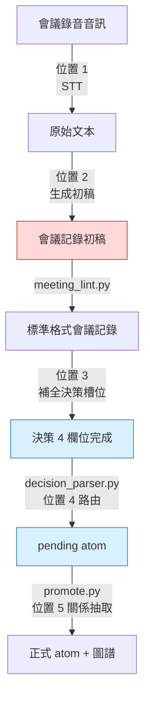
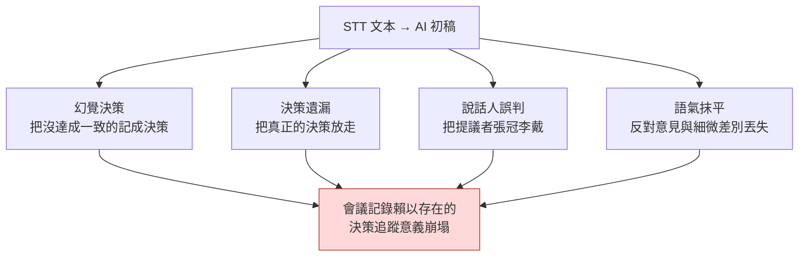

# 17.4 把會議記錄變成決策資料庫 —— AI 自動化的 5 個切入點

> 距離里程碑演示還有三天,午飯時,一位策劃放下餐盤問道:"把任務獎勵金幣提高到 1.5 倍那件事,是會上定下來的吧?可以錄入配置表了嗎?"旁邊的人答道:"那不是有人只是提議'要不試試看'嗎。"90 分鐘的錄音檔案和某人用鍵盤敲下的兩頁備忘錄,確實都在。但那份記錄裝下了"討論了什麼",卻沒能裝下"決定了什麼、由誰負責、為什麼這麼定"。

把公司的 17 份 R&D 文件按"痛點"程度排序時,佔比最大的是會議記錄改進計劃書。這出乎意料。既不是戰鬥平衡,也不是內容量產管線。最痛的地方只有一個:會上做出的決策沒有傳導到執行。

於是我把會議記錄系統重新設計成了決策追蹤資料庫,並用六個月的親自運營,驗證了在這條流程的哪些環節該放入 AI、哪些環節不該放。本章就是這 5 個切入點的地圖。

---

## 17.4.1 AI 自動化可以介入的 5 個切入點

從錄音檔案開始,到決策圖譜更新為止,在整條會議記錄管線中能安放 AI 助手的位置,正好有 5 個。但不會 5 個同時放入。因為每個位置的成熟度和出事風險各不相同。



紅色(位置 2)是最誘人也最危險的位置,藍色(位置 3、4)是最先引入的安全位置。管線中間的 `meeting_lint.py` → `decision_parser.py` → `promote.py` 不是 AI,而是確定性指令碼。AI 只進入這個確定性骨架之間"需要判斷的縫隙"。

用一句話概括各切入點的性質,如下。

- **位置 1(STT,Speech-to-Text,語音→文本)**:語音 → 文本。成熟度最高,風險最低。
- **位置 2(生成初稿)**:文本 → 會議記錄初稿。誘惑最大,風險最高。
- **位置 3(補全決策槽位)**:為人所宣告的決策填入依據與影響。ROI(Return on Investment,投資回報)第一。
- **位置 4(atom 路由)**:推薦把決策放進哪個資料夾。
- **位置 5(關係抽取)**:自動推斷 atom 之間的依賴關係。對非確定性最脆弱。

---

## 17.4.2 確定性骨架 —— 先造出讓 AI 介入的縫隙

在談 AI 自動化之前,得先看不屬於 AI 的指令碼骨架。因為會議記錄之所以能成為決策資料庫,關鍵不在 LLM,而在三個小小的 Python 指令碼。

標準格式的會議記錄在末尾有一個決策塊。塊中的每條決策都強制要求四個欄位。

```markdown
## Decisions

D1:
  decision: 將戰鬥全域性冷卻統一為 0.5 秒
  owner: teammate_a
  rationale: 技能連招測試中 0.3 秒經常丟輸入(正文 14:22)
  follow_up: 在連招設計表中落實 GCD 0.5,6/13 前完成
```

這個塊由 `decision_parser.py` 讀取。核心動作很簡單——四個欄位中只要有一個為空,就打上 `[MISSING]` 上報。尤其是沒有 `owner` 時,那條決策就是"無人負責的決策",也就是不會被執行的決策,因此攔得最狠。

```
$ python decision_parser.py 2026-06-06_combat-sync.md

D1: OK   (owner=teammate_a)
D2: [MISSING owner]  "治療技能是否排除 GCD,待議" —— 無 owner,阻止晉級
D3: [MISSING rationale]  依據欄位為空,警告
```

被打上 `[MISSING owner]` 的 D2,連 `pending` 資料夾都進不去。在人補上 owner 之前,它不會被當作決策。這就是從結構上防止"會開了,卻什麼都沒推進"的裝置。

通過的決策由 `promote.py` 變成 `pending atom`,在每週一次的評審關卡上經人批准後,晉級為正式 atom。此時適用的原則就是 `decision_summary_not_clickup_mirror` atom(§17.1.2)。任務看板追蹤"要做什麼",決策資料庫追蹤"為什麼這麼定"。把兩者混在一起,兩者都會壞掉。

這三個指令碼是骨架,AI 是填補這副骨架空白的助手。順序一旦顛倒——由 AI 來搭骨架——幻覺就會摧毀決策資料庫的信任本身。

---

## 17.4.3 最危險的位置 —— 為什麼把位置 2 放到最後

位置 2(STT 文本 → 自動生成會議記錄初稿)是所有團隊最想先做的位置。因為"只要把錄音丟進去,會議記錄就出來"這幅圖景太誘人了。而恰恰是這份誘惑,讓它以最高的代價失敗。

失敗的樣態有四種。



其中最致命的是幻覺決策。會上有人只是丟擲一句"全域性冷卻是不是 0.5 秒更好?"的意見,AI 初稿卻寫成"全域性冷卻已達成一致為 0.5 秒"。三週後,這一行被落實進配置表,連招設計在其上疊加,QA 用例也隨之寫就。一個從未達成一致的決策,不可逆地擴散開來。

因此位置 2 適用幾條絕對原則。

- AI 初稿**始終**要經主持人稽核。任何情況下都沒有自動提交。
- 決策槽位**不由 AI 填寫**。AI 只概括議題和發言,決策是否存在由人來宣告。
- 原始 STT 文本要與摘要**分開永久儲存**。若只留摘要,一旦依據變得模糊,就無法再回到原文核驗。

這不是說位置 2"永遠不做"。當位置 3、4、1 穩定下來、主持人親身體會到 AI 輸出的侷限之後,引入位置 2 的價值是足夠大的。只是**順序上排在最後**而已。

---

## 17.4.4 位置 3 —— 補全決策槽位為何 ROI 第一

這是六個月運營中產出效果最大的位置。人宣告決策的存在,AI 填寫這條決策的附屬欄位。與位置 2 的決定性區別在於:**決策存在這一事實本身,由人先行釘死**。

有三樣東西,人親手填太費時間,便由 AI 起草。

- **rationale**:從會議正文中引用作為決策依據的發言
- **affected_atoms**:推薦受影響的系統、配置表候選
- **follow_up**:從決策匯出的後續行動候選

關鍵在於提示詞**強制引用依據、並明確禁止幻覺**。下面是實際運營中使用的補全提示詞全文。

### 實操記錄(worked transcript)—— 補全決策槽位

**提示詞(由人輸入):**

```
看下面的會議正文,只填主持人已宣告的決策 D1("將戰鬥全域性冷卻統一為 0.5 秒")的
owner / rationale / affected_atoms / follow_up 這四欄。
不要新造決策。rationale 要把正文發言連同時間戳原樣引用,
沒有依據的欄不要臆測,寫上"無依據"。
// (意圖:affected_atoms 只取正文提到的系統與表,最多 3 個)

[會議正文]
(14:18) teammate_a: 現在 GCD 是 0.3 秒,連續按技能時輸入老是被吞。
(14:22) teammate_b: 昨天的連招測試裡,0.3 秒下第二個技能放不出來的
        情況大概佔 30%。我留了日誌。
(14:25) teammate_a: 那就提到 0.5 秒吧。我來在連招表裡落實。
(14:26) 主持人: 就走 0.5 秒。定了。
(14:31) teammate_c: 治療技能如果套 GCD,危急時就用不了,那個怎麼辦……
(14:33) 主持人: 那個下次單獨看。
```

**Claude 輸出(原樣):**

```
1. owner: teammate_a
   依據:(14:25) "我來在連招表裡落實。" —— teammate_a
   明確表示由本人負責。

2. rationale:
   - (14:18) teammate_a: "GCD 0.3 秒下連續按技能時輸入被吞"
   - (14:22) teammate_b: "連招測試中 0.3 秒下第二個技能未觸發
     的情況約 30%,有日誌"
   → 0.3 秒的輸入丟失問題,是 0.5 秒決策的直接依據。

3. affected_atoms (基於正文提及的候選):
   - atoms/combat/global_cooldown
   - 連招設計表(正文 14:25 提到"連招表")
   - atoms/combat/skill_recovery  ← 但 (14:31) 中治療技能的
     GCD 例外討論"被推遲"(14:33)。是否納入本決策的影響範圍
     尚不確定。依據薄弱,需人工確認。

4. follow_up:
   - teammate_a: 在連招設計表中落實 GCD 0.5 秒
   - [單獨議題] 治療技能是否 GCD 例外不在本決策範圍內,
     拆分為下次會議議題(14:33 主持人發言)
```

**人的核驗/否決:**

主持人稽核了輸出。owner 和 rationale 的引用準確,直接採用。`affected_atoms` 的第三個候選 `skill_recovery`,AI 自己上報了"依據薄弱,需人工確認",經主持人判斷,把它從本決策的影響範圍中**排除**了——治療技能的例外是另一條決策的事,而不是這次 D1 的影響。follow_up 中"拆分為單獨議題"的建議被採納,登記為下次會議的議題。

這裡重要的是,AI 沒有用幻覺硬把不確定的專案塞進來,而是**主動上報了不確定性**。正是"禁止臆測與幻覺,沒有依據就寫明無依據"這條提示詞約束,造就了這份誠實的輸出。去掉約束,AI 會理直氣壯地把 `skill_recovery` 放進 affected_atoms,而那個幻覺會擴散到圖譜裡。

稽核完畢的決策塊通過 `decision_parser.py`——因為四個欄位都已填滿,沒有 `[MISSING]`——進入 `pending atom`。

---

## 17.4.5 位置 4 —— atom 路由,以及位置 5 —— 關係抽取

當通過位置 3 的 pending atom 晉級到正式資料夾時,由 AI 推薦送往哪個資料夾(位置 4)。

```
把這個 atom("戰鬥全域性冷卻統一為 0.5 秒 / owner teammate_a")放進下面哪個
資料夾更合適,按優先順序最多選 3 個。不要提議新建資料夾,
只在這個列表裡選。
- atoms/combat/  atoms/character/  atoms/operations/  atoms/visual/
```

"禁止新建資料夾"是核心約束。去掉它,AI 就會沒完沒了地提議 `atoms/combat_timing/`、`atoms/gcd_rules/` 之類的資料夾,類別無限增殖,檢索與自動注入隨之崩壞。類別要保持少而正交,並以一年以上不變動為原則。AI 只在那個封閉列表裡挑選。

位置 5(atom 之間的關係抽取)最晚、最慎重地引入。它是推斷已晉級 atom 之間依賴關係的位置。

```
新增 atom A: "治療技能排除全域性冷卻"
既有 atom B: "全域性冷卻統一為 0.5 秒"

推斷出的關係:
  A.exception_of: [B]
  A.derives_from: [B]
  B.affects: [A]   ← 反向自動賦予
```

問題是,這種推斷正面暴露在 LLM 的非確定性之下。同樣的輸入,昨天和今天會得出不同的關係。緩解裝置有三種——`temperature=0`,並在支援的模型上固定 seed;給出候選、由人批准的稽核關卡;以及只抽取單向、反向再由指令碼確定性補齊的方式。因為若把雙向都交給 LLM,總會漏掉一邊。

---

## 17.4.6 一次 1\~2 個 —— 引入順序即是安全裝置

同時開啟 5 個切入點,是最常見也最昂貴的失敗。運營負擔比效果更早到來,團隊會把整套系統一起丟棄。下面是實際遵循的順序。

<svg viewBox="0 0 720 240" xmlns="http://www.w3.org/2000/svg" font-family="sans-serif" font-size="13">
  <line x1="40" y1="40" x2="40" y2="210" stroke="#999" stroke-width="2"/>
  <!-- step 1 -->
  <circle cx="40" cy="50" r="7" fill="#2980b9"/>
  <text x="60" y="48" font-weight="bold">第 1 步 · 位置 3 補全決策槽位</text>
  <text x="60" y="66" fill="#666">1~2 個月 · ROI 第一,從風險最低起步</text>
  <!-- step 2 -->
  <circle cx="40" cy="95" r="7" fill="#2980b9"/>
  <text x="60" y="93" font-weight="bold">第 2 步 · 位置 4 atom 路由推薦</text>
  <text x="60" y="111" fill="#666">再加 1 個月 · 強制資料夾候選封閉列表</text>
  <!-- step 3 -->
  <circle cx="40" cy="140" r="7" fill="#27ae60"/>
  <text x="60" y="138" font-weight="bold">第 3 步 · 位置 1 STT</text>
  <text x="60" y="156" fill="#666">自託管基礎設施落地後 · 出於安全規避外部 API</text>
  <!-- step 4 -->
  <circle cx="40" cy="185" r="7" fill="#c0392b"/>
  <text x="60" y="183" font-weight="bold">第 4 步 · 位置 2 會議記錄初稿</text>
  <text x="60" y="201" fill="#666">上述 3 個穩定後,最為慎重 · 絕對禁止自動提交</text>
  <!-- step 5 -->
  <circle cx="40" cy="225" r="7" fill="#8e44ad"/>
  <text x="60" y="223" font-weight="bold">第 5 步 · 位置 5 關係抽取</text>
</svg>

把位置 2 放到最後,是這個順序的核心。最想做的位置最後才做——這有違直覺,但讓最熟練的手落在最危險的操作檯上,才是作業現場的安全原則。

從成本上看,這個順序也合理。以每月 100 場會議計,位置 3 約 $5\~10,位置 4 約 $1\~2(基於作者運營環境的估算,未經驗證),**只開這兩個,每月也不到 $10**。產出效果最大的兩個位置,恰恰最便宜。

---

## 17.4.7 before / after —— 同一場會議,兩份會議記錄

同一場會議用兩種方式記錄時的差異,就是本章的全部概括。

**Before —— 自由敘述式會議記錄(無 AI,或把位置 2 連決策槽位都交出去的情形):**

```markdown
## 2026-06-06 戰鬥同步會議

討論了 GCD 相關。有人提出 0.3 秒太短。
說連招測試中出過問題。提到了 0.5 秒。
治療技能例外也被順帶提了一句。
氣氛上大體朝 0.5 秒的方向收攏。
```

三週後再開啟這份會議記錄,"朝 0.5 秒收攏的氣氛"到底是決策還是意見、誰負責落實進表、治療技能例外是定了還是推遲了,**誰都無法復原**。沒有說話人,沒有 owner,依據也只在正文某處,只能重新去聽錄音。

**After —— 決策槽位 + 位置 3 補全的會議記錄:**

```markdown
## 2026-06-06 戰鬥同步會議

### 議題摘要(AI 輔助)
- 戰鬥全域性冷卻(GCD)0.3 秒的輸入丟失問題
- 治療技能是否 GCD 例外(拆分為單獨議題)

### Decisions  (人宣告 + AI 補全)
D1:
  decision: 將戰鬥全域性冷卻統一為 0.5 秒
  owner: teammate_a
  rationale: |
    - (14:18) teammate_a: 0.3 秒下連續按技能時輸入被吞
    - (14:22) teammate_b: 連招測試 0.3 秒第二個技能未觸發 ~30%,有日誌
  follow_up: teammate_a —— 在連招設計表中落實 GCD 0.5 秒(6/13 前)
  affected_atoms: [atoms/combat/global_cooldown, 連招設計表]

### 拆分出的議題
- 治療技能 GCD 例外 → 下次會議(14:33 主持人決定)
```

三週後,這份會議記錄已被 `decision_parser.py` 讀取並連入圖譜,任何人問起"為什麼是 0.5 秒",都能憑 rationale 的兩行引用即時作答。因為寫明瞭 owner,便能追蹤 follow_up 是否已執行;就連治療技能例外**不是決策而是被推遲的議題**這一事實也得到儲存。

造成差異的不是 AI 的篇幅,而是**在保留人宣告決策的位置的前提下,只把填依據交給 AI 的結構**。把上面 After 會議記錄中 AI 填寫的段落(議題摘要、rationale 引用、affected_atoms 候選)全部刪掉,剩下的只有一行決策和 owner——會議記錄的資訊量有一半以上來自 AI 補全,但關鍵在於,這一半全都是通過了人工稽核的依據引用。

---

## 本章要點

- 先立起會議記錄的確定性骨架(meeting_lint → decision_parser → promote),AI 只填補其縫隙中的空白。
- 決策的存在由人宣告,AI 只補全依據、owner 與影響——位置 2 的決策自動生成會招致不可逆的幻覺。
- 不要同時開啟 5 個切入點,而是從位置 3、4 起一次 1\~2 個,把最誘人的位置 2 放到最後引入。

---

> **遊戲之外的應用。** "決策的存在由人宣告,AI 只填依據、責任人與影響"這條原則,不止遊戲,對所有用 AI 整理錄音的職場人都同樣適用,是一條安全線。最誘人的位置(把錄音整段自動生成為會議記錄)之所以最危險,是因為 AI 會把"是不是 0.5 秒更好"這樣的意見,變造成"已達成一致為 0.5 秒"這樣的決策——正是這種幻覺。比如人事部門整理考評會議的錄音時,只由主持人親自釘死"確定為 B 級"這條決策,而只讓 AI 做"從錄音中引用支撐這個等級的發言,沒有就說沒有"。一旦讓 AI 來做決策,一個從未達成一致的評價,就會不可逆地留在人事記錄裡。

---

## 動手試試

**setup**
1. 在會議記錄標準格式中建立 `## Decisions` 塊,並對每條決策強制 `decision / owner / rationale / follow_up` 四個欄位。
2. 編寫 `decision_parser.py`——四個欄位中只要有一個為空就輸出 `[MISSING <欄位>]`,尤其當 `owner` 為空時阻止晉級。
3. 把"決策摘要不是任務看板的映象,而是承載'為什麼'的獨立資產"這條規則(`decision_summary_not_clickup_mirror`)寫成明文。

**prompt**
4. 寫位置 3 的補全提示詞。必須包含的約束:"不要新造決策 / 引用正文依據並附上時間戳 / 沒有依據就寫明'無依據' / 禁止臆測與幻覺"。要求 rationale、owner、affected_atoms、follow_up 四個槽位。
5. 在位置 4 的路由提示詞中放入"禁止新建列表之外的資料夾 + 封閉的資料夾列表"。

**verify**
6. 用 `decision_parser.py` 跑一遍補全後的決策塊,確認沒有 `[MISSING]`。
7. AI 填寫的 affected_atoms 中被標為"依據薄弱"的專案,由人親自稽核後排除或採納。任何情況下都不做自動提交。

**單人精簡版**
如果你獨自工作或沒時間裝工具,不用指令碼,只在會議記錄末尾手寫四行決策塊(`決定 / 負責 / 依據 / 下一步行動`)即可。即便 owner 就是你自己,也要寫上名字。對 AI 只需說"從會議備忘裡引用這條決策的依據,沒有就說沒有"。即便沒有管線,只要**宣告決策的位置**和**強制引用依據的提示詞**這兩樣,會議記錄就會開始變成決策資料庫。
