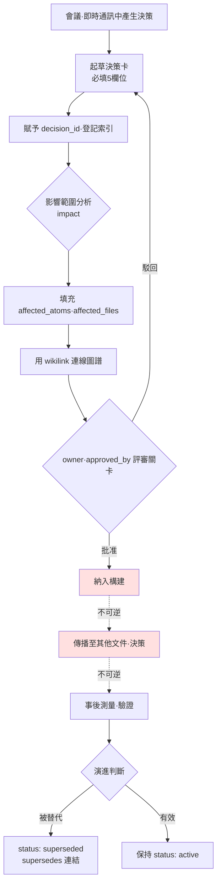

# 18.1 決策追蹤系統

那是季度會議進行到一半的時候。戰鬥設計師提議"把全域性冷卻(GCD)統一為 0.5秒",大家都點頭贊同。可是坐在旁邊的資深同事舉起了手。"這不是和去年第四季度定的 0.3秒相沖突嗎?當時為什麼定成 0.3秒來著?"會議室一時安靜下來。沒有人記得那個決定的依據。翻遍了會議記錄,卻只有"在戰鬥 TF 中討論過"這一行字。最後花了 30分鐘去重現去年的決定,即便如此,"為什麼是 0.3"始終沒能找到。

決策的難點不在於做出,而在於追蹤。一年積累數百件之後,哪個決策還有效、哪個已經廢棄,哪個決策又以另一個決策為前提,單靠人腦已經跟不上。本章討論的,是把決策固化為 atom(最小知識單元)、將其轉化為可追蹤資產的系統。核心很簡單:把一個決策記錄為一張帶有 `decision_id`、`owner`、`rationale` 的卡片,用 wikilink 把卡片彼此相連形成圖譜,再用 grep 反向追溯影響波及到哪裡。

## 18.1.1 決策卡:固化為 atom

決策追蹤的最小單位是決策卡。這裡原樣取自筆者所負責的專案A(MMORPG 開發)中實際使用的一張卡片,正是前面會議上發生衝突的那個 0.5秒統一決定。

```yaml
---
decision_id: D2026_Q2_017
title: 戰鬥全域性冷卻統一為 0.5秒
type: system_change
status: active        # active / superseded / deprecated
created: 2026-04-18
owner: teammate_a      # 戰鬥設計師,決定的發起者·所有者
approved_by: 李旼洙    # Design Director
approval_meeting: 95_BattleTF_2026-04-18

scope:
  - combat_system
  - all_active_skills

content: |
  對所有戰鬥主動技能應用 0.5秒全域性冷卻。
  治療技能除外(單獨決定 D2026_Q2_018)。

rationale:
  - 連招輸入的可讀性問題(使用者反饋累積)
  - 模擬中戰鬥平均時長呈增加方向
  - 新使用者學習曲線趨於平緩

affected_atoms:
  - combat_global_cooldown_constant
  - combat_skill_cooldown_rule

affected_files:
  - CombatBalance.xlsx
  - CombatFormula_v3.md
  - UI/skill_cooldown_indicator

implementation:
  target_build: 2026-05-09
  impl_owner: teammate_b    # 程式碼負責人
  qa_owner: teammate_c      # 資深 QA

related_decisions:
  - supersedes: D2025_Q4_034   # 之前的 0.3秒決定
  - relates_to: D2026_Q2_018   # 治療例外
---
```

三個欄位是脊椎。`decision_id` 為決策賦予永久地址。`owner` 釘死"誰對這個決策負責"。`rationale` 回答半年後的"當時為什麼這麼做?"。會議上沒能找到的那個"為什麼是 0.3",本應正是寫在 `D2025_Q4_034` 的 `rationale` 欄位裡的內容。其餘欄位(`scope`、`affected_atoms`、`related_decisions`)是為影響追蹤和圖譜連線而鋪設的線路。

這裡引入了一項設計決策。如果強制填滿全部 12個欄位,人們就會連卡片本身都不願寫。因此把它分成必填的 5個欄位(`decision_id`、`title`、`owner`、`status`、`rationale`)和選填的 7個欄位。會議上做出決定後即使只填這 5個欄位,卡片也是有效的,其餘的在實現階段再補。

## 18.1.2 決策追蹤的整體流程

一張卡片從產生到廢棄要走過怎樣的路徑,構成了追蹤系統的骨架。請注意不可逆關卡位於何處。



從起草(B)到評審關卡(G)全部是可逆階段。無論是修改還是廢棄卡片,成本都幾乎為零。然而納入構建(H)之後就是實質上的不可逆了。使用者已經體感到的變更,即便用熱修復回退,也會在社群認知中留下痕跡;而當後續決策開始以這個決策為前提層層累積時,回退成本會呈指數級增大。因此決策者的一切評審都必須在關卡 G 處結束。這與第5部分討論的"錄音·選角是不可逆階段"原則,是完全相同的結構。

## 18.1.3 決策圖譜:把卡片連起來

把卡片做成 atom 之後,卡片彼此就能相連。`related_decisions` 中的 `supersedes`、`relates_to` 成為圖譜的邊。前面會議上的衝突,其實就是這張圖譜的一個片段。

<svg viewBox="0 0 640 280" xmlns="http://www.w3.org/2000/svg" font-family="sans-serif" font-size="13">
  <defs>
    <marker id="arrow" markerWidth="10" markerHeight="10" refX="9" refY="3" orient="auto" markerUnits="strokeWidth">
      <path d="M0,0 L9,3 L0,6 Z" fill="#555"/>
    </marker>
  </defs>
  <!-- nodes -->
  <rect x="40" y="20" width="220" height="48" rx="6" fill="#eef2f8" stroke="#888"/>
  <text x="150" y="40" text-anchor="middle" fill="#333">D2025_Q4_034</text>
  <text x="150" y="58" text-anchor="middle" fill="#777" font-size="11">全域性冷卻0.3秒 (deprecated)</text>

  <rect x="40" y="116" width="220" height="48" rx="6" fill="#dff0df" stroke="#5a5"/>
  <text x="150" y="136" text-anchor="middle" fill="#333">D2026_Q2_017</text>
  <text x="150" y="154" text-anchor="middle" fill="#777" font-size="11">全域性冷卻0.5秒 (active)</text>

  <rect x="380" y="116" width="220" height="48" rx="6" fill="#dff0df" stroke="#5a5"/>
  <text x="490" y="136" text-anchor="middle" fill="#333">D2026_Q2_018</text>
  <text x="490" y="154" text-anchor="middle" fill="#777" font-size="11">治療技能冷卻例外 (active)</text>

  <rect x="380" y="212" width="220" height="48" rx="6" fill="#fdf3df" stroke="#cb5"/>
  <text x="490" y="232" text-anchor="middle" fill="#333">D2026_Q2_025</text>
  <text x="490" y="250" text-anchor="middle" fill="#777" font-size="11">PvP 全域性冷卻變體 (active)</text>

  <!-- edges -->
  <line x1="150" y1="68" x2="150" y2="116" stroke="#555" marker-end="url(#arrow)"/>
  <text x="160" y="96" fill="#555" font-size="11">supersedes</text>

  <line x1="260" y1="140" x2="380" y2="140" stroke="#555" marker-end="url(#arrow)"/>
  <text x="285" y="132" fill="#555" font-size="11">relates_to</text>

  <line x1="490" y1="164" x2="490" y2="212" stroke="#555" marker-end="url(#arrow)"/>
  <text x="500" y="192" fill="#555" font-size="11">relates_to</text>
</svg>

如果當時有這張圖譜,會議 30秒就能結束。開啟 `D2026_Q2_017` 就能看到 `supersedes: D2025_Q4_034`,點一下那張卡的 `rationale`,"為什麼是 0.3"就原樣出現了。圖譜是決策的演進歷史,而決策的演進歷史就是遊戲的歷史。連像 PvP 變體(`D2026_Q2_025`)這樣從本決策派生出的分支,也能一目瞭然地追蹤到。

## 18.1.4 自動提取影響範圍 —— impact

決策卡的 `affected_atoms`、`affected_files` 若由人一個個去填,總會漏。專案A裡有一個叫 `impact` 的影響範圍提取流程。它接收一個決策 atom,朝三個方向掃描圖譜。

- **入邊(inbound edge)**:引用這個 atom 的其他 atom(誰依賴於我)
- **本體 `affects` 連結**:明確宣告"產生影響"的關係
- **wikilink 反向引用**:在正文中引用了 `[[combat_global_cooldown_constant]]` 的所有文件

三條路徑的並集,才是決策真正的影響範圍。在此之上,`portal_layer_change_impact_check` atom 會額外檢查"是否觸及門戶層(對外暴露的文件·API 規格)"。一旦涉及門戶層,等級就上調一級。因為對外傳播的回退成本更高。

## 18.1.5 實操記錄(worked transcript):從會議記錄到決策卡

理論到此為止。下面把實際向 LLM 丟擲一整段會議記錄、拿到決策卡的全過程,連同提示詞全文和原始輸出原樣刊出——這就是實操記錄(worked transcript,完整保留真實操作過程的記錄)。不做摘要。Claude 混淆的地方、人工駁回的地方,乃至重新請求,全部呈現。

### 第1次提示詞(全文)

```
把下面的會議記錄轉成決策卡 YAML。schema 為
decision_id / title / type / status / owner / approved_by / scope /
content / rationale / affected_atoms / affected_files / related_decisions。
owner 是發起者,approved_by 是審批者。affected_atoms 和 related_decisions
只寫會議記錄裡實際出現的,不要臆測。
// (意圖:decision_id 為 D{YYYY}_Q{n}_{seq},不知道 seq 就填 XXX)

[會議記錄]
- 決定把戰鬥全域性冷卻統一為 0.5秒(teammate_a 發起)。
  當前每個技能各不相同,有反饋稱連招可讀性差,已累積。
- 有人指出去年定的 0.3秒太快,連招會糊成一團。
- 治療技能若套用 0.5秒就無法應對危機,需要做例外處理。
- 總監(李旼洙)審批。teammate_b 負責實現,teammate_c 負責 QA。
- target build 為 5月9日。
```

### Claude 第1次輸出(原樣,未加工)

```yaml
---
decision_id: D2026_Q2_XXX
title: 戰鬥全域性冷卻統一為 0.5秒
type: system_change
status: active
owner: teammate_a
approved_by: 李旼洙
approval_meeting: 95_BattleTF
scope:
  - combat_system
  - all_skills          # ← 明明有治療技能例外,卻當作了 all_skills
content: |
  對所有戰鬥技能應用 0.5秒全域性冷卻。
rationale:
  - 連招可讀性反饋累積
  - 去年 0.3秒太快,連招糊掉
affected_atoms:
  - combat_global_cooldown      # ← 與實際 atom 名不符。屬於臆測
affected_files: []              # ← 留空。會議記錄未明確說明
implementation:
  target_build: 2026-05-09
  impl_owner: teammate_b
  qa_owner: teammate_c
related_decisions:
  - supersedes: D2025_Q4_XXX    # 去年的 0.3秒決定。不知道 seq
  - relates_to: 治療技能例外決定(ID 未定)  # ← 用敘述而非連結填寫
---
```

實話說,這份輸出只值 60分。做對的和做錯的混在一起。

- **做對**:`owner`/`approved_by` 區分準確,`target_build`·實現者·QA 準確,捕捉到了 `supersedes` 關係。
- **做錯 ①**:在 `scope` 裡放了 `all_skills`。明明標註了治療技能例外,卻當成了全部。
- **做錯 ②**:在 `affected_atoms` 裡臆測填了 `combat_global_cooldown`。專案實際的 atom 名是 `combat_global_cooldown_constant`。它違反了"不要臆測"的指示。
- **做錯 ③**:把 `related_decisions` 裡的治療例外用自然語言敘述而非連結來填。
- **含糊**:把 `affected_files: []` 留空了。這是忠實遵循了指示,但影響檔案不可能沒有。

### 人工驗證·駁回

筆者沒有原樣接受這張卡。把 ①②③ 寫成駁回理由重新發起了請求。駁回的核心是 **atom 名的臆測**。atom ID 哪怕錯一個字元,後續的 grep·反向引用就會全部落空。追蹤系統的準確度,繫於 atom ID 的準確度。

### 第2次提示詞(重新請求,全文)

```
改三處。scope 因為治療技能屬於例外,別用 all_skills,
改成 all_active_skills,治療例外寫進 content。affected_atoms
之前叫你別臆測你卻臆測了——不知道 atom 實名就留成 [待確認],只加註釋
說明要確認什麼,索引我自己來看。related_decisions 把治療例外
用 relates_to 指向 D2026_Q2_018,supersedes 指向 D2025_Q4_034。affected_files
也只作為 [待確認] 候選。
```

### Claude 第2次輸出(未加工)

```yaml
affected_atoms:
  # [待確認] 以下為候選。需在索引中確定準確的 atom ID。
  - combat_global_cooldown_constant   # 全域性冷卻常量值
  - combat_skill_cooldown_rule        # 各技能的冷卻規則(含例外處理)
affected_files:
  # [待確認] 會議記錄中沒有。按 type=system_change 的通常影響候選:
  - CombatBalance.xlsx        # 冷卻數值表
  - CombatFormula_v3.md       # 戰鬥公式文件
  - UI/skill_cooldown_indicator   # 冷卻 UI 指示器
related_decisions:
  - supersedes: D2025_Q4_034
  - relates_to: D2026_Q2_018
scope:
  - combat_system
  - all_active_skills
content: |
  對所有戰鬥主動技能應用 0.5秒全域性冷卻。
  治療技能除外(單獨決定 D2026_Q2_018)。
```

第2次變得誠實了。它沒有臆測 atom 並下定論,而是打上 `[待確認]` 標記並附上依據註釋。筆者開啟 atom 索引,確認 `combat_global_cooldown_constant`、`combat_skill_cooldown_rule` 這兩個名字確實存在,便摘掉了標記。`affected_files` 的三個候選也在與索引比對後予以確定。本章開頭刊出的最終卡片,就是這一成果。

這份實操記錄的教訓只有一個:**LLM 作為決策卡的初稿撰寫者很強大,但 atom ID 與決策 ID 的最終確定,必須由人與索引比對。** AI 探索候選,人來採納。兩者角色一旦混淆,錯誤的 atom 名就會汙染整張圖譜。

## 18.1.6 用 grep 反向追溯影響

當卡片與圖譜以 atom ID 相互繫結時,"這個決策會影響到哪裡"用一行 grep 就能給出答案。把決策 `D2026_Q2_017` 的核心 atom `combat_global_cooldown_constant`,在稿件·資料表·決策卡全體中做反向引用掃描。

```
rg "combat_global_cooldown_constant" --type md --type yaml -l
# → D2026_Q2_017.yaml          (決策卡本身)
#   D2026_Q2_025.yaml          (PvP 變體 —— 再次引用了該常量)
#   CombatFormula_v3.md        (公式文件)
#   95_BattleTF_2026-04-18.md  (會議記錄原件)
```

這個結果就是一張"改動這個常量,就會牽動四處"的影響地圖。PvP 變體卡片引用了同一個常量這一事實,靠人的記憶很容易漏掉,而 grep 不會漏。這之所以可能,正是因為 atom ID 準確——如果用第1次輸出的 `combat_global_cooldown` 去 grep,這四行裡一個也不會命中。等級分類(§18.2)、全週期工作流(§18.3)、grep 工作流的精細化(§18.4),全都立於這份 atom ID 的準確性之上。

## 18.1.7 追蹤系統帶來的差異

下面比較筆者的專案A引入追蹤系統前後的情況。以下數字是筆者的推定(未驗證),建議按方向和比例來讀,而非絕對值。

| 條目 | 無系統 | 系統執行 | 方向 |
|---|---|---|---|
| "以前是否決定過?"的重議 | 每季度 8\~12件 | 每季度 0\~2件 | 大幅減少 |
| 掌握決策影響範圍 | 1\~2天 | 用 grep 數分鐘 | 大幅縮短 |
| 追蹤決策演進歷史 | 依賴資深成員記憶 | 圖譜自動 | 消除對人的依賴 |
| 新成員學習決策歷史 | 1\~2個月 | 1\~2周 | 效果最大 |

效果最大的是最後一行。新成員不再拉著資深同事追問"這遊戲為什麼變成現在這個樣子",而是順著決策圖譜自己讀下去。決策追蹤也就成了公司的決策學習資產。只是系統剛引入的那個季度,寫卡片的負擔確實存在。先從必填的 5個欄位落實、再逐步擴大,是穩妥的路徑。

## 18.1.8 從保守到進步 —— 自動化立於 atom 分解之上

到目前為止的運營都是保守式應用。人在會議上做決定、寫卡片、識別受影響的 atom,自動化只負責索引·檢索·grep·圖譜視覺化。人負責核心判斷,自動化負責保管與檢索。

下一步就是上面實操記錄所展示的方向。以會議記錄的自然語言為輸入,LLM 填寫決策卡 12個欄位的初稿,順著圖譜探索受影響的 atom 候選,連等級也一併推薦。留在人手裡的工作,收窄為"檢查 AI 填好的卡片與 atom 名是否與索引相符"和"最終審批"兩件。從零開始填滿 12個欄位的負擔,和在索引中核對 LLM 初稿 atom 名的負擔,性質不同。

要讓這種進步式應用站穩腳跟,需要三根骨架。其一,所有決策都以 atom 登記、用 wikilink 相連的**決策圖譜**。一整段會議記錄成不了自動化的輸入——它必須被分解到決策的粒度。其二,在圖譜之上計算受影響領域數·回退成本·使用者影響範圍,進而推薦等級的**影響等級自動機**(§18.2)。其三,以 atom ID 和 wikilink 精確運作的**grep·LLM 影響追蹤**(§18.4)。

這裡,貫穿全書的資訊再一次浮現。把決策分解為 atom·圖譜·等級,表面是"檢索與反向引用的便利",本質卻在於:**面對一整段未經分解的會議記錄,自動影響分析連什麼才是決策的單位都無從知曉。**"分解以統一協作語言為表面目的、以程式化自動化的前提為本質目的"這一普遍命題(§6.6),在決策領域體現為決策圖譜·atom·等級。這與第5部分的世界 BT(BehaviorTree,行為樹)·任務雲,以及第8部分的進步式平衡,是同一根骨架。2010年代理論上就已可行,但把會議記錄自動分解為決策 atom 這件事一直受阻;2023年之後 LLM 承擔起這一分解的初稿工作,原本只停留在紙面上的願景,相當一部分進入了可實現的領域。

## 本章要點

- 只有把決策固化為帶有 `decision_id`、`owner`、`rationale` 的卡片,半年後才能回答"當時為什麼這麼做"。
- atom ID 的準確性是追蹤的生命線——LLM 負責卡片初稿,人負責確定 atom 名。
- Layer 分解(決策圖譜)以統一協作語言為表面,以自動影響分析的前提為本質。

> **遊戲之外的應用。** 決策卡並不限於遊戲,它是讓任何組織在半年後仍能回答"當時為什麼那樣定"的裝置。市場部為了"上個季度決定砍掉這個渠道,到底是為什麼來著"在會議記錄裡翻不到一行、白白耗掉 30分鐘這樣的事,只要有一張帶 `decision_id`、`owner`、`rationale` 三個欄位的卡片就會消失。比如人事部在決定"遠端辦公統一為每週2天"這類政策時,若在那張卡上寫清發起者·審批者·依據(生產力資料·員工問卷)和被替代的舊政策 ID,一年後政策複審的場合,過去的判斷依據便原樣鮮活地留存著。

## 動手試試

**網頁聊天機器人最簡路徑(無需終端)** —— 本章的核心不在於決策卡目錄或 grep,而在於"給決策固化永久地址(`decision_id`)·責任人(`owner`)·依據(`rationale`),並在做出新決策之前先查一遍過去的決策"這一構想。這個構想不用 CLI·atom 索引,僅憑網頁聊天機器人(ChatGPT 或 Claude 網頁版)就能重現。下面三步是主線。
1. 把一個決策寫成一行。用一張叫 `decisions.md` 的普通文件就夠了。既不需要 YAML,也不需要指令碼。
   ```
   - [D17] 全域性冷卻統一為 0.5秒 (owner: 我, 依據: 連招可讀性, 替代: D08)
   ```
2. 要把會議記錄變成卡片時,在網頁聊天機器人裡貼入下面這段。它把第1次提示詞的 4條約束原樣搬了過來。
   ```
   把下面會議記錄裡的決策轉成表格。欄目為
   decision_id / title / owner / rationale / 被替代的舊決策。
   無法確定 owner 就填 [MISSING],不知道 atom·檔名就留 [待確認],
   不要臆測。
   // (意圖:decision_id 為 D{年份}_{序號},不知道序號就填 XXX)
   [會議記錄正文]
   ```
3. 在做出新決策之前,先用文件內查詢(Ctrl+F)搜一遍 `decisions.md` —— "以前是否決定過"這一個問題就靠它解決。這就是 grep 反向追溯的手工版。atom 索引·YAML 卡片·`rg` 工作流,等到決策積累數百件、用單個文件搜尋開始吃力時再引入即可。

**setup**(基礎設施版 —— 上面的最簡路徑上手之後)—— 請建立決策卡目錄與索引檔案。

```
decisions/
  D2026_Q2_017.yaml
  _index.json        # by_status / by_scope / by_quarter 彙總
```

**prompt** —— 把會議記錄中的決策議題拋給 LLM 時,務必包含上面第1次提示詞的 4條約束。尤其要寫明"不要臆測 atom 名,而是留成 [待確認]"。

**verify** —— 把產出卡片的 `affected_atoms` 條目與 atom 索引比對,確認實名後移除標記。然後用核心 atom 執行 `rg "<atom_id>" -l`,交叉驗證受影響檔案是否與卡片的 `affected_files` 一致。

### 單人精簡版

如果沒有團隊基礎設施、一個人用,就把 YAML 卡片扔掉。把一個決策寫成 Markdown 一行。

```
- [D17] 全域性冷卻統一為 0.5秒 (owner: 我, 依據: 連招可讀性, 替代: D08 的 0.3秒)
```

把這些一行行堆進 `decisions.md` 一個檔案,做出新決策之前,先用 `rg "쿨다운" decisions.md` 搜一遍過去的決策。沒有卡片、沒有圖譜、沒有工具,但"以前是否決定過"這一個問題就能解決。追蹤系統的90%,就從這一行的習慣開始。
