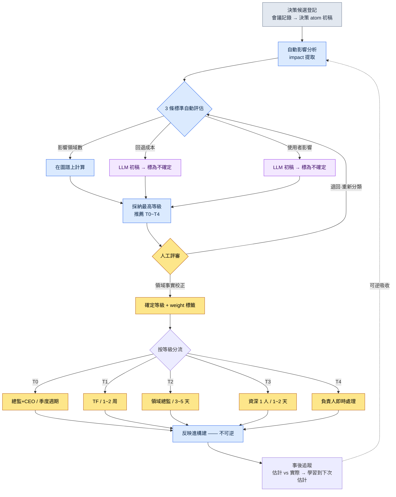
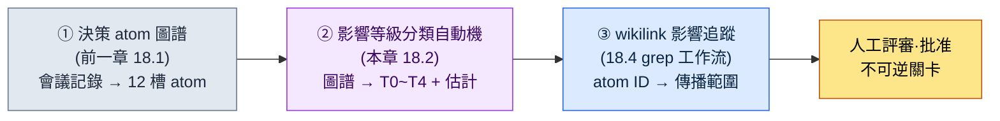

# 18.2 影響傳播·等級分類

會議結束後,我正在整理會議記錄。上面寫著一條決策。"全域性冷卻統一為 0.5 秒。"這在會上不到 30 秒就達成了一致。所有人點頭,便轉向了下一個議題。

那一行字吃掉了接下來的兩個月。戰鬥資料中的 277 個技能全部受到影響,UI 的冷卻進度條演出被重畫,數值表被推翻重做了兩次。同一份會議記錄裡寫著的另一條決策"修正新手引導提示文案的錯別字",只花了 5 分鐘就完成了。

兩條決策在會議記錄上同樣都是一行,字數也差不多。然而一條是 5 分鐘,一條是兩個月。讓這一差異在寫下會議記錄的那一刻就變得可見——這就是影響等級分類。等級若不可見,兩個月的決策就會被埋沒在與 5 分鐘決策相同的一行裡。

本章討論如何將決策的波及自動分為五個等級,並在決策 atom 圖譜上追蹤這波及蔓延到何處。所用工具是前一章積累的決策 atom 與 `impact` 提取,以及 `portal_layer_change_impact_check` atom。

---

## 等級不可見時會發生什麼

先來看看沒有等級分類的狀態是什麼樣子。當決策全部放在同一行上,兩類事故會交替發生。

一是**處理不足**。像全域性冷卻這樣撼動整個季度的決策,被當作"5 分鐘的活兒"未經驗證就進入了構建。直到兩個月後波及才顯現,而那時回退成本已如山堆積。

另一是**處理過度**。為改一個錯別字而召集 TF(專項組),還要獲得遊戲總監的審批。決策週期暴增,而總監本該用在 T0 決策上的時間,卻被吸進了錯別字會議裡。

兩類事故看似截然相反,根子卻相同。**決策的分量不可見。**分量不可見,於是把力氣花在輕的上面,把重的放任流走。等級分類就是給決策貼上分量標籤的工作,標籤一旦貼上,處理方式便自動分流。

---

## 18.2.1 影響的 5 個等級 —— 從 T0 到 T4

在筆者所在的 MMORPG 開發商專案A,決策的影響被分為五個等級。越往上越重,處理需要更多的人力與時間。

| 等級 | 定義 | 示例 | 決策者 | 週期 |
|---|---|---|---|---|
| T0 | 遊戲願景·核心系統 | 移動端優先決策、核心機制變更 | 遊戲總監 + CEO | 季度 |
| T1 | 系統·跨領域 | 全域性冷卻統一、新增職業 | TF 組長 + 總監 | 1\~2 周 |
| T2 | 領域·中等 | 特定技能數值調整、新增 UI 元件 | 領域總監 | 3\~5 天 |
| T3 | 單次·小型 | 修改單個 NPC 臺詞、顏色微調 | 資深人員 1 人 | 1\~2 天 |
| T4 | 即時·熱修復 | 修復 Bug、文本錯別字 | 負責人 | 小時級 |

只看表格,它像教科書一樣清晰。然而實務的難點不在於背表,而在於**判斷眼前的一條決策該放進哪一格**。"全域性冷卻統一"是 T1 這一點,不能等會議結束之後才知道,而要在寫下會議記錄的那一刻就知道。因此下一節的 3 條標準才是關鍵。

---

## 18.2.2 劃分等級的 3 條標準

等級不靠直覺來定。評估三條標準,採納其中最高的等級。

<svg viewBox="0 0 720 300" xmlns="http://www.w3.org/2000/svg" font-family="sans-serif" font-size="13">
  <rect x="0" y="0" width="720" height="300" fill="#fafafa" stroke="#ddd"/>
  <text x="20" y="30" font-size="15" font-weight="bold">等級判定矩陣 —— 3 標準 × 5 等級</text>
  <!-- header row -->
  <rect x="20" y="50" width="160" height="40" fill="#2c3e50"/>
  <text x="30" y="75" fill="#fff" font-weight="bold">標準 \ 等級</text>
  <rect x="180" y="50" width="100" height="40" fill="#c0392b"/><text x="215" y="75" fill="#fff" font-weight="bold">T0</text>
  <rect x="280" y="50" width="100" height="40" fill="#e67e22"/><text x="315" y="75" fill="#fff" font-weight="bold">T1</text>
  <rect x="380" y="50" width="100" height="40" fill="#f1c40f"/><text x="415" y="75" font-weight="bold">T2</text>
  <rect x="480" y="50" width="100" height="40" fill="#2ecc71"/><text x="515" y="75" fill="#fff" font-weight="bold">T3</text>
  <rect x="580" y="50" width="120" height="40" fill="#95a5a6"/><text x="625" y="75" fill="#fff" font-weight="bold">T4</text>
  <!-- row 1: 影響領域數 -->
  <rect x="20" y="90" width="160" height="60" fill="#ecf0f1" stroke="#bbb"/><text x="30" y="125">影響領域數</text>
  <rect x="180" y="90" width="100" height="60" fill="#fff" stroke="#bbb"/><text x="220" y="125">5+</text>
  <rect x="280" y="90" width="100" height="60" fill="#fff" stroke="#bbb"/><text x="315" y="125">2~4</text>
  <rect x="380" y="90" width="100" height="60" fill="#fff" stroke="#bbb"/><text x="425" y="125">1</text>
  <rect x="480" y="90" width="100" height="60" fill="#fff" stroke="#bbb"/><text x="525" y="125">1</text>
  <rect x="580" y="90" width="120" height="60" fill="#fff" stroke="#bbb"/><text x="635" y="125">1</text>
  <!-- row 2: 回退成本 -->
  <rect x="20" y="150" width="160" height="60" fill="#ecf0f1" stroke="#bbb"/><text x="30" y="185">回退成本</text>
  <rect x="180" y="150" width="100" height="60" fill="#fff" stroke="#bbb"/><text x="200" y="185">非常大</text>
  <rect x="280" y="150" width="100" height="60" fill="#fff" stroke="#bbb"/><text x="315" y="185">大</text>
  <rect x="380" y="150" width="100" height="60" fill="#fff" stroke="#bbb"/><text x="415" y="185">中等</text>
  <rect x="480" y="150" width="100" height="60" fill="#fff" stroke="#bbb"/><text x="515" y="185">小</text>
  <rect x="580" y="150" width="120" height="60" fill="#fff" stroke="#bbb"/><text x="600" y="185">非常小</text>
  <!-- row 3: 使用者影響範圍 -->
  <rect x="20" y="210" width="160" height="60" fill="#ecf0f1" stroke="#bbb"/><text x="30" y="245">使用者影響範圍</text>
  <rect x="180" y="210" width="100" height="60" fill="#fff" stroke="#bbb"/><text x="215" y="245">全部</text>
  <rect x="280" y="210" width="100" height="60" fill="#fff" stroke="#bbb"/><text x="320" y="245">大</text>
  <rect x="380" y="210" width="100" height="60" fill="#fff" stroke="#bbb"/><text x="415" y="245">中等</text>
  <rect x="480" y="210" width="100" height="60" fill="#fff" stroke="#bbb"/><text x="515" y="245">小</text>
  <rect x="580" y="210" width="120" height="60" fill="#fff" stroke="#bbb"/><text x="600" y="245">非常小</text>
</svg>

三條標準中,**影響領域數**可以在決策 atom 圖譜上機械地數出來。把決策所觸及的 atom 歸屬於哪個領域(戰鬥·UI·資料·敘事等)的標籤彙總起來即可。

問題在剩下的兩條。**回退成本**與**使用者影響範圍**無法換算成圖譜上的數字。"要在兩個月後回退這條決策,得花多少代價"是一種自然語言判斷。恰恰是這一點,在 2023 年之前一直是影響自動分類的最後一堵牆。影響領域數已經自動化,但兩格自然語言判斷空著,結果還是要人從頭重新評定。隨著 LLM 讀取決策 atom 的正文、為這兩格填寫初稿,這堵牆降低了。

這裡要如實說明。LLM 填寫的是**初稿**,而非定論。即便 LLM 把回退成本估為"大",領域總監也可以判定"按我們的表結構,這個是中等"。自動分類並不替代人的判斷,而是**讓人不必從空格開始**。

---

## 18.2.3 實操記錄(worked transcript)—— 讓 LLM 對一條決策分類

這是把前一章製作的一條決策 atom 原樣交給 LLM、讓它評定等級的真實過程。實操記錄即完整保留的真實操作過程記錄:不作摘要,原樣搬錄全過程,連否決與再次請求也一併收錄。

### 輸入 —— 決策 atom 原文

```yaml
# decisions/D2026_Q2_017.md (前一章 18.1 中登記的 atom)
id: D2026_Q2_017
title: 全域性冷卻統一為 0.5 秒
date: 2026-04-18
proposer: teammate_a
decider: 李旼洙    # Design Director (與 18.1 的 approved_by 相同)
context: 各職業的冷卻標準各不相同,每次新增職業都會累積
         數值重算成本。提議以 0.5 秒全域性標準統一。
affected_atoms: [combat_cooldown_rule, skill_table, ui_cooldown_gauge]
reversible: ?
status: proposed
```

### 提示詞全文

```
請把下面這條決策 atom 的影響等級評定為 T0~T4 中的一個。
分別看影響領域數 / 回退成本 / 使用者影響範圍這三條標準,
取其中最高的等級。沒把握的格子就寫"不確定",
並說明需要人來看。
// (意圖:T0=領域 5+·成本非常大·全部,T1=2~4·大·大,T2=1·中等,T3=1·小,T4=1·非常小)

[附上 atom 原文]
```

### Claude 原始輸出(未經編輯)

```
3 條標準評估:

1. 影響領域數
   看 affected_atoms:
   - combat_cooldown_rule → 戰鬥領域
   - skill_table → 資料領域
   - ui_cooldown_gauge → UI 領域
   明確寫出的領域是 3 個。
   不過看 context 中"每次新增職業都要重算數值"這句
   話,數值領域也很可能受到間接影響。
   直接 3 + 間接 1 = 實際按 2~4 個範圍來看。→ T1 訊號

2. 回退成本
   把全域性冷卻統一之後若要回退,就得把 skill_table 中
   所有技能的冷卻時間按各職業標準重新分叉。
   由於不知道 skill_table 的行數,確切成本尚不確定,
   但"統一 → 恢復分叉"通常成本很大。→ 大(T1 訊號)
   ※ 這一格若不知道 skill_table 的規模就無法確定。標為不確定。

3. 使用者影響範圍
   冷卻時間適用於所有戰鬥情形,因此幾乎所有使用者都
   能體感到。→ 大(T1 訊號)

採納等級:T1
依據:3 條標準都指向 T1。不是 T0 ——
因為還談不上"核心機制變更",而是對既有機制的引數
統一。

需要人工確認:
- 回退成本格:需確認 skill_table 的實際行數
- reversible 槽以"?"留空 → 本次分類以將 reversible
  填為"困難"為前提。
```

### 人工驗證與否決

這裡沒有原樣接受。我對輸出的第 1 項動了手。LLM 把數值領域看作"間接影響",但在專案A的實際結構中,冷卻統一會**直接**推翻數值表——因為新增職業的數值測算公式本身就把冷卻值作為輸入。所以數值不是間接,而是直接的第 4 個領域。影響領域數為 4 個。即便如此,採納等級 T1 並未改變。

還有一點,回退成本格里的"不確定"標記是準確的。`skill_table` 實際上有 277 行技能,若回退統一,就得把全部 277 行的冷卻時間重新分叉。成本更接近"非常大"而不是"大"。不過,一格往上升並不會讓採納等級變成 T0 —— 因為影響領域數與使用者影響都在 T1 範圍,最高等級仍然是 T1。

### 再次請求

```
更正。請在 affected_atoms 里加上 balance_sheet(數值公式把冷卻值
作為輸入,是直接影響)。那麼影響領域就是 4 個,skill_table 是 277 行。
把這些反映進去,填好 reversible 並確定最終等級。
```

```
已反映。

影響領域:戰鬥·資料·UI·數值 = 4 個
回退成本:非常大(skill_table 全部 277 行重新分叉)
使用者影響:大

reversible:困難(實質上接近不可逆 —— 277 行重新分叉需要
1~2 次構建外加一輪數值重新驗證)

最終等級:T1
注意:僅看回退成本一格是 T0 訊號,但
影響領域 4 個·使用者影響"大"處於 T1 範圍。
3 條標準中有 2 條指向 T1,所以 T1 是對的。
不過建議把這條決策標註為"T1 中偏重的一類" ——
因為回退成本達到了 T0 級。
```

最後這句比人還謹慎。等級雖是 T1,但回退成本達 T0 級,於是提議將其標註為"T1 中偏重的一類"——這是最初提示詞裡沒有的判斷。我採納了。我給這條決策額外貼上了 `weight: heavy` 標籤,並提高了事後追蹤的優先順序。

這份實操記錄展示的核心只有一個。**LLM 生成分類的初稿與理由,人用領域事實(數值是直接影響、277 行)來校正。**只靠其中之一都不行。只靠人,就得從空格開始,慢;只靠 LLM,就會在不知道 277 行的情況下寫下"大"。

---

## 18.2.4 自動追蹤影響傳播的程式碼

等級確定之後,接下來是"波及到何處"。把前一章的 `impact` 提取 —— 入邊、本體中的 `affects` 關係、wikilink 反向引用 —— 應用到決策 atom 上。

```python
# impact_propagation.py —— 追蹤決策 atom 的傳播範圍

def trace_impact(decision):
    # 一級:決策直接觸及的 atom·檔案
    direct = decision.affected_atoms + decision.affected_files

    # 二級:以 wikilink 反向引用一級 atom 的 atom(impact 入邊)
    secondary = []
    for atom in direct:
        secondary.extend(find_inbound_refs(atom))   # [[atom]] 反向引用
        secondary.extend(find_affects_edges(atom))   # 本體 affects

    secondary = dedup(secondary) - set(direct)

    return {
        "direct": direct,
        "secondary": secondary,
        "affected_fields": determine_fields(direct + secondary),
        "estimated_hours": estimate_hours(direct, secondary),
    }
```

核心是 `find_inbound_refs` —— 一個在 atom 圖譜中收集用 `[[...]]` 指向該 atom 的**入向**箭頭的函式。決策自身觸及什麼(出向箭頭)寫在 atom 裡,但誰依賴該 atom(入向箭頭)必須反向掃描整個圖譜才能看到。兩個月的波及,幾乎總是藏在這**入邊**一側。

在此如實記下對 D2026_Q2_017 跑這一追蹤的結果。direct 是上面確定的 4 個 atom。secondary 是反向引用 `skill_table` 的那些 atom —— 技能說明文本、技能圖示對映、各職業技能樹等 —— 一連串地被牽了出來。**數字因時點而異,故不下定論。**追蹤抓住的事實是"secondary 為 direct 的數十倍"這一方向,準確的 atom 數會隨圖譜狀態而變。僅憑方向就夠了 —— secondary 比 direct 大一個數量級,那就是 T1 訊號,意味著它是事後追蹤的物件。

---

## 18.2.5 等級分類嵌在何處 —— mermaid

分類不是獨立的步驟,而是作為關卡固定在決策流程的正中央。決策候選一經登記,自動分析就推薦等級,只有在人評審、調整之後,才進入決策會議。



在這一流程中,**不可逆的步驟只有一個,就是反映進構建(I)**。它之前的全都是可逆的 —— 即便等級推薦錯了,人退回即可,weight 標籤也可以撕掉。只有在進入構建、傳播到其他文件之後才變得不可逆。因此關卡(F 的人工評審)設在構建之前。在跨過不可逆這條線之前,人先攔一次。

最後那條虛線 —— 事後追蹤(J)返回下一次決策的自動分析(B)的箭頭 —— 讓這套系統成為一個學習迴圈。不可逆步驟中產出的實測資料(例如:QA 時間比估計更長)被吸收進下一次決策的可逆步驟。

---

## 18.2.6 事後追蹤 —— 把估計與實際的落差轉為學習

決策進入構建後 1 周\~1 個月,把估計與實際對照。這是 D2026_Q2_017 的事後追蹤表單。

```
決策 D2026_Q2_017 事後追蹤  (表單示例 · 數字為虛構輸入)
─────────────────────────────────
工作時間 (估計 → 實際)
  程式碼:    16h → 22h  (+38%)
  資料:     8h →  6h  (-25%)
  UI:       4h →  4h  (=)
  QA:       8h → 12h  (+50%)
  total:   36h → 44h  (+22%)

影響 atom (估計 → 實際)
  direct:    4 →  4   (準確)
  secondary: 估計數十 → 實際數十  (方向一致,準確數值不公開)

事故發生: 0 起
誤差模式: QA 每次都超出估計 (本次 +50%)
下次決策應用: 對 QA 估計預設加 +20% 餘量
```

上面這個塊是展示事後追蹤**長什麼樣**的表單示例。時間·百分比數值並非實際專案資料,而是填入表單的虛構輸入,在你自己的專案裡換成你自己的數字填寫即可 —— 正如本書的承諾,我們展示結構,數字由你自己測量。與表單無關、真正為真的只有一件事。**"QA 每次都超出估計"這一誤差的方向**,以及把這一方向反饋進下一次決策的流程。於是就有了從一開始就給下次估計加上 QA 餘量(例如 +20%)的處方。

事後追蹤的價值不在於猜中準確的數字,而在於把誤差的方向反饋回去。估計越準確,等級分類的可信度就越高,可信度越高,委派就越有可能。

---

## 18.2.7 各等級的事故模式與處方

各等級反覆出現的事故各不相同,處方也不同。

| 等級 | 事故模式 | 處方 |
|---|---|---|
| T0 | 願景模糊 → 整個季度都混亂 | 強制在決策文中寫明一行願景 |
| T1 | 領域間衝突 → 進度延誤 | 讓全部受影響領域的代表出席 TF |
| T2 | 遺漏相鄰系統的影響 → 後續決策暴增 | 必須做 secondary 追蹤 |
| T3 | 小決策累積 → 一致性受損 | 在季度覆盤中成批檢查 T3 |
| T4 | 驗證不足 → 二次熱修復 | 熱修復也至少經 1 人評審 |

這張表裡的處方全都由前面各節給出的工具來執行。T2 的"必須做 secondary 追蹤"就是 §18.2.4 的 `find_inbound_refs`,T1 的"全部受影響領域代表出席"則由 §18.2.4 抓出的 `affected_fields` 來確定誰該到場。

最昂貴的事故不在表中任何一處。那就是**把等級本身弄錯**。T0 若由資深人員一人決定,願景就會受損;T4 若由總監親自處理,就會產生瓶頸。等級一旦弄錯,其下所有處方都會在錯誤的位置運作。因此 §18.2.3 的人工評審關卡不是單純的形式。

---

## 18.2.8 度量 —— 等級運營的效果

比較專案A引入等級分類前後的情況。下面數值中的絕對值是加工過的示例,而**方向(不等號)是實際趨勢**。

| 對比項 | 無等級 | 等級運營 |
|---|---|---|
| 決策週期 | 全部統一為 1\~2 周 | 從 T0 季度到 T4 小時級分化 |
| 處理錯誤的決策 | 每季度多起 | 每季度少數 |
| 總監的每週決策負擔 | 大(所有決策都匯到總監) | 小(T2\~T4 委派出去) |
| 熱修復週期 | 1\~2 天 | 4\~24 小時 |
| 季度覆盤的決策分析 | 難以歸類 | 按等級統計彙總 |

把表寫成方向而非確定數字,原因由第 3 項就能說明。**總監時間的回收是等級分類最大的效果。**沒有等級時,從錯別字到願景,所有決策都湧向總監一個人。有了等級,T2 及以下就分流給領域總監·資深人員·負責人,總監則專注於 T0·T1。委派成為可能,也就意味著總監奪回了真正用於重大決策的時間。

---

## 18.2.9 本章在進取式應用骨架中的位置

前一章製作了決策 atom 圖譜,本章在這張圖譜之上疊加了等級分類自動機。兩者不是各自為政的工具,而是同一骨架中相連的位置。



三個要素是串聯的。圖譜製造輸入(①),分類器評定分量(②),影響追蹤鋪開傳播範圍(③)。本章處在中間的位置。

三個要素都是在 LLM 發展之後才進入可實現的領域。最晚被攻破的牆是②的兩格自然語言評估 —— 回退成本與使用者影響範圍(§18.2.2 的"最後一堵牆")—— LLM 填補其初稿之後,①→②→③才終於開始串聯運轉。

可逆·不可逆的排布也與這一骨架相扣。正如 §18.2.5 的流程圖,不可逆的線只有反映進構建這一條,反映進構建本身無法回退,但其實測結果會作為讓下一次決策更準確的可逆學習返回來。

---

## 18.2.10 常見的失敗

| 模式 | 處方 |
|---|---|
| 用同一週期處理所有決策 | 按等級分化週期 |
| 沒有等級分類,各自自行判斷 | 3 條標準分類關卡 |
| 無視等級(T0 由資深人員決定) | 強制執行決策者表 |
| 省略事前的影響度評估 | 把自動分析設為決策會議前的關卡 |
| 把自然語言格按 LLM 輸出原樣定稿 | 由人用領域事實校正 |
| 不做事後追蹤就結束決策 | 1 周\~1 個月做估計 vs 實際的比較 |
| 不把估計誤差反映到下次決策 | 把誤差方向應用到下次估計的餘量 |

---

> **遊戲之外的應用。** 影響等級是一個把"一行字的請求究竟是 5 分鐘還是兩個月"提前顯現出來的標籤,因此在任何決策紛至沓來的職場都適用。公司維基上一行文案的修改,與"全部門休假政策變更",若同樣作為"一件議題"進來、走同一條審批線,輕的事就會被過度處理,重的事則未經驗證便流走。舉例來說,在接到運營團隊的工作請求時,只要按影響部門數·回退成本·客戶影響範圍這三條標準貼上 T0\~T4,負責人可即時處理的事與需要主管審批的事就會自動分開,管理者的時間也會被回收到真正重大的決策上。

## 動手試試 —— 給一條決策分類等級

**setup.** 請準備一條前一章製作的決策 atom。`affected_atoms` 槽必須已填好。若為空,就無法計算影響領域數。

**prompt.** 請原樣使用 §18.2.3 的提示詞全文。別漏掉關鍵的三行 ——(1) 分別評估 3 條標準,(2) 採納最高的等級,(3) 沒把握的格子標為"不確定"並請求人工確認。少了第三行,LLM 就會連不知道的也一併斷定。

**verify.** 收到 LLM 輸出後,請親自確認兩點。第一,即便 LLM 數過了影響領域數,也要在 atom 圖譜上親自重數一遍 —— 它可能把間接影響當成直接,或有所遺漏(實操記錄中的數值案例)。第二,標了"不確定"的格子用領域事實來填(如 skill_table 277 行這樣的實際規模)。完成這兩項確認之後,才確定等級並交給構建關卡。

## 單人精簡版

如果是既沒有團隊也沒有 TF、獨自開發的專案,5 個等級就太多了。請縮減為 3 個等級。

- **重**:改變遊戲方向或多個系統的決策。睡前先放一放,睡醒後再重新審視。禁止即興決定。
- **中**:在單個系統內閉合的決策。當場處理,但留下一行決策 atom。
- **即時**:錯別字·Bug。立刻修改。記錄也可以省略。

工具也請從零行程式碼開始。記錄決策時,只在前面加上 `[重]` `[中]` `[即時]` 標籤。僅憑這一點,你就會在貼了"重"標籤的決策前多停一次 —— 等級分類的本質說到底就是在重大決策前停下的習慣,而自動化不過是讓這份停頓在團隊規模上也能運作的裝置。

---

### 本章要點
- 同樣一行字的決策,也會因影響等級而分成 5 分鐘與兩個月,等級若不可見,處理不足與處理過度就會交替發生
- 3 條標準中兩格自然語言(回退成本·使用者影響)曾是自動化的最後一堵牆,LLM 填補初稿後這堵牆降低了
- 等級分類最大的效果是回收總監的時間,並使委派成為可能
