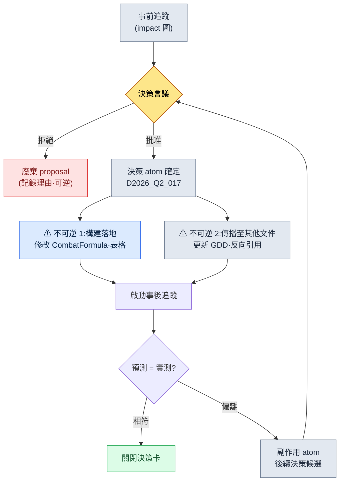

# 18.3 決策前後影響追蹤工作流

上線三週後,那是一場覆盤會議,用來回溯 PvP 平衡崩壞的原因。在白板上一路倒推,最終到達的起點,是一個月前的一條決策。"將全域性冷卻從 0.3 上調到 0.5。"它是因為收到"看不到連招"的反饋、在兩小時內就達成一致的、合理的提案。然而那個改動把坦克職業的生存率比預期又拉高了 14%,正是它讓 PvP 崩潰了。在做決策的現場,沒有任何人指出那條決策會波及到坦克。決策本身並沒有錯。事故的原因在於,沒能在**做出決策之前**看清這條決策會波及到哪裡。

影響追蹤必須發生在兩處。在**按下決策之前**(pre)看清它會波及到哪裡,在**決策落地之後**(post)確認它是否真的只波及到了那裡。本章把這兩次追蹤合併為一個工作流。

---

## 18.3.1 事前追蹤與事後追蹤是把同一張圖讀兩遍

決策影響分析的核心出乎意料地簡單。把一個決策 atom 看作一個節點,讀取**流入該節點的邊**與**流出該節點的邊**。事前追蹤問的是"改動這條決策會影響到哪裡"(出向 + 反向引用),事後追蹤問的是"那些影響是否真的按意圖發生了"(把同一批邊與實測值比對)。

在作者的專案A中,決策以 atom 的形式留存在 `decisions/` 資料夾裡。目前已累積 26 個,每個 atom 都以 frontmatter 攜帶日期、當事人、依據、影響範圍。抽取影響範圍的工具是 `impact`,而把這套抽取規則按決策單元強制執行的 atom 是 `portal_layer_change_impact_check`。這三者就是事前、事後追蹤的實際資產。

<svg viewBox="0 0 720 300" xmlns="http://www.w3.org/2000/svg" font-family="sans-serif" font-size="13">
  <rect x="0" y="0" width="720" height="300" fill="#fbfbfd"/>
  <!-- center decision node -->
  <rect x="300" y="120" width="120" height="60" rx="8" fill="#2b6cb0" stroke="#1a4971"/>
  <text x="360" y="146" text-anchor="middle" fill="#fff" font-weight="bold">決策 atom</text>
  <text x="360" y="164" text-anchor="middle" fill="#cfe2f3" font-size="11">D2026_Q2_017</text>
  <!-- inbound (left) -->
  <rect x="40" y="40" width="150" height="38" rx="6" fill="#e6f0fa" stroke="#2b6cb0"/>
  <text x="115" y="64" text-anchor="middle" fill="#1a4971">依據：使用者反饋</text>
  <rect x="40" y="130" width="150" height="38" rx="6" fill="#e6f0fa" stroke="#2b6cb0"/>
  <text x="115" y="154" text-anchor="middle" fill="#1a4971">上級決策 D_011</text>
  <rect x="40" y="220" width="150" height="38" rx="6" fill="#e6f0fa" stroke="#2b6cb0"/>
  <text x="115" y="244" text-anchor="middle" fill="#1a4971">反向引用：GDD 連結</text>
  <!-- outbound (right) -->
  <rect x="540" y="40" width="150" height="38" rx="6" fill="#fdeee6" stroke="#c05621"/>
  <text x="615" y="64" text-anchor="middle" fill="#7b3d12">CombatFormula.md</text>
  <rect x="540" y="130" width="150" height="38" rx="6" fill="#fdeee6" stroke="#c05621"/>
  <text x="615" y="154" text-anchor="middle" fill="#7b3d12">CombatBalance 表</text>
  <rect x="540" y="220" width="150" height="38" rx="6" fill="#fdeee6" stroke="#c05621"/>
  <text x="615" y="244" text-anchor="middle" fill="#7b3d12">UI 連招顯示</text>
  <!-- inbound arrows -->
  <line x1="190" y1="59" x2="300" y2="135" stroke="#2b6cb0" stroke-width="1.5" marker-end="url(#a)"/>
  <line x1="190" y1="149" x2="300" y2="150" stroke="#2b6cb0" stroke-width="1.5" marker-end="url(#a)"/>
  <line x1="190" y1="239" x2="300" y2="165" stroke="#2b6cb0" stroke-width="1.5" marker-end="url(#a)"/>
  <!-- outbound arrows -->
  <line x1="420" y1="135" x2="540" y2="59" stroke="#c05621" stroke-width="1.5" marker-end="url(#b)"/>
  <line x1="420" y1="150" x2="540" y2="149" stroke="#c05621" stroke-width="1.5" marker-end="url(#b)"/>
  <line x1="420" y1="165" x2="540" y2="239" stroke="#c05621" stroke-width="1.5" marker-end="url(#b)"/>
  <text x="115" y="22" text-anchor="middle" fill="#1a4971" font-weight="bold" font-size="12">入向(為何做此決策)</text>
  <text x="615" y="22" text-anchor="middle" fill="#7b3d12" font-weight="bold" font-size="12">出向(波及何處)</text>
  <defs>
    <marker id="a" markerWidth="8" markerHeight="8" refX="6" refY="3" orient="auto"><path d="M0,0 L6,3 L0,6 Z" fill="#2b6cb0"/></marker>
    <marker id="b" markerWidth="8" markerHeight="8" refX="6" refY="3" orient="auto"><path d="M0,0 L6,3 L0,6 Z" fill="#c05621"/></marker>
  </defs>
</svg>

事前追蹤讀取右側(出向),來預測"會波及到這裡";事後追蹤則取來右側各節點的實測值,與預測比對。這是把同一張圖以不同目的讀兩遍。

---

## 18.3.2 事前追蹤 —— 在按下決策之前讀圖

從這裡開始是真實的會話。不做概括,而是原樣刊出提示詞全文、Claude 的原始輸出,以及人如何拒絕它並重新提出要求。

`impact` 是一個接收決策 atom 的 ID、抽取影響圖的小型管線。它把入向邊(這條決策的依據)、出向邊(這條決策將修改的檔案)、本體中的 `affects` 關係,以及維基連結反向引用(通過 `[[D2026_Q2_017]]` 指向這條決策的其他文件)合併起來,生成影響候選清單。

### 提示詞(全文)

```
評估 decisions/D2026_Q2_017.md 在 proposal 階段的事前影響度。
- 這條決策將修改的檔案(出向)
- 通過 [[D2026_Q2_017]] 反向引用這條決策的文件(入向 wikilink)
- 通過本體 affects 關係連線的系統
把這三者合併給出影響候選,併為每個候選區分它是需要我確認的項(T1),
還是可以自動確定的項。不要用猜測來填補,若沒有依據檔案
就標註為"無依據"。
```

### Claude 的原始輸出

> 已讀取 `decisions/D2026_Q2_017.md`。以下是從 frontmatter 抽取的影響圖。
>
> **出向(這條決策直接修改)**
> - `data/CombatFormula.md` —— `global_cooldown` 欄位(atom 中已明示)
> - `sheets/CombatBalance` —— 回覆技能例外行(atom 中已明示)
> - `ui/ComboIndicator` —— 依據 atom 的 `affected_teams: [ui]` 推定。**但具體檔案不在 atom 中 → 無依據(推定)**
>
> **入向 wikilink(反向引用這條決策)**
> - 用 `grep` 以 `[[D2026_Q2_017]]` 檢索,但當前索引中**反向引用為 0 條**。這是一條新決策,看來還沒有任何人引用它。
>
> **本體 affects 關係**
> - 本體中存在 `CombatFormula → affects → TankSurvival` 關係。
> - 因此這條決策會對 `TankSurvival` 指標產生間接影響。推定影響 +12%。

此處人叫停了。問題出在最後一行"推定影響 +12%"。

### 人的驗證·拒絕

> 拒絕。"推定影響 +12%"這個數字是從哪來的?atom 裡、本體裡都沒有這個數值吧。如果是你編造的就刪掉。只需報告 affects 關係**存在**這一事實,影響的大小要跑模擬才能得出。還有,ui 推定項你既然歸類為"無依據",為什麼又把它以 T1 放進了候選清單?

### Claude 的再次響應

> 指正得對。我更正兩處。
>
> 1. **撤回"+12%"。** atom 與本體中都沒有這個數值的依據。這是我生成的值。只應報告 `TankSurvival` **存在影響這一關係**,大小要用模擬(Layer 2)的結果來填充。當前值為 `未測量`。
> 2. **ui 項重新分類。** 由於找不到具體檔案,在候選清單中不應作為 T1(需確認),而應降級為 `依據不足 —— 需由人指定檔案`。更正後的表如下。

| 影響候選 | 邊型別 | 依據 | 分類 |
|---|---|---|---|
| `CombatFormula.md` global_cooldown | 出向 | atom 明示 | 自動確定 |
| `CombatBalance` 回覆例外行 | 出向 | atom 明示 | 自動確定 |
| `TankSurvival` 指標 | affects | 本體關係 | 有影響 / 大小未測量 |
| ui 連招顯示(檔案未知) | 推定 | 無依據 | 需由人指定檔案 |
| 入向反向引用 | wikilink | grep 0 條 | 不適用 |

這張表就是事前追蹤的產出。核心是 `TankSurvival` 那一行。開篇中讓 PvP 崩潰的那個影響,在事前追蹤裡已經以**"有影響 / 大小未測量"**浮現了出來。如果在會議現場看到這一行,就會變成"那就用模擬測出大小再做決定"。若放任 AI 編造出 +12%,反而更危險。因為虛假的精確度會讓人跳過驗證。

---

## 18.3.3 決策與不可逆階段

事前追蹤結束後就在會議上做決策。決策以 atom 形式確定的那一刻,兩個**不可逆階段**就開始了。



不可逆的原因很簡單。落地到構建的數值,使用者已經玩過了;傳播到其他文件的內容,團隊成員已經據此開始了下一步工作。因此在這兩個階段的**緊前**,`portal_layer_change_impact_check` atom 會作為關卡攔在前面。這個 atom 的規則可以用一句話概括:"若決策包含跨 Layer 的變更(資料 → 公式 → UI),則在落地前必須由人對影響候選清單批准一次。"只有自動確定項時放行,只要出現一個"需由人指定檔案"就攔截。18.3.2 中的 ui 項就成了攔截理由。

---

## 18.3.4 事後追蹤 —— 給同一張圖附上實測

在構建落地後 1 周\~1 個月執行事後追蹤。這是給事前追蹤生成的影響候選表的每一行附上**實測值**的工作。

### 提示詞(全文)

```
D2026_Q2_017 事後追蹤。給事前追蹤表(18.3.2)的每個候選附上實測。
實測來源:
- CombatBalance 表 git diff(用於確認落地)
- 模擬 1000 次日誌 sim_2026q2_017.json
- 上線 1 周 KPI export kpi_w1.csv
計算意圖值與實測值的差異,只單獨彙總偏差超出 10% 範圍的行。
缺失的資料標為"未收集"。
```

### Claude 的原始輸出

> 已將實測與事前追蹤表結合。

| 候選 | 意圖 | 實測 | 差異 | 判定 |
|---|---|---|---|---|
| global_cooldown 0.3→0.5 | 落地 | git diff 確認 | — | 已落地 |
| 回覆例外行 | 落地 | 表格確認 | — | 已落地 |
| 戰鬥時間 | +15% | +14.2% | -0.8%p | 範圍內 |
| TankSurvival | (未測量) | +44% | 無基準 | **無法判定** |
| 5:5 PvP 勝率 | +15%p | +29%p | +14%p | **偏離** |
| ui 連招可讀性 | 改善 | 使用者正面 65% | — | 相符 |

> 超出誤差範圍(±10%)的行:**PvP 勝率 +29%p(意圖 +15%p)**。`TankSurvival` 因事前未測量大小、沒有意圖值,故無法判定。
>
> 把這兩行聯絡起來看,`TankSurvival +44%` 看來是 PvP 勝率偏離的原因。事前追蹤中把 `TankSurvival` 留作"大小未測量",預示了這次偏離。

### 人的驗證

> 準確。沒有用模擬測量 `TankSurvival` 就是事故的根源。做一個後續決策 atom。方案是通過坦克職業組的 dmg 修正,把 PvP 勝率拉回意圖範圍。

### Claude 的再次響應

> 已生成 `decisions/D2026_Q2_025.md` 草案。在入向掛上 `[[D2026_Q2_017]]`,用反向引用明示這次決策是對 17 號的**副作用修正**。現在再用 `impact` 查詢 17 號 atom,就會捕獲到 1 條入向反向引用(25 號)—— 這正是 18.3.2 中為 0 條的那個位置。

至此圖閉合了。在事前追蹤中還是"有影響 / 大小未測量"的節點,在事後追蹤中被確認為偏離,而後續決策以指向該節點的反向引用進來了。決策的整個週期在同一張圖上轉了一圈。

---

## 18.3.5 執行追蹤的實際命令 —— grep 工作流

`impact` 的入向反向引用抽取不是什麼花哨的工具,而是一行 `grep`。它在全部文件中查詢指向決策 atom 的維基連結。

```bash
# 反向引用 D2026_Q2_017 的所有文件(入向 wikilink)
grep -rln "\[\[D2026_Q2_017\]\]" decisions/ manuscript/ gdd/

# 決策 atom 的出向 —— 抽取 frontmatter 中的 affected_files
grep -A20 "affected_files:" decisions/D2026_Q2_017.md

# 事後追蹤:僅意圖對比中偏離的行(判定列)
grep -E "이탈|판정 불가" tracking/D2026_Q2_017_post.md
```

三行命令就能讓事前、事後追蹤的骨架運轉起來。LLM 的位置是**讀取並解讀**這些結果,而不是替代檢索本身。grep 給出事實(哪些檔案指向這條決策),LLM 把這些事實編織成影響候選表,人對影響的大小與判定負責。正是這種分離,才讓 §18.3.2 中"不要編造 +12%"得以成立。

---

## 18.3.6 測量 —— 當把前後追蹤合併時

這是作者的專案A中,把決策週期標準化前後比較得到的數值。絕對時間數值取決於團隊規模(中等規模,10\~50 人),屬**作者推定(未驗證)**;而比率與方向是在實際運營中觀察到的。

| 對比項 | 前後追蹤分離 | 前後追蹤合併 |
|---|---|---|
| 實際運行了事後追蹤的決策比例 | 約 30% | 90% 以上 |
| 事前浮現卻在事後釀成事故的影響 | 常見 | 幾乎沒有(事前設關卡) |
| 副作用 → 後續決策的連線率 | 低(口頭傳達) | 通過反向引用自動候選化 |
| 決策圖的入向反向引用完整性 | 稀疏零散 | 閉合迴路 |

核心只有一點。當事前追蹤與事後追蹤共享**同一張候選表**時,事前留作"大小未測量"的那個缺口,會在事後恰好在同一位置被確認。若二者分離,事前所見與事後所測是不同的格式,無法比對,於是追蹤率停留在 30%。不過若一開始就把反向引用完整性定為 100% 的目標,只會徒增運營負擔。現實的做法是,先養成在決策 atom 中寫 `affected_files` 的習慣,再把反向引用 grep 嵌入覆盤週期,逐步擴大。

---

## 18.3.7 常見的失敗

| 模式 | 處方 |
|---|---|
| 事前看到了影響卻沒測大小就做決策 | "大小未測量"的行在模擬前暫緩決策 |
| LLM 編造影響數值 | 沒有依據檔案就標"無依據",大小隻用模擬得出 |
| 事後追蹤與事前表格式不同 | 只在同一張候選表上追加實測列 |
| 副作用以口頭方式傳遞 | 強制後續決策 atom + 反向引用 wikilink |
| 跨 Layer 變更未經關卡就落地 | 強制通過 `portal_layer_change_impact_check` |

---

### 本章要點
- 事前、事後追蹤是把決策圖讀兩遍的同一個工作流。
- 沒能測出大小的影響,必須以"未測量"浮現出來,才不會釀成事故。
- LLM 解讀影響,數值由模擬與 grep 負責。

---

> **遊戲之外的應用。** 在按下決策之前看清"會波及到哪裡"(事前),在落地之後確認"是否真的只波及到了那裡"(事後),這種讀兩遍的做法,不只是遊戲,而是一切變更管理的基本動作。當公司調整價格政策時,若事前把受影響的部門(銷售·客服·結算)以候選表浮現出來,並留作"大小在模擬前未測量",就能預先防止上線後"為什麼結算部門不知道這件事"的事故。例如,在引入新的會員等級之前,若在事前表裡把客服諮詢量·流失率這類事後指標的格子留空,一個月後就能把實測填進那些格子,在同一張表裡直接比對意圖與實際的差異。

## 動手試試

**setup** —— 建立決策資料夾與追蹤資料夾。
```bash
mkdir decisions tracking
# 在 1 個決策 atom 中用 frontmatter 填寫 affected_files、affected_teams
```

**prompt** —— 事前追蹤後,把事後追蹤接到同一張表上。
```
評估 decisions/<ID>.md 的事前影響度:把出向(將修改的檔案)·
入向 wikilink·本體 affects 合併成影響候選表,
無依據的項標為"無依據",大小標為"未測量"。不要編造數值。

(構建落地後)
在同一張候選表上只追加實測列,只彙總相對意圖偏差超出 10% 的行。
偏離的行做成後續決策 atom 草案,並掛上 [[<ID>]] 反向引用。
```

**verify** —— 用 grep 確認圖是否閉合。
```bash
grep -rln "\[\[<ID>\]\]" decisions/   # 捕獲到後續決策的反向引用即閉環
grep -E "이탈|미측정" tracking/<ID>_post.md   # 確認剩餘的缺口
```

## 單人精簡版

如果你是獨自作業的個人遊戲開發者,會議·負責人·期限都可以全部去掉。在 `decisions/` 的 Markdown 裡寫下一行決策時,**只填兩格**即可:`affected_files:`(這條決策會觸及的檔案)與 `expected:`(意圖的變化)。構建之後開啟那些檔案,用眼睛看是否如意圖所願,若有偏差就在同一檔案里加上一行 `actual:`。工具只需 `grep -rln "[[決策ID]]"` 一個就夠了。事前一格,事後一格 —— 這就是前後追蹤的最小形態。
