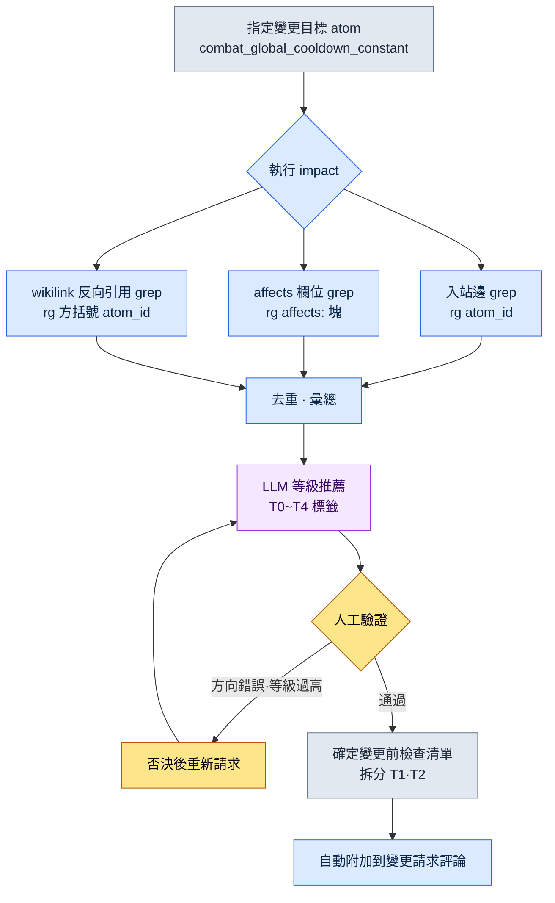

# 18.4 文件影響面 grep 工作流 —— 用 impact 提取影響範圍

週一上午 10 點。負責戰鬥的團隊成員 A 在團隊即時通訊工具裡丟下一句話:"全域性冷卻從 0.5 秒下調到 0.4 秒可以嗎?"這是改一個數字的事。表面上是。我讀到這句話,手停住了。這個數字被錄入了幾份文件、以這個常量為前提搭建的技能平衡 atom 有幾個、改動它會讓哪張表格的公式失效——我腦子裡浮現不出來。若自以為浮現出來了,那就是事故。每個季度都會爆出 8 到 12 起的"沒看到那份文件"式遺漏,其真身正是這種錯覺。

所以我決定不去背答案。而是敲一行命令。

```
impact combat_global_cooldown_constant
```

本章原原本本地看這一行命令吐出了什麼。它要展示的是:提取影響範圍不是抽象的說法,而是用 grep 把入站邊、本體 affects、wikilink 反向引用這三條路徑蒐羅到一起的具體動作。

---

## 18.4.1 影響範圍從三條路徑進來

"改動這個 atom 會影響到什麼"這個問題,其實是三個問題。混在一起答案就模糊,拆開來每一個都能落成一行 grep。

第一,**入站邊(inbound edge)**——誰指向我。atom A 引用 atom B,就是 A→B 方向的邊。改動 B 時危險的是那些指向 B 的 A,也就是進入 B 的箭頭。所以看的不是出站(我看向誰)而是入站。變更的衝擊波沿著箭頭逆流而上。

第二,**本體 affects**——在語義上影響到什麼。這是 atom 的 frontmatter 中寫明的 `affects:` 欄位。即使名字沒有直接出現,它也是設計者預先宣告的"這個會影響那邊"的語義連線。它把 grep 抓不到的別名、同義詞問題,由人預先錄入了進來。

第三,**wikilink 反向引用**——以 `[[atom_id]]` 形式顯式連結到我的文件。可信度最高。因為這不是偶然的詞語匹配,而是作者有意建立的連結。

把這三條路徑的關係畫成圖,如下。

<svg viewBox="0 0 640 300" xmlns="http://www.w3.org/2000/svg" font-family="sans-serif" font-size="13">
  <rect x="250" y="125" width="140" height="50" rx="8" fill="#2d3142" />
  <text x="320" y="148" fill="#ffffff" text-anchor="middle" font-weight="bold">combat_global</text>
  <text x="320" y="165" fill="#ffffff" text-anchor="middle" font-weight="bold">_cooldown_constant</text>

  <rect x="20" y="20" width="170" height="44" rx="6" fill="#e8eaf0" stroke="#5b6178" />
  <text x="105" y="40" text-anchor="middle" font-weight="bold">入站邊</text>
  <text x="105" y="56" text-anchor="middle" font-size="11">誰在引用我</text>

  <rect x="20" y="128" width="170" height="44" rx="6" fill="#e8eaf0" stroke="#5b6178" />
  <text x="105" y="148" text-anchor="middle" font-weight="bold">本體 affects</text>
  <text x="105" y="164" text-anchor="middle" font-size="11">affects: 欄位宣告</text>

  <rect x="20" y="236" width="170" height="44" rx="6" fill="#e8eaf0" stroke="#5b6178" />
  <text x="105" y="256" text-anchor="middle" font-weight="bold">wikilink 反向引用</text>
  <text x="105" y="272" text-anchor="middle" font-size="11">[[atom_id]] 顯式連結</text>

  <line x1="190" y1="42" x2="252" y2="135" stroke="#5b6178" stroke-width="2" marker-end="url(#arr)" />
  <line x1="190" y1="150" x2="248" y2="150" stroke="#5b6178" stroke-width="2" marker-end="url(#arr)" />
  <line x1="190" y1="258" x2="252" y2="165" stroke="#5b6178" stroke-width="2" marker-end="url(#arr)" />

  <rect x="450" y="125" width="170" height="50" rx="8" fill="#3d5a3d" />
  <text x="535" y="148" fill="#ffffff" text-anchor="middle" font-weight="bold">影響範圍列表</text>
  <text x="535" y="165" fill="#ffffff" text-anchor="middle" font-size="11">去重 · 附加等級</text>
  <line x1="390" y1="150" x2="448" y2="150" stroke="#3d5a3d" stroke-width="2.5" marker-end="url(#arr2)" />

  <defs>
    <marker id="arr" markerWidth="8" markerHeight="8" refX="6" refY="3" orient="auto"><path d="M0,0 L6,3 L0,6 Z" fill="#5b6178"/></marker>
    <marker id="arr2" markerWidth="8" markerHeight="8" refX="6" refY="3" orient="auto"><path d="M0,0 L6,3 L0,6 Z" fill="#3d5a3d"/></marker>
  </defs>
</svg>

把三條路徑捆進一個工具,就是 `impact`。下一節我們完整地看這個工具實際吐出的輸出。

---

## 18.4.2 實操記錄(worked transcript)—— 跑一次 impact

與其用話解釋,不如從頭到尾跟完一個真實的迴圈——把真實操作過程原樣記錄下來。它包含提示詞全文、工具的原始輸出(未加修飾)、我驗證並否決的部分,直到重新請求為止,全部收錄。

### 提示詞(全文)

我請 Claude 跑一遍 `impact` 工作流。工作流本體是呼叫 ripgrep 的 shell,但結果解讀和等級推薦由 Claude 負責。

```
請對 combat_global_cooldown_constant 執行 impact 工作流。
分別用 grep 提取三條路徑(入站邊 / affects / wikilink 反向引用),
合併重複項後,為每個影響物件附上影響等級推薦。
變更內容為"全域性冷卻 0.5 秒 → 0.4 秒"。
```

### Claude 原始輸出(不作摘要,原樣呈現)

```
我將按順序執行這三條路徑。

[1/3] 入站邊 —— 引用該 atom 的位置
$ rg -n "combat_global_cooldown_constant" --type md docs/ atoms/

atoms/combat/combat_skill_cooldown_rule.md:34:  base: combat_global_cooldown_constant
atoms/combat/combat_gcd_ui_feedback.md:12:  depends_on: combat_global_cooldown_constant
docs/spec/combat_v3.md:42:  以全域性冷卻(combat_global_cooldown_constant)為基準
docs/spec/skill_design.md:18:  冷卻時間按 combat_global_cooldown_constant 的倍數設計
docs/balance/refgame_comparison.md:77:  refgame 為 0.5 秒,我們的 combat_global_cooldown_constant 也相同

→ 發現 5 處直接引用。

[2/3] 本體 affects —— 通過 affects 欄位指向該 atom 的位置
$ rg -n "^\s*-?\s*combat_global_cooldown_constant" -B3 atoms/ | rg -B3 "affects:"

atoms/combat/combat_dps_curve.md:
  affects:
    - combat_global_cooldown_constant   ← (注意:需確認方向)

→ 1 處。不過這是 dps_curve 宣告"施加影響"的記錄,
  方向可能相反。需人工稽核 —— 參見下方驗證項。

[3/3] wikilink 反向引用 —— [[...]] 形式的連結
$ rg -n "\[\[combat_global_cooldown_constant" --type md

docs/spec/combat_v3.md:42:  ...[[combat_global_cooldown_constant]]...
atoms/combat/combat_skill_cooldown_rule.md:34: ...[[combat_global_cooldown_constant]]...

→ 2 處。兩處都是 [1/3] 中已捕獲的位置(重複)。

[彙總 —— 去重後的唯一影響物件]
1. atoms/combat/combat_skill_cooldown_rule.md   (入站邊+wikilink)
2. atoms/combat/combat_gcd_ui_feedback.md       (入站邊)
3. docs/spec/combat_v3.md                        (入站邊+wikilink)
4. docs/spec/skill_design.md                     (入站邊)
5. docs/balance/refgame_comparison.md            (入站邊)
6. atoms/combat/combat_dps_curve.md              (affects —— 方向未定)

[等級推薦 —— 依據 18.2 影響 5 級標準]
1. combat_skill_cooldown_rule    → T1(所有技能冷卻時間都是該常量的倍數)
2. combat_gcd_ui_feedback        → T2(UI 反饋時機,需視覺校正)
3. combat_v3.md                  → T3(規格文件數值更新)
4. skill_design.md               → T3(設計文件數值更新)
5. refgame_comparison.md         → T2(基準對比表,需重算與 refgame 的差距)
6. combat_dps_curve.md           → 待定(確認方向後再定等級)
```

### 人工驗證 / 否決

這裡我停下來的地方有兩處。

否決 1 —— **affects 方向**。`combat_dps_curve.md` 在 `affects:` 欄位裡寫下我們的常量,意思是 dps_curve *施加影響*給這個常量的宣告。可現在我們要改的是常量這一側。也就是說,箭頭方向相反。不是 dps_curve 改動常量,而是常量一改,dps_curve 的計算前提就會動搖。Claude 老實地以"需確認方向"掛起,這是對的。我把這一項**保留為影響物件**,但重新歸類為"反向語義依賴"而非 affects。確定為 T2。

否決 2 —— **把 refgame 對比表看作 T2**是高估了。`refgame_comparison.md` 是與外部遊戲做的單純數值對比表。我們的數字一變,只需把表裡一格從 0.5 改成 0.4 就完事,沒有任何系統以這張表為輸入。下調為 T3(文件數值更新)。

### 重新請求

```
請做兩處修改後重新整理影響表。
1) combat_dps_curve.md 保留為影響物件,標籤改為"反向語義依賴",
   等級確定為 T2。
2) refgame_comparison.md 從 T2 下調到 T3(沒有系統以它為輸入,只改表中一格)。
另外,只彙總 T1·T2,拆分為"變更前必須檢查"清單。
```

Claude 整理的最終結果如下。

```
[變更前必須檢查 —— T1·T2]
T1  combat_skill_cooldown_rule.md   所有技能冷卻時間都是該常量的倍數
T2  combat_gcd_ui_feedback.md       UI 反饋時機重新校正
T2  combat_dps_curve.md             反向語義依賴 —— 重新確認 DPS 曲線前提

[僅文件數值更新 —— T3]
T3  combat_v3.md / skill_design.md / refgame_comparison.md
```

起初在腦子裡"浮現不出來"的 6 個影響物件,經過一次 grep 迴圈和兩次人工判斷,變成了一份帶優先順序的清單。這就是影響範圍提取的實質:工具把候選全量蒐羅,人來定方向和等級。

---

## 18.4.3 提取流水線 —— 哪些是自動,哪些是人工

把上一節的一個迴圈概括成流程,如下。關鍵在於自動環節和人工環節在哪裡分道。



自動的部分是三條路徑的 grep 與彙總,以及等級*初稿*。人工的部分只有一個,**方向與等級的最終判斷**。上一個迴圈裡看到的 affects 反向和 refgame 下調,正是在這個位置發生的。如果 100% 信任工具,就會出兩種事故:要麼把 affects 反向從影響物件裡剔除,要麼過度保護對比表,每次都跑一遍不必要的評審。把自動與人工的邊界放在這一個點上,正是這套工作流的設計意圖。

---

## 18.4.4 三條路徑 grep 模式參考

把 impact 內部呼叫的 ripgrep 模式原樣寫下來。這就是這個工具的真身——不是華麗的基礎設施,而是三行經過驗證的正規表示式。

入站邊。atom ID 在文件正文中出現的所有位置。蒐羅得最寬。

```bash
rg -n "combat_global_cooldown_constant" --type md docs/ atoms/
```

affects 欄位。只看 atom ID 落在 `affects:` 塊內的情形。用 `-B3` 一併帶出前 3 行,由人用眼睛確認那是 affects 塊還是別的欄位。

```bash
rg -n "combat_global_cooldown_constant" -B3 atoms/ | rg -B3 "affects:"
```

wikilink 反向引用。只看用兩個方括號包起來的顯式連結。可信度最高,是優先檢查的物件。

```bash
rg -n "\[\[combat_global_cooldown_constant" --type md atoms/ docs/
```

這三個模式的可信度與召回率恰好成反比。wikilink 幾乎 100% 準確,但作者不建連結就抓不到。入站邊全都蒐羅,卻混進偶然的詞語匹配(噪聲)。affects 抓得住語義,方向卻容易搞混。三者合起來才能補上窟窿。只用一個,就一定會有漏的地方。

---

## 18.4.5 與決策卡繫結 —— portal_layer_change_impact_check

影響範圍提取是決策週期(§18.3)中的一步。決策卡登記的那一刻,impact 便以該卡的 `affected_atoms` 槽為輸入執行。驗證這一連線的 atom 就是 `portal_layer_change_impact_check`。

這個 atom 的職責是"當變更跨越 Layer 時,不讓影響檢查被跳過"。冷卻常量的變更只是 L1(系統)裡的一個數字,但其影響會蔓延到 L3(資料表公式)和 L4(構建 QA 項)。portal_layer_change_impact_check 判定變更是否越過 Layer 邊界,越過就強制執行 impact。

```yaml
---
name: portal_layer_change_impact_check
type: gate
description: 跨越 Layer 邊界的變更,在影響檢查通過前禁止納入構建
trigger:
  - 決策卡登記時 affected_atoms 非空
  - 變更 atom 的 layer != 影響 atom 的 layer
action:
  - 執行 impact(三條路徑 grep)
  - 若存在 T1·T2 影響物件,在勾選"檢查完成"前阻止合併
---
```

在冷卻時間這個案例裡,這道關卡抓到的不是 `combat_skill_cooldown_rule`(L1),而是以該 rule 為輸入的 CombatBalance 表格(L3)。表格裡的冷卻倍數列是以常量為前提搭建公式的。grep 從文件中搜羅 atom,關卡則推著你"這個越過了 Layer,連表格一起看"。兩者不繫結,就會出現文件更新了、表格卻停留在舊前提的典型遺漏。

---

## 18.4.6 度量 —— 工作流回收了什麼

這是作者在專案A運營中觀察到的變化。時間數值為作者估算(未經驗證),而遺漏事故的件數是季度覆盤中實際統計的值。

| 條目 | 無工作流 | 執行 impact |
|---|---|---|
| 掌握影響 atom 的時間 | 依賴記憶(不完整) | 1\~2 分鐘(全量 grep) |
| 變更遺漏事故 | 每季度 8\~12 起(統計實測) | 每季度 1\~2 起(統計實測) |
| 變更請求附帶影響清單 | 偶爾靠人 | 由關卡強制 |
| 新成員掌握影響 | 數天(口頭逐一傳達) | 30 分鐘(工具 + 卡片) |
| 基礎設施成本 | 考慮引入圖資料庫 | 只用 ripgrep + shell |

最後一行就是整章的結論。專案A 曾考慮過圖資料庫和搜尋索引,最終落定在 ripgrep 和一個小 shell 上。精密測量儀器確實比捲尺準。但每天都要拿出來用的工具,會收斂到不會壞、無需基礎設施的捲尺那一側。遺漏事故從 8\~12 起降到 1\~2 起,不是因為工具精巧,而是因為每次都毫無遺漏地跑一遍。

---

## 18.4.7 侷限 —— grep 抓不到的東西

即便捆起三條路徑,也還有漏的地方。知道侷限而用它,與不知情而盲信它,是兩回事。

別名與縮寫。如果正文只寫"GCD(Global Cooldown,全域性冷卻)",就不會被 `combat_global_cooldown_constant` 的 grep 捕獲。補救辦法是把檢索詞擴充套件成正則——`(combat_global_cooldown_constant|GCD|전역\s?쿨다운)`。另外維護一份團隊縮寫詞典,檢索時自動合成。

不可逆領域。grep 是可逆階段的工具。納入構建之前,文件、atom 與表格之間的影響全都能用 grep 看到。但構建釋出出去、使用者體感到 0.4 秒冷卻之後的反應——社群不滿、體感節奏變化——不是 grep 的物件。所以原則很簡單。**所有 grep 檢查都在納入構建之前完成。**一旦進入不可逆階段,grep 能知道的東西就急劇減少。

LLM 稽核的位置。就像上一個迴圈裡由人來定 affects 方向和等級那樣,在 grep 候選的適配性判定中插入 LLM,噪聲就會被濾掉。不過 LLM 也不是 100%,所以最終批准由人來做。在工具、LLM、人各過濾一道的結構裡,準確度才能達到可運營的水平。哪怕少一道,那一道原本會漏掉的那類事故就會重新進來。

---

> **遊戲之外的應用。**把"改動這一項會牽動哪裡"用全量檢索而非記憶去搜羅,這個習慣對任何用文件、電子表格工作的白領都能帶來同樣的效果。修改某一條條款時,若想靠腦子回憶寫明瞭該條款編號的合同、通知郵件、客戶 FAQ 分佈在幾處,一定會遺漏;但用關鍵詞把整個資料夾 grep 一遍全量蒐羅,再由人分類為"必須改 / 僅標記 / 無關",遺漏就消失了。舉例來說,會計人員變更某個科目程式碼時,把引用該程式碼的結算表格、報表模板、宏做全量檢索,整理成變更前檢查清單,就能從結構上杜絕"漏看了那一張表"式的季度結算事故。

## 18.4.8 動手試試

### setup

只要文件和 atom 以純文本(.md)管理、並裝好了 ripgrep(`rg`),準備就緒。若有 atom ID 命名規範(蛇形命名、唯一 ID),grep 的準確度會大幅提升。

```bash
# 驗證:某個 atom ID 在全部文件中出現了多少次
rg -c "combat_global_cooldown_constant" docs/ atoms/
```

### prompt

給出變更目標 atom 和變更內容,請求三條路徑提取 + 等級推薦。

```
請對 <atom_id> 執行 impact。
分別用 grep 提取入站邊 / affects / wikilink 反向引用三條路徑,
去重彙總後,推薦 18.2 的影響等級(T0~T4)。
變更內容:<把什麼改成什麼>。
只把 T1·T2 拆分為"變更前檢查"清單。
```

### verify

別原樣相信工具輸出,手動確認兩點。

1. **affects 方向** —— 看被 affects 抓到的項,是"我施加影響的一側"還是"我被影響的一側"。方向相反就改標籤。
2. **等級過高/過低** —— 若表格或用於對比的文件被列進 T1·T2,就問"有沒有系統以這份文件為輸入"。沒有就下調到 T3。

確認後,只把 T1·T2 清單貼到變更請求評論裡,一個迴圈就閉合了。

### 單人精簡版

如果是既沒有工具也沒有 atom 圖譜的個人作業,用一行命令和一格備註也能取得同樣的效果。

```bash
# 用要改的概念名稱在全部資料夾中做全量搜尋
rg -n "전역쿨다운|GCD|global_cooldown" .
```

把檢索結果原樣貼進記事本,在每一行旁邊手動寫上"必須改 / 僅標記 / 無關"三者之一。這就是單人版的 impact。關鍵不在工具的精巧,而在"不依賴記憶、全量蒐羅後由人分類"這個流程本身。有流程,遺漏就減少;沒有流程,週一上午那份茫然就每次重演。

---

### 本章要點
- 影響範圍分為入站邊、affects、wikilink 反向引用三條路徑,impact 把三者全量蒐羅
- 自動做到 grep 彙總與等級初稿為止,人只負責 affects 方向與等級判斷這一個點
- grep 是可逆階段的捲尺,檢查必須在納入構建前完成,而它比圖資料庫更耐用

### 下一章預告
- 19.1 團隊負責人的運營 —— 決策·影響追蹤如何以團隊為單位運轉
