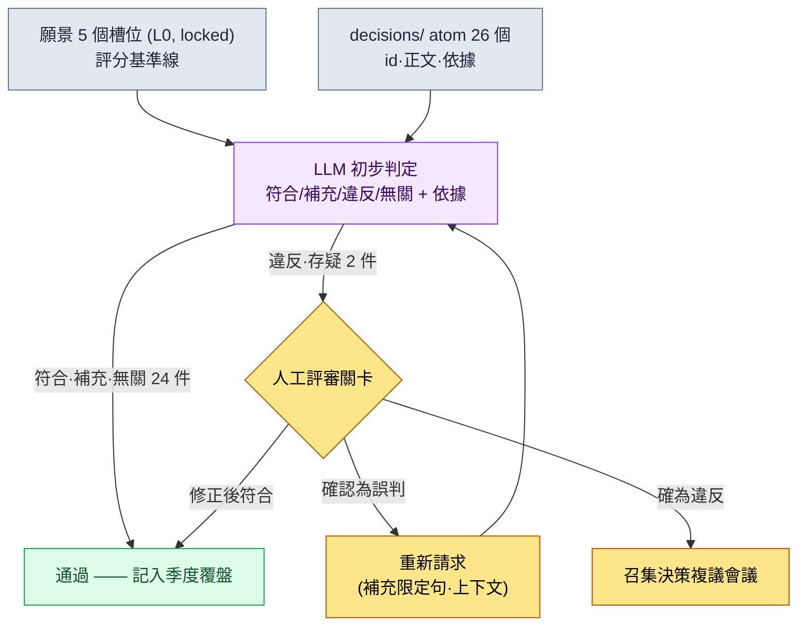

# 19.1 把願景用作決策的評分表 —— 將 decisions/ 中的 26 個決策交給 LLM 檢驗

> 主要讀者:帶領中等規模(10\~50 人)團隊的設計總監·主策劃
> 面向單人/業餘讀者的精簡版:§19.1.8「一個人的話,做到這些就夠」

即便是把願景文件在一頁內寫得很好的團隊,也會反覆出現同一種事故。願景掛在牆上,可每週不斷堆積的決策是否與這份願景相符,卻沒有人去確認。季度覆盤時會翻出來看一次,但那時早已在偏離的決策之上又疊了三個左右的後續決策。要讓願景成為“爭議的基準點”,比起撰寫,更重要的是每做一個決策就拿去與願景對照。而這項對照工作,若由人手工去做既枯燥又容易遺漏——正是適合交給 AI 的事。

本章把兩件事合在一起講。前半部分是把已經寫好的願景當作決策評分表來運轉的工作流——把作者專案中實際的 26 個決策 atom 放到 LLM 上,得到“違反願景槽位”的判定,並由人抓出其中一處誤判的一整個迴圈。後半部分回答的是這張評分表能覆蓋到誰的決策這一問題,也就是授權委派。領導力的一般論(願景為何重要、委派為何是成長的工具)在其他書裡已經講得夠多,本章只專注於把這些原則放到 AI 工作流中運轉的那一環。

---

## 19.1.1 願景·路線圖·排期 —— 只點明三層為何不同

先要理清“願景篩選決策”這句話。願景、路線圖、排期並不是一回事。它們的時間單位與變更頻率不同,而當這種區別崩塌時,排期壓力就會動搖願景。

| 層 | 週期 | 變更頻率 | 與願景對照的意義 |
|---|---|---|---|
| 願景 | 5\~10 年 | 幾乎不變 | 決策必須符合的基準線 |
| 路線圖 | 1\~3 年 | 每季度 | 把願景翻譯成排期的中間層 |
| 排期 | 1\~3 個月 | 每週 | 不與願景直接對照 |

關鍵在於:**決策所要對照檢驗的物件是願景(最不易變的那一層)**。不是因為排期緊張就去改願景,而是當排期與願景相沖突時去調整排期。只有這一層級關係清晰,下一節的自動檢查才有意義。因為如果檢查的基準線每週都在搖動,檢查本身就毫無意義。

願景用一頁、5 個槽位就寫完。作者專案的願景文件是下面這副骨架。這些槽位將成為 §19.1.3 中 LLM 檢查的評分標準,所以先把它的形態看一遍。

```markdown
---
title: 專案A 願景 v2
layer: L0
locked: true   # 變更時需遊戲總監 + CEO 達成一致
---

## 槽位 1. 我們要做的東西
韓國奇幻世界觀的移動優先 MMORPG。

## 槽位 2. 為誰而做
30~50 多歲、以移動端為主、喜歡厚重敘事的使用者。

## 槽位 3. 為什麼(差異化)
- 以多層敘事實現深度敘事(重深度而非量產)
- 東南亞 + 韓國同時運營

## 槽位 4. 怎麼做(價值)
- 尊重使用者的時間(最小化無謂消耗的內容)
- 資料 + 人的平衡決策
- 團隊共識優先於決策速度

## 槽位 5. 不是什麼
- 不是 F2P 激進付費模式
- 不以 PvP 為中心
- 不強制每天線上 N 小時
```

槽位 5(“不是什麼”)在檢查中出力最多。因為違反往往不是出在“決定要做的事”上,而是出在悄悄去做“決定不做的事”的地方。

---

## 19.1.2 決策早已以 atom 形式積累

拿願景去檢驗什麼?作者團隊把所有重要決策都以一張 atom 的形式固化到 `decisions/` 資料夾中。這是標明瞭日期、當事方、依據的事實記錄,目前已積累 26 個。檢查的輸入就是這 26 個——不是新造,而是把已有的拿去檢驗。

一張決策 atom 的實際形態如下(已匿名化)。

```markdown
---
type: decision
id: D0019
date: 2026-05-12
deciders: [遊戲總監, 資料總監]
tier: T1
---
# refgame_selective_adoption_for_mobile
將參考 MMORPG 的部分戰鬥資料選擇性地採用到移動端構建中。
依據:6 英寸移動端上已有經過驗證的戰鬥節奏,若從 0
重新設計,Alpha 排期會推遲一個季度。但付費、簽到誘導
結構不予採用。
```

從 26 箇中挑出若干個用作檢查輸入的代表(實際 atom 名,§A.3.3)。

| atom id | atom 名(匿名化) | tier | 一句話要點 |
|---|---|---|---|
| D0007 | `claude_role_transition_phase2` | T1 | 將 Claude 從被動輔助提升為主動夥伴 |
| D0014 | `dataset_scope_alpha_split` | T2 | 確定 Alpha 資料集的拆分標準 |
| D0019 | `refgame_selective_adoption_for_mobile` | T1 | 選擇性採用參考遊戲的戰鬥資料 |
| D0021 | `procedural_capability_frontier_5stage` | T1 | 定義程式化生成能力的 5 個階段 |
| D0023 | `class_keyword_world_only` | T2 | 將職業關鍵詞限定在世界觀之內 |

這張表就是下一節提示詞的輸入資料。一次性把 26 個都拿去檢驗是關鍵所在,而如果人在覆盤時手工把 26 個逐一與願景對照,要花上半天,並且從中途開始注意力下降,就會漏掉違反項。這項枯燥的初步對照交給 LLM。

---

## 19.1.3 [實操記錄] 把 26 個決策放到願景上檢驗

下面把一個完整迴圈從頭看到尾。輸入的提示詞可以原樣複製使用,輸出則是對真實會話的重現。

### 第 1 步 —— 提示詞:把願景作為評分表給出,並強制判定格式

```
請把 26 個決策 atom 逐一放到下面的願景 5 個槽位上檢驗,判定每個決策相對於
願景屬於符合/補充/違反/無關中的哪一種。若為違反或無關,請用一行註明是哪個
槽位以及原因(尤其要仔細看槽位 5“不是什麼”),存疑的用“存疑”標出交給我。
符合的可以不寫依據。
只給表格(id | 判定 | 衝突槽位 | 依據 | 存疑),不要總評。

[願景 5 個槽位 —— 貼上 §19.1.1 全文]
[26 個決策 atom —— id·正文·依據]
```

提示詞有一半是在“強制判定格式”。若給它自由,LLM 會把 26 個全都含糊成“大體符合”。**設定 4 級判定標籤、只對違反·無關強制附依據,以及留一個“存疑就交給人”的出口**,才是這條提示詞的核心。在依據句中明確點名槽位 5,也是有意為之——因為違反出在“決定不做的事”上。

### 第 2 步 —— Claude 的輸出(重現,節選)

```
| id    | 判定 | 衝突槽位 | 依據                                     | 存疑 |
|-------|------|----------|------------------------------------------|------|
| D0007 | 無關 | —        | Claude 運營決策。與遊戲願景的評價維度不同   |      |
| D0014 | 無關 | —        | 資料集拆分。屬內部基礎設施決策             |      |
| D0019 | 違反 | 槽位 5   | 採用參考遊戲戰鬥資料 → 與“不是 F2P 激進     | ★    |
|       |      |          | 付費模式”存在衝突之嫌                     |      |
| D0021 | 符合 | 槽位 3   |                                          |      |
| D0023 | 符合 | 槽位 1   |                                          |      |
| ...   |      |          |                                          |      |

(26 箇中:符合 18 · 補充 3 · 無關 3 · 違反 2)
違反/存疑判定待確認:D0019、D0026 —— 需人工評審
```

輸出中最有價值的部分不是表格,而是**最下方的 2 處違反與存疑標記**。LLM 自動過濾掉 26 箇中的 24 個,只把該由人來看的 2 處呈上來。半天的對照縮減為 2 處的評審。然而這 2 處裡有一處是誤判。

### 第 3 步 —— 驗證與否決(人的位置)

人再讀一遍 D0019(`refgame_selective_adoption_for_mobile`)的判定。LLM 看到“採用參考遊戲的戰鬥資料”,便判定它與槽位 5 的“不是 F2P 激進付費模式”相沖突。表面上的字眼看起來說得通——因為參考遊戲以激進付費而聞名。

然而,如果把 atom 正文讀到最後,會看到最後一句。**“但付費、簽到誘導結構不予採用。”** 這個決策只取用戰鬥節奏資料,而把付費結構明確排除在外。它反而是一個維護槽位 5 的決策。LLM 沒能把 atom 正文最後這句限定句納入判定權重,被“參考遊戲”這個出處字眼牽著走,把它歸為違反。這不是違反槽位 5,而是**符合**。

出現這種誤判的原因很清楚。LLM 把決策的*出處*(從哪款遊戲取來)與決策的*內容*(取來什麼、捨棄什麼)看得同等重要。而人知道“但……不做”這樣的限定分句才是決策的核心。於是人否決它,並重新請求。

```
請重新看一下 D0019。正文最後一句“但付費、簽到誘導結構不予採用”才是核心。
請把採用的部分(戰鬥節奏資料)和排除的部分(付費、簽到結構)分開,
分別判定各自落在哪個槽位上。
```

LLM 重新作答:“採用的物件(戰鬥資料)符合槽位 1·2,排除的物件(付費結構)積極支援槽位 5。綜合判定:符合。上一次的違反判定是對出處字眼過度反應的錯誤。”經過這一次往返,D0019 就從違反更正為符合。剩下真正需要評審的只有 D0026 一處。

這個迴圈就是本章的核心。**LLM 會把 26 個縮減為 2 處,但這 2 處裡可能有一處是誤判。** 自動檢查並不是取消人的評審,而是讓人把精力從 26 個轉到 2 處上的工具。如果人不把這 2 處讀到最後,好端端的決策就會以“違反願景”的名義被搬上會議,製造出無謂的爭執。

---

## 19.1.4 一圖看懂檢查流程

把上面的迴圈畫成圖留存下來,之後每個季度就能重複同一套流程。關鍵在於:LLM 的判定不會自動推翻決策。只把違反·存疑上報到人工關卡,而廢棄·更正·批准由人來做。



人經手的地方只有兩處。一處是乾淨地錄入願景與決策(最上方),另一處是把 LLM 判為違反·存疑的少數條目讀到最後並作出判定(中間的關卡)。中間那段枯燥的 26 個對照由 LLM 來跑。這與 §6.2 城市生成器中 lint 不自動廢棄違規、而只向作者關卡發出 alert(警報)的設計相同——機器挑出可疑候選,而殺還是留由人來定。

---

## 19.1.5 願景檢查覆蓋到誰的決策 —— 授權委派

這裡自然會冒出一個問題。這 26 個決策都是遊戲總監一個人做的嗎?那樣可不行。主管若親自做所有決策就會成為瓶頸,若全部授權下放又會削弱願景。願景檢查同時也是一張安全網——**用來把授權下放的決策也納入同一張評分表來篩選**。

決策是有等級的,而等級就意味著許可權。下面是作者團隊的許可權矩陣。

| 等級 | 決策者 | 評審者 | 通知 | 是否納入願景檢查? |
|---|---|---|---|---|
| T0 願景·核心 | 遊戲總監 + CEO | 全體組長 | 全團隊 | 願景本身(檢查基準線) |
| T1 系統·跨領域 | TF 組長 + 遊戲總監 | TF 成員 | 相關領域團隊 | ✅ 必須 |
| T2 領域·中等 | 領域總監 | 資深人員 | 相關領域團隊 | ✅ 必須 |
| T3 單次·小型 | 資深人員 | 負責人 | 直接相關方 | 抽樣檢查 |
| T4 即時·熱修復 | 負責人 | 資深人員(事後) | 遊戲總監(事後) | 不納入檢查 |

`decisions/` 裡的 26 個大多是 T1·T2——都是授權下放的決策。遊戲總監並不親自過目所有 T2。取而代之的是,願景檢查(§19.1.3)每季度把授權下放的 T1·T2 決策拿到願景上檢驗一次。**可以說,授權的安全網就是願景檢查。** T0 不是檢查物件,而是檢查的基準線;T4 熱修復數量多、對願景幾乎無影響,因此排除在外。

授權本身不是一步到位,而是分 4 個階段漸進推進。

| 階段 | 許可權 | 與 LLM 檢查的關係 |
|---|---|---|
| 1. 資訊傳達 | “照這樣做” | 由授權者決定,無需檢查 |
| 2. 建議 + 上報決策 | “考慮 X 後再決定” | 上報時一併對照願景 |
| 3. 事後上報 | “決定後告知結果” | 固化為 atom → 納入季度檢查 |
| 4. 自主決策 | 無上報義務(在等級限度內) | 只要留下 atom,檢查便可事後覆蓋 |

第 4 階段的自主決策與願景相偏離的風險最大,而正是這種風險由 §19.1.3 的檢查在事後抓住。自主做出的 T2 決策,只要固化成 atom,就會自動進入季度檢查。授權的自由與願景的一致性之所以不衝突,原因就在這裡——自由地做決策,但決策要留成 atom,而 atom 每季度都會被拿去與願景對照。

---

## 19.1.6 如何誠實地對待數字

寫願景·授權這一章,很容易忍不住想放進“引入願景後會議時間從 90 分鐘減到 45 分鐘”“授權後總監的決策負擔從每週 30 件降到 5 件”這類表格。這類數字若未經驗證,反而會削弱本書的可信度。本章的數字只按以下三種方式之一來處理。

第一,**能數的就按實測來寫。** `decisions/` 的 atom 目前是 26 個(以 2026 年 5 月的實測為準)。從 LLM 初步判定上報到人工關卡的件數、其中被更正為誤判的件數,都是可由會話日誌計數的實測值。上面的實操記錄中,2 件違反判定裡有 1 件(D0019)是誤判,這也是真實會話的結果。

第二,**效果只談方向。** “半天的對照縮減為少數幾處的評審”講的是結構的方向,而不是絕對時間。確切能省下多少時間會隨決策數量、團隊規模、atom 正文長度而變,所以應把它當作“手工過 26 個”與“LLM 初步判定 + 人工關卡”之間的結構差異來讀。會議時間、士氣分數這類結果指標不會由願景一項決定,因此不對因果下定論。

第三,**只承諾可測量的東西。** 這套工作流實際可測量的是——每季度納入願景檢查的決策數、通過人工關卡的件數、誤判率(LLM 判為違反、被人更正為符合的比例)、atom 固化遺漏件數(已授權下放卻因沒有 atom 而漏出檢查的決策)。這四項在會議上可以用數字而非“感覺”來講。尤其是**誤判率**,它每個季度都用數字證明為什麼不能照單全信 LLM 的判定。

---

## 19.1.7 常見的失敗

| 模式 | 為何失敗 | 對策 |
|---|---|---|
| 只寫願景,不拿去檢驗決策 | 願景淪為牆上裝飾,決策各行其是 | 每季度把 26 個 atom 放到願景上檢驗的 §19.1.3 |
| 把 LLM 的違反判定直接搬上會議 | 誤判(如 D0019)引發無謂的爭執 | 違反·存疑的條目由人把 atom 正文讀到最後 |
| 決策不留成 atom | 授權下放的決策整個漏出檢查之外 | 在事後上報(授權第 3 階段)中強制固化為 atom |
| 連 T4 熱修復也全部檢查 | 只增加數量,對願景幾乎無影響 | 把檢查範圍限定在 T1·T2 |
| 授權跳過 1→4 階段 | 自主決策在偏離願景的情況下不斷累積 | 分階段授權 + 季度檢查來事後覆蓋 |

第三項最常被忽略。越是能自主順暢運轉的團隊,越容易只在口頭上達成決策而不留下 atom。這樣一來,§19.1.3 的檢查只看得到已固化的決策,於是最自由做出的決策反而落入檢查的盲區。授權的自由,只有以固化 atom 為前提才安全。

---

> **遊戲之外的應用。** 把願景拿去逐一檢驗每個決策,以及授權委派,並不只是遊戲團隊的功課,而是每一位管理者的工作。如果把部門的使命用一頁 5 個槽位(“我們做什麼 / 為誰 / 為什麼 / 怎麼做 / 不是什麼”)釘死下來,就能每季度用 LLM 對每週堆積的實務決策是否偏離這份使命做一次初步對照——尤其容易抓出悄悄去做“決定不做的事”這類違反。舉例來說,把團隊負責人授權下放的決策每季度拿到部門使命上檢驗,就能成為一張安全網,事後抓出自主做出的決策是否偏離了方向。不過,LLM 判為“違反”的條目不要直接搬上會議,其中一處可能是誤判,所以必須由人讀到最後。

## 19.1.8 動手試試 —— 今天就能做的一步

> **一個人的話,做到這些就夠**:沒有決策 atom 資料夾也沒關係。先把你自己專案(或業餘遊戲)的願景,用 §19.1.1 的 5 個槽位寫滿一頁就好。接著把最近做的 5\~10 個決策各用一行記成便籤,再把 §19.1.3 的提示詞原樣貼上,交給 LLM 過一遍。只要出現哪怕一個“違反”判定,就把那個決策的便籤重新讀到最後,親自反駁一下 LLM 是否正確。這樣一來,你就能親身體會到願景檢查究竟是一組怎樣的判斷,以及為什麼不能照單全信 LLM 的判定。

如果是團隊,就從下面這一步開始。先把願景固定為 5 個槽位、一頁紙(L0, locked),再從把最近一個季度做出的 T1·T2 決策以一張 atom 的形式固化到 `decisions/` 資料夾做起。哪怕只積累了 10 個 atom,也可以把 §19.1.3 的提示詞跑一遍;只要在這第一個迴圈裡抓出授權下放的決策中一處偏離願景的,這套工作流的價值就會立刻顯現。

---

### 本章要點
- 比起撰寫,把願景拿去檢驗決策更重要——每季度把 decisions/ 的 26 個放到願景 5 個槽位上檢驗。
- LLM 會把 26 個縮減為少數幾處,但其中一處可能是誤判(D0019)。
- 把授權下放的 T1·T2 決策留成 atom,願景檢查便成為授權的事後安全網。

### 下一章預告
- 19.2 衝突管理·團隊文化 + 會議領導力 —— 許可權一旦分散,衝突隨之而來。如何用 AI 支撐衝突分類與會議運營
