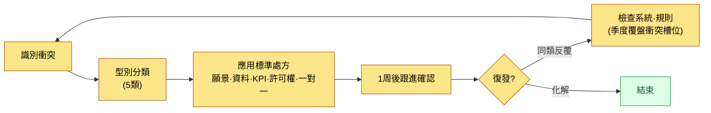
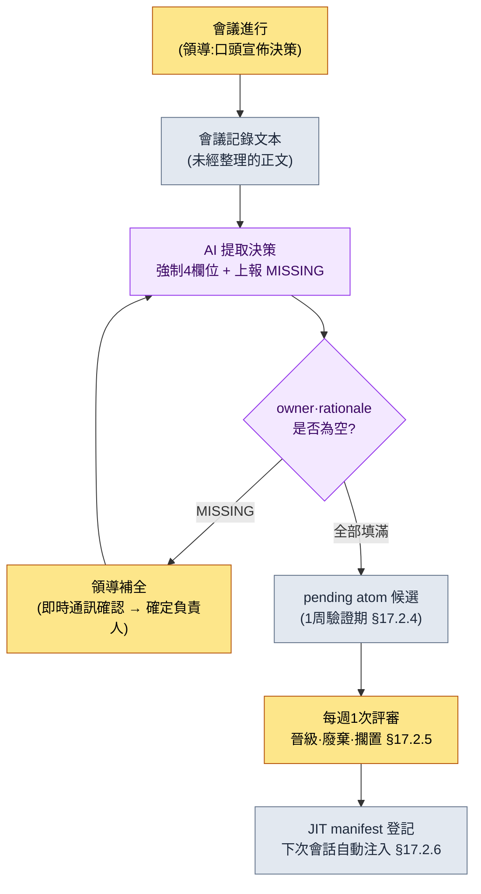

# 19.2 對沖突分類,不讓會議中的決策流失——會議領導力的 AI 輔助

> 主要讀者:每季度在會議上作出50件以上決策的總監·團隊負責人(中等規模(10\~50人)團隊)
> 面向個人/愛好者讀者的精簡版:§19.2.8「如果只有你一個人,做到這些就夠了」

我曾把一場會議順利開了90分鐘,一週之後,同一個議題卻又擺回了會議桌上。明明已經拍板,可是誰負責什麼卻哪裡都沒記下來。會議記錄裡只留下了"討論了全域性冷卻",而"定為0.5秒,負責人團隊成員A"這句,在當時在場者的腦海裡只過了一週就揮發殆盡。領導的會議崩掉的地方,大多不在會議進行中,而是在**會議剛結束、決策尚未固化為記錄之前的那道短暫縫隙**。

本章處理團隊負責人工作的兩大塊。前半部分是**不必每次都從零開始解決衝突,而是把它送往按型別劃分的標準處方的方法**;後半部分則是本章的脊柱——**讓 AI 提取會議中產出的決策,但一旦缺少負責人(owner)或依據(rationale)就強制不予通過的實操記錄(worked transcript)**。領導力的一般論(提出願景·傾聽·共情)在別的書裡已經講得夠多,因此本章只聚焦於*把這套一般論跑成 AI 工作流、從而防止決策遺漏的環節*。

---

## 19.2.1 衝突的目標不是歸零,而是分類

以為零衝突的團隊才是健康團隊,這是一種誤解。一箇中等規模(10\~50人)的團隊每季度作出50件以上決策,卻一次摩擦都看不見,那不是沒有衝突,而是衝突沉到了水面之下,而沉下去的衝突更危險。

領導要做的不是消滅衝突,而是**儘快對型別分類,把它送往標準處方**。若同樣的衝突每次都以不同方式解決,那麼解決所花的時間每次都要從零重新累積。

| 衝突型別 | 衝突的本質 | 標準處方 |
|---|---|---|
| 價值衝突 | 對願景的不同解讀(營收 vs 使用者時間) | 引用願景槽位 |
| 事實衝突 | 對同一資料的不同解讀 | 核對資料(元遊戲報告) |
| 優先順序衝突 | "我的領域更重要" | 比較影響等級·KPI 影響 |
| 許可權衝突 | "這是我的決定" | 重新確認許可權矩陣 |
| 個人衝突 | 人際關係·溝通風格 | 一對一,事實/情緒分離(系統之外) |

前四種,處方都是**引用系統**。願景·資料·KPI·許可權矩陣一旦被明文化,決策的分量就從人的嘴轉移到系統一側,討論隨之變短。只有第五種個人衝突在系統之外——一對一,以及事實·情緒的分離,除了時間與真心之外的工具幾乎都不起作用。不過,"系統解不了"並不是領導可以撒手的藉口。系統解不了的領域,歸根結底也是領導的活兒,這正是此處的棘手之處。

分類不是每次從頭解一遍,而是轉成一條流程。



關鍵在右側的分岔點。若同一類衝突反覆出現,那就不是人的問題,而是系統的問題。那時,不去調解人,而是去修整願景·許可權矩陣這類規則。這將成為 §19.2.7 要講的季度覆盤衝突槽位的輸入。

---

## 19.2.2 會議是產出決策的地方,而決策不能流失

正如衝突處方的四種全都是"引用系統",會議歸根結底也是一臺**產出決策、並把該決策固化為記錄的裝置**。領導在會議中要守的五條原則彼此相扣。哪怕只缺其中一條,其餘的也會跟著動搖。

1. 議題在會議24小時前共享。(沒有準備就聚在一起,會議就會滑向辯論場)
2. 為每個議題強制設定時限。(資訊共享5分鐘·決策15\~20分鐘·討論30\~45分鐘,超時則順延)
3. 在會議結束時明確"今日決策"。(不作決策就結束,下次會議會再次開啟同一議題)
4. 會議記錄在結束後立即生成。(若指望人事後再整理,就會揮發)
5. 每條決策都追蹤負責人·依據·後續行動。(沒有追蹤的行動,不到下週就會消失)

這五條裡,第3·4·5條崩掉,就是開頭那起事故。決策用嘴說了(原則3部分滿足),卻沒有固化為記錄(原則4失敗),負責人也沒有錄入(原則5失敗)。於是一週之後,同一議題又擺了上來。

問題在於,若把原則3·4·5交給人的意志,它們會在繁忙的一週裡最先崩塌。會議一結束,領導就已經奔向下一場會議。因此,要把這三條原則**搬到 AI 輔助流水線上。** 也就是從會議記錄文本中自動提取決策,而一旦負責人或依據為空,就不讓它通過。這條流水線,是從領導視角再看一遍第17部分中建立的會議→會議記錄→atom 提取流程(§17.2)。

---

## 19.2.3 [實操記錄] 從會議記錄中提取決策,但缺少負責人就攔下

下面把實際怎麼跑的完整走一遍。舞臺設在作者專案(移動優先的 MMORPG,以下簡稱"專案A")的戰鬥 TF 會議剛結束之時。輸入提示詞可以照抄使用,輸出則是對真實會話的還原。

### 第1步——輸入:直接把未經整理的會議記錄正文扔進去

不把會議記錄整理得漂漂亮亮。發言彼此夾雜,是否算決策存疑的行也原樣保留——這樣粗糙的文本就是輸入。整理是 AI 該做的事,不是人先要做的事。

```text
[2026-06-05 戰鬥 TF 會議記錄正文——摘錄,未經整理]

團隊成員A:全域性冷卻設為0.5秒的模擬結果很穩定。
團隊成員B:如果把恢復技能也一起綁進0.5秒,恢復迴圈可能會被打亂。
團隊成員A:那就單獨拿出來。恢復作為全域性冷卻的例外。
李旼洙:好,全域性冷卻統一為0.5秒,恢復作為例外。A 幫忙把資料表
        cooldown 列統一過一遍。
團隊成員C:目標選取優先順序規則,下週再看看再定……
團隊成員B:小地圖縮小切換得和 UI 組一起看才行。先擱置。
李旼洙:好,那個放到下次會議。
```

這裡混著兩條決策(全域性冷卻0.5秒、恢復例外)和兩條擱置(目標選取、小地圖)。靠人用眼睛挑,總會漏掉一件。那就是開頭那起事故。

### 第2步——提示詞:讓它提取,但不許把負責人·依據留成空欄

```text
從附上的會議記錄中只提取"決策"。討論·擱置·資訊共享都不算決策。
每條決策填寫 decision(一句話)/ owner / rationale / follow_up 四欄,
如果在正文中找不到 owner 或 rationale,不要猜測,
寫上"[MISSING——會議中未確定]"。擱置·順延到下次會議的記為 deferred,
是否算決策存疑的行記為 ambiguous 交給我。輸出
只用 decisions / deferred / ambiguous 三個區塊。
```

請注意,這段提示詞有一半都在"強制空欄"。給 AI 自由,它就會把 owner 編得像模像樣,或把擱置項晉級為決策。**留下一個"找不到就別猜、上報 [MISSING]"的出口**,正是這套工作流的核心。決策要由人明確宣佈才有價值(§17.6.3 的原則),AI 只做到把"此處為空"這一事實*暴露*出來為止。

### 第3步——Claude 的輸出(對真實會話的還原)

```text
decisions:
  - decision: 將戰鬥全域性冷卻統一為0.5秒。
    owner: 團隊成員A("A 幫忙把資料表 cooldown 列統一過一遍"——李旼洙)
    rationale: "全域性冷卻設為0.5秒的模擬結果很穩定"(團隊成員A)
    follow_up: 統一檢查 cooldown 列

  - decision: 恢復技能不適用全域性冷卻。
    owner: [MISSING——會議中未確定]
    rationale: "如果把恢復也一起綁進0.5秒,恢復迴圈可能會被打亂"(團隊成員B)
    follow_up: 將恢復技能 cooldown 例外處理寫入資料

deferred:
  - 目標選取優先順序規則(團隊成員C,下週追加評估)
  - 小地圖縮小切換(需與 UI 組協商,擱置)

ambiguous:(無)
```

輸出中最有價值的部分,不是第一條決策那張乾淨的表,而是**第二條決策的 `owner: [MISSING]`**。恢復例外分明已經拍板,可會議記錄裡哪兒都沒寫"由誰寫入資料"。AI 沒有用猜測去填那個窟窿,而是誠實地上報了。好的提示詞,能讓 AI 說得出"這個位置是空的"。

### 第4步——驗證與拒絕(領導的位置)

不能就這麼把這份輸出照單全收。冒出 `[MISSING]`,意味著**會議只把決策做完了一半**。此處領導要做的,不是去改 AI 的輸出,而是把會議上落下的決策補齊。

作者在這一步,用內部即時通訊向團隊成員A問了一句:"恢復例外的資料寫入,也是 A 一起來看,對吧?"A 回了"是"。這一句話就把缺失的負責人確定了下來。接著再次請求。

```text
第二條決策(恢復例外)的 owner 已確定為團隊成員A(通過內部即時通訊本人確認)。
把這個反映進去,重新給出 decisions,並把兩條決策也
轉成 pending atom 候選格式。
// (意圖:包含 status: pending、source_meeting、owner、related_atoms——§17.2.4 格式)
```

AI 把兩條已填好 owner 的決策,轉換成兩個 pending atom 候選後再次作答。這些候選不會立刻成為正式決策,而是**以 pending 狀態經過1周驗證期**(§17.2.4)。因為會議上定下的東西,也可能在運營一週後被推翻。相當於給墨水留出晾乾的時間。輸入 → 提取 → 上報 MISSING → 人補全決策 → 再次請求的一個迴圈,到這裡閉合。

這一圈,從結構上堵住了開頭那起事故。當決策只做了一半時,這個事實不是在會議結束一週之後,而是**在會議剛結束的當場**就暴露出來。

---

## 19.2.4 完整流水線——人手只落在兩處

把上面的實操記錄疊到第17部分的會議記錄流水線之上,整幅圖景就是這樣。領導的手能觸及的只有兩處:在會議上*宣佈*決策之處(最前),以及*補全* AI 上報的 `[MISSING]` 之處(中間)。兩者之間的提取·轉換·登記都是自動的。



在這條流水線裡,AI **不做**的事更重要。AI 不製造決策。不編造負責人。不把擱置項晉級為決策。AI 所做的,僅止於從會議記錄裡挑出決策候選、並把空欄*暴露*出來。決策的宣佈與空欄的補全由人來做。這正是 §17.6.3 所說"決策槽位禁止 AI 自動生成"原則在領導視角下的應用——因為決策一旦傳播到別的文件·會話·構建中就會留下不可逆的痕跡,所以在入口關卡處,要保留由人明確宣佈的環節。

---

## 19.2.5 [MISSING] 強制支撐起平等決策文化

在公司 PC 的團隊共享 atom 中,有一個名為 `team_equal_decision_culture` 的概念 atom。它把覆盤中反覆引用的措辭固化下來,用一個詞指代"決策靠依據而非職位"的團隊文化。這種文化不是總監一句"我定了,就這樣"壓下去,而是每條決策都留下誰·為何,從而**讓日後任何人都能以該決策的依據去回溯**。

§19.2.3 的 `[MISSING]` 強制,正是這種文化的技術支撐。不讓負責人和依據以空欄通過,意味著決策的權威落在"因為它出自正文的某句發言",而非"因為總監說了"。依據引用一旦為空,決策就會被攔下,於是靠職位壓出來的決策,在結構上無法成為 atom。

這種文化,與 §19.2.1 的衝突處方也一線相連。用引用願景解價值衝突、用資料解事實衝突、用矩陣解許可權衝突,全都是**以記錄下來的依據、而非人的一張嘴來解決**這同一條原理。平等決策文化是衝突處方的土壤,而 `[MISSING]` 強制,則是每逢一次會議就把這片土壤夯實、不讓它鬆動的工具。

在此之上,還疊加著團隊文化的另一根軸——公開與封閉的邊界。會議記錄·決策卡·KPI 資料·事故報告放在公開區域,而一對一談話·人事評價·薪資·個人情況放在封閉區域。決策提取流水線所處理的,全都在公開區域。個人衝突(§19.2.1 的第五種)之所以在系統之外,原因也一樣——它屬於封閉區域,不固化為 atom。

---

## 19.2.6 誠實對待數字的方法

領導力這一章,很容易被誘惑去放一張"引入會議流水線後,會議時間減半"之類的表。這樣的數字若未經驗證,就會削弱本書的可信度。本書的原則有以下三條。

第一,**只把可測量的東西承諾為指標。** 會議流水線真正能數的是這些——每條決策的 `owner`·`rationale` 缺失件數(目標為0)、從會議記錄中提取的決策裡晉級為 pending atom 的比例、"這個之前不是沒定過嗎?"的重開會議件數。這三項,在會議中能用數字而非"感覺"來說話。

第二,**作者的推測就寫明是推測。** 會議剛結束時提取決策所花的時間——"手工整理會議記錄20\~30分鐘 → AI 起草 + 補全5分鐘以內"——是作者基於經驗的推測,是未經驗證的假設。不必去記絕對值,而應把它讀作*結構差異*("人從頭開始挑揀" vs "AI 提取 + 只補空欄")。準確的節省時間,會隨會議規模·決策數量而變化。

第三,**不對因果下斷言。** 不把"重開會議變少了"完全歸功於這條流水線。團隊成熟度·專案階段也在同時起作用。只說方向(決策遺漏若在會議剛結束時暴露,就會朝著重開會議減少的方向起作用),而不編造倍數。

---

## 19.2.7 季度覆盤的衝突·決策槽位

衝突處方與決策流水線,會在季度覆盤中走一遍檢查迴圈。覆盤中設有"衝突槽位"和"決策遺漏槽位"。

```text
2026 Q2 季度覆盤——衝突·決策槽位
─────────────────────────────────
[衝突] 本季度主要3件
1. 全域性冷卻(價值衝突)→ 以引用願景結束。
   學習:再次確認願景5槽位可作為決策依據發揮作用。
2. 新副本優先順序(優先順序衝突)→ 比較 KPI 影響。
   學習:因缺少優先順序表,每次都臨時比較 → 下季度引入表格。
3. 角色設計許可權(許可權衝突)→ 重新確認許可權矩陣。
   學習:矩陣需增加"視覺 vs 功能"分工項。

[決策遺漏] 本季度發生的 [MISSING]
- 恢復例外決策 owner 未記錄(2026-06-05)→ 通過內部即時通訊補全。
  學習:TF 會議宣佈決策時,把立即點名 owner 加入進行檢查表。
```

衝突也好,決策遺漏也好,都是覆盤的輸入。若同一類衝突反覆出現,就修整系統(願景·許可權表);若 `[MISSING]` 經常以相同模式冒出,就修整會議的進行方式。§19.2.1 流程圖中向右岔出的"檢查系統·規則",在這裡被具體化。

---

> **遊戲之外的應用。** "分明已經拍板,一週後同一議題卻又擺上來"這種會議事故,不挑行業。把會議記錄正文不加整理、原樣餵給 LLM 只提取決策,而一旦負責人或依據為空,就不用猜測去填、而讓它以 `[MISSING]` 上報,那麼決策只做了一半這一事實,就會在會議剛結束的當場暴露出來。比如在銷售週會上,"這個客戶由 A 負責"若只是口頭說說、沒有記錄,下週就會懸在半空;而當 AI 提取冒出 `owner: [MISSING]` 時,就能當場用一句即時通訊確定負責人,消掉一場重開的會議。決策宣佈與空欄補全由人、提取由 AI 承擔,這樣的分工是關鍵。

## 19.2.8 動手試試——今天就能做的一步

> **如果只有你一個人,做到這些就夠了**:沒有團隊、沒有會議記錄流水線也無妨。把你最近參加過的會議(讀書會·社團·一人專案的商議都可以)的筆記,原樣貼進 §19.2.3 的提示詞裡跑一次。只要 AI 冒出哪怕一條 `owner: [MISSING]` 的決策,那就是你的團隊(或你自己)一週之後會再拿出來的議題。僅僅現在就把那個空欄填上,就能少掉一場重開的會議。

如果有團隊,就從下面這一步開始。把下一份會議記錄不加整理、原樣放進 §19.2.3 的提取提示詞,只啟用規則2(`[MISSING]` 強制)。pending atom·JIT 登記(§17.2)是之後的事。哪怕只有"強制空欄"這一行,也能在會議剛結束時抓住"以為定了、其實沒記"這個最昂貴的遺漏。

---

## 19.2.9 常見的失敗

| 模式 | 為何失敗 | 處方 |
|---|---|---|
| 用同一種方法解決所有衝突 | 哪一類都無法徹底解決 | 5類分類 → 按型別處方(§19.2.1) |
| 滿足於零衝突的團隊 | 衝突沉入水面之下(更危險) | 衝突是健康訊號,設季度覆盤槽位 |
| 決策只用嘴說、不記錄 | 一週後同一議題重開會議 | AI 提取 + pending 固化(§19.2.3) |
| AI 用猜測填負責人 | 錯誤的負責人固化為 atom | `[MISSING]` 強制,禁止猜測(§19.2.2) |
| AI 自動生成決策 | 決策的權威脫離依據 | 決策由人宣佈,AI 只做增補(§17.6.3) |
| 把擱置項晉級為決策 | 未確定的議題被不可逆地傳播 | 用 deferred 區塊分離(§19.2.3) |

第三條和第四條最常捆在一起爆發。不記錄決策的團隊,會把整攤事甩給 AI——"你看著整理吧",AI 則很貼心地把負責人編出來。那個編出來的負責人一旦固化為 atom,一週之後就會冒出"我沒答應過要負責啊"這種更昂貴的衝突。`[MISSING]` 強制,用一行就堵住這兩個失敗。

---

### 本章要點

- 衝突的目標不是歸零,而是5類分類的物件,其中四類以引用系統來解決。
- 讓 AI 提取會議決策,而一旦負責人·依據為空,就以 `[MISSING]` 攔下。
- 決策的宣佈與空欄的補全由人負責,提取·轉換·登記由 AI 負責。

### 下一章預告

- 19.3 AI 引入策略·向上溝通——把 AI 引入團隊的順序,以及把同一份決策資料轉換給上層受眾的方法
