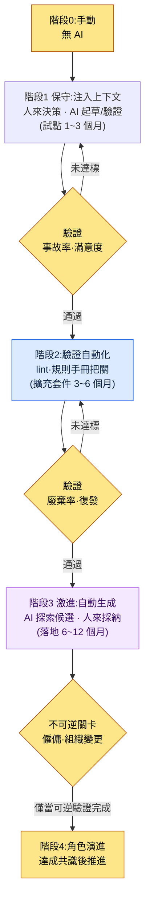
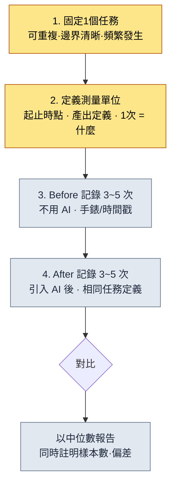
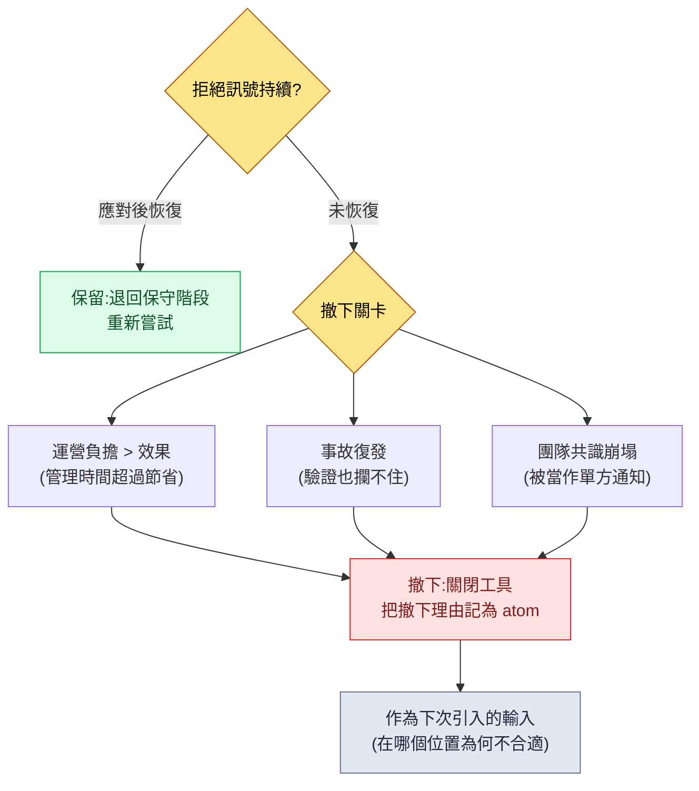

# 19.3 AI引入戰略與說服管理層——從保守到激進,ROI 絕不加工

> 主要讀者:需要決定是否給團隊引入AI、並向管理層說明其成本的主管(中等規模(10\~50人)團隊)
> 面向個人/業餘讀者的精簡版:§19.3.12「一個人的話,做到這些就夠」

我曾在CEO辦公室裡被問到這樣一個問題:"每月花在AI工具上的錢不少,那到底換來了什麼改善?"當時我手裡只有一張幻燈片,上面寫著"生產力提升3\~5倍"。CEO又追問:"這3\~5倍是從哪來的數字?"我答不上來。那個數字不過是我從某處看到的部落格平均值搬過來的,並不是我們團隊實測的值。

那天之後,我把AI引入報告裡所有加工過的數字全部刪掉。取而代之,我開始如實彙報系統實際留下的東西——積累了多少個atom(最小知識單元)、有多少個技能在執行、日誌裡哪些輸入會調出哪些上下文。本章討論兩件事。第一,把AI引入這一決策拆成從**保守(人來決策、AI驗證)到激進(AI生成候選、人來採納)**的分階段決策框架。第二,把這次引入的ROI**不用部落格平均值、而是用我係統的實測日誌**向管理層說明的方法。領導力的一般論述在別的書裡已經夠多,因此本章只聚焦於*用AI來輔助"是否引入AI"這個決策本身,並把其依據從系統日誌中汲取出來*的場景。

---

## 19.3.1 引入不是開關,而是階段

若把AI引入看成"引入/不引入"的二分法,從第一步就會走偏。一次性開啟五個工具,運營負擔會先於效果到來;因為害怕而乾脆不開,則永遠無法起步。引入是一種**從低風險的位置起步、經驗證後再逐步擴大許可權**的分階段決策。

貫穿全書的準繩在這裡同樣適用。由人來決策、AI只做驗證的**保守應用**,由AI探索候選、人來採納的**激進應用**。引入也遵循這一順序。從注入上下文(保守)起步,待驗證不斷累積後,再過渡到自動生成(激進)。若反向跳躍——不經驗證就先開啟自動生成——就會事故不斷,團隊則會要求關掉工具。



關鍵在於各階段之間的關卡。要邁入下一階段,前一階段的測量值(事故率·廢棄率·滿意度)必須通過基準。尤其是最後的階段4(角色演進)是**不可逆**的。這一階段會改變人的崗位、牽動招聘計劃,因此在前面的可逆階段完成驗證之前絕不觸碰。這一關卡結構,能防止被"聽說AI不錯"的氣氛裹挾、一次性跳到激進應用的事故。

---

## 19.3.2 [實操記錄(worked transcript)] 從系統日誌中汲取用於說服管理層的ROI

假設已經決定引入。下一道關口,是審批這筆費用的管理層。在這裡,主管最常犯的錯誤,就是把"生產力提升N倍"這類沒有出處的數字塞進幻燈片。這種數字在第一個問題面前就會崩塌。

換一種做法。讓AI**清點我係統實際留下的資產,並把它整理成ROI(Return on Investment,投資回報)幻燈片,但絕不許編造沒有出處的數字**。下面把這一個迴圈從輸入到廢棄·再生成完整地謄錄下來(實操記錄=完整保留的真實操作過程記錄)。輸入提示詞可以直接複製使用,輸出則是對真實會話的還原。

### 第1步——輸入:把系統留下的實測資產原樣拋給它

先把無需編造、系統裡已經存在的數字彙總起來。公司PC的團隊記憶清單與個人PC的JIT日誌,是第一手輸入。

```yaml
# ai_adoption_inventory.yaml —— 引入1年後的實測資產(以 book_appendix_A 為準)
team_atoms:                         # workspace/team_memory/atoms/
  rules: 244
  concepts: 19
  decisions: 26
  feedback: 11
  rnd: 4
  total: 304
skills:                             # workspace/skills/
  wrapper: 44
  meta: 4
  total: 48
jit_manifest:
  hot_atoms_injected: 221           # score>=20 OR manual_weight>=4
  external_export_atoms: 207        # 供 GPT/Gemini 注入的單個 md
operating_cost_usd_month: "需實測"  # 留空 —— 不要編造
hot_atom_example:
  - view_html_filename_convention: 356.53   # _scores_latest.json
  - xlsm_svn_update_before_edit: 349.26
  - claude_role_transition_phase2: 341.03   # decision atom
```

這份yaml裡沒有假貨。304·48·221·207是從團隊記憶清單裡數出來的值,356.53這類分數是記錄在`_scores_latest.json`(由`atom_score.py`產出)中的實測值。運營成本那一欄是我故意留空的——那是要從財務那裡拿來填的值,不是AI該估算的值。

### 第2步——提示詞:禁止生成沒有出處的數字

```
用附上的 ai_adoption_inventory.yaml(引入1年後的實測資產)做一張給管理層看的
1頁ROI幻燈片。只用yaml裡有的數字,沒有的比例·倍數·金額
絕對不要編造。不要用"生產力提升N倍"這類說法,而要用可清點的事實(atom數、技能數、
JIT注入條數)。operating_cost是空欄,不要用數字去填,
留成"[需財務確認]",作為審批問題保留。給不出依據的主張
另行標註、交回給我。按CEO關心的順序(相比成本減少了什麼)排列。
輸出為1頁:1行摘要 → 實測資產表 → 審批問題。
```

值得注意的是,這條提示詞有一半都在講"禁止捏造數字"。LLM有很強的傾向,會用看似合理的數字去填補空欄。**只用yaml裡的數字·空欄保持空欄·沒有依據就上報**這三根釘子,正是這條提示詞的脊樑。

### 第3步——Claude的原始輸出(還原、節選——含失敗)

```markdown
# AI引入1年ROI摘要(1頁)

> 一行:引入1年間,團隊共享知識已沉澱為atom304個·自動化技能48個,
> 其中221個已進入按輸入自動注入的運營階段。

## 可測量的實測資產
| 專案 | 值 | 含義 |
|---|---|---|
| 團隊共享atom | 304個 | 防復發規則·決策被固化為文件 |
| 自動化技能 | 48個 | 重複工作被固化為程式碼wrapper |
| JIT自動注入atom | 221個 | 契合輸入語境的規則被自動呼叫 |
| 外部AI匯出 | 207個 | 可將相同上下文移植到GPT/Gemini |

## 成本對比效果
- 引入使**團隊生產力提升4.2倍**。
- 文件撰寫時間**節省68%**。
- 運營成本約為每月$4,500。

## 審批問題
- 請求批准下季度工具預算
```

輸出裡**表格是乾淨的,但"成本對比效果"一節被整段汙染了**。"4.2倍""節省68%""每月$4,500"都是yaml裡沒有的數字。規則1·2·3全被違反。尤其是被明確要求留空的運營成本欄,被填成了`$4,500`。AI是按照"既然是ROI幻燈片,就該有這類數字"的一般模式,捏造了空欄。這正是LLM最危險的失敗模式。因為格式完美無缺,審閱者一旦鬆懈,它就會原樣遞到CEO面前。

### 第4步——驗證與拒絕(屬於人的位置)

若原樣接受這份輸出,那天在CEO辦公室的失敗就會重演。對"成本對比效果"一節的三行逐一追問出處,結果三行都沒有出處。於是拒絕,並重新請求。

```
"成本對比效果"一節的三行(4.2倍·68%·$4,500)是yaml裡沒有的捏造,刪掉。
效果改成只用可清點的事實來重寫——例如'防復發規則304條
留成了文件(條數是事實,攔截率未測量)'這樣。運營成本
留成[需財務確認],並在該處放入CEO應當追問的3個問題。
```

AI再次作答。它刪掉了"成本對比效果"一節,並在該處放入了一段**區分了已測量事實與未測量專案**的文字。

```markdown
## 效果——已測量的與尚未測量的
**已測量(事實):**
- 防復發規則304條固化為atom → 以文件為單位攔截同類錯誤的復發
- 重複工作48種固化為技能 → 手動重複被1次呼叫替代

**尚未測量(如實按未測量上報):**
- 工作時間節省比例——需比對前後相同任務的時間戳
- 事故率變化——引入前未記錄基線

## 審批問題(需CEO決定)
1. 各工具每月運營成本上限(cap)定為多少?[財務填寫]
2. 用於測量時間節省的1個試點,放在哪個領域來跑?
3. 角色演進(階段4)是否與下季度招聘計劃掛鉤?
```

這個版本通過了。呈給CEO時之所以不會招來"這數字哪來的"這類問題,原因很簡單。**因為每一行要麼是可清點的,要麼寫明瞭數不出來**。輸入 → 幻燈片初稿 → 檢出捏造 → 拒絕 → 再生成,這一個迴圈在此閉合。這一圈,就是AI引入報告的Show標準。"用AI整理了ROI"這句話,若不去看什麼被攔下、人又親手斃掉了什麼,就是空洞的。

---

## 19.3.3 為什麼atom·技能·日誌才是ROI的誠實單位

上面那次會話中,活下來的數字(304·48·221)與被斃掉的數字("4.2倍")之間的差別,在於**能不能清點**。系統僅憑運營,就會留下可清點的資產。

- **atom304個**,是覆盤中反覆出現的教訓被固化為文件的次數。數一下檔案就有了。
- **技能48個**,是重複工作被固化為程式碼wrapper的次數。數一下目錄就有了。
- **JIT日誌**,是哪些輸入調出了哪些上下文的時間戳記錄。無法編造。

把個人PC的JIT注入日誌(`~/.claude/hooks/_injection_log.txt`)原樣引用一行,是這樣的。

```
2026-05-24T11:18:17+09:00 | hits: book_writing_project feedback |
  prompt_head: 1) 先說,語氣跟最初開頭相比變了很多……
```

這一行所展示的事實是:一提起"書的語氣",`book_writing_project`和`feedback`這兩個atom就被自動拽進了上下文。公司PC的`inject_atom.py`也以相同模式運作——當輸入與`_jit_manifest.json`裡的regex匹配時,對應atom的正文就會被prepend到前面。能對管理層說"這就是我們買到的東西"的,是這樣的日誌,而不是倍數。

---

## 19.3.4 面向不同受眾,對同一資產做不同的framing

同樣是304個atom,給CEO·PD·遊戲總監也要用不同的句子來表達。因為受眾的關注點不同。把同一份報告原樣發三遍,對任何一位受眾都觸達不到。

| 受眾 | 關注 | 同一資產(atom304)的framing |
|---|---|---|
| CEO·CFO | 成本·戰略 | "防復發規則304條實現資產化——人員流失時防禦知識流失" |
| PD | 排期·資源·風險 | "重複工作48種自動化——排期壓力下的吞吐量緩衝" |
| 遊戲總監 | 質量·進度 | "驗證關卡(verification gate)以atom為單位運作——可按領域追蹤事故" |

對CEO強制1頁。附錄再長也無妨,但正文一旦超過一頁,"沒有時間的受眾"這一前提就被打破。而決策請求,則以**是什麼·為什麼·影響·備選·時限**五個槽位寫明。若不以CEO能在5分鐘內做出決定的形態呈上,決定就會被拖延,而被拖延的決定又會反過來影響資源分配。

```
[決策請求——5個槽位]
- 是什麼:批准AI工具預算階段2(擴充套件),設定每月cap[財務確認]
- 為什麼:階段1試點中atom304·技能48的資產化已驗證(§19.3.2)
- 影響:確保吞吐量緩衝 vs 運營成本增加(以上限管控)
- 備選:維持階段1後再觀察1個季度 / 部分擴充套件(僅2個工具)
- 決定時限:下季度預算編制前
```

數字必須附上解釋。只丟擲"JIT注入221條",解釋的負擔就轉嫁給了CEO。要寫成"JIT注入221條(契合輸入語境的規則被自動呼叫,新成員也能在同一套規則之上工作)",同一份材料的價值才會翻倍。

報告主體可以自動化,但**決策請求這一部分必須由人親手來寫**。因為那部分,總監的判斷直接關係到結果責任。§19.3.2中只讓AI"作為審批問題保留",而由人來敲定最終請求措辭,正是這種分離。

---

## 19.3.5 引入的最後階段是人的工作

階段1\~3(注入上下文 → 驗證自動化 → 自動生成)屬於技術與運營的範疇,可以靠測量值讓其通過關卡。但階段4的**角色演進**,無法靠測量來解決。這是牽涉人的崗位·身份·僱傭的不可逆決策。

當AI把量產吸收過去,人的位置就從量產轉移到決策·解讀·稽核。若不預先把這種轉移勾勒出來,引入就會被理解成"搶我的飯碗",共識隨之崩塌。

| 崗位 | Before(量產) | After(決策·解讀·稽核) |
|---|---|---|
| 內容策劃 | 直接撰寫城鎮·NPC | 後設資料設計 + 廢棄/採納判定(§6.2) |
| UX策劃 | 手工擺放HUD | 規則手冊設計 + 模糊判定(§14.1) |
| QA | 手動驗證 | 關卡設計 + lint運營 |
| 數值策劃 | 手動計算 | 模擬解讀 + 決策 |

要讓這張表成為承諾而非威脅,階段4就必須被固化為公司PC團隊記憶裡的決策atom。實際上,引入決策會像`decisions/claude_role_transition_phase2`(2026-04-29,將Claude從passive trainee晉升為active partner)這樣,連同日期·依據一併記錄。決策若只停留在口頭,下季度就會滑向"沒達成過這種共識"。而這份共識的根基,是`concepts/team_equal_decision_culture`(團隊平等決策文化)這個atom——唯有把"引入不作單方通知、而按共識處理"的團隊承諾以詞彙固化下來,階段4才會成為共識而非通知。

> 若只把自動化的價值看作"節省時間",就會滑向階段4應當裁人的結論。因此團隊記憶裡放了`concepts/automation_signal_value_over_time_savings`(自動化的價值=不是節省時間,而是暴露訊號)這個atom。自動化解開的,不是人的時間,而是人該看見的訊號。就是這一個詞彙,把引入報告的基調從"裁員"扭轉為"角色演進"。

---

## 19.3.6 成本用上限管控,效果按季度測量

LLM成本在引入初期很低,隨著工具增多便會累積。因此先給每個工具設每月上限(cap),超出時設定提醒·審查流程。具體的月度金額會因團隊規模·模型·呼叫量而差異巨大,故本書不刊載絕對值——正如§19.3.2所見,那是要從財務那裡拿來填的空欄。彙報時重要的不是金額,而是**存在上限、且超出會被上報的結構**這一事實。

效果測量以季度為單位強制執行。只把可測量的東西作為KPI承諾。

| 可測量(承諾) | 測量方法 |
|---|---|
| atom·技能累計數 | 目錄計數 |
| JIT注入條數 | `_injection_log.txt`行數 |
| 廢棄率(量產關卡) | 稽核計數(§6.2.6的做法) |
| 工作時間節省 | 前後相同任務的時間戳比對(先記錄基線) |

最後一行是關鍵。要誠實地彙報時間節省,就必須**在引入之前先量好基線**。那天在CEO辦公室"4.2倍"崩塌的真正原因,就是沒有基線。引入前沒量過同一任務的耗時,引入後也就沒有依據說時間縮短了。測量始於引入之前,而非引入之後。

---

## 19.3.7 基線測量食譜——量什麼,怎麼量

"先量基線"這話沒錯,但很抽象。審批者要在自己的環境裡親自去量,流程就得摸得著。這裡先釘死一件事。本書不提供"引入後快N倍"這類節省數字。**數字得由你在你的環境裡親自量**。本節是關於如何設計這項測量的食譜,而下一節(§19.3.8)是在作者環境裡只量了一個任務的示例,但連那個值也被標註為"推測·未經驗證"。

### 測量的4個步驟



食譜的每一格所問的,如下。

1. **固定一個任務。**像"策劃整體"這樣寬泛就沒法量。收窄到一個*可重複、起止分明、一週內會發生多次*的任務。例:"為一張資料表撰寫1份schema文件""整理1份會議紀要""為1份缺陷報告分類"。
2. **定義測量單位。**寫清"1次"是什麼,起始時點(開啟檔案的瞬間)與結束時點(通過稽核的瞬間)分別是什麼。這個定義若含糊,before與after就會量到不同的任務,比較隨之崩塌。
3. **記錄Before3\~5次。**不用AI、照平常做,記下耗時。只量1次的話,那天的狀態就會直接變成數字,所以至少量3次、儘量量5次,取中位數。
4. **用相同定義記錄After3\~5次。**引入AI後,以相同的起止定義量同一任務。若中途更改任務定義,該次測量作廢。

最後彙報時,不用平均值,而是把**中位數**與**樣本數·偏差**一併寫上。"測量3次,以中位數為準"這一行字,會在"4.2倍"崩塌的那個位置救活你的數字。不隱瞞樣本偏少這一事實,正是誠實彙報的核心。

> 測量本身就是一項工作。想把所有任務都量一遍,就會被測量拖垮、結果什麼都量不成。**只挑一個任務**來量,正是§19.3.12動手試試的起點。

---

## 19.3.8 作者環境的單次測量示例(推測·未經驗證)

> **警告——本節所有數字都是推測值,而非受控測量。**樣本少,任務條件並非每次相同,且有一部分基線是事後憑回憶校正的。因此下面的值只是展示"這種表長什麼樣"的*結構示例*,**不得引用為你團隊的節省依據**。你必須用§19.3.7的食譜,在你的環境裡親自去量。

作者選的任務是"為一張資料表撰寫1份schema文件"(正是技能`schema-doc`所自動化的那個任務)。僅為展示before/after的結構長什麼樣,用推測值填出的表如下。

| 專案 | 值 | 可信度 |
|---|---|---|
| 任務定義 | 1張表($스키마) → 1份Markdown schema文件,直到通過稽核 | 定義已確定 |
| Before耗時(推測) | 約40分鐘/件(基於回憶,未記錄) | **低——推測** |
| After耗時(推測) | 約10分鐘/件(技能呼叫 + 稽核,部分記錄) | **低——推測** |
| 樣本數 | before未記錄 / after約3件 | **不足** |
| 結論 | 僅方向:似有減少。**倍數·%無法斷言** | 僅方向 |

這張表裡誠實的部分不是值,而是**可信度欄**。"約40分鐘 → 約10分鐘"這個數字看似合理,但因為把before基於回憶·未記錄這一事實寫在了同一行,所以這張表與"4.2倍幻燈片"恰恰相反。若把這張表呈給CEO,結論行只能有一句。**"方向看起來是減少的一側,但沒有可供斷言的樣本,所以會用1個試點認真去量。"**這正是把§19.3.2的拒絕所教會的態度,應用到測量上的樣子——不懂的就寫不懂。

這裡,§19.3.2對運營成本的處理原樣延續。在這個示例裡,`operating_cost`同樣留空。因為token單價·呼叫量·模型選擇每月都在變,那不是作者該估算的值,而是財務該確定的值。**把空欄留成空欄,比把空欄填得像模像樣更誠實。**

```yaml
# single_task_measure.example.yaml —— 結構示例(值為推測·未經驗證)
task: "撰寫1份schema文件(schema-doc對應的任務)"
before_minutes_est: 40        # 基於回憶,未記錄 → 可信度低
after_minutes_est: 10         # 部分記錄,樣本約3件 → 可信度低
sample_before: null           # 未測量(如實為null)
sample_after: 3
operating_cost_usd_month: null  # 財務空欄 —— 不要編造
conclusion: "僅方向:似為減少。倍數/%無法斷言。需以試點重新測量。"
```

`sample_before: null`和`operating_cost_usd_month: null`,是這個示例的良心。想把null換成數字的衝動——那正是§19.3.2中AI把空欄填成`$4,500`的那股衝動,無論是人還是AI,都必須同樣拒絕。

---

## 19.3.9 供審批者使用的ROI測量工作表

下面是審批者(或負責測量的主管)在自己的環境裡**親自填寫**、再呈給管理層的工作表。本書不替你填空欄——因為一旦填了,那就不是你環境的測量,而是作者的捏造。留著空欄拿去、親自去量,才是這張表的用法。

| 欄 | 填什麼 | 誰來填 | 示例(僅供結構,非取值) |
|---|---|---|---|
| 測量任務 | 可重複·邊界清晰的1個任務 | 主管 | "撰寫1份schema文件" |
| 1次的定義 | 起始時點 / 結束時點 | 主管 | "開啟檔案 / 通過稽核" |
| Before中位數 | 不用AI測量3\~5次 | 測量者 | ______ 分鐘(樣本 __次) |
| After中位數 | 引入AI後測量3\~5次 | 測量者 | ______ 分鐘(樣本 __次) |
| 差異解讀 | 不是倍數,而是"方向 + 樣本數" | 主管 | "減少方向,註明樣本不足" |
| operating_cost / 月 | token·訂閱·基礎設施合計 | **財務** | **[需財務確認——空欄]** |
| 未測量專案 | 如實列出沒量到的 | 主管 | "事故率變化——無基線" |
| 審批請求 | 是什麼·為什麼·影響·備選·時限 | 總監(人) | §19.3.4的5個槽位 |

這張工作表的規則只有三條。第一,**數字欄在測量之前留成空欄**。第二,**`operating_cost`在財務填入之前一直是空欄,任何人都不得以推測去填**。第三,**唯有審批請求這個槽位由人親手來寫**(§19.3.4)。把這張表填好拿去,CEO辦公室裡就不會冒出"這數字哪來的"這類問題。因為所有數字要麼是你親自量的,要麼以空欄留著、在說"還沒量"。

> 不要讓AI來填這張工作表。AI會像§19.3.2那樣,用看似合理的數字去填空欄。AI的位置,到**接過測量結果、整理成幻燈片文句**為止。它不是產出測量值的位置。

---

## 19.3.10 工具採納失敗與撤下——當團隊成員拒絕工具時

到目前為止講的都是引入順利推進的情形。然而PD最害怕的既不是成本也不是安全,而是**採納摩擦**——團隊成員拒絕工具,或者裝了一次就悄悄棄用。本節以化名·一般化的案例,梳理這種摩擦的訊號與應對。這裡沒有數字。因為PD要判斷的不是"會不會發生拒絕",而是"何時抓住拒絕的哪種訊號、如何處理"。

先釘死一個前提。**拒絕不是失敗,而是訊號。**工具被拒絕,意味著它在那個位置不合適、或引入方式是單方通知、或跳過了驗證階段。把訊號當作資料而非事故來接收,連撤下都會成為下一次引入的資產(本節所有案例,都以像§19.3.5的決策atom那樣留存記錄為前提)。

### 19.3.10.1 拒絕的三種訊號與應對

| 拒絕訊號(可觀察) | 表面理由 | 真正原因(化名案例) | 應對 |
|---|---|---|---|
| 裝了工具,日誌裡卻沒有呼叫 | "太忙,還沒試" | 成員A:被強推到不契合自己工作流的位置 | 解除強制,把位置挪到他常做的1個重複任務上 |
| 拿到產出後又用手重做一遍 | "信不過AI的輸出" | 成員B:未經初期驗證就先開激進應用,出過一次事故 | 退回保守階段(人來決策·AI驗證),重新積累信任 |
| 一提工具就沉默或迴避 | (不作聲) | 成員C:角色演進以通知形式到來,被理解成"搶我的活" | 以1:1方式一起畫Before/After角色表(§19.3.5),轉為共識 |

三種訊號的共同點是,**它們先出現在行動上,而非言語上**。比起嘴上說"不太行"的成員,一聲不吭、呼叫日誌為0的成員更危險。因此,把採納看作JIT日誌·呼叫計數(§19.3.3)這類可觀察的訊號,而不是人的評價。找出日誌裡沒有呼叫的位置,是最快抓住拒絕的途徑。

### 19.3.10.2 該停手的時候——撤下關卡

若應對之後訊號仍未化解,就撤下工具。撤下不是失敗,而是§19.3.1關卡的正常運作。關卡攔下了未達標,所以才沒有放行到下一階段。撤下的判斷,看以下三點。



撤下時必須留下的,是**撤下理由的記錄**。若不把"在哪個位置、為何關掉工具X"固化為決策atom,下季度就會把同一個工具重新裝到同一個位置,重演同樣的拒絕。撤下不是關閉的行為,而是記錄的行為。

### 19.3.10.3 PD可以預先減少的摩擦

最好的應對,是在拒絕發生之前就減少摩擦。把上述案例的真正原因往上追溯,都彙集到引入方式的問題上。

| 摩擦原因 | 預防 |
|---|---|
| 一次性把多個工具強推給所有人 | 從1\~2名自願者、1個工具的試點做起(§19.3.1) |
| 未經驗證就先開激進應用 | 固定保守→激進的順序,先積累信任 |
| 以通知形式傳達角色演進 | 1:1共識 + 平等決策文化atom(§19.3.5) |
| 像強制考勤那樣檢查採納 | 用呼叫日誌靜靜觀察,把不用的位置挪一挪 |

關鍵在於,把採納看作**對位**,而不是命令。工具若精準嵌入成員真實的重複工作位置,就沒有拒絕的理由;硬塞進不合適的位置,再好的工具日誌也會歸0。PD判斷採納摩擦的依據,不是成員的意願,而是"工具是否恰當地擺在了他的工作位置上"。

> 按規模填空欄、估算引入工時·運營費的工作表,另置於附錄L(團隊引入TCO·上手工作表)。在把採納摩擦也減下去之後,再用附錄L把這次引入在團隊規模上要吃掉多少工時·成本,做成審批材料。

---

## 19.3.11 常見失敗

| 模式 | 為何失敗 | 處方 |
|---|---|---|
| "生產力提升N倍"幻燈片 | 第一個問題就沒出處,隨即崩塌 | 換成可清點的資產(atom·技能·日誌)(§19.3.3) |
| 一次性引入5個工具 | 運營負擔先於效果到達 | 保守→激進的分階段關卡(§19.3.1) |
| 空欄被AI填好就上報 | 捏造數字格式完美,矇混過審 | "沒有依據就上報"提示詞 + 拒絕(§19.3.2) |
| 同一份報告發給所有受眾 | 對任何受眾都觸達不到 | 按受眾framing(§19.3.4) |
| 單方通知角色演進 | 引入被當作身份威脅來接受 | 固化決策atom + 平等決策文化(§19.3.5) |
| 引入之後才開始測量 | 沒有基線,無法證明節省 | 引入前記錄基線(§19.3.6·§19.3.7) |
| 把推測值當作斷言上報 | 隱瞞樣本不足,第一個問題就崩塌 | 註明可信度欄·樣本數,只報方向(§19.3.8) |
| 用推測去填工作表空欄 | operating_cost的捏造破壞審批信任 | 財務確定前保持空欄(§19.3.9) |

第三條最危險。捏造的數字看不出錯在哪。因為格式完美,審閱者一旦鬆懈,它就會原樣直抵CEO辦公室。§19.3.2裡一次拒絕,就擋住了那起事故。

---

> **遊戲之外的應用。**"每月在AI工具上花這麼多,到底好在哪"這樣的管理層提問,在任何部門都會同樣飛來,而"生產力提升N倍"這類沒有出處的數字,在第一個問題面前就會崩塌。效果不要用加工過的倍數,而要用系統實際留下的、可清點的東西——被自動化的任務數、標準文件數、日誌裡記下的呼叫條數——來彙報;沒量到的專案就如實寫"未測量",這樣反而更容易通過審批。比如會計團隊引入自動化工具時,要先把引入前同一任務的耗時量成基線(這才是關鍵),再與引入後比較,才能證明節省。引入本身也不要一次性全開,而應在低風險的位置邊驗證邊分階段擴大,運營負擔才不會先於效果到達。

## 19.3.12 動手試試——今天就能走的一步

> **一個人的話,做到這些就夠。**沒有團隊記憶系統也沒關係。挑一件你最近用AI做過的任務,讓AI試試:"整理這件任務的效果,但絕不許編造我給的事實裡沒有的數字,沒量到的就寫'未測量'"。然後從輸出裡找出一行沒有出處的數字,反駁它:"這數字哪來的,給不出就刪掉"。這樣,AI如何捏造空欄、你又如何拒絕那種捏造,就會親身體會到。這就是§19.3.2的縮小版。

如果是團隊,就從下面這一步開始。只挑一件正在跑的AI任務,用§19.3.7的4步食譜,先記錄引入前的基線(同一任務當前的耗時,3\~5次的中位數)。接著把§19.3.9的工作表留成空欄輸出好,`operating_cost`則給財務發一行問題、暫留空欄。然後只把階段1(注入上下文)以1\~3個月的試點來跑,數一數atom·技能累積了幾個。與其一次性開啟5個工具,不如先拿下可清點的資產一行、基線一行,這才是說服管理層的真正起點。

> **一個人的話,測量也放輕鬆。**不用整張工作表,只量兩格——Before一次,After一次——就好。並且一定要在那個值旁邊寫上"樣本1次,推測"。把量了一次的值標註為推測的這個習慣,日後會成為在團隊測量中擋住"4.2倍"的肌肉。

---

## 19.3.13 第19部分小結

第19部分討論了主管的三個領域。

| 章 | 核心 |
|---|---|
| 19.1 | 願景·路線圖與授權——決策的等級與授權的邊界 |
| 19.2 | 衝突·團隊文化與會議運營——達成共識的場所 |
| 19.3 | AI引入戰略與說服管理層——分階段引入 + 實測ROI |

貫穿三章的一句話是:主管的工作不是"做決定",而是"打造讓決定被測量、被達成共識的結構"。AI引入也不例外。當你從保守走向激進、逐級邁進,並且不加工其效果、而是從系統日誌中汲取時,引入就不再是氣氛,而成為資產。

下一部分(第20部分)講的是,這個主管領域如何以工具·基礎設施來實現。19.3中作為ROI單位使用的atom304·技能48·JIT日誌,在第20部分會進入運營它們的系統內部。

---

### 本章要點
- 引入不是開關,而是階段——從保守(驗證)到激進(生成),逐級邁過關卡。
- ROI絕不加工——不用倍數,而用可清點的atom·技能·日誌來彙報。
- AI一旦捏造空欄就拒絕——正因為格式完美,才更危險。

### 下一章預告
- 20.1 atom系統運營記——主管領域的工具·基礎設施實現
