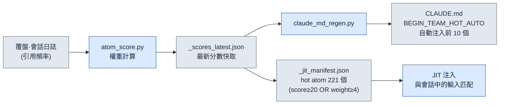
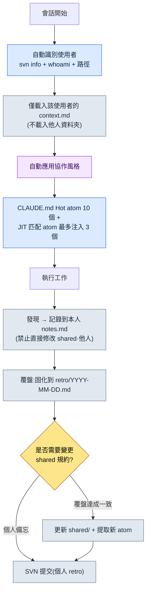

# 20.1 單人 DD(Design Director,設計總監)運營五人份的協作記憶 —— team_memory 系統

> 本章中的「DD」指設計總監(Design Director)。

> 首要讀者:在小型團隊中獨自扛起協作上下文的總監·主管(中等規模(10\~50 人)團隊)
> 面向單人/業餘讀者的精簡版:§20.1.7「一個人的話,做到這些就夠了」

週一早上,我曾在同一間會議室裡,把同一個決定向三個人解釋了三遍。我對一個人說「改冷卻時間前先 SVN update,再改 xlsm」;兩小時後,另一個人沒 update 就覆蓋了同一個檔案,引發了衝突;下午又有一個人問了同樣的問題。三個人都是好同事。問題不在他們,而在於那個決定只存在於我的腦子裡。一名中等規模團隊的總監,想靠人腦一致地維繫四個人份的協作上下文——誰知道哪條規則、誰經常在什麼地方出錯、哪些決定已經拍板——是不可能的。只要過上一個月,「那個我們之前不是定過嗎?」就會吃掉一半的會議時間。

本章講的是終結了這個問題的系統。核心資產有兩項。第一,全團隊共享的**決策卡 304 個**(atom)。第二,在其之上搭建的**五人 team_memory**——它是一個按使用者劃分的上下文儲存庫,分為本人(leeminsoo)、團隊成員 A·B·C(化名)以及 shared 資料夾。Claude 會在會話開始時自行識別「此刻坐在鍵盤前的是誰」,並只挑出那個人的協作風格來「穿上」。關於協作記憶的一般論述,別的書裡也有。本章只聚焦於 *AI 自動分支並注入這份記憶的環節*。

本章的數字全部是 2026 年 5 月盤點時的實測值。

---

## 20.1.1 決定若只在腦子裡,團隊就會重複同樣的錯誤

用「共享 wiki」來解決協作記憶的書很多。就是在 Notion 上建一個決定頁面,大家一起看。話是沒錯,但 wiki 做不到兩件事:只有人錄入時它才出現,只有人去找時它才被讀到。開會開到一半,沒人會專門跑去問「那個我們記進 wiki 了嗎?」。

所以我們把決定固化成**可檢索、可引用、可自動注入的原子級檔案**。這就是所謂的 atom(最小知識單元)。一個 atom 就是一個決定。檔名即識別符號,所以用 `rg` 就能找到;frontmatter 是標準格式,所以指令碼能處理;正文很短,所以能整個塞進上下文。公司 PC 的 `workspace/team_memory/atoms/` 下,已經堆了 304 個這樣的 atom。

| 資料夾 | 數量 | 性質 |
|---|---|---|
| `rules/` | 304 | 防止復發的規則(xlsm·SVN·文件·技能等) |
| `concepts/` | 19 | 在覆盤中反覆出現的領域詞彙 |
| `decisions/` | 26 | 明確標註日期·當事人·依據的決定 |
| `feedback/` | 11 | 協作糾偏迴圈(失誤 → 教訓) |
| `rnd/` | 4 | 工具打補丁時可能失效的未確定觀察 |

合計 304 個。這五個資料夾就是團隊的「長期記憶」。關鍵在於:資料夾名稱本身就是 atom 的可信度等級。`rules/` 是經多次復發驗證過的規則,`rnd/` 則是 UE 版本一變就可能作廢的臨時觀察。即便在同一份記憶裡,「已確定」與「假設」也按資料夾分開。這樣就從結構上杜絕了新成員把 `rnd/` 裡的繞行做法誤當成永久規則的事故。

> atom 的五個屬性定義(單決策原則·顯式命名·frontmatter 標準·關係顯式化·可追溯)已在第 5 部分講過。本章講的不是定義,而是 *五個人共同運營這 304 個 atom 的現場*。

---

## 20.1.2 Hot atom —— 常用的決定會自己浮上來

不可能每個會話都把 304 個全部讀一遍。所以給每個 atom 打上 **score**(權重),只自動露出 score 高的。score 由 `atom_score.py` 依據使用頻率·手動權重·時效性計算。下面是以 2026 年 5 月實測為準的前 10 個的實測 score。

| score | atom | 強制什麼 |
|---|---|---|
| 356.53 | `view_html_filename_convention` | View_*.html 命名規範(Phase/Status → Domain → Topic) |
| 349.26 | `xlsm_svn_update_before_edit` | 修改 xlsm 前先 SVN update + 保留已有行 |
| 341.03 | `claude_role_transition_phase2` | 將 Claude 從 passive trainee 提升為 active partner(決策) |
| 340.26 | `skill_audit_score` | 基於 SVN 日誌測量技能(Skill)使用頻率 |
| 329.26 | `docs_is_source_of_truth` | 以 workspace/docs 為正本 |
| 326.84 | `claudeskills_naming_separation` | ClaudeSkills 與遊戲內角色技能的命名分離 |
| 324.36 | `draft_doc_body_verify_before_skip` | 禁止僅憑位置就 skip,先 grep 正文再評估 |
| 309.43 | `json_over_schema_doc_as_source_of_truth` | 實際 JSON 輸出比 schema 文件更權威(為正本) |
| 294.93 | `integrity_check_clickup_notify` | 完整性校驗失敗時立即通知 ClickUp |
| 293.26 | `data_entry_schema_first` | 資料錄入順序($schema → Enum → proto) |

開頭那個解釋了三遍的事故——「改 xlsm 前先 SVN update」——看到了嗎?那就是 `xlsm_svn_update_before_edit`,score 349.26,排全體第 2。分數高,意味著它被引用得越頻繁,也就是越經常被搞錯的規則。我再也不用親口說三遍了。score 前 10 個會自動注入 `CLAUDE.md` 的 `<!-- BEGIN_TEAM_HOT_AUTO -->` 區域,無論誰在哪個資料夾開啟會話,第一屏都會帶出它們。

到這裡為止,不過是「把常看的規則置頂」而已。真正的差異在於:score 不是靠人手,而是**系統對自身進行測量**後打出來的。



這個迴圈是閉合的。atom 在覆盤中被引用得越頻繁,score 就越高;score 越高,就越容易出現在 CLAUDE.md 頂部和 JIT 清單裡;越容易出現,就越會被再次引用。這是一個常用的決定會 *自己* 浮上來的結構。反過來,六個月內引用為 0 的 atom,score 會沉下去,自然從視野裡消失。不需要人來判斷「這個現在不用了,撤下來吧」。

---

## 20.1.3 JIT 注入 —— 一行輸入拉來 3 個相關決定

score 決定「始終可見的東西」,而 JIT(Just-In-Time,即時)注入拉來「與剛說的話相匹配的東西」。使用者輸入提示詞的那一刻,hook 就把這段文本與 atom 清單(manifest)裡的正則對比,把相關 atom 塞進上下文。

這個 hook 的核心邏輯,完全沿用了公司 PC 上 `inject_atom.py` 的模式。下面是為個人 PC 重寫的同一模式 `inject_memory.py` 的實際核心部分——按 score 降序排序 → 正則匹配 → 最多 3 個 → 截斷到 6000 字,而且無論發生什麼都 exit 0。

```python
# 按 score 降序排序後匹配
atoms_sorted = sorted(atoms, key=lambda a: a.get("score", 0), reverse=True)

matches = []
for atom in atoms_sorted:
    if len(matches) >= max_matches:          # max_matches = 3
        break
    try:
        if re.search(atom["regex"], prompt, re.IGNORECASE):
            matches.append(atom)
    except re.error:
        continue                              # 跳過錯誤的 regex 後繼續

if not matches:
    emit_empty()                              # 無匹配則返回空(正常)
    return

chunks = []
for atom in matches:
    body = atom_path.read_text(encoding="utf-8")
    if len(body) > max_body:                  # max_body = 6000
        body = body[:max_body] + "\n\n[...truncated]\n"
    chunks.append(f"\n\n=== [JIT Inject] {name} (score {score}) ===\n\n{body}\n...")
```

重要的是這套設計很保守。匹配不到,就返回空並結束(正常)。正則壞了,就只跳過那個 atom 繼續跑。正文超過 6000 字就截斷。而且整個 hook 在任何異常下都以 `exit 0` 結束——即便記憶注入失敗,使用者的工作流也絕不會停下。「有就幫忙,沒有或壞了就悄悄退出」,這是這套系統的第一原則。

---

## 20.1.4 [實操記錄(worked transcript)] 一開會話,Claude 先弄清「你是誰」

如果說到這裡為止是 atom(長期記憶),那麼接下來就是五人 team_memory(按人區分的短期·協作記憶)。我們把真實一個會話的開端,按輸入 → 動作 → 結果從頭跟到尾。舞臺是公司 PC,場景是團隊成員 C(化名,資料夾 `팀원 C/`)在自己座位上打開了專案A的工作資料夾。

### 第 1 步 —— 輸入:一行平平無奇的首個提示詞

團隊成員 C 像平常一樣開始工作。

```text
繼續檢查昨天定的目標選擇系統初稿。
```

他一個字都沒寫自己是誰、該遵守哪些規則。因為根本不需要寫。

### 第 2 步 —— 動作:Claude 自動識別使用者

按照 `CLAUDE.md` 裡「會話開始時自動識別」的流程,Claude 在給出回答之前,會先弄清鍵盤前的人是誰。它執行的命令有三條。

```bash
svn info --show-item last-changed-author   # SVN 工作副本的最近提交 author
whoami                                      # OS 登入賬戶
# 以及當前工作路徑(哪臺 PC 的哪個使用者資料夾)
```

這三個訊號與 `team_memory/users.md` 裡的對映對比後,確定為 `팀원 C`。接著 Claude **只加載那一個使用者資料夾**。

```text
team_memory/
├── atoms/                       ← 共享(304 個,score 靠前的已在 CLAUDE.md 中)
├── leeminsoo/    context.md     ← (不載入 —— 不是我)
├── teammate_a/   context.md     ← (不載入)
├── teammate_b/   context.md     ← (不載入)
├── teammate_c/   context.md     ← ★ 只加載這個
│                 notes.md       ← ★ 用於記錄本人的發現
│                 retro/
└── shared/       conventions.md  commit_rules.md  ...  ← 僅參考規約,禁止修改
```

### 第 3 步 —— 結果:那個人的協作風格被自動「穿上」

`팀원 C/context.md` 裡記錄的協作風格,只應用於本次會話。於是 Claude 的回答這樣開頭。

```text
已識別為團隊成員 C(svn author:teammate_c / 路徑已確認)。
teammate_c/context.md 協作風格載入完成。

繼續檢查昨天的工作(Draft_Targeting_System_v0.1.md)。
注入的相關決策卡(JIT,3 個):
  - docs_is_source_of_truth (329.26)
  - draft_doc_body_verify_before_skip (324.36) —— 禁止僅憑位置就 skip,先 grep 正文再評估
  - decision_summary_not_clickup_mirror

我會先用 grep 確認正文,然後開始檢查。檢查中發現的事項只
記錄到 teammate_c/notes.md,不會直接修改 shared/。
```

### 第 4 步 —— 人工驗證與邊界確認

這裡我(作為總監,或者團隊成員 C 本人)要確認兩件事:識別是否正確,以及是否守住了邊界。在 Claude 的下一個提議裡,我抓到了一次越界。

```text
[Claude 提議]
檢查中發現了命名規則衝突。要不要現在就修改 shared/conventions.md 裡的
目標選擇術語條目?

[人工拒絕]
不。shared/ 只在覆盤達成一致後才修改。現在只在 teammate_c/notes.md 裡
記一句「conventions.md 目標選擇術語衝突 —— 覆盤議題」。

[Claude 重新請求後的結果]
明白了。取消直接修改 shared/。
已在 teammate_c/notes.md 中記為覆盤議題:
  - 2026-06-06 conventions.md 目標選擇術語 'lock-on' vs 'target-lock' 衝突
    → 需在下次團隊覆盤中達成一致(暫緩修改 shared)
```

這就是五人運營的安全閥。每個使用者**只寫自己的 notes.md**。他人資料夾和 shared 都不能直接碰。shared 只在覆盤達成一致後才改。所以哪怕四個人在同一份記憶上工作,也不會互相覆蓋對方的上下文。發現先彙集到個人筆記裡,只有通過覆盤這道關卡,才能升格為團隊共享規約。

---

## 20.1.5 五人運營的完整流程一圖看盡

用一張圖看完一個會話運轉的完整路徑。這是一個從識別開始、到在覆盤中固化收尾的迴圈。



右下角的分叉點是這套系統的心臟。個人發現的東西流向個人 notes,而影響整個團隊的規約·新 atom,只有通過覆盤關卡之後才能上升到 shared。一個人運營五個人份卻不衝突,原因就在這一道關卡上。而最後一步一定是 SVN 提交——因為沒有被固化的發現,會在下一個會話裡重新退回腦子裡。

---

## 20.1.6 常見的失敗與對策

這些是運營五人 team_memory 時實際踩過的雷。

| 失敗 | 症狀 | 對策 |
|---|---|---|
| 識別失敗 | svn author 是公用賬戶,無法確定使用者 | 在 `users.md` 裡對映路徑·賬戶等多重訊號,無法確定時提問 |
| shared 被擅自修改 | Claude 出於好意改了共享規約 | 「shared 只在覆盤達成一致後」atom + 實操拒絕模式 |
| notes 未提交 | 發現只留在本地,到下個會話就蒸發 | 在覆盤收尾時強制 SVN 提交(`feedback-svn-zero-red`) |
| Hot atom 僵化 | score 停滯,舊規則被釘在頂部 | 定期執行 `atom_score.py` → 更新 `_scores_latest.json` |
| 把 rnd 誤當規則 | 新成員把臨時繞行做法當永久規則來用 | 隔離 `rnd/` 資料夾 + 在 frontmatter 中寫明失效條件 |

這裡代價最高的失敗是第二行「shared 被擅自修改」。AI 幫忙的本能很強,一發現衝突就想立刻去改。§20.1.4 裡的實操拒絕必須固化成 atom、而不是一次性的糾正,下次在別的使用者會話裡才會劃出同一條線。

---

## 20.1.7 一個人的話,做到這些就夠了

就算沒有團隊,這套結構的八成也能由一個人原樣使用。把五個使用者縮減為一個資料夾即可。

- **只要兩個 atom 資料夾。** 只分 `rules/`(已確定)和 `rnd/`(假設)。光是把經常搞錯的 5\~10 條規則固化成 atom,「之前不是定過嗎?」就會消失。
- **JIT 可以不帶 score 就開始。** 清單裡只寫正則,score 全部設成一樣。光是注入 3 個匹配的 atom 就已見效。
- **notes 就一個檔案。** 不做使用者分支,只有一個 `notes.md`。只要保留覆盤關卡就好——即興備忘寫進 notes,確定的規則經過覆盤再進 `rules/`。

核心是「把決定從腦子裡搬到檔案裡」,無論五個人還是一個人,這個動作都一樣。

---

### 動手試試 —— 今天就能做的一步

把一條經常搞錯的規則固化成 atom,並讓它通過 JIT 自動注入,試試看。

1. **setup** —— 建一個 `atoms/rules/` 資料夾,把最常重複解釋的 1 條規則寫成檔案。例:`atoms/rules/xlsm_svn_update_before_edit.md`。
2. **prompt** —— 在這個 atom 的正文裡寫「何時·做什麼·為什麼」三行。(「修改 xlsm 前務必 SVN update —— 不然會覆蓋他人的行。」)
3. **verify** —— 在 JIT 清單里加上 `{"name":..., "regex":"xlsm|쿨타임", "score":100, "path":...}`,然後在提示詞裡輸入「쿨타임 수정」,確認 `_injection_log.txt` 裡該 atom 是否被記為 hit。

如果被記上了,那條規則現在就不在你腦子裡,而在系統裡了。

---

### 本章要點

- 把決定從腦子裡搬到 atom 檔案裡。
- score·JIT 會自動把常用的決定浮上來。
- shared 只有通過覆盤關卡才會改變。

### 下一章預告

- 20.2 按成員的記憶 —— 用工具把使用者區和共享區分開,防止實驗值偽裝成決定的事故
