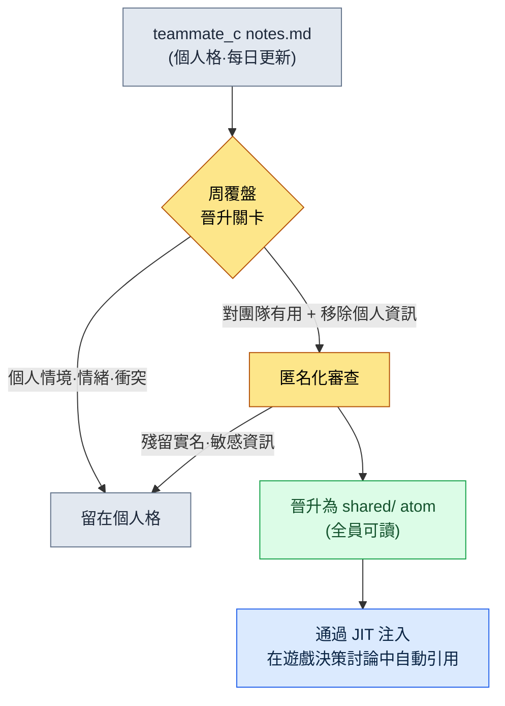

# 20.2 團隊成員各自的記憶 —— 使用者格與共享格的分離

週三午飯前後,團隊成員 B 通過團隊即時通訊工具發來一條訊息:"上週總監把戰鬥冷卻時間定為 0.8 秒,可我的筆記裡記的是 0.6 秒,到底哪個對?"我一時愣住了。0.8 秒是共享決策,0.6 秒是團隊成員 B 在自己的測試構建裡臨時試跑的值。兩者都記在"記憶"裡。問題在於,這兩個值混在了同一個格子裡。團隊成員 B 把自己的實驗值誤當成了公司決策,差一點就用錯誤的值去更新資料表了。

這起事故並非因為記憶裡沒有資料。恰恰相反,資料積累得很充分,卻因為沒有劃清哪個格子是共享格、哪個格子是個人格的邊界而出事。§20.1 鋪墊的賣點是五個人看到同一份事實(shared atom),而本章講的則是它的反面——**五個人各自擁有獨立的格子**。同一個櫃子,格子卻分兩種。而且,如果不用工具強制區分這兩種格子,上面那起 0.6 秒事故就一定會發生。

---

## 20.2.1 五個格子的櫃子

專案A 的 `team_memory/` 分成五個人的格子。包括本人(leeminsoo)在內的團隊成員 A、團隊成員 B、團隊成員 C,以及 `shared`。前四個是各使用者的個人格,最後一個是所有人都開啟的共享格。

<svg viewBox="0 0 720 250" xmlns="http://www.w3.org/2000/svg" font-family="sans-serif" font-size="13">
  <rect x="10" y="10" width="700" height="230" fill="#fafafa" stroke="#ccc" rx="6"/>
  <text x="30" y="38" font-weight="bold" font-size="15">team_memory/  (1 個櫃子)</text>
  <!-- 개인 칸 4 -->
  <g>
    <rect x="30" y="60" width="150" height="160" fill="#eef4ff" stroke="#5a7fbf" rx="4"/>
    <text x="105" y="84" text-anchor="middle" font-weight="bold">leeminsoo/</text>
    <text x="105" y="106" text-anchor="middle" font-size="11" fill="#555">總監(本人)</text>
    <line x1="42" y1="118" x2="168" y2="118" stroke="#cdd" />
    <text x="105" y="140" text-anchor="middle" font-size="11">context.md</text>
    <text x="105" y="160" text-anchor="middle" font-size="11">notes.md</text>
    <text x="105" y="180" text-anchor="middle" font-size="11">+ 戰略/評估</text>
    <text x="105" y="205" text-anchor="middle" font-size="10" fill="#a33">最高保護級別</text>
  </g>
  <g>
    <rect x="195" y="60" width="120" height="160" fill="#eef4ff" stroke="#5a7fbf" rx="4"/>
    <text x="255" y="84" text-anchor="middle" font-weight="bold">團隊成員 A/</text>
    <line x1="207" y1="118" x2="303" y2="118" stroke="#cdd" />
    <text x="255" y="140" text-anchor="middle" font-size="11">context.md</text>
    <text x="255" y="160" text-anchor="middle" font-size="11">notes.md</text>
  </g>
  <g>
    <rect x="330" y="60" width="120" height="160" fill="#eef4ff" stroke="#5a7fbf" rx="4"/>
    <text x="390" y="84" text-anchor="middle" font-weight="bold">團隊成員 B/</text>
    <line x1="342" y1="118" x2="438" y2="118" stroke="#cdd" />
    <text x="390" y="140" text-anchor="middle" font-size="11">context.md</text>
    <text x="390" y="160" text-anchor="middle" font-size="11">notes.md</text>
  </g>
  <g>
    <rect x="465" y="60" width="120" height="160" fill="#eef4ff" stroke="#5a7fbf" rx="4"/>
    <text x="525" y="84" text-anchor="middle" font-weight="bold">團隊成員 C/</text>
    <line x1="477" y1="118" x2="573" y2="118" stroke="#cdd" />
    <text x="525" y="140" text-anchor="middle" font-size="11">context.md</text>
    <text x="525" y="160" text-anchor="middle" font-size="11">notes.md</text>
  </g>
  <!-- 공유 칸 -->
  <g>
    <rect x="600" y="60" width="90" height="160" fill="#fff2e0" stroke="#c98a3a" rx="4"/>
    <text x="645" y="84" text-anchor="middle" font-weight="bold">shared/</text>
    <line x1="612" y1="118" x2="678" y2="118" stroke="#e3c">  </line>
    <text x="645" y="142" text-anchor="middle" font-size="11">atom</text>
    <text x="645" y="162" text-anchor="middle" font-size="11">(共享)</text>
    <text x="645" y="205" text-anchor="middle" font-size="10" fill="#a33">全員可讀</text>
  </g>
</svg>

四個個人格塗成藍色,一個共享格塗成橙色。顏色不同,是因為訪問規則不同。藍色格子只有本人和總監能開啟,橙色格子則由全員開啟。0.6 秒事故的根源在於:團隊成員 B 本該寫進自己藍色格子的實驗值,卻不加區分地統稱為"記憶",當成共享決策來對待。把格子從物理上分開——也就是分成不同目錄——至少能憑"寫在了哪裡"這一點,得到區分兩者的線索。

這裡的關鍵不是有兩個資料夾,而是**每個格子都附帶各自的規則**。放進 `shared/` 的是公司決策,人人都讀。放進 `團隊成員 B/` 的是那個人的工作情境,只有本人和我讀。同樣是 0.6 秒,放在哪個格子裡,就決定了它是"實驗中"還是"已決策"。

---

## 20.2.2 一個人的格子裡有兩個檔案

開啟某個使用者的格子,會看到兩個檔案:`context.md` 和 `notes.md`。名字很簡單,角色卻正好相反。

`context.md` 記錄的是**這個人現在是誰**:角色、負責的系統、正在進行的工作、工作風格。它相對穩定,是身為總監的我在 1:1 之前 5 分鐘翻開來看的檔案。開啟團隊成員 A 的 `context.md`,會看到諸如"負責戰鬥系統,當前正在做技能冷卻時間的數值平衡,是那種先要資料依據的風格"之類的內容。不看它就進 1:1,頭 10 分鐘就會耗在"最近在忙什麼?"上。

`notes.md` 記錄的是**這個人現在正在經歷什麼**:每天的實驗值、卡住的地方、小決策、失誤記錄、與其他成員的協商備忘。它易失性高,更新頻繁。團隊成員 B 的 0.6 秒本該記在這裡。就像這樣:"用 0.6 秒測試過,太快了,輸入被擠掉——決定遵從 0.8 秒的共享決策"。

把這兩個檔案分開,是因為它們的更新週期不同。`context.md` 每季度動一次就夠了,`notes.md` 卻每天累積。混在一起,穩定的資訊就會被每天的噪聲淹沒。如果是一個人工作,這種分離可能顯得過度——那就只運營一個 `notes.md`,把 `context.md` 放在腦子裡也行。但只要人數超過兩個,能在 5 分鐘內讀完別人的 `context.md` 來準備 1:1,就是很大的差別。

---

## 20.2.3 覆盤晉升到 shared 的關卡

把個人格和共享格分開,並不算完。最棘手的是**個人格里的某些內容必須晉升到共享格**。假設團隊成員 C 把這樣一條失誤記在了自己的 `notes.md` 裡:"資料表 import 時,如果 enum 順序錯亂,就會在執行時悄然出錯"。這雖是那個人的個人記錄,但只要團隊全體都知道,就能避免同樣的失誤。可也不能把整個個人 `notes.md` 都共享出去——那裡面還混著工作風格、卡殼時的情緒、與其他成員的衝突之類的東西。

所以在個人 → 共享之間,必須有一道**關卡**。覆盤就是那道關卡。寫覆盤時,先過濾一遍"這周我經歷的事情裡,有哪些是團隊該知道的",只把過濾出來的內容晉升為 `shared/` atom。流程如下。

關卡的判斷標準有兩條。**第一,是否對團隊有用。**不是個人喜好,也不是那天的狀態。第二,**是否移除了個人資訊。**不是"團隊成員 C 又在 enum 上出錯了",而是"給資料表 import 時的 enum 順序加一道校驗",只留下事實。只有通過這兩道關口的內容才會進 `shared/`。沒通過的,就原樣留在個人格里。

沒有這道關卡,就會以兩種方式之一崩掉。關卡太鬆,個人資訊就會漏進共享格,發生 0.6 秒事故的反面——私人備忘被暴露給全員——的事故。關卡乾脆沒有,團隊成員 C 的 enum 教訓就會被困在他自己的格子裡,團隊成員 A 重複同樣的失誤。把覆盤當作關卡,就能把"個人資訊洩露"和"學習資產化"這兩件正好相反的事,用一個動作分開。

我實際使用的晉升提示詞很短。覆盤一結束,我就丟擲這樣一句。

> "從我這周的 notes.md 裡,只挑出對團隊全體有用的條目。每條都去掉人名和具體的失敗情形,重寫成只保留'做什麼、怎麼做'的 atom 候選句。個人情緒、風格、衝突類的備忘從候選中排除,並用一行標註排除的理由。"

最後一句——讓它寫出排除理由——很重要。AI 展示出自己沒有上報什麼,人就能檢查這道關卡是不是太嚴,以至於連真正的教訓都擋住了。

---

## 20.2.4 實操記錄(worked transcript）—— 晉升關卡被拒的瞬間

關卡並不總是乾淨利落地運作。實際上,AI 一次答不對、人拒絕、再讓它重做,這樣的來回是會發生的。下面原樣搬來一次真實的來回——把團隊成員 B 一週的 `notes.md` 往 shared 上晉升的過程。

**[提示詞 —— 第 1 次]**

> "下面是團隊成員 B 這周的 notes.md。只把對團隊全體有用的條目挑成 shared atom 候選。去掉人名和具體的失敗情形,只留下'做什麼、怎麼做'。
> ---
> - 週二/0.6 秒冷卻時間測試,輸入被擠掉。遵從 0.8 秒共享決策
> - 週三/團隊成員 A 寫的技能 enum 和我的 import 衝突。直接跟團隊成員 A 說有點彆扭,就通過總監轉達
> - 週四/入口網站 View_skill_table.html 一重新整理篩選器就被重置。煩
> - 週五/狀態不好,下午請半天假"

**[Claude 原始輸出 —— 第 1 次]**

> 已提取以下 4 個條目作為 shared atom 候選。
> 1. 戰鬥冷卻時間在 0.6 秒會發生輸入被擠掉的情況,因此以 0.8 秒為準。
> 2. 團隊成員 A 編寫的技能 enum 與 import 衝突,因此變更 enum 時需要事先共享。
> 3. View_skill_table.html 重新整理時篩選狀態會重置,因此需要狀態保留功能。
> 4.(排除)週五下午半天假 —— 判斷為個人日程,已排除。

這裡我**拒絕了第 2 條**。"團隊成員 A 編寫的"原封不動地留著。人名是去掉了,但"是誰寫的 enum"仍被特定出來,而且"直接說彆扭就通過總監轉達"這一*個人衝突情境*,搖身變成了一條事實項。這不是學習資產,而是該在 1:1 裡另行處理的關係問題。就這樣上到 shared,團隊成員 A 就會在共享格里看到一條明確寫有自己名字的衝突記錄。

**[人工驗證/拒絕 —— 重新要求]**

> "第 2 條拒絕。enum 衝突作為事實值得留下,但"由特定某人編寫"這一資訊和轉達路徑(經由誰去說的)屬於個人關係範疇。去掉這兩點,只重寫成'防止資料衝突的流程'。另外,第 3 條入口網站的 bug 不是 atom,而是該進門戶問題追蹤器的條目,把它從候選中去掉,並寫明理由。"

**[Claude 原始輸出 —— 第 2 次]**

> 已修改。
> 2.(修訂)變更技能 enum 時,須與 import 資料表的其他協作者事先共享。enum 順序、值的變更可能在 import 一側悄然出錯。
> 3.(排除)View_skill_table.html 篩選器重置 —— 屬於工具 bug,比起 shared atom 更適合作為門戶問題條目,已從候選中排除。
> 最終 shared 晉升候選:第 1 條(冷卻時間 0.8 秒)、第 2 條(變更 enum 前先共享)。共 2 項。

第 2 次我放行了。第 2 條裡,人和轉達路徑都消失了,只剩下流程。以 4 項開始,2 項上到了 shared,1 項留在個人格里(半天假),1 項被分流到門戶 issue(篩選器 bug)。這就是關卡實際運作的樣子——不是一次到位,而是人拒絕一次,什麼被拿掉、為什麼被拿掉都留下記錄。總結出來看似乾淨,但只看乾淨的總結,就會抹掉第 2 條一開始差點帶著人名上到共享格這個事實。而那份風險,正是這道關卡存在的理由。

---

## 20.2.5 JIT 注入 —— 展開哪個格子,就是介面本身

即便分好了格子、立起了關卡,如果每次對話都要手動展開某個格子,運營就會很重。所以最後一塊拼圖是**讓契合對話情境的格子自動展開**。在本人的 PC 上,這件事由 UserPromptSubmit 鉤子(`inject_memory.py`)來做。它只挑出與輸入語句匹配的格子,注入到上下文裡。

規則很簡單。討論遊戲決策時,`shared/` atom 會展開。準備與某位團隊成員的 1:1 時,那個人的 `context.md` + shared 會一起展開。寫季度覆盤時,專案記憶 + 總監本人的格子會展開。寫對外報告時,總監的格子 + 部分 shared 會展開。展開哪個格子,就是記憶的介面。

這裡,格子的分離再次顯效。準備 1:1 時,團隊成員 B 的個人格會展開,而團隊成員 C 的個人格不會——因為與當下對話無關。格子若不分開,每次就會全部展開、淹沒在噪聲裡,更糟的是,在 1:1 的場合會牽扯出無關人員的個人備忘。分離既是安全,也是注入的準確度。

---

## 20.2.6 同一份資料、多臺 PC —— 阻止同步事故的位置

就算格子的結構立起來了,還剩最後一個陷阱。我在家裡的 PC 和公司的 PC 之間往返,記憶通過雲端資料夾同步。這時,如果兩臺 PC 同時修改同一個格子,就會發生衝突。一方把另一方整個覆蓋掉,那一天的 `notes.md` 就沒了。

處方按格子單位而不同。頻繁更新的個人 `notes.md` 放進 git 這類可合併的倉庫,衝突時把兩邊合併。穩定的 `context.md` 或 `shared/` atom 更新頻率低,用加鎖或每日備份就夠了。關鍵是把"同步覆蓋掉一方"這個動作從預設值裡去掉。因資料夾許可權設錯,個人格混進共享資料夾被同步出去——那才是最安靜也最致命的事故。為每個格子標明它屬於哪個同步區域,就能在入口處擋住與 0.6 秒事故同類的"混淆"事故。

---

## 動手試試

**setup**
1. 在 `team_memory/` 下為每個人建立資料夾。本人 + 每位團隊成員各一個,再加一個 `shared/`。資料夾名用化名(leeminsoo、團隊成員 A ……)。
2. 在每個個人資料夾裡放兩個檔案:`context.md`(穩定 —— 角色·負責·風格)和 `notes.md`(易失 —— 每天的實驗·失誤·決策)。
3. 明確資料夾許可權:`shared/` 為全員讀取許可權,個人資料夾為本人 + 總監讀取許可權。

**prompt**(周覆盤之後,個人 → shared 晉升關卡)—— 直接使用 §20.2.3 的晉升提示詞(去掉人名·失敗情形 + 只留'做什麼、怎麼做' + 標註排除理由)。

**verify**
1. 親自讀一遍輸出的候選句,看是否殘留人名·轉達路徑·情緒描寫。哪怕有一處,就拒絕,並以"去掉那條資訊,只留流程"重新要求。
2. 只把通過的候選移入 `shared/` atom,拿掉的條目原樣留在個人格里。
3. 確認同步資料夾的許可權——檢視個人格是否被放進了共享資料夾的路徑裡。

**單人精簡版**
如果是一個人,五個資料夾就太多了。每天只寫一個 `notes.md`,把 `context.md` 放在腦子裡。但關卡還是要保留——每週一次,用"從這份 notes 裡,只挑出下次還值得再看的一行"來過濾自己的筆記,易失的備忘和已資產化的教訓就會分開。等人數增加到兩個的那一刻,再把格子拆開就行。

---

### 本章要點

- 記憶櫃子分為各使用者的個人格和所有人共用的共享格;若不用工具強制區分這兩個顏色不同的格子,實驗值就會搖身變成決策。
- 把個人格里的教訓上升到共享的路上,有覆盤這道關卡,它把學習資產化和個人資訊洩露用一個動作分開。
- JIT 注入只展開契合對話情境的格子,讓格子的分離同時作為安全與注入準確度發揮作用。

### 下一章預告

- 20.3 入口網站搭建 —— 在同一螢幕上訪問分散的工具與格子的統一介面
