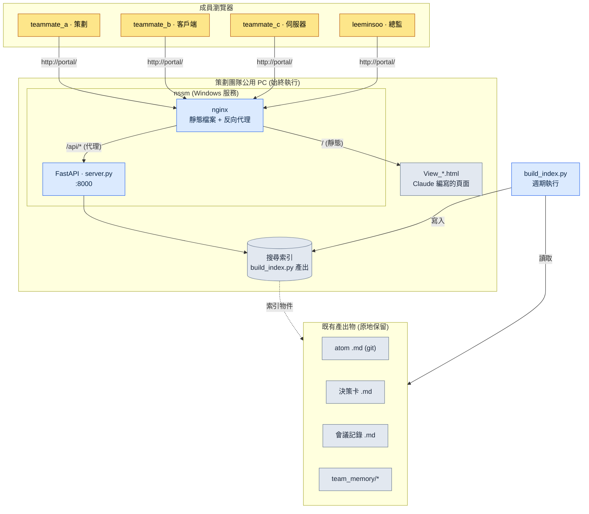

# 20.3 策劃門戶 —— 團隊通過瀏覽器進入的入口

週四傍晚,在提交構建之前,客戶端程式設計師成員 B 在公司內部聊天裡發了一條訊息:"上週戰鬥 TF 上,我們把全域性冷卻常量定為 0.8 秒,對吧?記在哪份文件裡了?"5 分鐘後,策劃成員 A 回覆:"會議記錄裡應該有……我在找。"又過了 7 分鐘。"git 的哪個資料夾來著。"

這段 12 分鐘的往返,並不是因為資訊缺失。資訊確實存在。它寫在 atom 檔案裡、會議記錄裡,也寫在決策卡里。只是這三者被放進了不同的抽屜,而開啟每個抽屜的方式各不相同。問題不在抽屜,而在開啟抽屜的把手。

本章講的就是把這些把手合併成一個。它不是從零自研全棧,而是在已經堆積在資料夾裡的策劃產出物之上覆蓋薄薄一層 Web,讓成員在瀏覽器位址列裡只敲 `portal` 一個詞就能進入。核心工具只有三個:用 Python 啟動搜尋 API 的 FastAPI、架在它前面的 nginx,以及讓服務在無人關閉、PC 開著的整段時間裡持續存活的 nssm。

---

## 20.3.1 分散的產出物,統一的入口

策劃產出物本來就是分散的。這不是有意打散,而是因為每份產出物都落在最自然的位置上。atom 落到 git 倉庫的 Markdown 裡,日程落到任務管理工具裡,即時對話落到聊天裡,KPI 落到獨立的儀表盤裡。各自待在各自的位置上,這沒有錯。問題在於,這些位置需要人在腦子裡存成一張地圖。

對新入職者來說,這張地圖本身就是進入的門檻。要找"全域性冷卻值",就得(1)判斷它到底是決策卡、atom 還是會議記錄,(2)開啟對應的工具,(3)再用那個工具的搜尋語法去查詢。這三步都是從經驗中來的隱性知識。

門戶的想法很簡單。產出物仍舊留在現在的位置。只是在它之上疊一層用於搜尋的索引,再把索引通過瀏覽器暴露出來。不是擺七張桌子,而是擺一張帶七個抽屜的桌子。抽屜照舊,但人只需坐下一次。

下面是筆者在專案A中實際運營的門戶結構。它不需要額外的伺服器裝置,在策劃團隊的一臺公用 PC 上以始終開啟的狀態執行。



圖中用灰色框起來的下半部分,是原本就已存在的產出物;門戶新增的,只是上半部分薄薄的三層——索引、FastAPI、nginx。這是一種不觸碰產出物、只新開一個入口的結構。

---

## 20.3.2 四個部件:build_index.py · server.py · nginx · nssm

門戶的實體,由五個小檔案就能構成。逐個來看,它們各自只做一件事。

**build_index.py —— 把產出物轉換成可搜尋的形態。** 它掃過 git 倉庫,讀取 atom、決策卡、會議記錄以及 `team_memory/` 之下的所有 Markdown,提取標題、正文、標籤,落成一個索引檔案。這個指令碼做的事,只是"把分散的檔案平鋪成一行一條的記錄"而已。它不碰檔案本身,所以即使索引損壞,原件也是安全的。週期性地(例如每 30 分鐘,或通過 git 提交鉤子)重新執行,就能保持最新狀態。

**server.py —— 用 FastAPI 啟動搜尋 API。** 它把索引載入到記憶體裡,當 `/api/search?q=...` 請求到來時,就把匹配的記錄以 JSON 返回。程式碼不超過一屏。

```python
# server.py (節選 —— 搜尋端點骨架)
from fastapi import FastAPI
import json, pathlib

app = FastAPI()
INDEX = json.loads(pathlib.Path("index.json").read_text(encoding="utf-8"))

@app.get("/api/search")
def search(q: str):
    q = q.strip().lower()
    hits = [r for r in INDEX
            if q in r["title"].lower() or q in r["body"].lower()]
    # 按種類歸組後返回 → atom / 決策 / 會議記錄 / 記憶
    by_kind = {}
    for r in hits:
        by_kind.setdefault(r["kind"], []).append(
            {"id": r["id"], "title": r["title"], "path": r["path"]})
    return {"query": q, "count": len(hits), "results": by_kind}
```

搜尋演算法特意從簡單的子串匹配起步。當團隊是中等規模(10\~50 人)、文件在數千份量級時,這份簡單反而降低了維護成本。形態素分析或向量檢索,等到"搜尋太弱"的抱怨真的出現之後再疊上去也不遲。

**nginx —— 服務靜態頁面並代理到 API。** 它把請 Claude 生成的 `View_*.html` 檔案(搜尋頁面、結果頁面、儀表盤頁面)作為靜態資源下發,只把進入 `/api/` 的請求轉交給後端的 FastAPI(:8000)。站在成員的角度,頁面也好、搜尋也好,全都發生在同一個 `http://portal/` 地址上。因為頁面由 Claude 直接用 HTML 畫出,所以策劃需要新頁面時,只要請求"做一個只彙總決策卡的頁面",拿到 `View_decisions.html` 放進資料夾裡就完事了。沒有前端構建流水線,這一點在中等規模團隊裡是明顯的優勢。

**nssm —— 無人開啟也能讓它存活。** 門戶的核心需求是"即使我不在座位上,成員也要能搜尋"。在終端裡啟動 server.py,關掉那個終端的瞬間它就會死,PC 重啟後它也會消失。nssm(Non-Sucking Service Manager)把這個 Python 程序註冊為 Windows 服務,PC 一開機它就自動啟動,程序一旦死掉就自動重啟。註冊一次即可。

```powershell
# 用 nssm 把 FastAPI 註冊為 Windows 服務 (一次)
nssm install Portal "C:\Python\python.exe" "C:\portal\portal_run.py"
nssm set Portal AppDirectory "C:\portal"
nssm start Portal
```

這裡的 `portal_run.py` 是一個五行的啟動器。用 uvicorn 啟動 server.py 的那一行,再加上讓服務不至於死掉的最小骨架,就是全部。人需要記住的命令只有 `nssm start` 一個,而且它一旦註冊好,就再沒機會重敲。

把這四個部件的分工一眼看下來,是這樣的。

<svg xmlns="http://www.w3.org/2000/svg" viewBox="0 0 720 250" font-family="sans-serif" font-size="13">
  <rect x="0" y="0" width="720" height="250" fill="#fbfbfd"/>
  <!-- columns -->
  <g>
    <rect x="20" y="40" width="150" height="170" rx="8" fill="#eef4ff" stroke="#5b8def"/>
    <text x="95" y="65" text-anchor="middle" font-weight="bold" fill="#244">build_index.py</text>
    <text x="95" y="92" text-anchor="middle" fill="#345">產出物 → 索引</text>
    <text x="95" y="112" text-anchor="middle" fill="#345">平鋪·打標籤</text>
    <text x="95" y="148" text-anchor="middle" fill="#789" font-size="11">原件不變</text>
    <text x="95" y="168" text-anchor="middle" fill="#789" font-size="11">週期重跑</text>
  </g>
  <g>
    <rect x="200" y="40" width="150" height="170" rx="8" fill="#eafaf0" stroke="#3aa76d"/>
    <text x="275" y="65" text-anchor="middle" font-weight="bold" fill="#244">server.py</text>
    <text x="275" y="92" text-anchor="middle" fill="#345">FastAPI :8000</text>
    <text x="275" y="112" text-anchor="middle" fill="#345">/api/search</text>
    <text x="275" y="148" text-anchor="middle" fill="#789" font-size="11">按種類分組</text>
    <text x="275" y="168" text-anchor="middle" fill="#789" font-size="11">JSON 返回</text>
  </g>
  <g>
    <rect x="380" y="40" width="150" height="170" rx="8" fill="#fff5e9" stroke="#e08a3c"/>
    <text x="455" y="65" text-anchor="middle" font-weight="bold" fill="#244">nginx</text>
    <text x="455" y="92" text-anchor="middle" fill="#345">View_*.html 託管</text>
    <text x="455" y="112" text-anchor="middle" fill="#345">/api/ 代理</text>
    <text x="455" y="148" text-anchor="middle" fill="#789" font-size="11">單一地址</text>
    <text x="455" y="168" text-anchor="middle" fill="#789" font-size="11">無構建流水線</text>
  </g>
  <g>
    <rect x="560" y="40" width="150" height="170" rx="8" fill="#f6eefe" stroke="#8a5be0"/>
    <text x="635" y="65" text-anchor="middle" font-weight="bold" fill="#244">nssm</text>
    <text x="635" y="92" text-anchor="middle" fill="#345">Windows 服務</text>
    <text x="635" y="112" text-anchor="middle" fill="#345">開機自動啟動</text>
    <text x="635" y="148" text-anchor="middle" fill="#789" font-size="11">死掉即復活</text>
    <text x="635" y="168" text-anchor="middle" fill="#789" font-size="11">保證始終執行</text>
  </g>
  <text x="360" y="232" text-anchor="middle" fill="#456" font-size="12">資料流:產出物 → 索引 → API → 頁面 → 瀏覽器 (從左到右)</text>
</svg>

---

## 20.3.3 團隊實際搜尋的一個場景

光靠部件說明,門戶的價值還不夠真切。讓我們把前面吃掉 12 分鐘的那個問題,在門戶上重新拋一次。下面把筆者製作搜尋頁面時拋給 Claude 的提示詞、拿到的輸出,以及驗證過程,不作壓縮地照搬過來。

筆者的提示詞:

> 做一個 fetch `index.json` 來搜尋的單頁 HTML。在輸入框裡敲關鍵詞就呼叫 `/api/search?q=`,把結果分成 atom / 決策卡 / 會議記錄 / 記憶 四組,以卡片形式展示。點選每條結果就跳轉到原始路徑(`path`)。不要用外部 CSS·JS 框架,用一個檔案搞定。檔名為 `View_search.html`。

Claude 的原始輸出(節選,與實際收到的一模一樣):

```html
<!-- View_search.html -->
<input id="q" placeholder="atom 或關鍵詞">
<div id="out"></div>
<script>
document.getElementById('q').addEventListener('keydown', async e => {
  if (e.key !== 'Enter') return;
  const r = await fetch('/api/search?q=' + encodeURIComponent(e.target.value));
  const d = await r.json();
  const order = ['atom','decision','meeting','memory'];
  const label = {atom:'atom', decision:'決策卡',
                 meeting:'會議記錄', memory:'記憶'};
  out.innerHTML = order.filter(k => d.results[k]).map(k =>
    `<h3>${label[k]} (${d.results[k].length})</h3>` +
    d.results[k].map(x =>
      `<a href="${x.path}">${x.title}</a>`).join('<br>')
  ).join('') || '無結果';
});
</script>
```

這份輸出並不是成品。筆者沒有原樣接受,而是否決了兩處。

第一,把 `out` 不經 `getElementById` 就當全域性變數來用,這是一段依賴瀏覽器慣用行為的危險程式碼——在某些環境下它不會工作。第二,`path` 是 git 內部路徑,直接放進 `href` 的話,瀏覽器打不開檔案。必須改成讓門戶把這個路徑重新路由到自己的頁面,也就是經過 `/view?path=`。

筆者的再次請求:

> 改兩處。(1)把 `out` 明確地用 `document.getElementById` 接收。(2)結果連結不要直接跳到原始路徑,而要經過 `/view?path=` 檢視器端點。檢視器我會加到 server.py 裡,前端只改連結。

這一次往返正是關鍵。Claude 的第一份輸出對了 80%,但剩下的 20%,是隻有當人知道"這個門戶疊在 git 產出物之上"這一背景時才能揪出的缺陷。驗證,始終留給人來做。

執行一次搜尋,成員的頁面上就會浮現出這樣分組的結果。

| 分組 | 搜尋詞"全域性冷卻"的結果 |
|---|---|
| atom | `combat_global_cooldown_constant` |
| 決策卡 | `D2026_Q2_017` (確定為 0.8 秒) |
| 會議記錄 | `95_BattleTF` 第 2 次 |
| 記憶 | 成員 B 一對一筆記 1 條 |

週四下午那段 12 分鐘的往返,縮短為在搜尋框裡敲一個詞的 20 秒。而更重要的是,這 20 秒成了成員 B 一個人就能完成的事,於是成員 A 的 12 分鐘根本不必再花。

---

## 20.3.4 成本與效果 —— 做到哪一步才值得

做門戶的方式大致有三種。從零自研全棧,或引入 Notion·Coda 這類外部一體化工具,或像現在這樣在基礎工具上疊一層薄薄的自動化。筆者選了第三種,而這個選擇的依據在於中等規模團隊這一規模。

全棧自研的自由度最高,但做完之後必須持續維護這個 Web 的負擔,會比效果更早到來。認證、部署、DB 遷移之類的運維勞動,會落到策劃團隊頭上。外部一體化工具很快,卻要按月訂閱,而且最要緊的是,還得把堆在 git 裡的 Markdown 產出物再遷移成那個工具的格式,這筆遷移成本躲不掉。相比之下,FastAPI+nginx+nssm 的組合,把產出物留在原地、只疊一層索引,因此幾天就能執行,維護也不過是偶爾修一修 build_index.py 的程度。

下面是筆者在專案A中,門戶引入前後所感受到的變化。表中的數字並非精密計量,而是筆者的估算(未經驗證),應當讀方向與比例,而非絕對值。

| 條目 | 無門戶 | 運營門戶 | 方向 |
|---|---|---|---|
| 單次資訊檢索耗時 | 數分鐘 | 不足 1 分鐘 | 大幅縮短 |
| "這個在哪"的提問頻率 | 頻繁 | 稀少 | 減少 |
| 新成員適應工具 | 兩週上下 | 幾天 | 縮短 |
| 會議記錄·決策卡的登記率 | 半數左右 | 大多數 | 上升 |

最後一行最為本質。資訊一旦變得易於查詢,快起來的就不只是搜尋,連留下資料這一行為本身的動機也會提升。"反正也搜不到,寫會議記錄幹嘛"這樣的冷嘲,會轉變為"寫了就能被搜到,所以寫"。門戶既是搜尋工具,同時也是誘導記錄的裝置。這一良性迴圈,創造出超過把一兩個工具拼起來的價值。

不過這份平衡取決於團隊規模。當團隊超過 50 人、產出物膨脹到數萬份時,子串搜尋的侷限與單臺 PC 服務的侷限會同時顯現。到那個時點,全棧自研或引入搜尋引擎才被證明為正當。眼下這套結構是"適合中等規模團隊的解",而非所有規模的正解。

---

## 20.3.5 動手試試

**setup.** 定下一臺策劃團隊公用 PC(或一臺始終開著的 PC)。安裝 Python、nginx 和 nssm。確認待索引的產出物資料夾(atom·決策卡·會議記錄·team_memory)的位置。

**prompt.** 按順序向 Claude 請求三件事。

> (1)"做一個 build_index.py,讀取這個資料夾的 Markdown,提取標題·正文·標籤·種類,落成 `index.json`。種類用路徑規則來判別。"
> (2)"做一個 FastAPI server.py,把那個 index.json 載入到記憶體,用 `/api/search?q=` 搜尋。結果按種類分組後返回。"
> (3)"做一個 fetch index.json 來搜尋的單頁 HTML(View_search.html)。不用外部框架,用一個檔案搞定。"

**verify.** 親自確認三件事。(1)執行 build_index.py 之後,看 index.json 裡產出物的條數是否正確——有沒有遺漏的資料夾。(2)啟動 server.py,在瀏覽器裡直接呼叫 `/api/search?q=測試關鍵詞`,看 JSON 是否分組返回。(3)讀 Claude 生成的頁面程式碼,揪出連結路徑是否原樣暴露了 git 內部路徑、有沒有依賴全域性變數的程式碼——前一節看到的兩處缺陷,正是在這裡被篩掉的。最後用 nssm 註冊服務後重啟 PC,確認在無人開啟任何東西時門戶是否仍然存活。

## 20.3.6 單人精簡版

即使沒有團隊,這套結構照樣有用。因為獨自工作的人,自己的產出物也一樣會分散。在 setup 裡用本人 PC 代替公用 PC,nssm 註冊也可以省略(只在需要時用 `python portal_run.py` 啟動)。prompt 同樣拿到 build_index.py、server.py 和 View_search.html 三樣,只是去掉 team_memory 部分,只索引 atom·決策·會議記錄。verify 有確認 index.json 條數和搜尋一次就足夠。核心是一樣的——產出物留在原地,只新開一個搜尋入口。

---

### 本章要點

- 產出物留在原地,只疊一層索引,統一搜索入口
- 有 FastAPI·nginx·nssm 三個部件,中等規模團隊的門戶幾天就能執行
- 搜尋一旦變容易,留下記錄的動機也會隨之提升

### 下一章預告

- 20.4 MCP 專案管理 —— 把公司已在用的工具連線到 LLM·門戶
