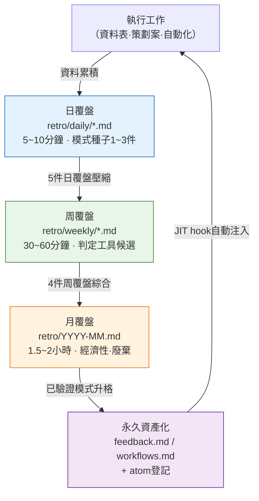

# Part 21 · 第1章 覆盤是一切的起點

週五傍晚6點40分。正準備下班合上筆記型電腦時,我發覺那天做的工作有些似曾相識。我找出並修好了資料表裡斷掉的enum引用,可上週分明也修過同樣的東西。再上一週也修過。每次都要重新敲一遍相同的提示詞,每次都要在Claude的輸出裡核對相同的條目。直到合上筆記型電腦之前,我才意識到這已經是第三次了。

這種"有些似曾相識"的感覺,是全書中最重要的一刻。若放任這種感覺溜走,下週就會第四次重複同樣的工作。若抓住這種感覺並寫成一行字,這一行字下週就會變成一個skill,這個skill一個月後又會變成一個atom(最小知識單元)被自動注入。而抓住它的地方,正是覆盤。

本書的其他部分講的是"有這樣的工具""有這樣的模式"。而本章講的是,所有這些工具與模式究竟從何處萌發。新的斜槓命令在哪裡誕生,新的atom如何被固化,一個月都用不上一次的工具由誰來剔除。答案總是匯聚到同一個地方。在覆盤中。

---

## 1.1 把熟悉感寫成一行 —— 實操記錄(worked transcript)

覆盤並不是什麼隆重的儀式。我們直接開啟作者的一份日覆盤檔案來看。實際路徑是`retro/daily/YYYY-MM-DD.md`,過了一個月,這些檔案會被壓縮為周覆盤(`retro/weekly/YYYY-Www.md`),再壓縮為月覆盤(`retro/YYYY-MM.md`)。規則寫在`retro/README.md`裡。

作者實際採用的流程,不是親手手寫覆盤檔案,而是把當天的工作日誌丟給AI,讓它從中提煉模式。下面是對某個週五傍晚真實往返過程的還原——這正是本書所說的實操記錄(worked transcript),即完整保留下來的真實操作過程記錄:先完整給出提示詞,再把Claude的原始輸出原樣呈現——不作摘要,連偏差之處也照登不誤。

**[提示詞 —— 人工輸入]**

> 把我今天做的工作整理成覆盤。今天做的事:① 修復了角色資料表裡斷掉的enum引用（grade列和enum表對不上）② 統一了NPC對白的語氣 ③ 重新跑了一遍relation-map。
> 其中如果有**本週重複過2次以上的工作**就標出來,如果有**值得做成工具的候選**就單獨挑出來。沒有就說沒有。不要硬湊。

**[Claude原始輸出 —— 未經摘要與改寫]**

> 以下是今天的工作覆盤。
>
> **重複模式檢測**
> - ① 修復enum引用斷裂 → 這一項在本週週二的覆盤裡也出現過同樣的條目。標記為**重複2次以上**。
> - ② 統一NPC對白語氣 → 本週首次出現。非重複。
> - ③ 重新執行relation-map → 您已經在使用relation-map-gen這個skill了,所以這是一項已經完成工具化的工作。不作為新增候選。
>
> **工具候選**
> - enum引用校驗**似乎可以做成一個skill。** 形式上是:比對資料表的列值與enum表,報告其中的不一致。
> - 不過由於我並不清楚這兩張表的確切結構,很難斷定這是否真是一個可複用的模式。需要確認:週二修復的斷裂與今天的斷裂**是否屬於同一類斷裂**。如果是在同一列、因同樣的原因斷裂,那就是很有力的skill候選;如果每次都是不同的列因不同的原因斷裂,就難以歸併為一個skill。

這裡的最後一段才是關鍵。AI並沒有斷言"就做一個skill吧"。它反問的是:**請人來確認是否屬於同一類斷裂**。這正是覆盤之所以不是全自動的原因。

**[人工驗證 —— 採納AI的建議但加以篩選]**

作者開啟週二的覆盤做了比對。週二的斷裂在`grade`列,今天的斷裂也在`grade`列。**屬於同一類**。AI的候選建議通過了驗證。於是在日覆盤裡留下一行。

> 重複工作:enum-grade引用校驗（週二·週五2次）→ **skill候選**。下次周覆盤時判斷是否升格。

這一行就是全部。花了不到5分鐘。而這一行,正是self-improving（自我改進）迴圈的第一環。假如把AI已經點明"早已完成工具化"的第③項也一併列為候選,一個月後就會又多出一個沒人用的重複工具在四處漂浮。正因為AI的篩選與人的篩選雙雙起了作用,最終只留下了一個真正的候選。

---

## 1.2 覆盤之所以是起點

哪項工作在重複,哪件工具用得頻繁,哪個atom還欠缺——這些靠單次工作是看不出來的。在上面的實操記錄裡,enum斷裂之所以浮現為候選,並不是因為"今天",而是因為把"週二和今天"疊在一起看。只有把1周、1個月、1個季度累積下來的痕跡疊起來,模式才會浮現。覆盤,就是刻意製造這種疊合的時間。

覆盤中發現的模式會分成兩支。

- 重複的模式 + 有價值的結果 → 固化為工具(skill·atom·hook)
- 重複但沒有價值的模式 → 廢棄或簡化

這種分野的判斷,在工作進行途中是做不了的。因為它會打斷工作的連貫性。在修復enum斷裂的那一刻,根本沒有餘裕去琢磨"這是不是第三次了"。單獨騰出來的覆盤時間,才是做這種判斷的地方。

工具做出來之後是否真的產生價值,也在同一個地方衡量。一個月才用一次的工具,和能省下一個小時的工具,價值是不一樣的。衡量也好,廢棄決定也好,都在覆盤裡做。沒有覆盤,工具就只會不斷累積而得不到整理。幾年下來,幾十個沒人用的工具會妨礙檢索與運營。

用抽屜來打比方,覆盤就是定期清空書桌抽屜的時間。如果每天都用的筆,和一年都沒拿出來過一次的便籤,混在同一個格子裡,那麼每次找筆都要多花幾秒鐘。工具也是一樣。

---

## 1.3 日·周·月覆盤的壓縮流

作者的覆盤按三個層級運轉。日覆盤收集模式的種子,周覆盤把種子歸攏、壓縮為工具候選,月覆盤則評估工具的經濟性,或將其固化為資產,或將其廢棄。每一層都把其下層的輸出作為輸入。

最後一根箭頭閉合了這個迴圈。被永久資產化的模式,會通過JIT（Just-In-Time,即時）鉤子(hook)自動注入到下一次工作中。在作者的環境裡,有一個名為`inject_memory.py`的hook,每當接收到使用者輸入時,就挑選相關的atom塞進去。一旦enum-grade校驗被固化為atom,下次輸入"資料表校驗"這類內容時,那個atom就會自動跟上來。人不必每次都去記"對了,還有那條校驗規則"。

一旦缺了覆盤,就只剩下自上而下的箭頭,而資產迴流到工作的那根最後的箭頭會斷掉。迴圈無法閉合。所謂自我改進(self-improving),它的含義正是這個迴圈仍在轉動。工具改進工具自身,atom增生出atom。而它的動力,就是人特意騰出來的那一個小時的覆盤。

---

## 1.4 覆盤中萌發的五樣東西

以作者在某個MMORPG專案上把覆盤運轉約半年的體會來看,一次覆盤會萌發出以下五類產出。下面的頻率並非精確統計,而是作者運營中的體感（作者估算·未經驗證）,並非每次覆盤都會產出全部五類。若以季度為單位來看,這五類都會各出現一次。

把這五類展開來說是這樣。如果本週把同一個決定重複了兩次以上,那就是**新atom候選**。如果一週內多次重新輸入同一種提示詞模式,那就是**新skill候選**（上一節的enum-grade校驗就屬於這種情況）。本週用過的skill裡,如果有結果不盡如人意的,那就是**改進現有skill**——調整提示詞·增加校驗·標準化輸入。上個季度做的atom裡,若某個在一個月內匹配次數為0,那就是**廢棄候選**。不用它,就只是白佔token。最後,**經濟性評估**是指:按工具逐一權衡使用頻率與所節省的人工,來決定保留·改進·廢棄。

這五類在同一個畫面裡如何排布,用一個矩陣來看是這樣。橫軸是"是否重複",縱軸是"是否有價值"。

<svg viewBox="0 0 520 320" xmlns="http://www.w3.org/2000/svg" font-family="sans-serif" font-size="13">
  <rect x="0" y="0" width="520" height="320" fill="#ffffff"/>
  <!-- axes -->
  <line x1="90" y1="40" x2="90" y2="280" stroke="#333" stroke-width="1.5"/>
  <line x1="90" y1="280" x2="500" y2="280" stroke="#333" stroke-width="1.5"/>
  <text x="295" y="305" text-anchor="middle" fill="#333">重複頻率  →  高</text>
  <text x="30" y="160" text-anchor="middle" fill="#333" transform="rotate(-90 30 160)">結果價值  →  高</text>
  <!-- quadrants -->
  <rect x="92" y="42" width="200" height="118" fill="#fdecea"/>
  <rect x="294" y="42" width="204" height="118" fill="#e8f5e9"/>
  <rect x="92" y="162" width="200" height="116" fill="#f5f5f5"/>
  <rect x="294" y="162" width="204" height="116" fill="#fff8e1"/>
  <!-- labels -->
  <text x="192" y="95" text-anchor="middle" fill="#b71c1c" font-weight="bold">價值高·重複低</text>
  <text x="192" y="118" text-anchor="middle" fill="#444">→ 原樣保留（暫不工具化）</text>
  <text x="396" y="80" text-anchor="middle" fill="#1b5e20" font-weight="bold">價值高·重複高</text>
  <text x="396" y="103" text-anchor="middle" fill="#444">→ 新skill / 新atom候選</text>
  <text x="396" y="126" text-anchor="middle" fill="#444">（enum-grade校驗在此）</text>
  <text x="192" y="215" text-anchor="middle" fill="#666" font-weight="bold">價值低·重複低</text>
  <text x="192" y="238" text-anchor="middle" fill="#444">→ 忽略</text>
  <text x="396" y="215" text-anchor="middle" fill="#e65100" font-weight="bold">價值低·重複高</text>
  <text x="396" y="238" text-anchor="middle" fill="#444">→ 廢棄 / 簡化候選</text>
</svg>

覆盤所做的,歸根結底就是把這一週的工作撒進這四個象限。落在右上的會變成工具,落在右下的會被剔除。這種分類,就是self-improving的實際運作方式。

---

## 1.5 atom被固化的位置

我們接著走完這樣一段過程:上一節的enum-grade校驗候選升格為skill,再從skill固化為atom。atom是覆盤中被粗略發現的模式,經過驗證之後成為永久資產的形態。

作者的記憶庫裡,已經有一些這樣被固化的atom。其中之一是`retro_atom_natural_invitation`。正如其名,這是一個承載了"在覆盤中,atom不是以命令、而是以自然的邀請出現"這一原則的atom。這個atom本身,就是把覆盤反覆運轉多次才發現的元模式(meta pattern)——只有在多次親歷"如果在覆盤途中強迫症般地非要把某樣東西固化成atom,反而會讓覆盤淪為形式"之後,它才凝固成這一行字。

固化是否真的產生效果,也用分數來管理。作者的環境裡有一個名為`atom_score.py`的指令碼,給每個atom實際被匹配、被使用的程度打分。結果儲存在`_scores_latest.json`裡,分數超過一定水平的atom會被自動注入到`CLAUDE.md`中。也就是說,越是常用的atom越會頻繁地出現在眼前,不常用的atom則會被扣分,流向廢棄候選。這個打分—注入的迴圈,正是把§1.4的四象限自動化的那一部分。

這裡有一點需要誠實地點明。這個分數,並不會直接換算成"一個月省下了30個小時"這類定量指標。atom所節省的時間很難測量。所以,與其用數字去斷定ROI（Return on Investment,投資回報）,不如只用方向與比例來講會更誠實——"越是常用的atom分數越高,分數越高的atom被注入得越頻繁、越能減少人工";是方向,而不是倍數。

---

## 1.6 沒有覆盤的地方會發生什麼

沒有專門騰出覆盤時間的團隊,常見的景象是這樣。

- 同樣的會議每個季度都要重開一遍（"這個我們以前不是也定過結論嗎……"）。
- atom·skill只存在於某一個人的腦子裡。那個人一走,它們也隨之消失。
- 工具只會不斷累積。沒人用的工具妨礙檢索與運營。
- 就算來了新的策劃,學習資料也四散各處,只能從頭再把同樣的試錯經歷一遍。

這種景象,只要有一個小時的覆盤就幾乎會消失。回想§1.1裡那個週五傍晚,差別不過在於:把"有些似曾相識"寫成一行,還是任它溜走。寫下來只要5分鐘;不寫而損失的時間,則會以第四次·第五次重複的形式累積起來。這是典型的因捨不得花小時間而損失更大時間的情形。

當然,沒必要一開始就搭建一套隆重的覆盤系統。在大團隊裡,從每天5分鐘的覆盤起步,或許會讓人覺得憋悶。但若一上來就把日·周·月三層系統一次性鋪開,又容易只顧追著形式走而丟掉本質。讓在最小的階段親身體會到覆盤價值的人,再把它拉昇到下一個階段——這樣的順序才穩妥。

本書中遇到的所有工具·atom·模式,歸根結底都是從某個人的覆盤中萌發出來的。說這本書本身就是作者半年間累積的覆盤的產物,也毫不誇張。說覆盤是起點,並不是一句比喻——它指的是,本書的目錄本身,就是從覆盤里長出來的這一事實。

---

> **遊戲之外的應用。** 用一行字抓住"有些似曾相識——這個我上週不是也做過嗎"這種感覺的覆盤,不只對遊戲開發,而是對任何有重複性工作的職場,都是自我改進的入口。在結束一天時,只寫一行"今天我用手做了兩遍的是什麼事",到了週五再把這一週的五行疊在一起看,那些每天都藏著的模式,就會在一週的尺度上顯現出來。比如,行政總務人員如果在覆盤裡抓住"每週都要重新敲一遍同一格式的郵件",那麼這一行下週就會變成郵件模板,一個月後就會變成自動傳送規則。關鍵不在於工具有多精巧,而在於把痕跡疊起來看這一行為本身,以及:讓AI挑出候選,但同時掛上"不要硬湊、已經自動化的就排除掉"這道篩網。

## 1.7 動手試試

這是首次引入覆盤迴圈的最小版本。幾乎不用安裝任何工具就能開始。

**setup**

1. 在工作資料夾裡建立一個`retro/daily/`資料夾。
2. 以今天的日期新建並開啟一個空檔案`retro/daily/2026-06-06.md`。除此之外不需要任何準備。

**prompt**

每天結束工作時,把當天的工作日誌交給AI,像下面這樣發問。

> 我今天做的事是[工作1·2·3]。其中如果有**本週重複過2次以上的工作**就標出來,如果有**值得做成工具(skill)的重複模式**就單獨挑出來。已經完成工具化的工作請從候選中剔除。沒有就請說沒有。不要硬湊。

最後兩句("已經工具化的要排除""不要硬湊")就是篩網。少了這個,AI每次都會過量生成看似合理的候選,一個月後就會堆起一批沒人用的工具。

**verify**

1. **親自逐條比對**一件,確認AI點出的重複項是否真的是同一類重複（就像前面週二·週五對`grade`列的比對那樣)。同類就確定為候選,不同類就廢棄。
2. 把確定的候選在日覆盤裡留下一行:`重複: [工作] (N次) → skill候選,周覆盤時判斷`。
3. 一週之後,把五份日覆盤再次交給AI,請它"篩出可以升格為skill的候選"。這時,只把存活兩次以上的候選做成工具。

**單人精簡版**

如果既沒有團隊、也沒有額外工具,一個人起步,那就這樣精簡。

- 連資料夾都不建,只在記事應用裡按日期寫一行。
- 每天只寫一句:"今天有一件有些似曾相識的工作"。沒有就留空。
- 週五時,把這一週的五行一眼看完。如果同一句話出現了兩次以上,就只把那一句在下週做成工具。

關鍵不在於工具有多精巧,而在於**把痕跡疊起來看這個行為**。一天會藏起模式,一週會顯露模式。抓住這份顯露的5分鐘,就是自我改進迴圈的入口。

---

### 本章要點
- 覆盤是把重複用一行字抓住、再固化為工具的自我改進迴圈的入口。
- 日覆盤篩種子·周覆盤篩候選·月覆盤篩經濟性,層層過濾出資產。
- 效果用方向而非倍數來講——越是常用的atom,被注入得越頻繁。
