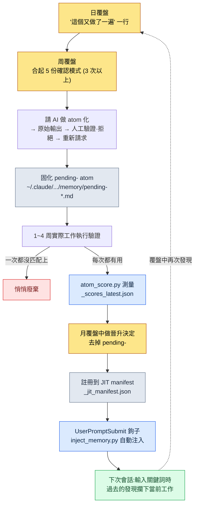

# Part 21 · 第2章. 覆盤系統與 atom 晉升 —— 讓發現成為永久資產

週一早晨,我把上週的五份日覆盤一併顯示在同一螢幕上,正準備開始新的一週。週二的覆盤裡寫著"資料表 export 之前忘了做一致性檢查"。週四的覆盤裡也有幾乎一模一樣的一句。而就在那個週一上午,我又在做同一件事。我把 FK 已損壞的表原樣提交到客戶端/伺服器構建裡,然後又撤了回來。這已經是第三次了。

這一刻正是覆盤系統的核心。你正在第三次做同一件事——這個事實,在你做那件事的當下絕對看不出來。因為手在熟練地動作,腦子裡則低聲說著"這本來就是我一直在做的事"。重複只有把痕跡攢起來、事後回看時才顯現。覆盤是收集這些痕跡的裝置,而 atom 晉升則是把在其中發現的重複固化下來、讓你再也不必用手去做的裝置。

本章將完整追蹤這兩個裝置如何相互咬合運轉,以及一份真實的日覆盤檔案如何變成 JIT manifest 中的一行 atom。

---

## 21.2.1 發現只誕生於痕跡堆中

首先有一個必須點明的前提:重複無法被即時察覺。

遊戲策劃的一天是決策的連續。某個資料表列該用哪種 enum、技能冷卻時間該以秒為單位還是以幀為單位、會議上得出的含糊共識該記在文件的哪個位置。這些決策每一個都太小,留不下記憶。可是如果同一個決策一週要做三次,那它就不再是決策,而是規則了。既然是規則卻每次都重新做一遍,那就是浪費。

問題在於,這種浪費看不見。所以要留下痕跡。每天 5 分鐘,把今天做過的事、今天重複了兩次以上的事,各寫下一行。一週過去,五份痕跡積累起來,到那時才會看見"咦,這個寫了三次啊"。

這正是覆盤與單純日記的分界點。日記記錄感想,覆盤則為提取模式而記錄痕跡。因此覆盤的格式必須固定。格式每次都不一樣,就無法把五份並排比較;無法比較,就看不出模式。

---

## 21.2.2 三個週期不是以時間劃分,而是以角色劃分

把覆盤分成日、周、月三個週期,原因不在於時間的流逝,而在於每個週期所做的事在根本上不同。

<svg viewBox="0 0 720 300" xmlns="http://www.w3.org/2000/svg" font-family="sans-serif">
  <rect x="0" y="0" width="720" height="300" fill="#fbfbfd"/>
  <!-- Daily -->
  <rect x="30" y="40" width="190" height="220" rx="10" fill="#eaf2fb" stroke="#3b6fb0" stroke-width="1.5"/>
  <text x="125" y="70" text-anchor="middle" font-size="17" font-weight="bold" fill="#1f3d63">日覆盤 · 5~10 分鐘</text>
  <text x="125" y="100" text-anchor="middle" font-size="13" fill="#33475b">角色:固化痕跡</text>
  <line x1="50" y1="115" x2="200" y2="115" stroke="#c2d4e8" stroke-width="1"/>
  <text x="125" y="142" text-anchor="middle" font-size="12" fill="#4a5b6b">今天做的事</text>
  <text x="125" y="166" text-anchor="middle" font-size="12" fill="#4a5b6b">做了兩次的決策</text>
  <text x="125" y="190" text-anchor="middle" font-size="12" fill="#4a5b6b">沒用到的工具</text>
  <text x="125" y="214" text-anchor="middle" font-size="12" fill="#4a5b6b">交接給下一次會話</text>
  <text x="125" y="244" text-anchor="middle" font-size="11" font-style="italic" fill="#7a8a99">產出:5 份/周</text>
  <!-- arrow 1 -->
  <polygon points="225,150 255,135 255,165" fill="#9bb3cc"/>
  <!-- Weekly -->
  <rect x="265" y="40" width="190" height="220" rx="10" fill="#eef6ee" stroke="#3f8a4f" stroke-width="1.5"/>
  <text x="360" y="70" text-anchor="middle" font-size="17" font-weight="bold" fill="#1f4a2a">周覆盤 · 30~60 分鐘</text>
  <text x="360" y="100" text-anchor="middle" font-size="13" fill="#33475b">角色:提取模式</text>
  <line x1="285" y1="115" x2="435" y2="115" stroke="#c8e0c8" stroke-width="1"/>
  <text x="360" y="142" text-anchor="middle" font-size="12" fill="#4a5b6b">把 5 份日覆盤合起來看</text>
  <text x="360" y="166" text-anchor="middle" font-size="12" fill="#4a5b6b">3 次以上重複 → 候選</text>
  <text x="360" y="190" text-anchor="middle" font-size="12" fill="#4a5b6b">固化 pending- atom</text>
  <text x="360" y="244" text-anchor="middle" font-size="11" font-style="italic" fill="#7a8a99">產出:1~3 個候選</text>
  <!-- arrow 2 -->
  <polygon points="460,150 490,135 490,165" fill="#9bb3cc"/>
  <!-- Monthly -->
  <rect x="500" y="40" width="190" height="220" rx="10" fill="#fbf2ea" stroke="#b07b3b" stroke-width="1.5"/>
  <text x="595" y="70" text-anchor="middle" font-size="17" font-weight="bold" fill="#634021">月覆盤 · 1.5~2h</text>
  <text x="595" y="100" text-anchor="middle" font-size="13" fill="#33475b">角色:經濟性·晉升</text>
  <line x1="520" y1="115" x2="670" y2="115" stroke="#e8d4c2" stroke-width="1"/>
  <text x="595" y="142" text-anchor="middle" font-size="12" fill="#4a5b6b">工具經濟性評估</text>
  <text x="595" y="166" text-anchor="middle" font-size="12" fill="#4a5b6b">晉升 / 廢棄決定</text>
  <text x="595" y="190" text-anchor="middle" font-size="12" fill="#4a5b6b">季度規劃</text>
  <text x="595" y="244" text-anchor="middle" font-size="11" font-style="italic" fill="#7a8a99">產出:正式 atom</text>
</svg>

日覆盤固化痕跡。不做判斷,只是記錄。周覆盤把五份痕跡合起來觀察模式。在這裡,"這是重複"這樣的判斷第一次介入。月覆盤則縱觀積累下來的全部工具,評估其經濟性,決定留下什麼、捨棄什麼。

缺了任何一個週期,其餘的都會崩塌。沒有日覆盤只做周覆盤,一週前的事已記不清,痕跡就空了。沒有周覆盤只做月覆盤,就要一次性面對一整月的日覆盤,而把 22 份放在一處比較幾乎是不可能的。模式看不出來,只會徒增疲憊。

用工作間來比喻很貼切。日覆盤是每天傍晚整理桌面的 5 分鐘。周覆盤是週末重新歸置一格抽屜的 30 分鐘。月覆盤是每個季度審視整個工作間動線的兩個小時。每天不收拾桌面,週末就沒法歸置抽屜;抽屜一團亂,再看動線也理不出頭緒。

---

## 21.2.3 日覆盤 —— 5 分鐘內完成的固化

我實際使用的日覆盤檔案,會按日期堆放在 `retro/daily/2026-05-30.md` 這樣的路徑下。模板由 `/retro` 斜槓命令自動鋪好。

```markdown
# 日覆盤 2026-05-30

## 今天做的事 (3~5 行)
- 在新技能資料表中新增 12 種 enum + 重排冷卻時間列
- 數值模擬第 1 輪 (調整掉落表權重)
- 資料 export 構建同時更新客戶端/伺服器

## 重複發現 (若有)
- export 構建前又忘了做一致性檢查 → FK 損壞狀態下構建 → 第 3 次
- 數值模擬未固定種子就執行,無法復現 (第二次)

## 廢棄候選
- 今天一次都沒用到的工具:(僅記錄用於月度累計測量)

## 交接給下一次會話
- 先補上兩處損壞的 FK (技能→特效引用),再重新構建
- 候選:考慮把模擬種子固定選項設為預設值
```

5 分鐘就能填完。因為格式固定,不必每次重新糾結"該寫什麼"。欄目是定好的,只要把欄目填滿就行。

這裡最關鍵的是"重複發現"欄。這一欄留空也無妨,大多數日子都是空的。可一旦意識到今天把同一件事做了兩次,就寫下一行。上面示例中的"export 構建前又忘了做一致性檢查 → 第 3 次"就是如此。這一行會在幾天後的周覆盤裡被歸為一個模式,再過幾周就固化成 atom 或 skill。

自動捕獲能減少人工。當 git 提交日誌、atom 變更歷史、skill 使用日誌自動匯入日覆盤時,"今天做的事"欄就已經填好了一半。人只需補上 git 日誌看不到的那部分——"這個又做了一遍"的自覺。

最後的"交接給下一次會話"欄,是寫給明天的自己的便條。有了這一欄,開始新會話時上下文載入能在 1\~2 分鐘內完成;沒有它,就要費時去摸索"昨天我做到哪兒停下的"。實際上,我的 MEMORY.md 裡單獨維護著"下一次會話優先確認"這一條目,它正是日交接累積而成的上層版本。

---

## 21.2.4 周覆盤 —— 模式第一次顯露的場合

周覆盤從把五份日覆盤放上同一螢幕開始。檔案堆放在 `retro/weekly/2026-W21.md` 這樣的路徑下。

```markdown
# 周覆盤 2026-W22 (5/25~5/31)

## 本週工作摘要
- 更新技能/數值資料表,掉落表模擬 2 次
- 資料 export 構建 4 次 (其中 2 次在 FK·enum 損壞狀態下構建)

## 模式發現
- 3 份日覆盤中"export 前忘做一致性檢查"重複 → atom 候選
- 2 份日覆盤中"數值模擬種子未固定"重複 → 檢討模擬預設值

## atom 候選
- pending-data-check-before-export (強制在 export 構建前做一致性驗證的規則)

## skill 候選
- (無 —— 本週用 atom 即可)

## 現有工具檢查
- 未使用:relation-map-gen (本週 0 次)
- 使用最多:check(一致性 cascade)、excel-reader、/retro

## 下週計劃
- pending-data-check-before-export 再執行 1 周後判斷是否晉升
```

在這裡,判斷第一次介入。"3 份日覆盤中 export 前檢查遺漏重複"是算術上的事實,而"這值得固化為 atom"則是判斷。把 3 次重複作為基準線的理由很簡單:一次是偶然,兩次也可能是偶然,三次就是模式。

判斷一旦確立,就立即固化。不過不是作為正式 atom,而是加上 `pending-` 字首的臨時 atom。它會這樣落到我的專案記憶資料夾裡。

```
~/.claude/projects/<project>/memory/
  pending-data-check-before-export.md
```

`pending-` 字首是"這個還在驗證中"的標記。這個標記之所以重要,是因為若把未經驗證的直覺直接變成全團隊的規則,會有兩樣東西被破壞。一是信任——未經驗證的規則老是出錯,人們就會連規則本身也不再相信。二是累積——沒有驗證關卡(verification gate,即由人或檢查器把關的驗證環節,類似質量門禁 quality gate),直覺就原樣堆積,記憶庫最終變成垃圾桶。

所以 `pending-` 會在實際工作中執行一週、長則一個月。真的每次都有用就存活下來,一次都沒用上就悄悄刪除。

---

## 21.2.5 月覆盤 —— 衡量工具的健康,挑出該留下的

月覆盤是把一整月的累積攤開、檢查全部工具健康狀態的場合。檔案按月堆放,如 `retro/2026-05.md`。

```markdown
# 月覆盤 2026-05

## 本月累計
- 日覆盤:22 篇,周覆盤:4 篇
- 新 atom:4 個 (data-check-before-export、sim-seed-pinning 等)
- 新 skill:1 個 (relation-map-gen 選項增強)
- 廢棄 atom:1 個

## 工具經濟性評估
- 各 skill 每月使用次數 + 節省體感 (定性)
- 每月使用不足 1 次的 skill → 廢棄候選
- 價值最大的工具:check(一致性 cascade)、excel-reader、/retro

## atom 分佈
- 按 prefix 累計 (data: X, sim: Y, meeting: Z ...)
- 廢棄候選:一個月匹配 0 次的 atom

## 季度計劃
- 下月引入:impact(影響度追蹤)、schema-doc 自動更新

## 書稿素材 (若有)
- 本月案例中值得在書中引用的:atom 晉升實操 1 例
```

月覆盤的核心是經濟性評估。工具在做出來時看著都有價值,可一個月過去,一半都不會再去碰。要用五把尺子把它們篩出來。

評估標準有五個:使用頻率、時間節省、認知負擔、維護成本、可替代性。使用頻率若每月 1 次以上就先留下,不足則轉入廢棄候選。時間節省是把每次節省的體感乘以頻率——這裡不去斷言以分鐘為單位的數字。"一次感覺省幾分鐘,一個月用十次,累計起來就很可觀"這種程度的定性判斷才誠實。認知負擔方面,若要記的斜槓命令超過十二個,就視為該整理的訊號。人腦能同時扛著的命令數是有上限的。維護成本要看這個工具是否在資料表變動時得跟著一起改。可替代性要看是否新出現了更簡單的方法。

把五把尺子合起來,決定留下、捨棄還是修改。一個小時就能把三十到五十個工具過一遍。不過開始頭一兩個月工具還少,評估用不了一小時。那個階段,與其評估,不如把更多時間花在催生新工具上。經濟性評估是要等工具積累起來之後才真正發揮作用的安全裝置。

---

## 21.2.6 實操記錄(worked transcript):日覆盤一行到 JIT manifest 一行 atom 的全過程

從這裡開始是本章的脊柱。所謂實操記錄,就是完整保留的真實操作過程記錄;下面從覆盤時點起,一路追蹤前面散落的碎片如何真正從一行開始,直到在所有會話中自動注入。途中我拒絕的瞬間、AI 含糊作答的瞬間,都原樣保留。

**第 1 步 —— 在日覆盤中自覺。** 寫 5 月 30 日的日覆盤時,我在"重複發現"欄寫下了一行。

```
- export 構建前又忘了做一致性檢查 → FK 損壞狀態下構建 → 第 3 次
```

這時並沒有做任何工具。只是留下了痕跡。

**第 2 步 —— 在周覆盤中確認模式,並請 AI 將其 atom 化。** 幾天後的周覆盤裡攤開五份日覆盤,發現同一行出現在三處。於是我拋給 Claude 的提示詞全文如下。

> 本週 3 份日覆盤中反覆出現"資料 export 構建前用手工做一致性檢查時忘了做"。我想把它做成 pending atom。請寫一份 atom 正文草稿。格式和我們記憶庫裡其他 atom 一樣,用 frontmatter(name、status、trigger)加一段規則。

Claude 的原始輸出如下(未經刪減,原樣呈現)。

> ```markdown
> ---
> name: data-check-before-export
> status: pending
> trigger: ["資料", "export", "構建前", "一致性"]
> ---
> 在把遊戲資料表 export 構建到客戶端/伺服器之前,始終先執行一致性檢查
> (check cascade),確認 FK·enum·引用違規 0 處之後才 export。若發現違規,
> 則中止 export,並把失敗明細通過 ClickUp 通知傳送給負責人。
> ```
>
> 把這個 atom 儲存為 `pending-data-check-before-export.md` 即可。不過 trigger 關鍵詞中"資料"太寬泛,可能會匹配到與 export 無關的場景(資料表閱覽、資料會議等)。建議去掉。

**第 3 步 —— 人工驗證與部分拒絕。** AI 自己懷疑其中一個 trigger,這個指摘是對的。但我又往前走了一步。規則正文裡把"一致性驗證"和"失敗時 ClickUp 通知"兩件事捆在一起,這一點我不滿意。失敗通知已經由 `integrity_check_clickup_notify` 這個獨立 atom 負責。把兩項職責捆在一個 atom 裡,日後只想改通知規則時,就會連驗證規則一起動到。於是我拒絕並重新提出請求。

> 好,把"資料"trigger 去掉。另外失敗時的 ClickUp 通知已經由 integrity_check_clickup_notify 負責,所以從這個 atom 裡去掉。把這個 atom 收窄成只負責 export 前的一致性驗證。

重新請求後,Claude 收窄的正文如下。

> ```markdown
> ---
> name: data-check-before-export
> status: pending
> trigger: ["資料構建", "export", "構建前驗證"]
> ---
> 在把遊戲資料表 export 構建到客戶端/伺服器之前,先執行一致性檢查
> (check cascade)。檢查物件:FK 引用完整性、enum 值有效性、
> 表間引用一致性。確認 0 處違規之後才 export。失敗時的通知
> 由 integrity_check_clickup_notify 負責,本規則不予介入。
> ```

這就是我採納的版本。只承擔一項職責,trigger 也收窄到只在 export 語境下。我把這個檔案儲存為 `pending-data-check-before-export.md`。這裡的關鍵在於,我沒有原樣採用 AI 的第一版輸出。AI 幫忙搭好了格式、懷疑了一個 trigger,但"把職責收窄為一項"這一設計判斷是由人做出的。

**第 4 步 —— 1 周執行驗證。** 接下來的一週裡,每次做資料 export 構建時都會想起這個 pending atom,實際上有兩次在構建前一刻抓到了 enum 損壞。沒有一次落空。它有了存活下來的資格。

**第 5 步 —— 在月覆盤中做晉升決定並測量 score。** 月覆盤裡我把這個 pending atom 列入晉升候選。是否晉升不靠直覺,而靠測量來判斷。我的環境裡有一個把 atom 的匹配頻率和有用性打分的指令碼。

```bash
python ~/.claude/scripts/atom_score.py
# → 更新 ~/.claude/projects/<project>/memory/_scores_latest.json
```

這個指令碼會統計每個 atom 在過去一段時間裡被 trigger 匹配了多少次、當時是否真的被引用到工作中,並把結果落到 `_scores_latest.json`。分數超過一定基準的 atom,會被接上自動注入到 CLAUDE.md 的通路。`pending-data-check-before-export` 按 2026 年 5 月的實測,一週內每次 export 構建都被匹配,分數足夠。晉升確定。

**第 6 步 —— 去掉 `pending-`,註冊到 JIT manifest。** 摘掉字首、換成正式 atom 後,我在 JIT manifest 里加了一行。

```
~/.claude/projects/<project>/memory/_jit_manifest.json
```

這個 manifest 由 UserPromptSubmit 鉤子(`~/.claude/hooks/inject_memory.py`)在每次輸入時讀取。輸入中若含有"資料構建"或"export",這個 atom 的正文就會自動插入上下文。

**第 7 步 —— 閉環。** 之後想做構建,輸入"幫我跑一下資料 export 構建"的那一刻,我什麼都沒吩咐,Claude 卻先開口了。

> 要不要先在 export 前跑一遍一致性檢查(check cascade)?我會檢查 FK 引用、enum 值、表間引用的一致性,確認 0 處違規之後再 export。

三週前寫在日覆盤裡的"這個又做了一遍"那一行,如今變成了會自動攔下當前工作的規則回到了我面前。曾經用手做的驗證,再也不必用手去做。所謂閉環,說的正是這一幕。

---

## 21.2.7 從發現到自動注入:晉升迴圈的全貌

把上面的實操記錄壓縮成一張流程圖,就是下面這樣。發現發生在日覆盤,驗證由執行期完成,晉升由測量決定,而資產化則由 manifest 收尾。



最後那條虛線就是這張圖的全部。被自動注入的 atom 又暴露出新的重複,那重複再次進入覆盤,催生下一個 atom。每轉一圈,要用手做的事就少一件。這個迴圈累積上半年到一年,覆盤就不再是日記,而成了工作系統的大腦。

---

## 21.2.8 讓覆盤自然而然地召喚出 atom

晉升迴圈裡最脆弱的一環是第 1 步——寫下"這個又做了一遍"的那一刻。忙的時候,人會把覆盤欄留空就跳過。這樣就不留痕跡,沒有痕跡周覆盤裡就看不出模式,沒有模式就誕生不了 atom。迴圈的入口被堵住了。

所以我的環境裡有一個叫 `retro_atom_natural_invitation` 的 atom。它的規則是:寫覆盤時,不要把 atom 的催生當成強制義務,而要留作一種自然的邀請。也就是說,不是"今天必須挑出一個 atom 候選",而是把覆盤模板裡的"重複發現"欄當作可以留空的欄,只在那裡確有值得寫的一行時,才輕輕記下。做成義務,就會硬擠出假模式;留作邀請,就只有真正的重複才會自然被捕獲。

這一線之差,決定了迴圈能否持續。義務化的覆盤撐不過兩週,就會被形式化的謊言填滿。邀請式的覆盤在沒什麼可寫的日子裡就留空,沒有負擔,因而能長久。長久才能積累痕跡,痕跡積累起來才看得見模式。

這個 atom 本身也誕生於覆盤。把覆盤當義務來執行,沒幾天就在日覆盤裡發現欄目被假內容填滿,這個發現經過周覆盤,晉升成了這條規則。改進覆盤的規則,正是從覆盤里長出來的。

---

## 21.2.9 常見的崩壞之處

把迴圈運轉起來後會發現,它總在同樣的地方崩塌。

跳過覆盤最常見。以忙為由跳過三天,這三天的痕跡就永遠消失了。防止的辦法很簡單——別的欄都留空也行,唯獨"今天做的事"這一行一定要寫。哪怕不是 5 分鐘而是 1 分鐘,痕跡也能留下。

每次都重新設計格式也很危險。用自由格式記錄,就沒法把五份並排比較。無法比較,提取模式這件周覆盤的本職工作本身就變得不可能。所以 `/retro` 會強制鋪好模板。

只增不棄也是陷阱。只顧增加 atom 和 skill 而不捨棄,認知負擔就會累積。斜槓命令一旦超過十二個,腦子就記不全所有工具了。月覆盤的經濟性評估是阻止這種累積的唯一裝置。

跳過晉升關卡也很危險。把直覺直接做成正式 atom,未經驗證的規則就會堆積。經過 `pending-`、靠測量來晉升的關卡,必須存在於發現與資產化之間。

最後,以為單人工作沒有團隊共享就不必做覆盤,這是一種誤解。上面整個實操記錄都是在單人環境裡跑出來的案例。只是少了團隊共享合併這一步,發現→pending→測量→晉升→JIT 注入的迴圈,一個人也照樣轉。反倒是在單人環境裡,這個迴圈扮演著唯一的外部評審者角色。

---

> **遊戲之外的應用。** 讓日覆盤的一行經過驗證、成為永久規則的晉升迴圈,是一套與職業無關、能讓人"把學到一次的教訓再也不必用手去做"的流程。不把發現直接固定為團隊規則,而是先以 `pending` 執行一週、只在實際每次都有用時才正式化——這道關卡是核心,因為把未經驗證的直覺直接做成規則,人們就會連規則本身也不再相信。舉例來說,運營團隊可以把"提交報告前再核對一次數字合計是否正確"作為暫定檢查清單,執行一週,當實際抓到兩三次錯誤後再升為正式的標準流程;而"只承擔一項職責"這一收窄的設計判斷(不要把多項檢查捆在一行裡)也會自然而然隨之而來。

## 動手試試

**setup.** 鋪好覆盤資料夾和模板。

```bash
mkdir -p ~/.claude/projects/<your-project>/memory/retro/daily
mkdir -p ~/.claude/projects/<your-project>/memory/retro/weekly
# 把一個日覆盤模板檔案儲存為 retro/_template_daily.md
```

**prompt.** 累積一週的日覆盤後,在周覆盤的場合這樣拋給 Claude。

> 我把本週 5 份日覆盤貼給你。請找出重複 3 次以上的工作或決策,整理成 atom 候選。每個候選用 frontmatter(name、status: pending、trigger 關鍵詞陣列)加一段規則。trigger 太寬泛就收窄了再提議,一個 atom 承擔兩項職責就拆開來提議。

**verify.** 不要原樣使用拿到的候選,而要驗證三點。(1) 一個 atom 是否只承擔一項職責——兩項職責就拒絕並要求拆分。(2) trigger 關鍵詞是否只匹配那一工作語境——太寬就拒絕。(3) 是否真的重複了 3 次,還是偶然的 2 次——若是偶然,連 pending 都不做。只有通過這三項驗證的,才加上 `pending-` 儲存,執行一週後每次都有用時才正式晉升。

---

## 21.2.10 單人精簡版

如果既沒有團隊,也還沒有 JIT 鉤子和 score 指令碼,那麼用下面這一張檔案就能模仿整個迴圈。

建立 `retro.md` 一個檔案,只放三個欄。

```markdown
## 今天 (1 行)
- 

## 又做了一遍 (若有,1 行)
- 

## 固化候選 (「又做了一遍」攢夠 3 次就移到這裡)
- [ ] (規則一句話) —— 驗證:有用 ___ 次
```

每天只填上面兩欄。"又做了一遍"裡同一行攢到三次,就移到第三欄,寫成一句話的規則。數一數這條規則在接下來一週裡實際有用的次數填進欄裡,達到三次以上,就把這句話正式移入專案記憶(CLAUDE.md)。即便沒有 JIT 鉤子,寫進 CLAUDE.md 的規則在下次會話裡也總會跟著來,單憑這一點,"過去的發現幫助當前工作"這一迴圈的最小形態就完成了。

關鍵不在於工具是否華麗,而在於關卡是否存在。只要有"又做了一遍 3 次 → 固化 → 有用 3 次 → 永久化"這道關卡,哪怕只有一張檔案,self-improving 迴圈也能轉起來。

---

### 本章要點
- 重複在工作中看不見,只有把痕跡攢起來事後回看時才顯現
- 沒有 pending 關卡和測量,覆盤就只停留在催生想法這一步,成不了資產
- 當日覆盤的一行閉合為 JIT manifest 的一行,過去就在幫助現在

### 下一章預告
- 第 3 章. 閉合 self-improving 迴圈 —— 覆盤·atom·JIT 合為一個系統的時刻
