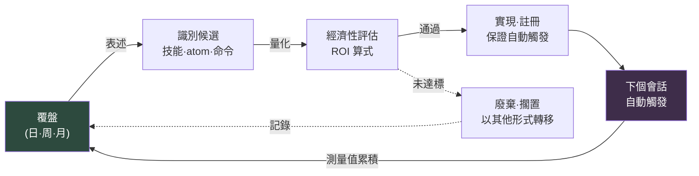

# Part 21 · 第3章. 閉合 self-improving 迴圈

> 從覆盤開始的迴圈,是否又回到了覆盤。若不閉合,它便只是筆記,而非系統。

---

翻開六個月前的覆盤。"術語統一不了""文件難以查詢""同樣的問題又被問到。"翻開今天早上寫的覆盤。"術語統一不了""文件難以查詢""同樣的問題又被問到。"

連字句都一樣。並不是沒做覆盤。這六個月一直認真地做。Notion 頁面一頁頁地堆積,季度工作坊上便利貼鋪滿了白板。可寫下的內容卻在原地打轉。不是覆盤沒有起作用,而是迴圈沒有閉合。

本章是全書的最後一章。因此它探討的也是最後一個問題。前面做出的所有工具 —— Part 6 的城市生成器、Part 14 的移動端評審 atom、Part 22 的成本標準 —— 要讓它們不是做一次就結束的一次性產物,而是成為自我成長的系統,還需要什麼。答案只有一個。覆盤中產生的表述從下個會話起自動運作,而這一運作再度被測量並回到覆盤的閉合環路。閉合這個環路的機制,就是 self-improving 迴圈。

---

## 21.3.1 未閉合迴圈的真面目

覆盤中產生一句表述:"會議太多了。"這是好的表述。可這句表述只作為 Notion 頁面上的一行留了下來。到了下週,會議依舊很多,下一次覆盤裡又寫下同樣的一行。因為在表述與改進之間夾著人的記憶。人會遺忘。所以鏈條斷了。

要能稱之為 self-improving,覆盤的表述就必須不經過人的記憶,而直接連向下個會話的自動行為。滿足這一點的條件有四個。

第一,覆盤表述必須轉化為可立即執行的形態。不是抽象的決心,而是落成技能·atom·manifest 條目·斜槓命令之一。第二,從下個會話起,即使人不記得也要自動觸發。第三,在下一次覆盤中,要實測它究竟改變了什麼。第四,這一測量結果要再度作為下一輪改進的輸入而迴圈。

當這四點全部自動銜接時,迴圈才閉合。哪怕只有一個環節用"下週我記得再應用吧"來填補,迴圈就會當場重新開啟。然後在下一次覆盤裡,同樣的表述又被寫下。

用抽屜來比喻是這樣。如果覆盤止於"這支筆不用了,拿出來吧"的一句筆記,那麼下週那支筆還在原處。不是筆記,而是動手拿出來,才算閉合。而且要到下個季度再檢查一次,那個位置才不會又堆起不用的筆。筆記是表述,動手是自動觸發,下季度的檢查是測量。三者缺一,抽屜就又亂了。

---

## 21.3.2 迴圈的閉合形態

把整個流程畫出來,就成了一個閉合的迴圈。起點與終點都是覆盤。



箭頭繞行一圈,又回到覆盤。這個閉合正是核心。每個環節的產出物成為下個環節的輸入,而最後的測量值又成為最初覆盤的輸入。若中間夾進人的記憶,那支箭頭就會斷裂,迴圈隨之破裂。

請注意,ROI 未達標的候選被劃入廢棄·擱置的那條虛線箭頭,最終也會回到覆盤。"這個不值得做"的判斷本身成為下一次覆盤的記錄,當同一候選再次被提出時,便成為快速篩除的依據。捨棄也在迴圈之內。

從覆盤通向 self-improving 的表述,有固定的五種模式(在 §21.1.4 中講過)。待建立技能、待改進技能、待建立 atom、待改進 atom、經濟性再評估。只要把這五項作為槽位放進覆盤模板本身,表述就不會遺漏。

```markdown
## 覆盤(日)—— 2026-06-06

### 1. 今日工作
- (工作摘要)

### 2. self-improving 表述(5 個槽位)
- 待建立技能:<留空則填"無">
- 待改進技能:<>
- 待建立 atom:<>
- 待改進 atom:<>
- 經濟性再評估:<>

### 3. 下次覆盤要測量的項
- <>
```

槽位空著也沒關係。空著這一事實本身,就是"今天沒有新的改進"的記錄。不過若連續幾天五個槽位全空,那不是沒有可改進之處,而是覆盤正在僵化為形式的訊號。這種時候就丟擲觸發提問:"本週同一件事手動做了兩次的是什麼。"

表述以模糊的狀態冒出來。"會議記錄太長了。"要把它培養成候選,就用一個產出物來量化。"會議記錄太長了"換算為 `meeting_summary` 技能,即一個接收會議記錄、只提取決策與行動項的工具。"術語容易混淆"換算為收納 30 個領域詞彙的 `glossary_lookup` atom;"同樣的問題每次都被問到"換算為將新人第一天引導自動化的 `/onboarding` 斜槓命令。"同步遺漏頻繁"則落成 manifest 更新與新增 JIT atom。

候選必須被定義為"某一個產出物",才能進入下一環節。"整體改進一下"不是候選。無法換算為一個產出物的表述,沒法擺上 ROI 評估臺,擺不上去就停在那裡。

---

## 21.3.3 ROI 是數量級的問題

有了候選,並不都去做。製作之前先衡量投入與產出之比。算式很簡單。

<svg viewBox="0 0 720 150" xmlns="http://www.w3.org/2000/svg" font-family="sans-serif">
  <rect x="0" y="0" width="720" height="150" fill="#1e1e28"/>
  <text x="360" y="38" fill="#9fe0b0" font-size="17" text-anchor="middle" font-weight="bold">ROI 算式</text>
  <line x1="180" y1="85" x2="540" y2="85" stroke="#666" stroke-width="2"/>
  <text x="360" y="72" fill="#e6e6e6" font-size="16" text-anchor="middle">節省時間 × 觸發頻率 × 運營週期</text>
  <text x="360" y="115" fill="#e6e6e6" font-size="16" text-anchor="middle">製作時間 + 維護負擔</text>
  <text x="150" y="92" fill="#c89bf0" font-size="22" text-anchor="middle">ROI =</text>
</svg>

每個專案都有單位與通過線。節省時間是每次觸發所減少的人力時間,以分鐘為單位來估。觸發頻率是每週的估計次數,每週 1 次以上才划算。運營週期是到廢棄為止的預計週數,撐不過 4 周的工具就沒什麼理由去做。製作時間是首次實現與驗證所花的時間,維護是每月檢查·修改所花的時間。

分子是累計節省,分母是累計成本。用算出的值來決策。

| ROI 值 | 決策 |
|---|---|
| 10 以上 | 立即製作 |
| 3\~10 | 一週內製作 |
| 1\~3 | pending 擱置,一個月後再評估 |
| 1 以下 | 以此形式廢棄。考慮其他方式 |

ROI 低於 1,意思不是"這個想法沒用",而是"不該以這種形態去做"。先檢查能否用更輕的一行 atom 來替代,能否用只改變現有工具入口的 Wrapper 來解決。把本要做成笨重技能的事情降為一行 atom,分母縮到十分之一、ROI 因此起死回生的情況很常見。

代入一個真實數字試試。就來算算 2026 年 5 月 23 日在個人 PC 上搭建的 JIT atom 注入系統 —— 由 UserPromptSubmit 鉤子讀取使用者輸入、自動注入相關記憶片段(atom)的基礎設施 —— 的 ROI。

```
節省時間:  每個會話約 3~5 分鐘(省去手動查詢並呼叫相關 atom 的時間)
觸發頻率:  每週 15~25 個會話(以個人 PC 為準)
運營週期:  預計 1 年以上(屬於基礎設施性質,廢棄可能性低)
製作時間:  4 小時(hook + manifest + atom 驗證)
維護:      每月 0.5 小時(atom 增補·修改)

ROI = (4分 × 20次/周 × 52周) / (4小時 × 60分 + 0.5小時 × 12個月 × 60分)
    = 4,160分 / (240分 + 360分)
    = 4,160分 / 600分
    ≈ 6.9  →  "立即製作"區間。決策由算式支撐
```

這裡有必須坦誠的地方。上面這些數字 —— 每個會話 3\~5 分鐘、每週 15\~25 個會話 —— 不是精密計量,而是基於作者運營經驗的估計。不是用秒錶測出的值。所以 ROI 6.9 也不是精確到小數點的可信值。

但這沒關係。因為 ROI 算式是看數量級、而非看精度的工具。結果在 7 上下就做。在 0.3 上下就再想想。要劃開這兩者,並不需要小數點。重要的是,即便決定不做,其依據也要出自算式,而非腦中的直覺。數量級不夠所以不做 —— 只要這一行留在覆盤裡,當同一候選再次被提出時,就不必再糾結。

---

## 21.3.4 做出來不等於結束 —— 註冊與觸發驗證

候選通過了就做。可做出來只是一半。另一半是把它註冊好,讓它從下個會話起自動觸發。若漏了這一註冊,工具雖已做成,卻留在無人觸及的角落,迴圈就在那裡斷裂。

不同種類的產出物,註冊的地方不同。全域性技能放進 `~/.claude/skills/`,並一併做一個載有用法的指南 atom。專案技能放在該專案的 `.claude/skills/`。新增 atom 放進合適的資料夾,在 MEMORY.md 索引里加上一行,並在 JIT manifest 中註冊觸發詞 —— 這三件都做齊,自動注入才成立。斜槓命令放進 `~/.claude/commands/`;Wrapper 則改變現有工具的入口,並附上指南 atom。

漏了註冊,下一次覆盤裡又會冒出"這個明明做了,怎麼沒在用"的表述。那不是新的改進表述,而是一份缺陷報告。等於在覆盤中重新發現了自己遺漏的註冊。

即便註冊完畢,還剩一步。那就是開一個新會話,用預期的觸發詞確認它是否真的觸發。

```
1. 啟動新會話
2. 輸入觸發詞(例:"家人健康怎麼樣")
3. 檢查 JIT 日誌 → 預期的 atom 是否真的被注入
   (~/.claude/hooks/_injection_log.txt)
4. 若未觸發 → 擴充套件 manifest 中的觸發 regex
   或增加手動呼叫路徑
```

缺了這一驗證,"以為有,可真正需要時卻沒觸發"的事故就會反覆發生。註冊與觸發是兩回事。註冊是把檔案放好,觸發是觸發詞實際被命中。觸發 regex 差一個字,註冊了也永遠不會觸發。

---

## 21.3.5 測量 —— 回到覆盤的箭頭

把做好的工具執行一週到一個月左右,再測量。這一測量正是迴圈的最後一支箭頭,也就是重新進入覆盤的那支箭頭。

實際觸發次數從 JIT 日誌或命令呼叫日誌裡數。實際節省時間以"以前要花 N 分鐘的工作,這次 M 分鐘就完成了"的方式記入覆盤。副作用 —— 錯誤觸發、不必要的上下文汙染 —— 也一併檢視。然後把最初估計的 ROI 與實測 ROI 並排放在一起。

若估計 ROI 是 6,而實測 ROI 是 0.8,就毫不留情地廢棄。因為比起製作者的自尊,系統的整潔更優先。不用的工具堆積在 manifest 裡,那份噪聲會啃食下一次覆盤的準確度。

不過在按下廢棄鍵之前,先檢查一次。可能是觸發 regex 太窄,以至於根本沒觸發;也可能是沒有手動呼叫路徑,就這麼被遺忘了。先分清:究竟是真的沒有價值的工具,還是觸發路徑被堵住的好工具。前者就丟棄,後者就打通路徑。

廢棄同樣在覆盤中決定。"廢棄這個工具"的決定本身就是 self-improving 的產出物。只做不清的迴圈是單調遞增的迴圈,而單調遞增的系統最終會被自身的重量壓垮。

---

## 21.3.6 閉環的標誌

迴圈是否閉合,可以從四個訊號來判斷。

第一,同樣的表述不再重複。覆盤中寫過一次的條目若被寫第二次,就意味著第一輪裡,候選識別或實現的某處失敗了。本章開頭那句"術語統一不了"連續六個月反覆出現 —— 那正是迴圈敞開的最鮮明的證據。

第二,manifest 與 atom 的數量不再只是單調遞增。廢棄會發生。每個季度整理掉 10\~20% 左右,才是健康的迴圈。從未減少過的系統,就像從未打掃過的抽屜。

第三,覆盤時間縮短。系統運轉良好時,苦想"昨天做了什麼"的時間就消失了,填滿五個表述槽位 5 分鐘就夠。

第四,新人能在一週之內參與覆盤。只要覆盤格式已標準化、atom·技能視覺化,就能做到。

迴圈斷裂的位置每次都是固定的。把失敗模式收集起來,下次看到同樣的症狀時,就能立刻拿出處方。

| 斷裂點 | 症狀 | 處方 |
|---|---|---|
| 沒有表述 | 5 個槽位每次都空 | 增加觸發提問:"同一件事本週手動做了兩次的是什麼" |
| 落不成候選 | "整體改進"式的含糊 | 強制量化為一個產出物 |
| 跳過 ROI 評估 | 先做了再說 | 將 ROI 算式做成 5 分鐘模板 |
| 做了卻不觸發 | 遺漏註冊 | 強制執行註冊檢查清單 |
| 觸發了卻不用 | 觸發詞缺失·配置錯誤 | 擴充套件 regex + 同時提供手動路徑 |
| 不做測量 | 覆盤中沒有測量槽位 | 增加"下次覆盤要測量的項"槽位 |

每一種失敗模式都在覆盤中被表述,而這一表述又成為 self-improving 的輸入。就連修復迴圈這件事,也發生在迴圈之內。這是元迴圈。

---

## 21.3.7 本書的最後一句

這本書很長。從資訊架構開始,做出生成城市的工具,設計戰鬥系統,自動化移動端評審,標準化成本,又從覆盤中打撈出 atom。所有這些章節的工具匯聚一處所回答的問題,就是這最後一章:做出來的東西,是否自我成長。

self-improving 最終可以濃縮為一句話。

> 在覆盤中決定的事,從下個會話起自動運作,而這一運作再度被測量並回到覆盤。

若不自動運作,覆盤就是日記。寫得好的日記能帶來慰藉,卻改變不了系統。若自動運作,覆盤就成為系統的大腦。每天的表述改變每天的行動,而那行動的結果又讓下一次表述更準確。

本書探討的所有領域 —— 資訊設計、系統、戰鬥、移動端、成本,以及作為程式化生成·自動化前提的 Layer 分解 —— 全都在這條 self-improving 迴圈之上進化。工具會陳舊,模型會更替,專案會結束。但只要迴圈閉合著,系統就比昨天的今天更好一點。這正是本書最後留下的一樣東西:不是做工具的方法,而是讓工具自我成長的方法。

願你的下一次覆盤,成為那迴圈的第一圈。

---

### 本章要點
- 迴圈中,只要把表述→候選→ROI→實現→自動觸發→測量中的任何一格交給人的記憶,迴圈就會當場重新開啟
- ROI 是看數量級而非看精度的工具,不去做的決定也要有出自算式的依據
- 廢棄也是 self-improving 的產出物 —— 不清空的迴圈會被自身的重量壓垮

---

> **遊戲之外的應用。** 如果"術語統一不了 / 文件難以查詢"連續六個月一字不差地被寫進覆盤,那不是沒做覆盤,而是迴圈沒有閉合 —— 因為在表述與改進之間夾著人的記憶。無論哪個部門,閉環的條件都相同。表述要落成一個可立即執行的產出物(模板·檢查清單·自動化規則),此後即使人不記得也能運作,而其效果要再度被測量並回傳。例如"會議太長了"這一表述,可換算為"接收會議記錄、只提取決定與待辦事項的一個工具",在製作之前用(節省時間 × 觸發頻率 × 運營週期)÷(製作·維護時間)只核對數量級,來決定立即製作還是擱置。即便是決定不做,其依據也要出自算式而非直覺,這樣當同一候選再次被提出時,才不必再糾結。

## 動手試試

### setup
1. 在覆盤模板中放入 self-improving 5 個槽位與"下次覆盤要測量的項"槽位。
2. 把 ROI 算式一行與決策區間表(10↑ 立即 / 3\~10 一週 / 1\~3 擱置 / 1↓ 廢棄)固定在覆盤檔案頂部。
3. 事先做好註冊檢查清單(技能·atom·命令·Wrapper 各自的註冊位置)。

### prompt
```
幫我填滿今天覆盤的 self-improving 5 個槽位。
把每條表述都量化為"一個產出物",並對每個候選,把 ROI 按
(節省分 × 每週觸發 × 運營周) / (製作分 + 維護分)
來估算,並附上決策區間(立即/一週/擱置/廢棄)。
估算數字要用一行註明依據,若非精密計量就標註"估算"。
```

### verify
1. 實現通過的候選後,開一個新會話,用預期的觸發詞輸入。
2. 檢查觸發日誌 —— 預期的 atom·命令是否實際觸發。
3. 一週\~一個月後在覆盤中把實測 ROI 與估計 ROI 比較,若低於 0.8,先分清是否路徑被堵,再決定是否廢棄。

### 單人精簡版
沒有團隊也行。一個人的話就這樣精簡。一天結束時寫一行筆記 —— "今天同一件事手動做了兩次的是什麼。"把這一行,在第二天換成一行自動化(atom·別名·程式碼片段)。一週後只看這一行有沒有實際被用到。用到了就留下,沒用到就刪掉。一行表述 → 一行自動化 → 一行測量。迴圈的最小單位就是這三行。
