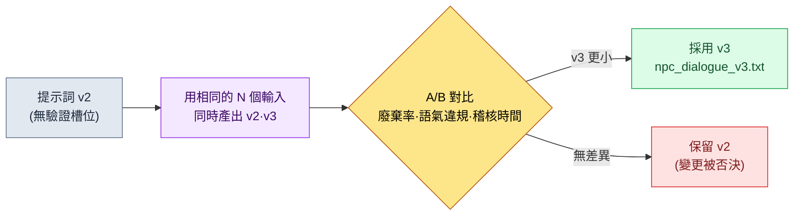

# 22.1 提示詞工程 —— 遊戲策劃的一頁作業指示書

> 第一讀者:在實務中引入 LLM 的遊戲策劃(中等規模(10\~50 人)團隊)
> 面向單人/業餘讀者的精簡版:§22.1.7「一個人的話,只做這些就夠」

為了拿到三行 NPC 臺詞,我曾輸入過"給這個 NPC 寫 5 句臺詞"。回來的,是那種放到任何一款奇幻遊戲裡都不違和、因而放到我們遊戲裡哪兒都不合適的五行臺詞。語氣是空的,它不知道這個 NPC 是誰,也接不上旁邊的臺詞。逐行來看,語法都沒毛病。問題在於:接過那五行去稽核,比我從頭自己寫還要花更長時間。

本章講的是如何把那句一行指令,變成**一頁作業指示書**。提示詞的通論,其他書裡已經足夠多。這裡要展示的,是遊戲策劃坐到 LLM 面前時手裡應當握著的四樣東西——上下文、輸出格式、幻覺阻斷、驗證請求——不是抽象的碎片,而是一頁**真實跑過的 npc_dialogue 提示詞**。它往提示詞裡放了什麼、產出了什麼、拒絕了什麼,我們會跟到一個完整週期的終點。

---

## 22.1.1 提示詞就是作業指示書 —— 四條原則全都裝進一頁

好的作業指示書並不短。把活兒交給新人時,只說一句"好好幹",每次拿回來的結果都不一樣;同樣,對 LLM 說"給我寫臺詞",每次回來的都是一般 RPG 的平均水準。哪怕是同一個模型,指示書不同,結果也會分道揚鑣——輸出質量相差幾倍是業界通識,而本書並不用數字去承諾那個倍數。但方向是明確的:加入了上下文與約束的提示詞,其產出比赤手空拳的一行指令更省稽核負擔。

遊戲策劃的提示詞需要同時滿足的四點如下。

| 原則 | 一句定義 | 不遵守則 |
|---|---|---|
| ① 上下文 | 給出依據什麼來作答(願景·voice·鄰接臺詞) | 得到一般奇幻的平均值 |
| ② 輸出格式 | 釘死數量·長度·標籤·禁止項 | 稽核蔓延為對自由敘述的解讀 |
| ③ 幻覺阻斷 | 明示"給定資料之外的不要生成" | 編造不存在的設定 |
| ④ 驗證請求 | 讓其自行標示輸出符合哪些標準 | 沒有能讓它通過驗證關卡的依據 |

把這四條分開背,總會漏掉一兩條。所以本章的做法是,把四條原則**當作槽位放進同一頁提示詞裡**。槽位一旦空著,漏掉了哪條原則就一目瞭然。下一節,我們把這一頁整個兒看一遍。

---

## 22.1.2 [實操記錄] 一頁 npc_dialogue 提示詞

這一節是一份"實操記錄"(worked transcript,完整保留真實操作全過程的記錄):把筆者專案(移動優先的 MMORPG,以下稱"專案A")中實際在用的 `prompts/narrative/npc_dialogue_v3.txt` 匿名化後原樣搬來。城市與 NPC 名稱、公司專有名稱都為出版做了替換,輸出則是真實會話的重現。輸入提示詞是可以直接複製就用的形態。

### 第 1 步 —— 輸入上下文:先交代這個 NPC 是誰

先把提示詞要參照的資料填進槽位。這三樣都不是新寫的,而是從既有資產裡取出來的。

```yaml
# 槽位輸入(附在提示詞正文上方)
L0_願景:        # 快取 —— 不在每次呼叫時重新發送
  world_premise:  "魔力封印逐漸冷卻的學者城邦聯盟"
  tone_manifesto: "抑制感傷。人物不解釋情感,而以行動·事物來呈現。"
voice_profile:    # 該 NPC 的身份(5 個項)
  id: npc_doren_vale
  年齡段: "50多歲"
  說話習慣: "只用數字說話。幾乎不用形容詞。"
  世界觀_知識: "記錄封印脈絡的微弱振動 30 年。不瞭解學者公會外部的局勢。"
  禁忌:  "停用預言·命運·神之類的神秘主義詞彙(城市語氣為 scholarly_strict)"
  關係:  "將玩家視為'觀測物件之外的變數',戒備與好感都很弱"
鄰接_臺詞:        # 緊鄰的上文 —— 同一場景中已出現的臺詞
  - (玩家) "鐘塔的燈整夜亮著,出什麼事了?"
```

這裡,`voice_profile` 的 5 個項就是原則①的核心。年齡·說話習慣·知識範圍·禁忌·關係——正是這五項,讓"多倫·維爾"區別於其他 NPC。尤其**世界觀_知識的範圍**(不瞭解公會外部的局勢)是原則③幻覺阻斷的前置工作。只有把"不知道的東西"明示出來,AI 才不會越出那個範圍。

### 第 2 步 —— 提示詞正文:把格式·幻覺·驗證釘死在一頁裡

```
[L0 上下文] world_premise + tone_manifesto                    (已快取)
[voice_profile] npc_doren_vale 5 個項(上方 yaml)
[鄰接臺詞] 玩家緊鄰的上一句提問 1 行

請參照以上資料,寫出 doren_vale 回答玩家提問的臺詞。

[輸出格式 —— 原則②] 正好 3 條,每行一條,每條 40 字以內。行尾用(漠然|戒備|冷嘲)之一標註情感標籤。去掉其他說明和引號。

[幻覺阻斷 —— 原則③] 只寫以上資料中有的內容,不要新編造封印·鐘塔相關的事實。若需要資料中沒有的內容,該行寫為'[無資料:需要什麼]'。停用預言·命運·神之類的詞彙。

[驗證請求 —— 原則④] 在臺詞下方,逐行寫出 voice_profile 5 個項各自的符合/違反,對沒有把握的行標註 ★ 並附一行理由。
```

值得注意的是,這一頁裡裝齊了四條原則。上方的槽位是①,`[輸出格式]`塊是②,`[幻覺阻斷]`塊是③,`[驗證請求]`塊是④。提示詞的一半以上,不是"寫什麼",而是"怎麼寫、什麼不要寫、怎麼自我驗證"這樣的約束。給了自由就出平均值,所以削減自由才是正事。

### 第 3 步 —— Claude 的輸出(真實會話重現,原始輸出)

```
脈在冷卻。12.4。昨天是 12.1。(漠然)
算不上好事。不過我的職責只是記錄。(冷嘲)
你為何發問,不在我的觀測物件之內。(戒備)

[驗證 —— voice_profile 5 個項]
- 年齡段(50多歲):符合。老年學者般剋制的語氣。
- 說話習慣(只用數字):符合。第 1 行有 2 個數值。但第 2·3 行沒有數值 ★
- 世界觀_知識(不瞭解公會外部):符合。未提及外部局勢。
- 禁忌(禁止神秘主義):符合。預言·命運·神詞彙 0 處。
- 關係(視為外部變數):符合。第 3 行把玩家推到了觀測物件之外。

★ 注意:若將說話習慣一項嚴格解釋為'只用數字說話',
   第 2·3 行可能算違反。是否強制每行都有數值,需人來判斷。
```

這段輸出裡最有價值的,不是那三行臺詞,而是**最底下那一行 ★**。AI 把自己輸出中模稜兩可的地方主動上報,交給了人。好的提示詞,能讓 AI 說出"這一處我沒有把握"——這正是加入原則④的直接效果。

### 第 4 步 —— 驗證與拒絕(人的位置)

不照單全收。AI 報上來的 ★,由人來判定。實際上,這次會話裡就有一行被卡住了。

第 2 行"算不上好事"裡的*"好"*,與 voice_profile 的說話習慣("幾乎不用形容詞")相沖突。這正是 AI 用 ★ 標出來的那一處。多倫·維爾是個用數值、而非價值判斷形容詞來說話的人物,而"算不上好事"卻滑向了常見老年 NPC 的腔調。這是一行讓語氣變渾濁的臺詞。

於是重新提出請求。

```
第 2 行"算不上好事"使用了形容詞('好'),違反 voice_profile 的說話習慣。
只把這一行改用數值或觀測類詞彙重寫。第 1·3 行保持不變。
格式·幻覺·驗證規則照舊適用。
```

AI 把第 2 行重新答成了**"3年前是 9.0。這就是答案。(漠然)"**。它沒用形容詞,而是以數值的變化揭示危機,並再次通過了 voice_profile 的 5 個項。一次往返就閉合了。從頭用手寫出三行拿捏好語氣的臺詞,與"填好槽位的一頁提示詞 + ★ 稽核 + 一次往返"相比——後者的稽核負擔更小,這就是這次會話的結論(基於筆者經驗;絕對耗時會隨 NPC 語氣難度而變,因此應當作方向來讀)。

---

## 22.1.3 四層結構 —— 一頁提示詞如何層層堆疊

把上面那頁提示詞為什麼按那個順序堆疊記錄成一頁,從下一份提示詞起,就能像填空一樣把槽位補上。上下文自下而上,按由重(幾乎不變)到輕(每次都變)的順序堆疊。不變的層加以快取,以節省成本(§22.1.5)。

<svg viewBox="0 0 560 360" xmlns="http://www.w3.org/2000/svg" role="img" aria-label="遊戲策劃提示詞四層結構圖">
  <rect x="0" y="0" width="560" height="360" fill="#0f1117"/>
  <!-- L0 -->
  <rect x="40" y="40" width="480" height="56" rx="6" fill="#1e3a5f" stroke="#3b82f6" stroke-width="1.5"/>
  <text x="56" y="64" fill="#bfdbfe" font-family="sans-serif" font-size="14" font-weight="bold">L0  願景 · 語氣 (world_premise · tone_manifesto)</text>
  <text x="56" y="84" fill="#93c5fd" font-family="sans-serif" font-size="11">幾乎不變 → 快取。原則① 上下文的基礎。</text>
  <!-- L1 -->
  <rect x="40" y="106" width="480" height="56" rx="6" fill="#14532d" stroke="#22c55e" stroke-width="1.5"/>
  <text x="56" y="130" fill="#bbf7d0" font-family="sans-serif" font-size="14" font-weight="bold">L1  voice_profile · 命名規則 · 地區設定</text>
  <text x="56" y="150" fill="#86efac" font-family="sans-serif" font-size="11">區分該 NPC 的 5 個項 + 明示未知範圍 → 原則③ 前置工作。</text>
  <!-- L2 -->
  <rect x="40" y="172" width="480" height="56" rx="6" fill="#854d0e" stroke="#f59e0b" stroke-width="1.5"/>
  <text x="56" y="196" fill="#fde68a" font-family="sans-serif" font-size="14" font-weight="bold">L2  鄰接臺詞 · forbidden_names</text>
  <text x="56" y="216" fill="#fcd34d" font-family="sans-serif" font-size="11">場景緊鄰的臺詞·禁止重複的名稱 → 使其與旁邊臺詞銜接。</text>
  <!-- L3 -->
  <rect x="40" y="238" width="480" height="82" rx="6" fill="#7f1d1d" stroke="#ef4444" stroke-width="1.5"/>
  <text x="56" y="262" fill="#fecaca" font-family="sans-serif" font-size="14" font-weight="bold">L3  作業指示(每次都變)</text>
  <text x="56" y="282" fill="#fca5a5" font-family="sans-serif" font-size="11">[輸出格式]②  ·  [幻覺阻斷]③  ·  [驗證請求]④</text>
  <text x="56" y="302" fill="#fca5a5" font-family="sans-serif" font-size="11">"正好3條 · 40字 · (情感)標籤 · 禁止資料外 · 5項自檢"</text>
  <!-- 화살표 라벨 -->
  <text x="280" y="350" fill="#9ca3af" font-family="sans-serif" font-size="11" text-anchor="middle">從下(重·快取) → 到上(輕·每次替換)層層堆疊</text>
</svg>

§22.1.2 的那一頁,就跟這張圖一模一樣。L0·L1 從資料裡取出、貼進槽位(原則①·③的基礎),L3 裡放入格式·幻覺·驗證三個塊(原則②·③·④)。下一次生成 NPC 臺詞時,變的只有 L1 的 voice_profile 和 L2 的鄰接臺詞。L0 與 L3 的骨架可以複用——於是提示詞就成了一座"庫"。

---

## 22.1.4 把提示詞當資產 —— 庫與版本管理

上面的 npc_dialogue 提示詞,不是用一次就扔的。按領域、按任務分門別類放進檔案,每次不再重寫,而是呼叫。專案A的提示詞資料夾長這樣。

```
prompts/
├── narrative/
│   ├── npc_dialogue_v3.txt        # ← §22.1.2 就是這個檔案
│   ├── quest_synopsis_v2.txt
│   └── consistency_check_v1.txt
├── balance/
│   ├── change_proposal_v2.txt
│   └── outlier_analysis_v1.txt
├── content/
│   ├── city_npc_batch_v2.txt
│   └── side_quest_v3.txt
└── meta/
    ├── meeting_summary_v2.txt
    └── decision_card_v1.txt
```

檔名末尾的 `_v3` 是關鍵。提示詞做一次並非就完事,而是**接近"決策"的資產**,所以每次改動都要測量結果的變化,再提升版本號。npc_dialogue 走到 v3 的路徑正是如此。



從 v2 升到 v3 的實際改動,就是 §22.1.2 裡的 `[驗證請求]` 塊。v2 裡沒有讓 AI 逐項自我驗證自己的輸出、並打上 ★ 的槽位。加進這一個塊後,就像 §22.1.2 第 4 步那樣,AI 開始率先上報模稜兩可的行,人從頭到尾全讀一遍去挑錯的負擔因而減輕。不做測量、只憑"感覺上變好了"是不升版本的。用同一組輸入把 v2·v3 的輸出並排放好,確認語氣違規的件數和稽核時間確實減少之後,才予以採用。

庫帶來的最大效果,體現在新成員身上。入職第一天呼叫 npc_dialogue_v3.txt,就能一上手用上資深成員往返幾十次打磨出的四層槽位結構。在把"如何寫好提示詞"練成本能之前,他手裡已經握著寫得很好的一頁。

---

## 22.1.5 誠實對待成本的方法 —— 快取與 cap

提示詞一長,token 成本就跟著來。本章不會寫"靠標準化省下了 ×2 成本"這類未經驗證的倍數,而只談實際可測量的東西。

控制成本的結構性裝置有兩個。第一,**§22.1.3 裡把 L0·L1 放在下層的理由就是快取**。把幾乎不變的願景·語氣層快取起來,每次呼叫就不必重新發送、重新計費這一層。生成 100 次 NPC 臺詞時,把 L0 重發 100 次和只快取一次,兩者的差距會隨呼叫累積而拉大。第二,設一個**每次呼叫的 token cap**,不把太多工一次性硬塞進一份提示詞。

這裡重要的是:成本被測量的地方是真實存在的。專案A的 atom(最小知識單元)系統裡,`_economy_log/`(token·時間的經濟性日誌)與 `_roi_report.md`(ROI(Return on Investment,投資回報)報告)作為運營後設資料存在。提示詞標準化的效果,是在這份日誌裡以實測來追蹤的,而不是在正文的表格裡寫上一個像模像樣的數字來主張。本書的原則,是以下三者之一。

- **公開標準照原樣引用。**(本章這類項很少——提示詞格式上少有公認的數值。)
- **筆者的推測就寫明是推測。**"稽核負擔減輕"這個方向是基於經驗的推測,絕不承諾具體倍數。
- **只把可測量的東西作為 KPI 來承諾。**提示詞運營中真正被測量的,是語氣違規件數、廢棄率、每次呼叫的 token(快取前後)、稽核時間。這四項都能從 `_economy_log` 裡得出數字。

---

## 22.1.6 常見的失敗

| 模式 | 為何失敗 | 處方 |
|---|---|---|
| "給我寫 5 句臺詞"這樣的一行指令 | 上下文為 0 → 一般 RPG 平均值 | §22.1.2 的四層槽位提示詞 |
| voice_profile 裡沒寫'未知範圍' | AI 編造資料之外的設定 | 在世界觀_知識槽位明示界限(原則③) |
| 沒有驗證槽位,只接收輸出 | 人得從頭全部讀一遍 | 用 `[驗證請求]` 塊做自我驗證 + ★(原則④) |
| 每次都重寫提示詞 | 同樣的經驗從 0 重新捏一遍 | `prompts/` 庫 + 版本 |
| 憑感覺採用提示詞的改動 | 無法確認是否變得更好 | 同一輸入做 A/B 測量後再升版本 |
| 每次呼叫重發長上下文 | token 成本隨呼叫次數累積 | 快取 L0·L1 + 每次呼叫設 cap |

第六項發現得最晚。成本在單次呼叫時並不疼,量產累積之後才會在 `_economy_log` 裡顯形。

---

> **遊戲之外的應用。**一句一行的指令,招來那種"放到哪兒都不違和、因而不合我這份活兒"的平均值結果,這並不只是遊戲臺詞的問題。提示詞就是把活兒交給新人的作業指示書——把四樣東西裝進一頁:依據什麼來作答(上下文),數量·長度·禁止項(輸出格式),"資料之外不要編造"(幻覺阻斷),"自己標示符合哪些標準"(驗證請求)——產出就會更省稽核負擔。比如人事負責人拿到招聘啟事的初稿時,若明示"只寫職務要求資料裡有的項,資料中沒有的福利·薪資不要編造,用 [待確認] 標出",就能防止那些看似合理、實則捏造的條件混進啟事的事故。把常用工作的指示書留成一頁檔案,它立刻就成了同事的起跑線。

## 22.1.7 動手試試 —— 今天就能做的一步

> **一個人的話,只做這些就夠**:不需要庫,也不需要快取。挑一個你自己遊戲(或你喜歡的遊戲)裡的 NPC,把 §22.1.2 第 1 步的 voice_profile 5 項(年齡·說話習慣·已知範圍·禁忌·關係)用手寫下來,再把第 2 步的提示詞正文原樣貼上,跑一次看看。在跑出的三行裡,自己挑出與 voice_profile 相悖的一行,反駁它一句"這行違反了說話習慣這一項,只重寫這一行",你就能親身體會到提示詞的四個槽位各自在做什麼。

如果是團隊,就從下面這一步開始。挑一件常用的工作(例如 NPC 臺詞),把一頁 §22.1.2 形式的提示詞作為檔案放進 `prompts/narrative/`。先確認四個塊(槽位·格式·幻覺·驗證)是否都齊了,這一個檔案立刻就成了團隊新成員的起跑線。版本管理和快取,是之後的事。

**網頁聊天機器人的最小路徑(無需終端)**——本章的四條原則,不需要檔案·庫·快取,只用一個網頁聊天機器人(ChatGPT 或 Claude 網頁版)的輸入框就能照樣運作。因為提示詞工程不是工具的問題,而是"一頁裡放什麼"的問題。下面兩步是主線。
1. 挑你自己的一件工作,把 §22.1.2 第 1 步的五個項(年齡·說話習慣·已知範圍·禁忌·關係;遊戲之外的話,可換讀為'物件·語氣·依據範圍·禁止·關係')用手寫下來。不需要 YAML,也不需要檔案,寫進聊天機器人的輸入框就行。
2. 在其下方原樣貼上 §22.1.2 第 2 步的提示詞正文,只需確認四個塊是否都齊了——`[輸出格式]`(數量·長度·標籤·禁止),`[幻覺阻斷]`("資料之外不要編造,需要時寫 [無資料]"),`[驗證請求]`("逐項寫出符合/違反,沒把握就打 ★")。跑完之後,只對打了 ★ 的行由人來判定、反駁一次,一個週期就閉合了。庫·版本·快取,等到要反覆使用同一份提示詞時,再引入即可。

---

## 22.1.8 下一章預告

22.2 講幻覺與安全性。如果說本章的原則③(幻覺阻斷槽位)是一頁提示詞之內的第一道防線,那麼 22.2 要看的,是在運營層面攔住那些突破防線的幻覺的多層防禦。

---

### 本章要點
- 提示詞就是作業指示書——把四條原則裝進一頁的槽位裡。
- 一頁 npc_dialogue:把上下文·格式·幻覺阻斷·驗證做成四層。
- 成本·效果以 `_economy_log` 實測為準,不寫加工過的倍數。

### 下一章預告
- 22.2 AI 安全性·幻覺 —— 突破提示詞的幻覺的多層防禦
