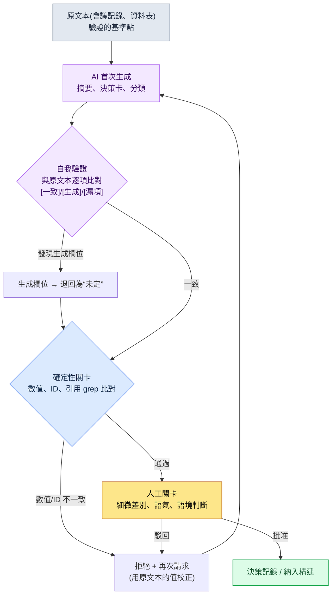

# 22.2 自信地說謊的同事 —— 用驗證關卡攔住幻覺

> 主要讀者:用 AI 大量產出文件、資料、決策記錄的遊戲策劃(中等規模(10\~50 人)團隊)
> 面向單人/業餘讀者的精簡版:§22.2.7「獨自一人的話,做到這些就夠」

那天,我讓 AI 把 17 份會議記錄彙總成決策卡。輸出很整潔。決策 ID、引用的會議日期、乃至一行依據,格式都完美無缺。其中一張卡片上寫著“2026-04-18 戰鬥 TF 會議確定冷卻時間策略”。問題在於,那天根本沒有開過戰鬥 TF 會議。AI 把其他會議的議題和日期混在一起,編造出一張看似可信的卡片,而正因為格式完美,它險些就這樣被寫入了團隊的決策記錄。

這就是幻覺(hallucination)。LLM 越是不瞭解,反而答得越自信。用人來打比方,就像會議上一位同事斬釘截鐵地說“哦那件事就是這麼定的”,可事後一查,根本沒有過這樣的決定。這句話一旦流入資料表、客服回覆、atom(最小知識單元)資產,就會釀成事故。本章討論的不是如何封住這位同事的嘴——那是不可能的——而是如何建立**在放行他的話之前必經的驗證關卡(verification gate,即由人或檢查器把關驗證的環節,類似質量門禁 quality gate)**。幻覺的一般論述在別的書裡已有很多,本章只聚焦於*用 AI 工作流攔住它的那個環節*。

---

## 22.2.1 幻覺降不到 0 —— 所以要設“關卡”

沒有哪條提示詞能把幻覺降到 0。更大的模型、更好的提示詞能降低頻率,但不會歸零。所以運營的出發點不該是“消除幻覺”,而應是“在幻覺觸及決策與資料之前設一道攔住它的關卡”。

關卡的核心原理只有一條:**凡是 LLM 可能編造的東西(引用、數值、ID),都在 LLM 之外的地方來驗證。**驗證的來源不外乎三種:程式碼(確定性)、原始文件(grep)、或人的眼睛。再問 LLM 一句“幫我確認對不對”也可以算關卡的一環,但那只是輔助,不是最終裁決者。

這裡先釐清遊戲策劃最常搞混的一點:幻覺易發的領域和不易發的領域,是有明顯區別的。

| 任務 | 幻覺風險 | 原因 | 關卡 |
|---|---|---|---|
| 數值計算(獎勵、機率) | 極高 | LLM 靠估算做算術 | 計算交給程式碼,禁止讓 LLM 做 |
| 引用(會議、決策 ID) | 高 | 會把不存在的出處編得像模像樣 | 與原始文本 grep 比對 |
| 分類(標籤、類別) | 中等 | 會弄混標籤 | 可做確定性比對 |
| 摘要、推理 | 中等 | 會多加或漏掉條目 | 自我驗證 + 人工關卡 |
| 創作(風味文本) | 低 | 沒有標準答案,“幻覺”概念本就模糊 | 語氣評審關卡 |

第一行是最簡單的處方:**數值別交給 LLM。**就像把乘法交給計算器一樣,把它交給確定性工具。第二行(引用)才是本章的脊樑。在會議記錄彙總、決策卡這類*原文本存在、而 LLM 去轉述它*的任務裡,幻覺最危險,也最容易被抓住——因為有原文本可供比對。

---

## 22.2.2 [實操記錄] 用自我驗證抓出會議記錄彙總裡的幻覺

只抽象地寫“要驗證”,根本看不出到底做什麼、怎麼做。本節完整地走一遍——從輸入到再次請求——彙總一份會議記錄、再抓出這份彙總裡幻覺的整個迴圈(這類完整保留下來的真實操作過程記錄,本書稱為“實操記錄”,worked transcript)。下面的提示詞可以直接複製使用,輸出則是對一次真實會話的還原。

### 第 1 步 —— 輸入:把原始會議記錄原樣丟進去

首先要有待彙總的原文本。它就是驗證的基準點。如果沒有原文本、任由 LLM 憑“記憶”來彙總,就沒有東西可供比對了。

```markdown
# 會議記錄 —— 2026-04-15 戰鬥平衡評審

出席:李旼洙、成員 A、成員 B
議題:
1. 群體技能冷卻時間 —— 有意見認為當前的 8 秒太短。考慮上調至 12 秒。
   結論:暫定為 12 秒,下個版本檢視遙測資料後再最終確定。
2. Boss 階段轉換 HP —— 擬從 50% 下調至 30%。
   結論:擱置。與美術演出排期衝突,下週再議。
3. 新增異常狀態“冰凍”的持續時間 —— 已討論但數值未定。
```

### 第 2 步 —— 首次彙總提示詞

```
將附上的會議記錄彙總成決策卡。

規則:
1) 每個議題彙總為 1 張卡片。格式:[議題 | 結論 | 狀態(確定/暫定/擱置) | 依據]
2) 禁止生成會議記錄中沒有的資訊。不得推測數值、日期、出席者。
3) 未得出結論的議題,狀態置為“未定”,不得擅自編造結論。

輸出格式:僅表格。禁止解說。
```

### 第 3 步 —— Claude 的首次輸出(還原,節選)

```
| 議題             | 結論              | 狀態 | 依據                       |
|------------------|-------------------|------|----------------------------|
| 群體技能冷卻時間  | 8 秒 → 12 秒      | 暫定 | 檢視遙測資料後再確定         |
| Boss 階段轉換     | 50% → 30% 擱置    | 擱置 | 與美術演出排期衝突           |
| 冰凍持續時間      | 定為 3 秒         | 確定 | 套用標準異常狀態持續時間基準   |
```

看第三張卡片。原文本里只寫了“冰凍持續時間已討論但數值未定”。可輸出卻寫成了**“定為 3 秒 / 確定 / 套用標準基準”**。這三項全都是會議記錄裡沒有的資訊。是 LLM 用“異常狀態一般大概持續幾秒吧”這類常識把空白填上了。因為格式完美,光看是發現不了的。

### 第 4 步 —— 再次請求自我驗證(關卡的核心)

這裡不直接接受輸出,而是**強制它逐行與原文本比對、做自我驗證**。這正是本章的關鍵一招。

```
將剛才生成的 3 張決策卡,與附上的原始會議記錄逐項比對。

對每張卡片的所有欄位(結論、狀態、依據、數值):
- 是原文本中直接寫明的內容嗎? → [一致]
- 是原文本中沒有、而你新增的內容嗎? → 標為[生成],並註明沒有出處
- 有原文本中存在、卻在卡片裡漏掉的條目嗎? → 報告為[漏項]

凡在原文本中無依據的[生成]欄位,一律退回為“未定”。
```

### 第 5 步 —— Claude 的自我驗證輸出(還原,原樣呈現)

```
比對結果:

卡片 1(群體技能冷卻時間)
- 結論“8 秒→12 秒”:[一致] 議題 1“上調至 12 秒”
- 狀態“暫定”:[一致] “暫定”
- 依據“檢視遙測資料後再確定”:[一致]

卡片 2(Boss 階段轉換)
- 結論“50%→30% 擱置”:[一致]
- 狀態“擱置”:[一致] “擱置。下週再議”
- 依據“與美術演出排期衝突”:[一致]
- [漏項] 原文本中“下週再議”的條件在卡片裡漏掉了。需補入依據。

卡片 3(冰凍持續時間)
- 結論“定為 3 秒”:[生成] —— 原文本為“數值未定”。3 秒是我自己新增的值。
- 狀態“確定”:[生成] —— 原文本並未得出結論。
- 依據“套用標準異常狀態持續時間基準”:[生成] —— 原文本中沒有提及這樣的基準。
  → 依據規則,將卡片 3 退回如下:
  | 冰凍持續時間 | (數值未定) | 未定 | 會議上已討論但無結論 |
```

這段輸出是本章最有價值的部分。AI 把自己的輸出與原文本比對,**自白“3 秒是我自己新增的值”**,並依規則把卡片 3 退回為“未定”。與此同時,它還抓出了卡片 2 裡連人都漏看的漏項(“下週再議”的條件)。幻覺(多加了不存在的)與漏項(漏掉了存在的)是一枚硬幣的兩面,同一次比對就能把兩者都抓住。

需要注意的地方也很明確:這套自我驗證**並非萬能。**如果 LLM 讀錯了原文本,也可能自信地給出錯誤的比對結果。所以自我驗證只是關卡的*第一道*,原文本較短時,還要由人用 grep 再兜一層底。像卡片 3 那樣明顯的生成,自我驗證幾乎都能抓到;但細微的意譯、語氣上的失真,終究要由人工關卡來把最後一關。

---

## 22.2.3 驗證關卡 —— 一張流程圖

把上面的迴圈一般化,AI 輸出在觸及決策與資料之前所要經過的關卡如下。需要人動手的地方只有兩處:把乾淨的原文本放進去的最前端,以及做出自動關卡抓不到的判斷的最末端。



關卡之所以是三重,是因為每一道抓的東西不同。自我驗證由 LLM 自己比對、抓*有沒有多加不存在的內容*;確定性關卡用程式碼抓*數值、ID 與原文本是否逐字一致*;人工關卡抓*內容雖對、語境卻錯位*的情況。只開其中一道,另外兩道原本把守的位置就會漏出事故。在 §22.2.2 中,卡片 3 的“3 秒”在第一道(自我驗證)被抓,卡片 2 的漏項也在第一道被抓;而假如自我驗證把“12 秒”誤讀成“21 秒”,就會在第二道(grep)被攔下。

---

## 22.2.4 關卡即便失敗也不阻斷流程 —— hook 的安全設計

把驗證關卡放進自動化流水線時,新手最常釀成一種事故:**讓關卡本身一崩潰,整個作業就停擺。**一旦 grep 因編碼錯誤而掛掉,或清單檔案損壞,本想幫忙驗證的程式碼,反而把使用者的作業整個堵死。於是團隊不出一兩週就會說“把那個驗證關了吧”。

這裡原樣引用本書實際運營中的 JIT atom 注入鉤子(hook,`inject_memory.py`)處理這一問題的方式。這個 hook 會在使用者每次敲下提示詞時介入、注入相關記憶,可以說是一道*常開的關卡*。它的設計原則註釋裡明確寫著一行。

```python
設計原則:
- 始終 exit 0(即便失敗也不得妨礙使用者流程)
- 未匹配則返回空響應(正常)
```

而且這條原則在整段程式碼裡都被一致地貫徹。哪怕 stdin 解析失敗、哪怕清單 JSON 損壞、哪怕 atom 正文讀取失敗——全都落到 `emit_empty()`,並 `exit 0`。

```python
def emit_empty() -> None:
    sys.exit(0)

def main() -> None:
    try:
        ...
        payload = json.loads(raw)
    except Exception:
        emit_empty()        # 輸入損壞也靜默通過
        return
    ...
    try:
        manifest = json.loads(MANIFEST_PATH.read_text(encoding="utf-8"))
    except Exception:
        emit_empty()        # 清單損壞也不阻斷作業
        return

if __name__ == "__main__":
    try:
        main()
    except Exception:
        emit_empty()        # 任何異常的最後一張網
```

設計的核心在於**把關卡的失敗與內容的失敗分離**開來。hook 注入記憶失敗,在使用者看來只是“一次沒掛上記憶的普通會話”,並不是作業被堵死的事故。驗證關卡也該如此。grep 關卡若因編碼問題跑不起來,不是把那張卡片*放行*,而是標註“自動驗證失敗——轉人工關卡”,移交給人工這一道。不能因為關卡掛了就自動批准未經驗證的輸出,同時也不能因為關卡掛了就讓整條流水線停擺。同時滿足這兩點的安全預設值,就是“靜默移交給人”。`inject_memory.py` 裡的 `except: emit_empty()` 正是這一模式的最小實現。

---

## 22.2.5 如何誠實地對待幻覺率

很想在本章塞進一張“把幻覺率從 89% 降到 3%”之類的表。可這種數字若不交代測量方法,只會折損全書的可信度。本書遵循以下三條原則。

第一,**只把可測量的東西用數字說。**要承諾一個幻覺率,就得定義分母和分子。分母是“經評審的決策卡數”,分子是“在原文本比對中被抓出至少 1 處[生成]/[漏項]的卡片數”。沒有這個定義,“幻覺率 5%”就是空話。筆者在引入初期評審會議記錄彙總時,實際清點用的正是這套方法;而那批樣本很小,不是精確的總體引數,而是一個*方向值*。

第二,**模型之間的比較只談方向。**“大模型比小模型幻覺更少”這個方向,能夠被穩定地觀察到。但“Opus 3%、開源 7B 20%”這類絕對數值會隨任務、提示詞、領域而大幅波動,所以本書不主張絕對值。只取方向(模型越大幻覺越少,但與成本相互牴觸)。

第三,**公開標準照原樣引用。**本章幾乎沒有可供編造的標準數值,但像 temperature 這樣的設定值,是模型 API 文件裡的公開事實。驗證、分析類任務把 temperature 調低(更接近確定性),創作類任務則調高——這不是推測,而是 API 行為的定義。

所以本章真正承諾的可測量指標有三個——[生成]檢出數(自我驗證抓到的幻覺數)、grep 關卡拒絕數(數值、ID 不一致數)、人工關卡駁回數。這三者每個季度都能靠日誌清點,在會議上就能不靠“感覺”、而用數字說話。

---

## 22.2.6 常見的失敗

| 模式 | 為何失敗 | 處方 |
|---|---|---|
| 只看格式就接受 AI 彙總 | 幻覺在格式完美時最難被發現 | 與原文本比對的自我驗證(§22.2.2 第 4 步) |
| 不放原文本、憑 LLM 記憶彙總 | 沒有可比對的基準點,無法驗證 | 先把原文本放進輸入 |
| 把數值計算交給 LLM | 算術靠估算,每次都不同 | 計算交給確定性工具(§22.2.1) |
| 驗證關卡一崩潰,整個作業停擺 | 團隊會把關卡關掉 | exit 0 + 轉交人工這一道(§22.2.4) |
| 關卡掛掉就自動批准未驗證輸出 | 幻覺原樣通過 | 關卡失敗 = 標註“未驗證” |
| 把自我驗證當作最終裁決 | LLM 誤讀原文本時,連誤判也很自信 | 短原文本要並行人工 grep |

---

> **遊戲之外的應用。**“自信地說謊的同事”——把不存在的會議日期或決定以完美格式編造出來的 AI——不只在遊戲決策卡里危險,在一切文件彙總中同樣危險。幻覺在格式完美時最難被發現,所以在有原文本的任務(會議記錄彙總、合同摘錄、報告整理)中,關鍵是不要直接接受輸出,而要強制它做自我驗證:“逐項與原文本比對,凡你新增的內容一律標為[生成]”。舉例來說,讓法務助理彙總一份合同後,再讓它把金額、日期、條款編號與原文本逐字比對,AI 就會自白“這個違約金數值是我自己新增的值”,並把空白退回為“未定”。數值計算乾脆別交給 AI,而交給計算器、公式;自動驗證工具則要設計成即便失敗也不阻斷作業,而是轉為“未驗證——待人工確認”。

## 22.2.7 動手試試 —— 今天就能做的一步

> **獨自一人的話,做到這些就夠**:不需要程式碼,也不需要 hook。把你手頭的一份短文件(會議便籤、更新公告、一頁策劃)交給 AI 彙總,然後把 §22.2.2 第 4 步的自我驗證提示詞原樣粘進去。只要“逐項與原文本比對,凡你新增的內容一律標為[生成]”這一行,AI 就會開始主動申報自己的幻覺。哪怕只拿到一次[生成]自白,你也會切身體會到:為什麼不能對 AI 彙總照單全收。

如果是團隊,就從下面這一步開始。把自我驗證環節作為*基礎提示詞*,固定進 AI 生成的決策卡與彙總裡(§22.2.2)。接著,只挑出數值、決策 ID、日期這類必須與原文本逐字一致的欄位,用程式碼寫出 grep 比對。這時那段驗證程式碼務必像 `inject_memory.py` 一樣,設計成**即便失敗也不阻斷作業**(exit 0 + 標註“未驗證”)(§22.2.4)。哪怕只有自我驗證和 grep 這兩道,也能先擋住“格式完美的幻覺滲入決策記錄”這個最常見的事故。

---

### 本章要點
- 幻覺降不到 0,所以要在觸及決策之前用驗證關卡攔住。
- 與原文本逐項比對,AI 就會主動申報自己的幻覺。
- 驗證程式碼要設計成即便失敗也不阻斷流程(exit 0)。

### 下一章預告
- 22.3 AI 成本管理 —— 用真實日誌運營各模型的 token、快取與 cap
