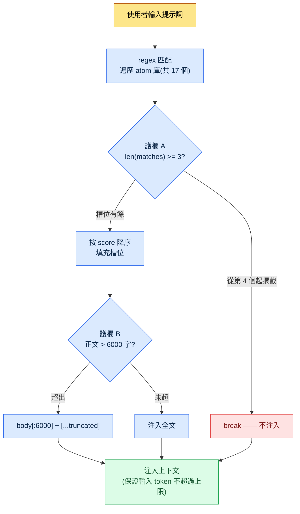

# 22.3 AI 成本管理 —— 用程式碼守住 token 預算

> 主要讀者:在團隊中引入 AI 工具併為成本負責的策劃主管(中等規模(10\~50 人)團隊)
> 面向單人/業餘讀者的精簡版:§22.3.9「單人只需做到這些」

如果一章講成本卻舉出虛假的成本,這本身就是自相矛盾。所以本章不會去做一張"我們團隊每月省了多少"的漂亮表格。取而代之,只用兩類數字。一類是任何人都能核實的**公開 token 單價**(各模型每 1M token 的費用),另一類是筆者親自運營的 hook 程式碼中**寫死的常量**(`max_atom_body = 6000`、`max_matches = 3`)。兩者都不是編造,而是引用來的。

AI 成本可怕,不在於金額大,而在於**看不見**。引入的頭一個月呼叫少,賬單也小。可一旦上下文變長、呼叫變頻繁,某個季度的賬單就會突然多出一個數量級。先把本章的結論擺出來 —— 成本不是靠"省著點用"的決心,而是靠**在每次呼叫中強制削減 token 的程式碼**來控制。擋住它的不是人的意志,而是 wrapper 與 truncate。

---

## 22.3.1 LLM 成本實質上只有'輸入 token'這一項

成本項有輸入、輸出、快取命中、快取寫入四類,但在實務中主導賬單的是**輸入 token**。原因很簡單。在遊戲策劃中使用 AI 的幾乎所有工作,都是"塞進長上下文、拿回簡短回答"的形態。把 L0 願景文件、atom 庫、相鄰城市的正文、資料表摘錄全部塞進去,輸入就是數萬 token,而輸出只是一張表,不過幾百 token。

因此,成本控制的第一要務不是"減少輸出",而是**"在哪裡削減輸入 token"**。這一句話貫穿本章其餘部分。

先把各模型的公開單價釘死。下面是 Anthropic 公開的每 1M(100 萬)token 費用,是**照原樣引用本書寫作時那一代(Opus·Sonnet·Haiku 當時最新等級)公開單價的快照**(引自官方公開單價 —— 會隨模型代際·時點變動,套用前務必核對當前價目表)。正如附錄 K 所歸納的原則,這裡不變的**不是單價的絕對值,而是三個等級之間的單價比例**。因此,下表不是用來看"今天的賬單",而是用來讀懂"等級越往下調,單價就成數量級下降"這一結構。

| 模型 | 輸入 1M token | 輸出 1M token | 備註 |
|---|---|---|---|
| Claude Opus | $15 | $75 | 頂級推理(公開單價) |
| Claude Sonnet | $3 | $15 | 中檔 —— 輸入價為 Opus 的 1/5 |
| Claude Haiku | $0.80 | $4 | 輕量 —— 輸入價約為 Opus 的 1/19 |
| 快取命中(read) | 約為標準輸入價的 1/10 | — | 複用已快取輸入時(公開快取政策) |

關鍵在最後兩行。**同樣的工作用 Haiku 而非 Opus 來跑,輸入 token 單價約為 1/19**;**把同樣的上下文放進快取,那部分的輸入價約為 1/10**。成本節省的兩大支柱由此而來 —— 模型合理選型與快取。兩者都不是"少用",而是"用更低的單價處理同一件事"的結構。

> 節省來自單價差異,而非意志。把 Opus 降到 Haiku 約省 19 倍,放進快取約省 10 倍,都是自動發生的。

---

## 22.3.2 最大的輸入成本是'每次呼叫都注入的上下文'

有一種成本比單項工作的單價更悄無聲息地累積 —— **每次呼叫都自動附加的上下文**。筆者的個人 PC 上執行著一個 hook,每當使用者敲入提示詞,它就自動把相關記憶(atom)塞進去(UserPromptSubmit hook,`inject_memory.py`)。這是個便利功能,但同時也是**成本洩漏的頭號嫌疑**。每次輸入都有很長的 atom 正文進入上下文,若放任不管,輸入 token 會隨每次呼叫膨脹。

所以這個 hook 裡固定了三重削減成本的安全裝置。它們不是抽象論,而是實際程式碼中的常量。

```python
# inject_memory.py —— UserPromptSubmit hook(實際運營程式碼,節選)
# 設計原則(docstring 原文):
#   - 始終 exit 0(即便失敗也不打斷使用者流程)
#   - 按 score 降序注入最多 3 個 atom
#   - atom 正文超過 6000 字時 truncate

# (1) 從 manifest config 中讀取預算常量
max_matches = cfg.get("max_matches", 3)      # 單次呼叫最多 atom 數
max_body    = cfg.get("max_atom_body", 6000) # 每個 atom 的正文上限(字)

# (2) 按 score 降序排序 —— 讓昂貴的槽位按價值順序填充
atoms_sorted = sorted(atoms, key=lambda a: a.get("score", 0), reverse=True)

matches = []
for atom in atoms_sorted:
    if len(matches) >= max_matches:   # (護欄 A)在最多 3 個處截斷
        break
    if re.search(atom["regex"], prompt, re.IGNORECASE):
        matches.append(atom)

# (3) 注入正文時在 6000 字處截斷
for atom in matches:
    body = atom_path.read_text(encoding="utf-8")
    if len(body) > max_body:          # (護欄 B) truncate
        body = body[:max_body] + "\n\n[...truncated]\n"
```

三重成本護欄都在這裡。

- **護欄 A —— 數量上限(`max_matches = 3`)**:即便與輸入匹配的 atom 有 10 個,最多也只附加 3 個。整座 17 個 atom 的庫在每次呼叫都被塞進去的事故,由程式碼來阻止。
- **護欄 B —— 長度上限(`max_atom_body = 6000`)**:即便 atom 正文有 12,000 字,也在 6,000 字處截斷。一條很長的覆盤 atom 把呼叫成本翻倍這種事,在結構上就不可能發生。
- **護欄 C —— score 優先順序**:3 個槽位按 score 從高到低填充。也就是說,"價值低的 atom"佔不到昂貴的輸入 token。

這三個常量就是**每次呼叫輸入 token 的上限**。粗略估算,一個 6,000 字的 atom 在韓語中大約是數千 token 的規模(準確的 token 數會因分詞器·語言而異,所以應把它當作"存在上限"這一結構來讀,而不是絕對值)。3 個 × 6,000 字就是單次呼叫的注入預算,超出部分由程式碼切掉。人不需要用眼睛去發現"atom 附加得太多了"。

---

## 22.3.3 [實操記錄(worked transcript)] 一行 6000 字 truncate 如何遏制成本

光說"truncate 能遏制成本"是空洞的。實際制定這個常量時,我和 AI 把一個完整迴圈從頭跑到尾。下面是對那次會話的忠實再現。輸入提示詞可以原樣複製使用,輸出則是對真實會話的重現。

### 第 1 步 —— 輸入:原樣丟擲問題情境

剛啟用 hook 不久,`_injection_log.txt` 裡就留下了一次呼叫中 atom 正文被整段注入的記錄。當很長的 atom(覆盤·健康上下文等)每次呼叫都以完整大小進入,越是高頻使用的工作,輸入 token 累積得越多。我問了 AI 該在哪裡截斷。

### 第 2 步 —— 提示詞:強制限定與格式

```
我有一個每次呼叫都會把 atom 自動注入到上下文的 hook(inject_memory.py)。
我想設定一個能遏制輸入 token 成本的 truncate 上限,請你提議每個 atom 的正文字數
上限,以及單次呼叫注入的 atom 數量上限。太短會切掉核心,
太長又會漏 token,所以也請一併點明其中的權衡;對沒把握的地方
單獨標記出來,交給人來定。(意圖:上限值以 config 外部化為前提)以表格給出:
專案 | 建議值 | 依據 | 把握度。
```

請注意,提示詞有一半都是"強制限定與格式"。在成本相關的問題上放任 AI 自由發揮,就會得到"視情況而定"這類不負責任的回答。**強制給出具體數值、要求明示權衡、並留一個'沒把握就上報'的出口**,才是這條提示詞的核心。

### 第 3 步 —— Claude 的輸出(重現,節選)

```
| 專案            | 建議值  | 依據                                          | 把握度 |
|----------------|--------|-----------------------------------------------|-------|
| max_atom_body  | 6000 字 | 韓語單個 atom 的"核心+依據"大多在 4~6 千字     | 中    |
|                |        | 以內。6000 字時正文開頭(要旨·規則)基本        |       |
|                |        | 保留,只切掉結尾(示例羅列)。                 |       |
| max_matches    | 3      | 單條輸入同時強匹配的主題通常為                 | 高    |
|                |        | 1~3 個。4 個以上是 regex 過寬的訊號            |       |
| 外部化位置      | _jit_manifest.json > config | 無需重新部署程式碼即可執行中調整 | 高    |
| truncate 標記   | 附加 [...truncated] 結尾    | 讓模型·人知道此處被截斷      | 中    |
| 沒把握之處      | 6000 是否為精確值           | 各分詞器的 token 換算因語言·  | ★低   |
|                | (字→token 換算不確定)      | 模型而異,字為單位只是近似值   |       |
```

輸出裡最有價值的不是表格,而是**最底下那行 ★**。AI 主動上報:"不確定 6000 是否為精確的最優值,字→token 的換算並不確定"。好的提示詞能讓 AI 說出'我不知道'。

### 第 4 步 —— 驗證與否決(人的位置)

我沒有原樣接受這份輸出。AI 把 6000 字提為"核心得以保留的界線",但實際在 6000 字處截斷到底切掉了什麼,必須親自核實。我挑出最長的 atom(健康上下文、覆盤累積本),用眼睛看了 6000 字那個位置。

核實結果發現一處問題。**6000 字那個位置從正文中間切斷了一個表格行**,像 `| 維生素D | 1000IU |` 這樣的行在一半處被截斷。語義雖保留了,但被切斷的表格行以殘缺的 Markdown 形式進入模型,總歸讓人不放心。於是我再次發起請求。

### 第 5 步 —— 再次請求

```
在 6000 字處截斷時,有時會把 Markdown 表格的某一行從中間切斷。是否值得加一個
把截斷位置吸附到前一個換行邊界的修正?實現不能比 truncate 本身還複雜,
所以請權衡成本與收益,連做不做都一併下結論。
```

AI 這樣回答 —— "吸附到行邊界用 `body[:max_body].rsplit('\n', 1)[0]` 一行即可實現,但**truncate 的目的是 token 上限,而非表格完整性**,所以一行殘缺的表格行對成本·行為的影響微乎其微。目前僅憑 `[...truncated]` 標記,模型就能識別'此處被截斷',因此**建議不做**行邊界吸附。若一定要做,一行修正就夠了。"

這個回答是對的。若在成本控制程式碼裡連表格完整性也貪求,護欄程式碼本身就會臃腫。**當前運營程式碼保持 `body[:max_body] + "[...truncated]"` 的簡單截斷。**這是一個由人驗證 AI 的首個提議(6000 字)、再由 AI 壓下過度修正的貪念,一次往返就閉合的迴圈。

---

## 22.3.4 成本護欄的結構 —— 一覽

上面會話中定下的常量,在實際呼叫中如何削減輸入 token,把整個流程用圖示記錄下來。



這張圖的要點是:**無論使用者輸入什麼,每次呼叫注入的 token 都有一個天花板**。天花板是 `3 × 6000 字`(+標記),超過部分程式碼一律切掉。成本不依賴使用者的自制力。護欄 A·B 在每次呼叫中機械地運作。

同樣的理念在工具層面也重複出現。筆者所在公司的系統有一條政策:把暴露在全域性槽位的 wrapper 技能**精確固定為 12 個**(atom `skill_listing_budget_wrapper_only_policy`)。會話開始時,若全域性 `*` wrapper 的數量不是 12,清理指令碼就會自動執行。名義上是"整理槽位",本質卻是**保護會話開始時的 token 預算** —— 把技能列表載入上下文的成本鎖定在 12 個的量。atom 注入 3 個上限與技能暴露 12 個上限,是同一思想的不同應用。

---

## 22.3.5 按任務分配模型 —— 80% 交給更低的單價

如果說護欄遏制的是每次呼叫的 token,那麼模型選擇決定的就是這些 token 的單價。在 §22.3.1 的表中,輸入價 Opus:Sonnet:Haiku ≈ 19:4:1。所以,把所有工作都用 Opus 來跑,等於連分類·替換這類簡單工作也要付 19 倍的單價。

按工作的複雜度分配單價。

| 工作型別 | 推薦模型 | 理由 |
|---|---|---|
| 與驗證·法務直接相關、決策分析 | Opus | 出錯就闖大禍的工作 —— 不省這個單價 |
| 報告·摘要·自然語言加工 | Sonnet | 需要質量,但不必用到頂級推理 |
| 分類·打標籤·關鍵詞提取 | Haiku | 簡單模式 —— 用 Opus 約 1/19 的單價就夠 |
| 簡單對映·替換 | Haiku 或確定性方法 | 很多情況下連 LLM 都不需要 |

以經驗來看,大部分工作用 Sonnet·Haiku 就夠。**昂貴的模型只用於"出錯代價高的工作"。**不過有一個陷阱 —— 降到過於便宜的模型會導致幻覺增多,驗證成本會把節省下來的金額吃掉(與上一章 §22.2 幻覺·安全性直接相關)。所以模型分配不是"一律便宜",而是"出錯也無妨的工作用便宜的,出錯代價高的工作用貴的"這樣的分流。

最後一行"簡單對映·替換 → 確定性方法"往往才是最大的節省。像名稱替換、按既定規則對映這類答案唯一確定的工作,根本不需要呼叫 LLM。**把呼叫本身歸零,才是最便宜的呼叫**。

---

## 22.3.6 快取 —— 相同的輸入按 1/10 單價

即便遏制了每次呼叫的 token(護欄)、壓低了單價(模型分配),**只要每次呼叫都重新發送相同的上下文**,成本就會洩漏。像 L0 願景文件、atom 庫、領域風格指南這類幾乎不變的長輸入,就做快取。快取命中時,那部分輸入按標準價的約 1/10 計費(§22.3.1 表)。

```python
# 不變的上下文用 cache_control 標記 —— 快取命中時約為 1/10 單價
messages = [
    {"role": "system", "content": SYSTEM_PROMPT},
    {"role": "user", "content": [
        {"type": "text", "text": L0_VISION,    "cache_control": {"type": "ephemeral"}},
        {"type": "text", "text": ATOM_LIBRARY, "cache_control": {"type": "ephemeral"}},
        {"type": "text", "text": SPECIFIC_TASK},  # 只有每次變化的部分放在快取之外
    ]},
]
```

關鍵在於**把會變的部分和不變的部分分開**。快取要求輸入的前段相同才會命中,所以把固定上下文(L0·atom)放在前面,把每次都變的工作指令放在後面。

把什麼放進快取,按變更頻率來劃分。

| 上下文 | 快取 | 理由 |
|---|---|---|
| L0 願景(幾乎不變) | 適合 | 只以數天\~數週為單位變動 |
| atom 庫 | 適合 | 僅在覆盤時更新 |
| 領域風格指南 | 適合 | 以季度為單位變更 |
| 近期會議記錄 | 不適合 | 每天變化 —— 快取命中率低 |
| 使用者輸入 | 不適合 | 每次呼叫各不相同 |

快取 TTL 短則以數分鐘為單位,所以在**連續叩擊相同上下文的工作**(如量產 30 座城市那樣把同一個 L0 複用 30 次)中效果最大。對一次性問題,只會花掉快取寫入成本卻命不中,反而可能吃虧 —— 所以只對"頻繁·連續使用相同上下文的工作"有選擇地應用。

---

## 22.3.7 誠實對待數字的方法

成本這一章,是最容易讓人想放一張"把每月 $5,000 降到 $1,000"這類表格的地方。那種絕對節省額會因團隊規模·工作量而千差萬別,一旦編造,成本章就成了對成本撒謊的自相矛盾。本章只用了三類數字。

第一,**公開單價原樣引用。**§22.3.1 的 Opus $15 / Sonnet $3 / Haiku $0.80(輸入 1M token)、快取命中約 1/10,都是 Anthropic 公開的費用。輸入價比例 19:4:1、快取約省 10 倍,是從這些公開單價用算術得出的值 —— 不是估測,而是計算。

第二,**程式碼常量引用程式碼。**`max_atom_body = 6000`、`max_matches = 3` 是實際記錄在 `inject_memory.py` 和 `_jit_manifest.json` 中的值。不是比喻,而是真實檔案。

第三,**不知道的就寫不知道。**"6000 字是多少 token"會因分詞器·語言·模型而異,字為單位只是近似值。§22.3.3 中 AI 也把這一點用 ★ 上報了。所以本章任何地方都沒有"6000 字 = N 個 token = 省 $X"這類換算表。取代絕對節省額,只用**方向與比例**(19 倍·10 倍)來講。

> 本章的成本數字,要麼是公開單價(Anthropic 價目表),要麼是寫死在程式碼裡的常量(`inject_memory.py`·`_jit_manifest.json`),要麼是明確標註"不知道"的近似值。

---

## 22.3.8 常見失敗

| 模式 | 為何失敗 | 對策 |
|---|---|---|
| 所有工作都用頂級模型 | 連分類·替換都付約 19 倍單價 | 按任務分配模型(§22.3.5) |
| 每次呼叫重發相同上下文 | 白白丟掉快取命中的 1/10 | 快取固定上下文(§22.3.6) |
| 自動注入沒有上限 | 整座 atom 庫每次呼叫都被注入 | 數量·長度護欄(§22.3.2) |
| 靠"省著點用"的決心管理成本 | 人的自制力擋不住暴漲 | 把上限固定在程式碼裡 |
| 連確定性方法能辦的事也呼叫 LLM | 最便宜的呼叫是'不呼叫' | 把對映·替換分離到程式碼裡 |

第四條是核心。把成本控制交給人的意志,一定會洩漏。意志在忙碌時最先崩塌,而成本在忙碌時增長得最快。所以控制必須是 `max_matches = 3` 這樣的**程式碼常量**。

---

> **遊戲之外的應用。**AI 成本可怕,不在於金額大,而在於看不見,這一點無論對遊戲團隊還是市場團隊都一樣。成本不是靠"省著點用"的決心,而是靠結構來管住。第一,按工作難度分配模型單價 —— 連簡單的分類·打標籤都用頂級模型來跑,就等於為同一件事付好幾倍單價;而簡單對映·替換乾脆不呼叫(用規則·公式處理)才是最便宜的呼叫。第二,對幾乎不變的長輸入(公司介紹·政策文件·術語表)做快取,減少重發成本。舉例來說,給客戶諮詢分類這件事用輕量模型就夠,只把複雜的合同審查交給更高檔的模型,就能在保住質量的同時把單價分流。如果有某處會自動附加很長的上下文,那麼事先定好"一次附加的數量·長度上限",就能從結構上防止某天賬單突然多出一個數量級的事故。

## 22.3.9 動手試試 —— 今天就能做的一步

> **單人只需做到這些**:沒有 hook、沒有 manifest 也可以。在你常用的 AI 工具裡,把下一件工作的模型下調一檔試試(原來用 Opus 做的摘要改用 Sonnet,原來用 Sonnet 做的分類改用 Haiku)。只要輸出質量足夠,那件工作就永久固定在更低的單價上。哪怕只在每件工作上問一次"這件事真的需要頂級模型嗎",節省的一半就出自這裡。

如果是團隊,就從下面這一步開始。找一個會自動注入上下文的地方(hook·系統提示詞·RAG),在那裡用程式碼放入 §22.3.2 的兩道護欄(注入數量上限 1 個、正文長度上限 1 個)。像 `inject_memory.py` 那樣把上限用 config 外部化,就能在運營途中無需重新部署程式碼、只調數字。兩行護欄就能從結構上防止"某天賬單多出一個數量級"的事故。

用 setup → prompt → verify 概括 —— **setup**:在自動注入點放入數量·長度上限常量,並抽到 config 裡。**prompt**:以 §22.3.3 的格式讓 AI 提議上限值,同時強制它給出權衡與把握度。**verify**:挑出最長的輸入,親自用眼睛確認在上限處切掉了什麼。

---

### 本章要點
- 輸入 token 佔成本的大部分 —— 控制的第一要務是"在哪裡削減輸入"。
- 節省不靠意志,而靠程式碼常量(`max_matches=3`·`6000 字 truncate`)。
- 善用單價差異 —— 模型分配約 19 倍,快取約 10 倍。

### 下一章預告
- 22.4 版權·許可與倫理 —— AI 工具使用中法務·共識層面的安全運營
