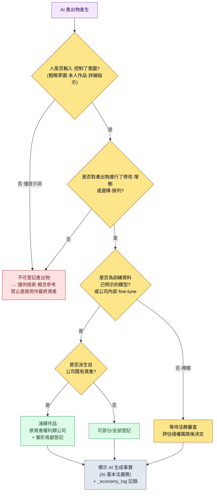

# 22.4 著作權與倫理 —— 用一套流程閉合產出物的權利、標示與共識

> 主要讀者:負責引入 AI 的遊戲總監與主管(中等規模(10\~50 人)團隊)
> 面向單人/業餘讀者的精簡版:§22.4.9「獨自一人的話,做到這些就夠了」

發售前兩個月,我們曾因一張概念美術師繪製的城市插畫而讓整場會議陷入停滯。有人問:"這是用 AI 生成的吧?那著作權歸我們,還是根本無法登記?"沒有人能回答。當場出現了三種意見:"是 AI 做的,所以不歸我們""是我們花錢跑出來的,所以歸我們""反正還沒有法律,直接用就是了"。三種都不對。而且這個問題並不只是一個法務議題。製作那張插畫的美術師其角色究竟是什麼、團隊對 AI 的使用達成了怎樣的共識,都在那一刻同時被牽扯了進來。

本章不會把著作權與倫理分開來講。因為在實務中,二者是同一個問題的一體兩面。"這份產出物的權利歸誰"(著作權)會直接歸結為"人在這份產出物中介入了多少"(倫理·角色)。韓國著作權委員會在 2025 年明確釘定的登記要件,恰恰就在這一點上。所以本章的脊柱是一份實操記錄(worked transcript,完整保留的真實操作過程記錄)—— 我們會實際判定一張 AI 概念美術圖能否進行著作權登記,並從輸入到決策一路追蹤這一判定如何延伸為團隊的角色共識。

> **作者實際運營備註**
> 本章引用的 `design_intent_vs_automation_boundary` atom 以及 `_economy_log`·`_roi_report.md`,是將作者在公司實際運營的治理資產做了匿名化處理後的產物。atom 名稱與日誌檔名原樣保留了實際運營中使用的名稱(僅為保護 IP 而替換了公司與專案的專有名詞)。實操記錄的輸出是對真實判定會話的重現。

---

## 22.4.1 權威來自公開指南,而非"感覺"

很多書只把 AI 著作權寫成"因為還沒有法律,所以模糊不清"。這隻對了一半。2025 年 6 月,文化體育觀光部與韓國著作權委員會發布了《生成式 AI 利用作品的著作權登記指南》,至少在韓國,能否登記的界線已經清晰。無須編造。

指南的核心可以濃縮為一句話:**著作權登記的要件是"人類的創作性貢獻"。** 由此分為兩類。

| 分類 | 定義 | 登記 |
|---|---|---|
| GAI 產出物 | 沒有人類創作性貢獻、由 AI 生成的結果物 | 不可 |
| GAI 利用作品 | 人類將 AI 作為工具製作的成果中,被認定具有創作性貢獻的部分 | 可 |

指南還給出了被認定為"利用作品"的三條路徑。① 將使用者自身的作品作為提示詞輸入,使其創作性體現在產出物中;② 對產出物進行修改·增刪的追加工作本身具有創作性;③ 對產出物進行選擇·排列·構成時具有創作性。判斷的兩條軸線是**"可控性"與"可預測性"**。創作者必須能夠明確決定自己想要表現的內容,並按照其意圖匯出結果物,才會被認定具有創作性。

這一處是決定性的。指南用法律語言所說的"可控性·可預測性",與本書自 §1.1 起反覆強調的**"策劃提供意圖"**(`planner_provides_intent_not_recommendation` atom)是同一回事。完全交給 AI 的產出物沒有可控性與可預測性,因而也沒有著作權;而由人輸入意圖、經人審校·重構的產出物,權利便隨之而來。著作權能否登記,與良好 AI 工作流的條件,處在同一條線上。

還有另一項公開標準。2026 年施行的《AI 基本法》對生成式 AI 產出物課以**確保透明性的義務(標示 AI 生成事實)**。登記(主張權利的一側)與標示(公開使用事實的一側)是彼此獨立的義務。無論是否產生權利,使用了 AI 這一事實本身都必須公開。這兩項公開標準,構成本章要交給 AI 的**規則手冊(rulebook)的首批輸入**。

---

## 22.4.2 [實操記錄] 判定一張 AI 概念美術圖能否登記

回到開頭那張插畫。我們不靠"感覺"來判斷,而是把 §22.4.1 的指南標準作為規則手冊輸入,讓 AI 先做一次分類。人只做最後的判定。下面的輸入提示詞可以直接複製使用,輸出則是對真實判定會話的重現。

### 第 1 步 —— 輸入:原樣丟擲產出物的生成歷史

判定的輸入不是插畫本身,而是記錄該插畫如何被製作出來的日誌。這些資訊已經存在於資產後設資料中,只需提取即可。

```yaml
# asset_concept_city021_v4.meta.yaml —— 判定物件產出物的生成歷史
asset_id: concept_city021_v4
asset_type: concept_illustration
created_by: 團隊成員 A(概念美術師)
generation_log:
  - step: 1
    actor: 團隊成員 A
    action: "將親手繪製的城市佈局粗略草圖作為輸入影像附上"
  - step: 2
    actor: AI (image_model)
    action: "以粗略草圖 + 提示詞生成 4 種變體"
    prompt: "stone observatory tower over sealed magic core, cold arid, scholar guild, muted palette"
  - step: 3
    actor: 團隊成員 A
    action: "從 4 種中選取 1 種,親手對鐘樓剪影·飽和度·構圖進行精修(約 40% 區域重做)"
  - step: 4
    actor: 團隊成員 A
    action: "親手設計背景的封印陣紋樣併合成"
ai_generated_disclosure: true   # 滿足 AI 基本法的標示義務
```

### 第 2 步 —— 提示詞:依指南標準分類,但強制給出依據

```
附上的 meta.yaml 是一張概念插畫的生成歷史。請依據韓國著作權委員會
《生成式 AI 利用作品的著作權登記指南》(2025)的標準,把它能否登記
分類為 可登記/部分登記/不可登記 三者之一。依據請用指南的兩條軸線(可控
性·可預測性)各給出一行,並在 generation_log 中用編號指出哪個 step 屬於
"創作性貢獻"。法律上無法斷定的,標為"需法務確認"交給人處理。
用表格呈現:分類 | 依據(可控) | 依據(預測) | 貢獻 step | 法務確認。
```

請注意,這段提示詞有一半是在做"強制依據"與"法務退路"。如果把法律判斷整個交給 AI,它會吐出貌似可信的斷言。給出分類標準(指南的三分法)、依據義務(兩條軸線)、指定貢獻 step,以及"無法斷定就交給法務"這一退路——這才是這段提示詞的核心。

### 第 3 步 —— Claude 的輸出(真實會話重現)

> ```
> | 分類     | 依據(可控性)                 | 依據(可預測性)              | 貢獻 step | 法務確認 |
> |---------|------------------------------|----------------------------|----------|---------|
> | 部分登記 | 粗略草圖(step1)與 40% 精修    | 從 4 種中選擇可預測,        | 1,3,4    | ★       |
> |         | (step3)直接控制表現意圖        | 但 AI 的 4 種變體本身不可預測 |          |         |
>
> 分析:
> - step1(直接輸入粗略草圖):對應指南 ①"以本人作品輸入體現創作性"。
> - step3(40% 精修):對應指南 ②"修改·增刪的追加工作"。貢獻最強。
> - step4(親手設計封印陣紋樣):合成獨立作品,明顯的人類創作。
> - step2(AI 的 4 種變體):無人類創作性貢獻的純 AI 產出物 → 這部分單獨不屬於登記物件。
>
> ★ 需法務確認:"40% 精修"是否達到"實質性改變",缺乏定量標準。
>   精修比例是否越過可登記的界線,建議由律師審查。
>   (AI 無法斷定該比例在法律上是否充分。)
> ```

輸出中最有價值的部分不是表格,而是最下面的**★ 法務確認**。AI 主動申報了自己的界限——"我無法斷定 40% 精修在法律上是否充分"——並把它交給了人。好的提示詞會讓 AI 能夠說出"我不知道"。這不是自動拒絕型,而是自動申報型。

### 第 4 步 —— 驗證與否決(人的位置)

不能原樣接受這份輸出。總監用規則手冊再核查一遍。AI 把 step4(封印陣紋樣)分類為"獨立作品",但重新檢視生成歷史後發現,那個紋樣其實派生自 §6.2 中 `city_hunting_generator` 生成的城市 lore。也就是說,step4 未必是純粹的原創,而可能是**疊加在公司內部資產之上的二次加工**。由於是公司資產,權利歸屬很明確;但 AI 所用的"獨立作品"這一表述若原樣寫進登記申請書,會招致誤解。

於是再次發出請求。

```
step4 的封印陣紋樣是從公司內部城市 lore 資產派生的二次加工(並非獨立的全新原創)。
請據此重新分類 step4 的貢獻性質。
並用一行提議:登記申請時應如何註明"基於既有內部資產"。
```

這一次往返就閉合了。AI 把 step4 從"獨立作品"改答為"公司內部 lore 資產的演繹作品——原資產權利歸公司所有,變形貢獻為登記物件",該判定隨後交由法務審查。結論最終定為**部分登記 + 標示 AI 生成事實**。若全部手工進行,法務就得逐個資產追問生成歷史;而有了 AI 初稿 + 規則手冊審校 + 一次往返,法務只需把時間花在標了 ★ 的邊界案例上。

這一整圈就是本章的 Show 標準。"AI 著作權很模糊"這句話,在你尚未依指南標準把一份產出物的生成歷史徹底分類一遍之前,都是空洞的。

---

## 22.4.3 決策樹 —— 這份產出物,能用嗎

為了不必每次都從頭做上面那種判斷,我們把指南標準記錄成一張流程圖。每進來一個資產,順著這棵樹往下走即可。所有分叉點都出自 §22.4.1 的公開標準。



關鍵在於:這棵樹的終點(J)在所有路徑上都相同。無論能否登記、是公司資產還是演繹作品,**"使用了 AI"的事實標示與生成歷史日誌都無一例外地保留。** 標示是與權利無關的獨立義務,而日誌是出事時追溯責任的唯一依據。開頭那場會議之所以停滯,正是因為沒有這份日誌,沒有人能重現每個 step 由誰做了什麼。

紅色路徑(C,不可登記)也並非直接丟棄。"僅輸入提示詞的純 AI 產出物"在探索·概念階段作為參考完全可用,只是不把它作為最終資產放進遊戲而已。把 AI 輸出原樣推上線,是事後著作權事故最大的誘因。

---

## 22.4.4 把著作權規則手冊變成運營日誌 —— `design_intent_vs_automation_boundary`

樹(§22.4.3)是判斷的流程,而讓這條流程每次都畫在同一條線上的,是一個 atom。在公司的治理資產中,`design_intent_vs_automation_boundary` 就是本章整體的脊柱。

這個 atom 的一句話定義是:"設計意圖由人負責,自動化由工具負責——每個資產都明示這條邊界。"這不是抽象的口號。這個 atom 已註冊進 JIT hook(`inject_memory.py`),因此當提示詞中出現"著作權""AI 生成""資產登記"之類關鍵詞時,它會被自動注入會話。hook 的設計原則直接支撐了這個 atom 的運營。

```python
# inject_memory.py —— 始終 exit 0,即使失敗也不阻斷使用者流程(節選)
def main() -> None:
    ...
    # 按 score 降序排序後匹配 —— 最多隻注入 3 個 atom
    atoms_sorted = sorted(atoms, key=lambda a: a.get("score", 0), reverse=True)
    matches = []
    for atom in atoms_sorted:
        if len(matches) >= max_matches:   # 防止過度注入
            break
        try:
            if re.search(atom["regex"], prompt, re.IGNORECASE):
                matches.append(atom)
        except re.error:
            continue
    if not matches:
        emit_empty()   # 無匹配則返回空響應(正常)
        return
```

這裡在治理上有兩處重要設計。第一,hook **始終 `exit 0`**(指令碼 docstring 中已註明)。即便在注入著作權規則時失敗,也絕不阻斷使用者的工作。一旦安全裝置把工作扣為人質,團隊會在一兩個季度內把這個裝置關掉。第二,**最多隻注入 3 個**。若每次會話都把所有治理規則一股腦塞進來,上下文會爆掉,誰也不會讀。只有 score 高的規則才會浮現。

這與 §6.2 中 lint 不自動廢棄違規、而只向作者關卡(gate)發出 alert 的哲學如出一轍。**可疑候選由機器挑出,但要棄要留由人決定。** 著作權上也一樣。atom 會自動彈出"這個資產的著作權確認了嗎",但能否登記的最終判定由人和法務來做。

---

## 22.4.5 權利之後是人 —— 用共識閉合角色演進

開頭那張插畫的判定並未止於著作權。因為它意味著,製作該資產的團隊成員 A,其工作已從"繪製"轉移到了"從 AI 的 4 種中做選擇、並精修其中 40%"。在著作權要求"人類創作性貢獻"的那一刻,做出這份貢獻的人,其角色定義也隨之改變。二者是同一事件的一體兩面。

這裡最常見的事故,是把這種變化當作單方通知來處理。即便工具再好,半年後無人使用,多半不是工具不好,而是當初沒有達成共識。角色從量產轉向選擇·審校·重構,這才是引入 AI 的本質;若不把這一點明示出來並以培訓加以支撐,團隊成員就會把它理解為"我的位置要沒了"。

| 職群 | AI 之前 | AI 之後(角色演進) | 著作權上的意義 |
|---|---|---|---|
| 概念美術師 | 全部親手作畫 | 輸入意圖·選擇·精修 | 精修即"創作性貢獻" |
| 數值策劃 | 手動模擬 | 解讀模擬·做決策 | 決策日誌即責任依據 |
| 策劃 | 全部親筆撰寫規格 | 提供意圖·審校 | 輸入意圖即可控性 |

這張表想說的一句話是:**讓著作權登記成為可能的"人的貢獻",正是角色演進之後人所做的事。** 一旦指南所要求的可控·可預測消失,著作權會消失,人的位置也會消失。所以,角色演進必須被解釋為"把權利與責任留在人手中"的變化,而非"搶走崗位"的變化,才能達成共識。

共識不是無休止的開會,而是用流程閉合:引入提案(總監)→ 全團隊事先共享(目的·受影響角色·衡量指標·風險)→ 共識會議(自由發言·收集顧慮)→ 與必要成員一對一 → 釋出調整方案 → 達成共識或擱置。並不是必須得到所有成員的同意才能啟動,而是通過流程聽取並調整顧慮之後,由總監拍板。沒有流程,共識每次都要從 0 重新開始,而這種成本會拖慢引入。

---

## 22.4.6 成本·ROI 也是倫理的一部分 —— 用 `_roi_report.md` 誠實以對

如果把倫理只收窄到崗位·共識,就會漏掉一條軸線。誠實地衡量並公開 AI 運營的成本與效果,本身就是治理。若不做衡量,只是嘴上說"用 AI 提升了效率",團隊成員會懷疑這句話是在為削減自己的崗位找藉口。

公司的治理基礎設施中,為此配備了兩項真實資產:atom 系統的 `_economy_log/`(token·時間經濟性日誌)與 `_roi_report.md`(ROI 報告)。前者由機器記錄每次會話的 token·時間,後者則按週期彙總供人閱讀。關鍵在於:這份日誌追蹤的不是"AI 替代了多少人",而是"把人的時間釋放到了哪裡"。

本書的數值原則有三條。第一,公開標準原樣引用(指南的登記要件、AI 基本法的標示義務)。第二,作者的推測就寫明是推測。第三,只把可衡量的東西作為 KPI 來承諾。在著作權·倫理領域,可衡量的不是結果指標,而是流程指標。

| 衡量項 | 衡量方法 | 能否承諾 |
|---|---|---|
| AI 生成事實標示的缺失數 | 對資產後設資料 `ai_generated_disclosure` 做 grep | 可衡量(目標 0) |
| 生成歷史日誌的持有率 | 含 `generation_log` 的資產比例 | 可衡量 |
| 未經法務審查即上線的 AI 資產 | 上線構建 vs 法務通過清單比對 | 可衡量(目標 0) |
| "因為 AI,營收上升了" | —— | 不可衡量,不作承諾 |

最後一行是誠實性的核心。AI 引入對營收的影響無法作為單一變數分離出來,因此不對因果下斷言。但"AI 生成資產中,通過了標示·日誌·法務審查的比例",可以用 `_economy_log` 和資產後設資料實際數出來。治理承諾的不是結果,而是流程的完整性。

---

## 22.4.7 使用者生成內容(UGC)與資料保護

把資產權利·角色·成本理順之後,還剩一個領域:使用者用 AI 製作的內容上傳到遊戲的通道。公司製作的資產用內部流程閉合,而 UGC 則是控制之外的產出物源源湧入。

這裡同樣直接套用 §22.4.3 樹的終點(標示·日誌)。使用者上傳的時裝·公會徽章要求標示 AI 生成,並以自動審校 + 人工關卡的組合來進行稽核(moderation)。只運營其中一條軸線,下個季度的事故就會累積。另外,使用者資料不能隨意傳送給 LLM。個人資訊·支付資訊禁止傳輸,行為日誌則以匿名化後再傳輸為原則(遵守 GDPR·韓國國內個人資訊保護法)。

管轄並不止於韓國一處。一旦接納海外使用者,該使用者所屬地區的資料法規也會一併適用。對 EU 使用者,GDPR 對個人資訊的跨境轉移·同意·刪除權設有專門要求;其他服務所在國家也各有其個人資訊·資料本地化規定。因此,表格第三行的"個人資訊·支付資訊禁止傳輸給 LLM"在任何管轄區都是最安全的預設值;而把行為日誌傳送給外部模型時,匿名化·假名化處理的強度則應按服務所在地區另行核查。不過,本節只是流程設計的指引,並非法律諮詢。一旦涉及全球發行·跨境轉移,務必另行接受相應管轄區的法務審查。

| UGC/資料 | 政策 | 依據 |
|---|---|---|
| 使用者上傳的時裝·徽章 | AI 標示 + 自動審校 + 人工關卡 | AI 基本法標示義務 |
| 角色暱稱·發帖 | 通用條款 + 使用者責任 | —— |
| 個人資訊·支付資訊 | 禁止傳輸給 LLM | 個人資訊保護法 |
| 遊戲行為日誌 | 匿名化後傳輸 | 匿名化·假名化處理 |

UGC 越多,稽核負擔越重。自動審校先做一次篩除,只有邊界案例才交由人來看。這正是把 §22.4.4 的 atom 哲學(機器挑候選、人來決定)搬到了使用者內容層面。

---

## 22.4.8 常見的失敗

| 模式 | 為何失敗 | 處方 |
|---|---|---|
| 把 AI 產出物原樣用作最終資產 | 人類貢獻為 0 → 不可登記 + 侵權風險 | §22.4.3 樹,僅限探索·概念 |
| 沒有生成歷史日誌 | 出事時無法按 step 重現責任 | 強制資產後設資料帶 `generation_log` |
| 未標示 AI 生成事實 | 違反 AI 基本法透明性義務 | 樹終點的標示步驟無一例外 |
| 把角色演進當作單方通知處理 | 工具引入半年後被棄用 | 共識流程(§22.4.5) |
| 只喊"用 AI 提升了效率" | 團隊成員疑其威脅崗位 | 用 `_economy_log`·`_roi_report` 公開衡量 |
| 無批判地使用訓練資料模糊的模型 | 遺漏侵權風險評估 | 優先選用已明示模型·公司內部 fine-tune(樹的 E 分叉) |

第五條最常被忽略。正如開頭那張插畫的判定所示,讓著作權登記成為可能的"人的貢獻",正是這個人的新角色。若只衡量效率,而不衡量這個人的時間被釋放到了哪裡,治理會在 KPI 上成功,人卻會離開。

---

> **遊戲之外的應用。** "這個是用 AI 做的,著作權歸我們嗎"這類問題讓會議停擺的情況,不只出現在遊戲插畫上,凡是用 AI 製作的報告·廣告文案·提案書,處處都會發生。韓國著作權委員會 2025 年指南釘定的標準很簡單——能否登記取決於"人的創作性貢獻(可控性·可預測性)",而僅輸入提示詞的純 AI 產出物沒有權利。因此,無論哪個部門,給每一份 AI 產出物留下一張用 step 記錄"哪一步是人、哪一步是 AI"的生成歷史,就會成為一張安全網。舉例來說,營銷人員拿到 AI 文案初稿後親手修改·重構,只要把這份貢獻記錄下來,就能成為主張權利的依據;而無論最終能否登記,"使用了 AI"這一事實標示(2026 年 AI 基本法義務)都無一例外地保留。權利之後是人,所以做出這份貢獻的員工其角色變化,不能靠單方通知,而必須用共識來閉合。

## 22.4.9 動手試試 —— 今天就能邁出的一步

> **獨自一人的話,做到這些就夠了**:沒有法務團隊也沒關係。挑一件你自己用 AI 製作的影像或文本產出物,按 §22.4.2 的格式親手寫一份 `generation_log`(用 step 區分哪一步是人、哪一步是 AI)。然後順著 §22.4.3 的樹,自己判定一遍"這個能登記嗎",你就會親身體會到韓國著作權委員會指南里"可控·可預測"標準究竟是怎樣一組判斷。哪怕是個人·業餘專案,也最好留下一行 AI 生成事實標示(`ai_generated: true`)。

如果是團隊,就從下面這一步開始。給所有 AI 資產後設資料強制加上 `generation_log` 與 `ai_generated_disclosure` 兩個槽位(用一行程式碼的 grep 就能抓出缺失),並把 §22.4.3 的決策樹貼成一頁維基。登記要件的判定自動化或 `_economy_log` 的運營,都是後話。哪怕只有生成歷史日誌和一頁決策樹,也足以避免像開頭那樣會議陷入停滯。

---

## 22.4.10 第 22 部分小結

第 22 部分講的是治理的四條軸線。

| 章 | 核心 |
|---|---|
| 22.1 | 提示詞工程 —— 強制格式·依據·退路 |
| 22.2 | 幻覺·安全性 —— 審校關卡·申報型驗證 |
| 22.3 | 成本管理 —— 快取·cap·`_economy_log` |
| 22.4 | 著作權·倫理 —— 登記要件·標示·角色共識 |

貫穿這四章的一句話是:**治理不是阻擋 AI 的裝置,而是把人的意圖與責任留在產出物中的流程。** `design_intent_vs_automation_boundary` atom 就是這套流程的名字。著作權登記所要求的"可控·可預測"、倫理所要求的"角色·共識"、成本所要求的"誠實衡量",都指向同一處——無論 AI 做什麼,決策與責任的最後一席都屬於人。

---

### 本章要點
- 著作權登記要件是"人的創作性貢獻"(韓國著作權委員會 2025 指南)。
- 無論能否登記,AI 生成標示·生成歷史日誌都無一例外地保留。
- 著作權所要求的"人的貢獻",正是角色演進之後人的工作。

### 下一章預告
- 第 23 部分擴充套件 —— 以單人·業餘開發的方式,把同一套工作流精簡套用

---


---

> **來源**
> - 韓國著作權委員會·文化體育觀光部,《生成式 AI 利用作品的著作權登記指南》(2025)—— https://www.copyright.or.kr/information-materials/publication/research-report/view.do?brdctsno=54253
> - 韓國著作權委員會·文化體育觀光部,《生成式 AI 著作權指南》(2023.12)—— https://www.copyright.or.kr/information-materials/publication/research-report/view.do?brdctsno=52591
> - 《人工智慧基本法》(AI 基本法)生成式 AI 產出物的透明性·標示義務(2026 施行)—— https://www.shinkim.com/kor/media/newsletter/3142
