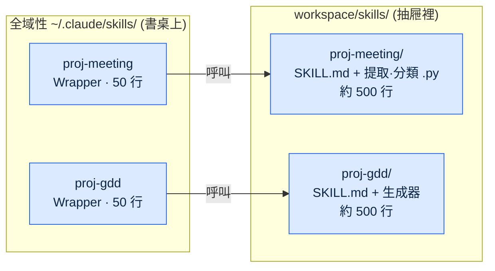
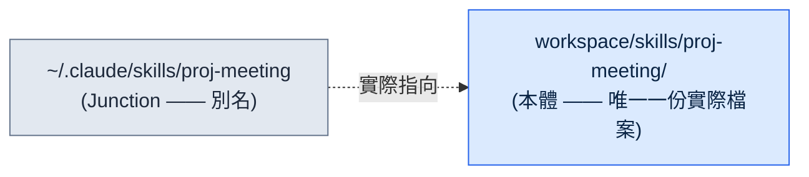
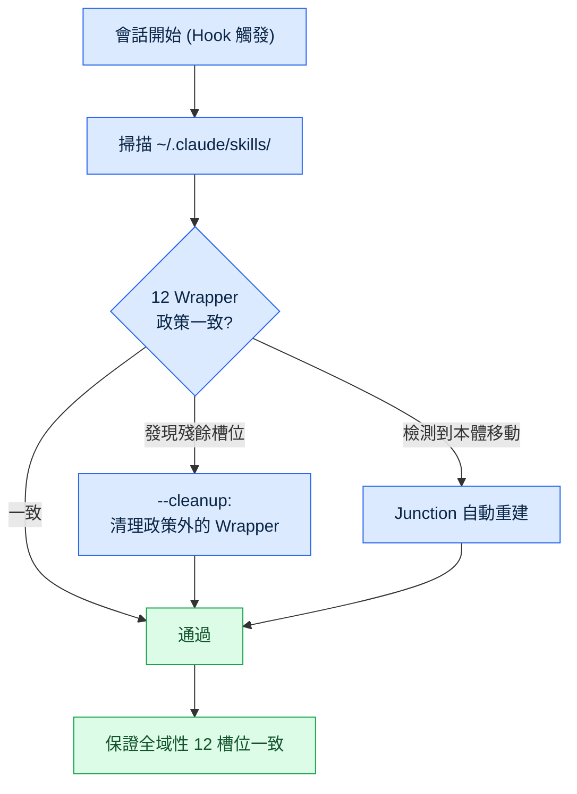
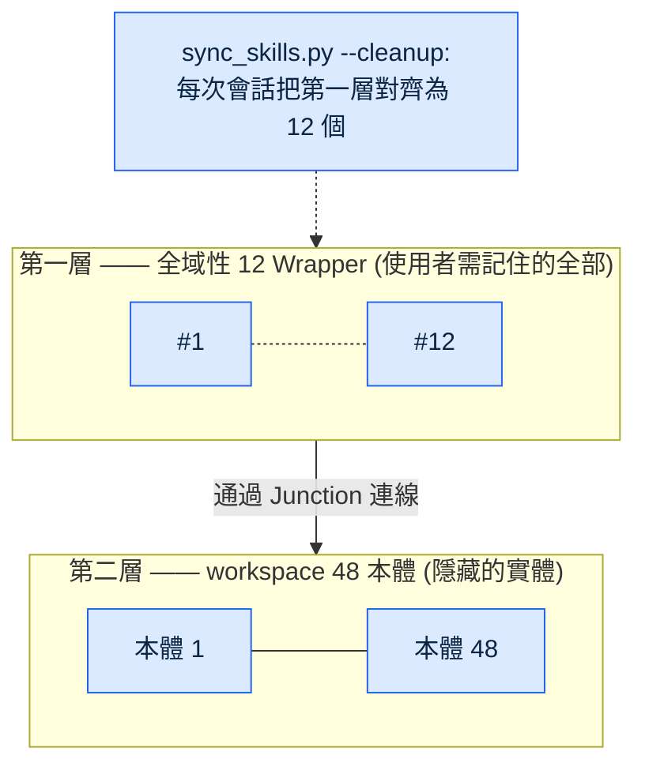
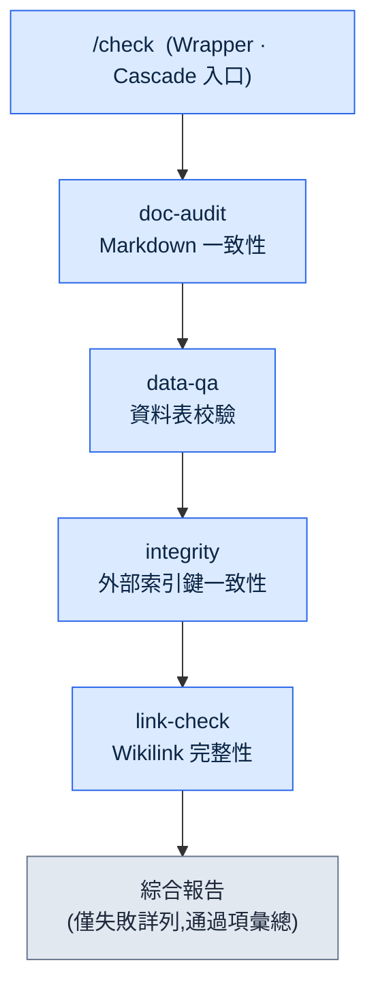
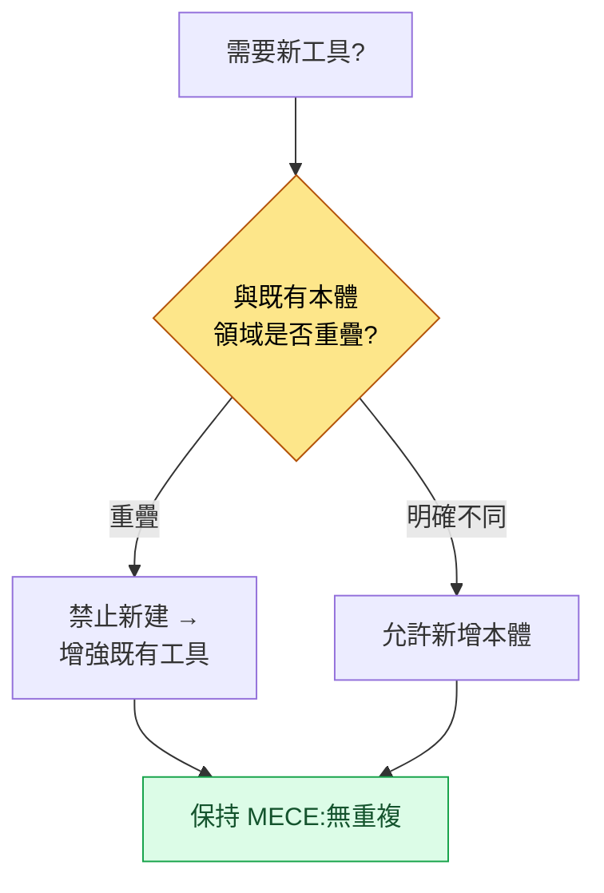

# Part 23 · 第1章. Wrapper·Cascade·Junction 模式

> 不要增加工具,而要製造工具的工具。這是關於一種兩層結構——在全域性 12 個入口背後隱藏 48 個本體——以及無需人工干預維持其一致性的自動化的故事。

---

某個跑月度覆盤的傍晚,數著斜槓命令列表時,我的手停住了。有 40 個。明明半年前是從七八個起步的,可就這麼做一個會議記錄工具、加一個數據校驗工具、再添一個 GDD(Game Design Document,詳細規格文件)生成器,一週增加一兩個,不知不覺就成了 40 個。而且其中將近一半,在過去一個月裡一次都沒被呼叫過。

問題在於,不用的工具並不是安靜地待在那兒而已。每次開始會話,40 個斜槓命令的規格說明都會全部被載入。它蠶食了 token 預算,名稱相近的命令(`skill-design`·`skill-design-new`·`skill-design-template`)容易混淆,而真正需要某個工具時,又要花時間才能想起它。工具不再是幫著幹活,反倒是管理工具本身成了一項工作。

本章講的,就是把這 40 個收斂為全域性 12 個、卻又一個本體都沒捨棄的過程。核心是三種模式:製造輕量入口的 **Wrapper**、把多個工具收進一個入口的 **Cascade**、把入口與本體在物理上連起來的 **Junction**。還有替人守住這三者一致性的 `sync_skills.py`。

---

## 23.1.1 從覆盤中發現的量化訊號

工具太多這種印象人人都會有。但僅憑印象,無法決定該削減什麼。讓決策成為可能的,是月覆盤對工具經濟性的測量。

本專案把覆盤作為自我改進機制來運營。日覆盤累積成周覆盤,周覆盤匯聚成月覆盤的過程中,月覆盤會從 SVN 提交日誌中反推"過去一個月各工具用了多少次"。用於這項測量的分數就是 `skill_audit_score`。它通過提交歷史追蹤每個斜槓命令在實際工作產出中出現了多少,從而給出使用頻率。

那個月測量得到的分佈如下。(使用量佔比是基於 SVN 提交日誌的實測,不是絕對呼叫次數,而是各工具的出現佔比。)

<svg viewBox="0 0 640 220" xmlns="http://www.w3.org/2000/svg" font-family="sans-serif" font-size="13">
  <rect x="0" y="0" width="640" height="220" fill="#fafafa" stroke="#ddd"/>
  <text x="20" y="30" font-weight="bold" font-size="15">斜槓命令 40 個 —— 使用頻率分佈</text>

  <!-- TOP 12 bar -->
  <rect x="20" y="55" width="500" height="40" fill="#2c7be5"/>
  <text x="30" y="80" fill="#fff" font-weight="bold">TOP 12 命令</text>
  <text x="530" y="80" fill="#2c7be5" font-weight="bold">使用量的 92%</text>

  <!-- middle group -->
  <rect x="20" y="105" width="55" height="40" fill="#a6c8f0"/>
  <text x="85" y="130" fill="#555">中等使用 10 個 —— 約 8%</text>

  <!-- tail group -->
  <rect x="20" y="155" width="18" height="40" fill="#e0e0e0" stroke="#bbb"/>
  <text x="85" y="180" fill="#999">每月不足 1 次 18 個(佔總數 45%) —— 幾乎 0%</text>

  <text x="20" y="212" fill="#888" font-size="11">來源:月覆盤 skill_audit_score,SVN 提交日誌反推 / 佔比為出現比重實測</text>
</svg>

排名前 12 的命令佔了總使用量的 92%,而每月一次都用不到的命令有 18 個,佔總數的 45%。答案已經定了一半:只把常用的 12 個暴露在全域性,其餘的整理歸置。

問題在於,"整理"並不等於"刪除"。那 28 個不常用的命令,每季度也總有一兩次會用到——寫半年報告時,建立新的資料模式時,或執行某項特定校驗時。那時如果工具不在,工作就會當場停下。所以真正的問題是:**如何只讓 12 個可見,同時把 28 個保留下來。**

書桌的比喻貫穿整章。沒有人會把 40 支筆全攤在桌面上天天用。只把常用的 12 支放在桌上,其餘收進抽屜。抽屜裡,同類的筆再歸到一個筆筒裡。Wrapper 是放在桌面上的輕量入口,Junction 是連線抽屜與桌面的通道,Cascade 是捆在一個筆筒裡的一束筆。

---

## 23.1.2 Wrapper 模式 —— 輕量入口,重量本體

Wrapper 是斜槓命令的一層薄殼。全域性只放入口,實際邏輯放在 workspace 的本體裡。全域性目錄裡住著 50 行的說明,本體裡住著 500 行的實現。



這一分離帶來五點好處。會話開始時全域性只加載 50 行,節省 token;本體即使每天修改也不影響全域性槽位;本體可以放在 SVN、Git 或任何地方;本體放在團隊共享資料夾、只把 Wrapper 放在個人全域性,便於共享;統一 Wrapper 的格式後,使用者體驗保持一致。

Wrapper 的標準格式如下。所有 Wrapper 都共享這一骨架。

```markdown
---
name: proj-meeting
description: 會議記錄分析·決策提取 (本體: workspace/skills/proj-meeting/)
---

# /proj-meeting —— Wrapper

本體位置:workspace/skills/proj-meeting/SKILL.md

## 工作方式
該 Wrapper 呼叫本體的入口指令碼。詳細邏輯定義在本體中。
本體變更時,只需更新該 Wrapper 的 description(建議自動同步)。
```

關鍵在於只有一行 description 和一個本體指標。邏輯一旦進來,Wrapper 就會變重,與本體的同步也開始失效。因此以規則強制 Wrapper 保持在 100 行以內。

本專案的全域性斜槓命令槽位固定為 12 個。常用工具必須全部裝進這 12 個,選擇標準由月覆盤來把關:每月使用 5 次以上、領域均衡(單一領域的工具不超過 6 個)、入口一致(命名規則統一)。一旦超過 12 個,就廢棄使用最少的那一個,或將其併入其他命令。

12 這個數字並非絕對。關鍵在於"數字被固定下來"這件事本身。小規模(\~10 人)團隊也許 10 個合適,領域繁多的團隊也許 15 個更合適。只有存在既定上限,認知負擔才會停留在一定水平。

---

## 23.1.3 Junction 模式 —— 本體與入口的物理連線

如果說 Wrapper 是"全域性只放輕量入口"這條規則,那麼 Junction 就是在作業系統層面實現這條規則的手段。Junction 是目錄符號連結,也就是 OS 提供的別名。



使用者檢視全域性位置時,看上去本體就在那裡。但實際檔案只有一份,存在於本體位置。全域性那一側,只是指向那裡的一塊路標而已。

這一結構帶來的好處很清楚。修改本體會立即反映到全域性(沒有複製步驟)。檔案只有一份,節省磁碟;全域性只有 Junction,因而不會有 Git 衝突(本體在 SVN/Git 中另行管理)。即使移動本體,只要重新掛上 Junction,對使用者來說也毫無變化。

不同 OS 的掛載方式不同。Windows 用 `mklink /J <link> <target>` 建立目錄 junction,無需管理員許可權。Linux 和 macOS 用 `ln -s <target> <link>`,WSL 直接沿用 Linux 命令。這一平臺差異由後文將講到的 `sync_skills.py` 自動處理,運維者無需親自記住各 OS 的命令。

如果不用 Junction 而用複製來運營,一旦本體與全域性副本產生分叉,就會出同步事故。比如在本體裡修好了 bug,而全域性副本還是舊版本,於是執行的還是舊行為。Junction 從根本上消除了這種事故的可能。路標不可能有兩塊,實體永遠只有一個。

---

## 23.1.4 sync_skills.py —— 替人維持一致性的工具

手動管理 Wrapper 和 Junction,最終還是會回到 40 個。人會拖延整理、忘記政策、製造例外。因此把一致性維持自動化,那個工具就是 `sync_skills.py`。

每次會話開始時,Hook 都會觸發這個指令碼。指令碼所做的事是以下流程。



核心功能有三個。第一,掃描全域性目錄,檢查是否符合 12 Wrapper 政策。第二,用 `--cleanup` 標誌清理不在政策內的殘餘 Wrapper。若有人臨時新增的工具殘留在槽位裡,會在下次會話開始時被清理,槽位不會再次暴增。第三,若本體位置發生變化,就自動重新掛上 Junction:檢測 OS,Windows 選用 `mklink /J`,其他則選 `ln -s` 呼叫。
重要的是,這三項功能都設計為 **冪等(idempotent)**。它是每次會話開始時自動執行的工具,因此在同一狀態下反覆執行多次,結果都應與執行一次相同。已經符合政策的 Wrapper 不去動,已經正確掛好的 Junction 不再重掛,沒有需要清理的殘餘槽位就什麼都不刪。若不冪等,每次會話都會疊加同樣的整理,從而出現重建好端端的 Junction、或誤動本體的事故——對於每次會話都無人值守執行的工具而言,這會直接演變為同步事故。因此 `sync_skills.py` 把"只動改變過的,沒改變就不動"作為不變式。

`--cleanup` 的效果直接關係到 token 預算的保護。把每次會話載入到全域性的斜槓命令說明固定為 12 個,即使本體增加到 48 個,會話開始的成本也保持恆定。因為不靠人工管理,政策也不會走樣。

這種自動一致性,就是兩層結構的安全銷。Wrapper 與 Junction 搭出結構,`sync_skills.py` 讓這一結構隨時間推移仍得以維持。

---

## 23.1.5 兩層結構 —— 全域性 12 wrapper → workspace 48 本體

三種模式與自動一致性結合起來,就完成了下面的兩層結構。上層是使用者需要記住的 12 個入口,下層是 48 個本體。



使用者只需記住全域性的 12 個。哪怕它們背後藏著 48 個本體,認知負擔也停留在 12 個。Wrapper 讓入口保持輕量,Junction 把入口與本體連起來,`sync_skills.py` 在每次會話中守住這 12 個的一致性。

按比例看,入口與本體是 1:4(12 比 48)。工具再增加,使用者要記的也不會增加。本體增加到 60 個、80 個,第一層仍然是 12 個。這就是"不要增加工具,而要製造工具的工具"這句話的實際實現。增加的是第二層(本體),而使用者面對的第一層(入口)始終恆定。

---

## 23.1.6 Cascade 模式 —— 用一個入口串起的連鎖呼叫

如果說兩層結構是"把眾多工具收斂為少數入口"的模式,那麼 Cascade 就是"把經常一起用的工具打包進一次呼叫"的模式。一個斜槓命令依次呼叫多個下級工具,再把結果匯成一份綜合報告。

本專案最具代表性的 Cascade 是 `check`。它把每天早上檢查策劃資料完整性的四個工具整合成了一個。



過去每天早上要分別呼叫四個工具:文件檢查一次、資料檢查一次、外部索引鍵檢查一次、連結檢查一次。每個工作週期要手動呼叫三四次。`check` 把這四個打包為一個命令,只需呼叫一次,四個階段就會依次執行,結果合併為一份。

Cascade 的設計有原則。每個階段都必須能夠單獨呼叫(必須能只調用 `data-qa`)。失敗時中斷還是繼續,由各階段分別設定。校驗類作業即使某一階段失敗,也繼續執行其餘階段以看到全域性;變更類作業則一旦某一階段失敗便立即停止。結果會累積併成為下一階段的輸入,而綜合報告在每個 Cascade 中都採用相同的格式。

`check` 的實際定義如下。(這是把 4 種校驗整合為一個的配置。)

```yaml
cascade:
  - step: doc-audit
    purpose: Markdown 一致性 (YAML frontmatter·連結·atom 引用)
    fail_action: continue
  - step: data-qa
    purpose: Excel 資料表校驗 (模式·取值範圍·必填列)
    fail_action: continue
  - step: integrity
    purpose: 外部索引鍵一致性 (表間引用)
    fail_action: continue
  - step: link-check
    purpose: Wikilink·外部連結完整性
    fail_action: continue

report:
  format: markdown
  include_pass: false   # 通過項僅彙總,失敗項詳列
  group_by: severity
```

四個階段都掛著 `fail_action: continue`,是因為這是一個校驗類 Cascade。即使一項檢查失敗,也把其餘三項跑完,一次性看到當天的全部缺陷清單。報告把通過項摺疊為彙總、只展開失敗項,把注意力集中在早上真正該看的東西上。

Cascade 也有陷阱。階段無限增加,複雜度就會爆炸。因此像 12 槽位政策一樣,Cascade 也設階段上限。大致超過五到七個階段,就拆成兩個,或把一部分分離為獨立的 Cascade。

---

## 23.1.7 工具治理 —— MECE Wrapper 政策

兩層結構和 Cascade 一旦穩定下來,增加本體就變得容易——因為不必動全域性槽位,只要往 workspace 裡新增本體即可。可正是在這裡出現了新的陷阱:新增一旦變容易,相似的工具就會重複堆積。

因此在增加本體時強制一條政策:**MECE Wrapper 政策**。要新增新工具時,分兩條路判斷。若與既有工具領域重疊,就不新建,而是增強既有工具;只有領域明確不同時才新建。意思是讓本體清單做到無重疊(Mutually Exclusive)、無遺漏(Collectively Exhaustive)。



這一判斷由覆盤來支撐。`skill_audit_score` 從 SVN 日誌中測量各工具的使用頻率,於是能捕捉到"這個工具其實和那個工具做的幾乎是同一件事,而兩者都幾乎沒人用"這樣的訊號。那就把兩者合併,或把使用較少的一方從本體中撤下。治理中,整理與新增同樣重要。

沒有 MECE 政策,兩層結構帶來的"新增本體的自由"反而會變成毒藥。即便本體不蠶食第一層槽位,本體本身因重複而臃腫起來,又會讓人重新搞不清該用哪個本體。政策阻止這種臃腫。

---

## 23.1.8 覆盤為何引燃了這一切

到這裡,回到開頭看看。Wrapper 也好,Junction 也好,Cascade、MECE 政策也好,沒有一個是在書桌前預先設計出來的。它們全都是作為對覆盤中發現的問題的回答而誕生的。

當月覆盤的 `skill_audit_score` 用量化資料揭示出 40 個槽位與 92% 使用量的失衡時,"限制到 12 個"就此定下。那個決定之後,緊跟著"那 28 個又該如何保留"的問題,答案就是 Wrapper 與 Junction。下一次覆盤中出現了"每天早上分別呼叫四個相似的校驗工具太麻煩"的發現,答案就是 `check` Cascade。又一次覆盤中捕捉到"新增本體變容易了,重複就堆積起來"的訊號,答案就是 MECE 政策。

沒有覆盤,這些模式就不會誕生;就算做出來,也會淪為與真實問題無關的過度工程。先用測量發現問題,再引入模式——正是這個順序,讓工具真正被用起來。覆盤是自我改進的起點,這一 Part 21 的資訊,在工具層面就這樣被具體化了。

---

## 23.1.9 運營案例 —— 6 個月累計

把六個月的測量值按引入前後作比較。關注的不是絕對呼叫次數,而是運營負擔的變化。

| 專案 | 引入前 | 引入後 (Wrapper+Cascade+Junction) |
|---|---|---|
| 全域性槽位數量 | 40 個(暴增) | 12 個(政策強制) |
| 本體數量 | 分散·大量重複 | 48 個(MECE 整理) |
| 會話開始時全域性槽位佔比 | 大(載入 40 個說明) | 小(僅載入 12 個說明) |
| 本體修改後同步到全域性 | 需手動複製步驟 | 立即(Junction,無複製) |
| 相似校驗工具的呼叫 | 每次作業手動 3\~4 次 | 1 次(check Cascade) |

引入首月的測量值參差不齊。在 Wrapper 格式定型之前,同步事故出過兩三次;在 12 個政策被強制之前,槽位在 15 到 18 之間來回浮動。穩定是從第二個月開始的。自 `sync_skills.py --cleanup` 開始在每次會話中整理槽位之後,槽位暴增就再沒發生過。

表中"佔比"·"需要"·"立即"這類方向性表述是有意為之。因為每個環境的 token 成本與時間都不同,所以只寫了變化的方向。可以確定的是,第一層從 40 固定到了 12,而本體同步中手動複製這一步已經消失。

---

## 23.1.10 常見錯誤與規避方法

把前面各節點到的陷阱彙總到一處。這五點,全都指向同一個教訓:比起搭出結構,讓它隨時間推移仍能維持更難。

- **邏輯滲入 Wrapper。** 輕量入口一旦吸收本體的一部分,同步就會失效 → 以規則強制保持在 100 行以內(§23.1.2)。
- **用複製代替 Junction。** 本體與副本一旦分叉,舊版本就會執行舊行為 → Junction 不是可選項而是必需(§23.1.3)。
- **無限堆疊 Cascade 階段。** 超過五\~七個,複雜度就會爆炸 → 設定階段上限(§23.1.6)。
- **用手工管理 12 槽位。** 沒有強制裝置,就必定再次暴增 → `sync_skills.py --cleanup` 在每次會話中整理(§23.1.4)。
- **沒有覆盤就先引入模式。** 在測量之前搭結構,會留下沒人用的骨架 → 測量 → 發現 → 模式 的順序(§23.1.8)。

---

## 動手試試(setup → prompt → verify)

**setup.** 在 workspace 裡建一個本體目錄(例如 `workspace/skills/proj-meeting/`)。在裡面放 `SKILL.md` 和實際指令碼。全域性 `~/.claude/skills/` 裡只放 50 行的 Wrapper。

**prompt.** 向 Claude 提出以下請求。

```
掃描 ~/.claude/skills/ 中的斜槓命令列表。
把每個命令分類為 (a) 只有本體指標的輕量 Wrapper,
還是 (b) 含有邏輯的重量級命令,
對屬於 (b) 的命令,把本體分離到 workspace,
並給出只在全域性保留 50 行 Wrapper 的修改方案。
另外,輸出為指向本體的 Junction 按 OS 匹配掛載的命令
(Windows 用 mklink /J,其他用 ln -s)。
```

**verify.** 確認三點。第一,全域性目錄中的每一項是否都在 100 行以內。第二,開啟全域性項時,是否只看到一行本體位置和 description。第三,把本體改動一行後從全域性呼叫時,改動是否立即生效(只要 Junction 掛對了,就會無需複製而生效)。

## 單人精簡版

如果是既沒有團隊也沒有 SVN 的單人運營,就這樣精簡。不必設 workspace,一個個人 Git 倉庫就夠了。本體放在那個倉庫裡,全域性只放 Wrapper。即使沒有 `skill_audit_score` 這樣的測量工具,只要在月末把"這個月實際呼叫過的命令"親手記下來,失衡就會顯現。只把排名前五到七的留在全域性,其餘的下放到本體。Cascade 只需在經常一起呼叫的工具出現兩個以上時,把它們打包為一個命令即可。若嫌自動一致性指令碼麻煩,可以用"開始新會話時用眼睛把全域性目錄掃一遍"的習慣來替代。規模一小,習慣就替代自動化做著同樣的事。

---

### 本章要點
- 不要增加工具,而要製造工具的工具 —— 全域性 12 個入口,本體 48 個實體。
- Wrapper·Junction·sync_skills 無需人工就守住兩層一致性。
- 所有模式都從覆盤的量化測量中引燃 —— 先測量,再談結構。

### 下一章預告
- Part 23 · 第2章. Hermes Agent 引入記
