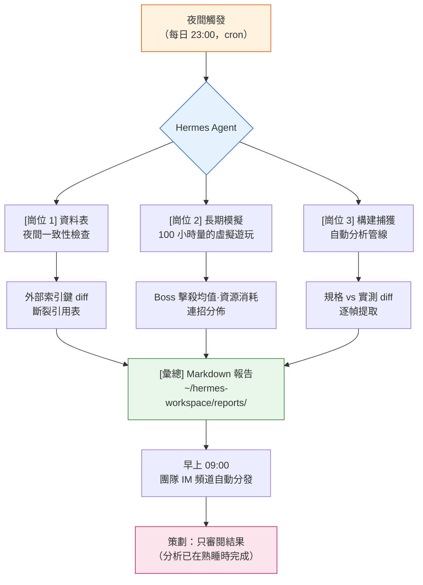

# Part 23 · 第2章 Hermes Agent 引入實錄

晚上 11 點 47 分。我儲存好最後一份資料表,合上了筆記型電腦。次日早上 9 點 10 分,衝咖啡時開啟公司內部的即時通訊工具,發現頻道頂部已經掛著一份報告。那是一份 Markdown——它以外部索引鍵為基準,對昨夜更新過的三張數值表做了交叉校驗,並用紅色標出了兩處斷裂的引用。不是我寫的。它是在我熟睡時生成的。

本章記錄的,是把製作那份報告的工具——Hermes Agent——裝到個人 PC 上,併疊加到 §23.1 講過的 Wrapper·Cascade·Junction 運營之上的整個過程。最初引入時,Hermes 還是基於 Linux 的,要在 Windows 上使用就得先經過 WSL2;到了 2026 年,原生 Windows 構建釋出,這道彎路就消失了。先把結論說在前面:智慧體(Agent)並沒有把 Claude Code 擠走,而是坐到了它旁邊。

---

## 23.2.1 坐在同一張桌前的兩個工具

到 §23.1 為止的運營,全部以 Claude Code 為中心。我輸入一句話,工具就響應一次,我審閱完這次響應,再輸入下一句。這種短週期對精細作業再好不過。如果是修改一個數值、每一步都需要確認的作業,那就該由人每次介入。

問題出在耗時長的作業上。"把過去一個月的 30 份會議記錄全部讀一遍,只把決策事項抽取成 atom 候選"這樣的請求,若放在對話流裡處理,需要 30 個來回。那 30 次裡,我沒法做別的事。對這類作業,輸入與輸出短促相連的工具,其長處反而成了短處。

智慧體填補的正是相反的位置。只要丟擲目標——"從 30 份會議記錄裡把決策事項挑成 atom 候選,匯成報告"——它就自己挑選工具、自行走完中間步驟,結束後只把結果拿回來。週期長而自主。代價是,每一步人看不到,這個短處也隨之而來。

<svg viewBox="0 0 640 280" xmlns="http://www.w3.org/2000/svg" font-family="sans-serif" font-size="13">
  <rect x="0" y="0" width="640" height="280" fill="#fafafa" stroke="#ddd"/>
  <text x="320" y="28" text-anchor="middle" font-size="15" font-weight="bold">兩個工具的作業週期對比</text>

  <!-- Claude Code lane -->
  <text x="20" y="70" font-weight="bold" fill="#1565c0">Claude Code</text>
  <text x="20" y="88" font-size="11" fill="#666">精細 · 單發 · 每步驗證</text>
  <g fill="#bbdefb" stroke="#1565c0">
    <rect x="160" y="58" width="60" height="26"/>
    <rect x="260" y="58" width="60" height="26"/>
    <rect x="360" y="58" width="60" height="26"/>
    <rect x="460" y="58" width="60" height="26"/>
  </g>
  <g fill="#1565c0" font-size="10" text-anchor="middle">
    <text x="190" y="75">輸入→輸出</text>
    <text x="290" y="75">輸入→輸出</text>
    <text x="390" y="75">輸入→輸出</text>
    <text x="490" y="75">輸入→輸出</text>
  </g>
  <g stroke="#90caf9" stroke-width="2">
    <line x1="220" y1="71" x2="260" y2="71"/>
    <line x1="320" y1="71" x2="360" y2="71"/>
    <line x1="420" y1="71" x2="460" y2="71"/>
  </g>
  <text x="160" y="112" font-size="10" fill="#1565c0">↑ 每個箭頭處都有人工審閱</text>

  <!-- divider -->
  <line x1="20" y1="140" x2="620" y2="140" stroke="#ddd" stroke-dasharray="4"/>

  <!-- Agent lane -->
  <text x="20" y="180" font-weight="bold" fill="#c62828">Hermes Agent</text>
  <text x="20" y="206" font-size="11" fill="#666">長時 · 自主 · 僅檢查點</text>
  <rect x="160" y="168" width="360" height="26" fill="#ffcdd2" stroke="#c62828"/>
  <text x="340" y="185" text-anchor="middle" font-size="10" fill="#c62828">輸入 1 個目標 →（自主執行：工具選擇·反覆·驗證）→ 輸出 1 個結果</text>
  <g fill="#c62828">
    <circle cx="250" cy="168" r="4"/>
    <circle cx="340" cy="168" r="4"/>
    <circle cx="430" cy="168" r="4"/>
  </g>
  <text x="160" y="222" font-size="10" fill="#c62828">● 檢查點（可人工審閱的節點）—— 並非每一步</text>

  <text x="320" y="262" text-anchor="middle" font-size="12" fill="#555">精細決策走上方泳道,反覆·長時走下方泳道。同一張桌子。</text>
</svg>

拿鄰座同事來打比方就容易理解。Claude Code 是對我每一句話都一起細看的搭檔,智慧體則是主動請纓上夜班、在我上班前把報告放到桌上的助手。兩者不是誰解僱誰的關係,而是共用同一張桌子。

---

## 23.2.2 為何還要再添一個工具

在 §23.1 中,我把全域性斜槓命令槽收攏為 12 個,再用 Junction 把背後的 48 個本體藏起來,做成了這樣一套運營。不增加工具,而是造出工具的工具——這就是那時的結論。可如今又要引入一個新工具,聽上去與那個結論自相矛盾。

並不矛盾。§23.1 的 12 槽策略,處理的是"人直接呼叫的工具"的認知負擔。而 Hermes 要填補的位置,是人不去呼叫的時間——熟睡的時間、開會的時間、被別的事拴住手的時間。它不是與 12 槽競爭,而是填補 12 槽夠不到的時段。

引入決定的依據,是一項覆盤測量值。用從 SVN 提交日誌反推全域性工具使用頻率的 `skill_audit_score` 跑了一個月的資料,發現排名靠前的工具大多屬於"在人清醒的時間、短促、頻繁"使用的那一類。相反,那些使用頻率低、但一旦跑起來就很耗時的作業——會議記錄批次分類、資料表夜間一致性、構建捕獲分析——卻每每被"明天早上再做吧"地往後推。往後推的原因很明確:它們會長時間佔用清醒的時間。

這類被往後推的作業群,正是智慧體精準瞄準的目標。

---

## 23.2.3 安裝 —— 原生 Windows 構建

最初裝 Hermes 時它基於 Linux,要在 Windows 個人 PC 上使用,就得先裝好 WSL2(Windows Subsystem for Linux 2),再把 Hermes 安置進去。如今有了原生 Windows 構建,這道彎路就不必了。安裝和一般的 Windows 應用程式一樣——下載安裝器執行,在首次執行時設定好工作空間路徑與許可權白名單的初始值即可。

如果你已經在用 WSL2,或偏好 Linux 環境,那一側的構建同樣受支援。只是若從頭開始,原生這一側更簡單。具體的安裝器與版本因工具更新很快,請以官方文件為準。

無論裝在哪兒,都有一個繞不開的坑。Hermes 工作空間必須放在**快速的本地磁碟**上。若把網路驅動器或 SVN 工作資料夾直接接為工作空間,一次夜間一致性檢查,會把本該幾分鐘的作業拖成幾十分鐘。資料表放在工作空間之外,只在作業開始時複製進來,才是正道。若用 WSL2,出於同樣的原因,要把工作空間放進 Linux 檔案系統內,不要來回跨越 `/mnt/c` 這類 Windows 路徑。

---

## 23.2.4 Hermes 安裝與首次連線 —— 實操記錄(worked transcript)

從這裡開始,是真正要動手的部分。比起安裝本身,"裝好之後讓它做什麼"才是本章的核心;因此我們把第一個作業從頭跟到尾——提示詞全文、原始輸出、人工驗證、再請求——完整走一遍,如實保留操作全過程,這樣一份記錄即所謂實操記錄(worked transcript)。這個作業,是我從 §23.2.2 中那些被往後推的作業群裡挑出的最簡單的一個:資料表夜間一致性檢查。

> 注意:下面的部分命令只是為展示 Hermes 的表層形態而給出的示例形式。安裝器 URL 與子命令隨版本而變,請查閱官方文件。工作流的結構(目標 → 自主執行 → 驗證 → 再請求)不因工具更換而改變。

若是原生 Windows,就在 PowerShell 裡下載並執行官方的 `install.ps1`。不過,在直接執行一行式的 `iex (irm ...)` 之前,先把指令碼(約 2,800 行)下載下來,用眼睛掃一遍其中的危險模式——這是信任來源的最起碼步驟——然後把金鑰配置分離出來:用 `-SkipSetup` 先只裝本體,再單獨跑 `hermes setup`,這樣更安全。若用 WSL2·Linux,則遵循官方文件中對應的安裝小節。

```powershell
# 原生 Windows —— 官方 install.ps1(先下載、審閱後再執行)
irm https://hermes-agent.nousresearch.com/install.ps1 -OutFile install.ps1
# (確認 install.ps1 內容之後)
.\install.ps1 -SkipSetup
# 一併獲取 Python 3.11 · Node · Git · Playwright · 捆綁技能
# 安裝位置:%LOCALAPPDATA%\hermes\  (將 hermes 命令註冊到 PATH —— 從新終端起生效)
# 結束後:hermes setup
```

安裝器會一併裝好依賴(Python 3.11·Node 22·Git),把本體安裝到 `%LOCALAPPDATA%\hermes\`,再將 `hermes` 命令註冊到 PATH(從新終端起生效)。配置、日誌、預約(cron)、檢查點這類運營資料也都留在同一個 `%LOCALAPPDATA%\hermes\` 之下,重灌也不會丟(這裡有個坑——`~/.hermes\` 裡只放了輔助指令碼,很容易搞混。真正的 `config.yaml`·`logs\` 全都在 `%LOCALAPPDATA%\hermes\` 那一側)。首次執行 `hermes setup` 時,會詢問模型 API 金鑰,並設定工作空間路徑與許可權白名單的初始值。

```powershell
hermes --version
hermes setup
```

現在把第一個作業交給它。拋給智慧體的目標,比 Claude Code 的提示詞要抽象一層。不是"把這個照這樣做",而更接近"把這個結果給我做出來"。我實際輸入的目標全文如下。

**[提示詞全文]**

```
目標:資料表夜間一致性檢查。

讀取 ~/hermes-workspace/sheets/ 下的 item_master·drop_table·npc_shop 三個 xlsx,
檢查 drop_table·npc_shop 所引用的 item_id 是否真的存在於 item_master 中,做外部索引鍵
檢查。把所有斷裂的引用(指向不存在的 item_id 的行)都找出來,以日期為檔名,
用 Markdown 儲存到 reports/。(意圖:通過的只報數量,失敗的用表格列出表名·行號·item_id)

約束:
- sheets/ 只讀,絕對不要修改。
- 若讀不了表,或列名與預期不同,就停下,報告哪裡不一樣。禁止臆測。
```

最後兩行很重要。智慧體是自主的,一旦卡住,就有"自作主張"去填補的傾向。列名不同時,它會挑一個相近的名字繼續跑下去。所以要明確地輸入"卡住就停下並報告,不要臆測"。這與 §23.1 裡編排資料表驗證 Cascade 時學到的教訓是同一個道理。

**[Hermes 原始輸出 —— 第 1 次]**

不做概括,原樣照錄。第一次嘗試並沒有順順當當地結束。

```
[hermes] goal accepted: 資料表夜間一致性檢查
[hermes] step 1/4  reading sheets...
         item_master.xlsx   loaded (4,210 rows)
         drop_table.xlsx    loaded (1,880 rows)
         npc_shop.xlsx      ERROR

[hermes] npc_shop.xlsx: expected column 'item_id', found columns:
         ['shop_id', 'sell_item', 'price', 'stock']
[hermes] this conflicts with the constraint: "列名與預期不同就停下並報告".
[hermes] HALTING. reporting instead of guessing.

[hermes] partial result:
  - item_master ↔ drop_table 檢查可行(item_id 列兩側都存在)
  - npc_shop 的 item_id 列名推定為 'sell_item',但無法確定,故未執行
[hermes] awaiting clarification on npc_shop column mapping.
```

這裡正是第一次用智慧體的人最吃驚的地方。工具停了下來。而且準確說出了停下的原因。`npc_shop.xlsx` 的道具引用列,不是我預期的 `item_id`,而是 `sell_item`。若沒有事先輸入約束,智慧體就會自作主張把 `sell_item` 當成 `item_id` 繼續跑,而我在早上只會收到一份"正常"的報告。停下,就是安全。

**[人工驗證·駁回]**

我看著輸出,做了兩點判斷。

第一,報告說 item_master ↔ drop_table 的檢查已經可行,這部分值得信任。第二,npc_shop 的 `sell_item` 推定是對的——它確實是那張表的銷售道具列名。只不過,不以"推定"就貿然推進的判斷是正確的。於是我沒有原樣接受第 1 次輸出(駁回),而是提交了一份明確寫出列對映的再請求。

**[再請求提示詞]**

```
已確認。明確列對映如下:
- npc_shop.xlsx 的道具引用列是 'sell_item'。把它當作 item_id 來檢查。
- 其餘約束不變。不要再額外臆測 'sell_item' 之外的列。
再執行一次。
```

**[Hermes 原始輸出 —— 第 2 次]**

```
[hermes] resuming with column map: npc_shop.sell_item -> item_id
[hermes] step 2/4  foreign-key check...
         drop_table → item_master   : 1,880 refs, 2 broken
         npc_shop   → item_master   : 642 refs, 0 broken
[hermes] step 3/4  collecting broken refs...
[hermes] step 4/4  writing report...
         ~/hermes-workspace/reports/2026-05-25_sheet_integrity.md  written
[hermes] done. 2 broken references found. summary:
  | sheet      | row  | bad item_id |
  |------------|------|-------------|
  | drop_table | 417  | ITM_90412   |
  | drop_table | 1356 | ITM_90727   |
```

兩處斷裂的引用被抓了出來。`drop_table` 的第 417 行和第 1356 行,指向了 `item_master` 中不存在的 `item_id`。早上看到的那張紅色表格,正是這個。

在這一個來回裡,本章的資訊幾乎全部顯現。智慧體雖自主,卻在約束面前停了下來;人把它停住的地方補上,它便走到了終點。自主與控制不是衝突,而是咬合。而只要把這整個週期預約成在我熟睡時再跑一次,那就成了 §23.2.5 的夜間自動化。

---

## 23.2.5 嵌入遊戲策劃工作流的三個崗位

第一個作業上手之後,就把被往後推的作業群一個個挪到夜間。我實際疊加上去的是三個崗位。三者的共同點很清楚——它們都把人無需清醒在場的時間,變成了幹活的時間。



**崗位 1 —— 資料表夜間一致性。** 把 2.4 裡從頭跟到尾的那個作業預約到每晚 23 點。無論昨夜誰動過哪張表,一到早上,外部索引鍵斷裂的地方就以表格呈現出來。這與 §23.1 的 `/check` Cascade(doc-audit → data-qa → integrity → link-check 四合一)表面相似,但有一個決定性差異。`/check` 要我醒著去呼叫才會跑,夜間智慧體則不需要我在場也照跑。兩者並不競爭——白天的 Cascade 是即時驗證,夜晚的智慧體是無人驗證,角色由此分開。

**崗位 2 —— 長期模擬。** 把 §4.4 講過的戰鬥模擬沿時間軸深度拉長。這是一項跑 100 小時量的虛擬遊玩、測量 Boss 擊殺平均時間、資源消耗曲線、連招分佈的作業。它本質上不適合 Claude Code 的對話流——跑一次要好幾個小時,而那段時間裡我不可能一直守著對話窗。讓智慧體在後臺跑,結束後只把曲線圖和彙總數值拿回來。

**崗位 3 —— 構建捕獲自動分析。** QA 捕獲的構建影片一落進資料夾,智慧體就逐幀提取資料,做出規格數值與實測數值的 diff。策劃無需把影片從頭到尾看一遍,只看"規格是傷害 120,而構建實測為 108"這樣的 diff 行。分析裡枯燥的部分,整個都歸智慧體。

這三個崗位,看結果的人所花的時間都沒有減少。減少的是投入到分析裡的人力時間。判斷,依然由人來做。

---

## 23.2.6 自主的代價 —— 五道安全裝置

智慧體的自主性,本身也就是風險。一件不經人每一步確認就讀檔案、跑命令的工具,一旦出岔子,人不在現場。§23.2.4 裡明寫"禁止臆測",並非偶然。五道安全裝置不是可選項,而是引入第一天就要一起開啟的一整套。

| 裝置 | 作用(實際 Hermes 配置鍵) | 缺了會發生什麼 |
|---|---|---|
| 許可權白名單 | 破壞性命令須經人工批准(`approvals.mode: manual`),只把允許的命令列入白名單(`command_allowlist`),金鑰值在日誌中打碼(`security.redact_secrets`) | 自作主張改掉原始資料表 |
| 檢查點 | 檔案操作前拍快照,便於回退(`checkpoints.enabled`,恢復用 `/rollback`) | 錯誤的假設一路滾到底,整個結果被汙染 |
| 日誌自動記錄 | 把閘道器·智慧體·錯誤日誌留在 `%LOCALAPPDATA%\hermes\logs\` | 出事後無法追溯"為什麼會這樣" |
| 成本上限 | 單個作業的輪次上限(`agent.max_turns`)·終端超時(`terminal.timeout`)·死迴圈自動檢測(`tool_loop_guardrails`)·上下文自動壓縮(`compression`) | 陷入死迴圈的作業把 API 賬單越滾越大 |
| 可廢棄 | 隨時中止(`/stop`)·預約暫停/刪除(cron pause)·子作業超時(`delegation.child_timeout_seconds`)·不用的技能自動歸檔(`curator`) | 開始跑偏的夜間作業停不下來 |

這五道並非各自為政,而是作為一整套協同工作。只鎖許可權、不設成本上限,就會在許可權範圍內跑起死迴圈,把賬單撐大。只開日誌、沒有廢棄手段,就會眼看著出了事卻停不下來。哪怕只缺一道,夜間無人運營的事故機率也會陡然上升。

實際把工具開啟來看,這五個概念在若干處的實現,比書中所描繪的還要細密一層。許可權一側多出一層獨立的策略引擎(`security.tirith_enabled`),用規則過濾命令。成本一側的死迴圈檢測並非單一上限,而是把"同一失敗反覆"·"毫無進展的反覆"這類訊號分別設為閾值。而夜間無人預約(cron)另有一個開關(`approvals.cron_mode: deny`),在無人時段一旦逮到破壞性命令,就不等批准直接拒絕——相當於把書裡的"許可權 + 檢查點"合併進了一個配置。廢棄一側的 `curator`,正是 §21 的"不用的工具就廢棄"落成實際功能的地方。五道套件的骨架照舊保持,只是工具做得更精細的地方,把那個鍵開啟就好。

把這一整套寫進 `config.yaml`,大致是下面這個樣子。

```yaml
# %LOCALAPPDATA%\hermes\config.yaml (節選)
approvals:
  mode: manual              # ① 許可權 —— 破壞性命令須經人工批准
  command_allowlist:        #    只列出無需批准即可放行的命令
    - "python *"
    - "rg *"
  cron_mode: deny           #    夜間無人 cron 遇到破壞性命令則自動拒絕
security:
  redact_secrets: true      #    在日誌中打碼金鑰值
  tirith_enabled: true      #    再加一層策略引擎(基於規則的命令過濾)
checkpoints:
  enabled: true             # ② 檢查點 —— 檔案操作前拍快照(/rollback 恢復)
  max_snapshots: 20
  retention: 7d
logs:
  path: "%LOCALAPPDATA%\\hermes\\logs"   # ③ 日誌 —— gateway/agent/errors
agent:
  max_turns: 60             # ④ 成本 —— 單個作業輪次上限
terminal:
  timeout: 180              #    終端命令超時(秒)
tool_loop_guardrails:       #    死迴圈自動檢測(同一失敗·毫無進展)
  enabled: true
compression:
  enabled: true             #    上下文自動壓縮(節省 token)
delegation:
  child_timeout_seconds: 600  # ⑤ 廢棄 —— 子作業超時(與 /stop·cron pause 配合)
curator:
  enabled: true             #    不用的技能自動歸檔
```

委派也不是一次全交出去。起初只把最窄、最容易回退的作業(像一致性檢查這種只讀的活兒)交給它,盯著結果看上幾天,再拓展到下一個崗位。§23.2.4 裡第一個作業選夜間一致性檢查,也是同樣的道理——只讀,最壞也不過是一份錯誤的報告,原始資料不會受損。

---

## 23.2.7 引入進展與漸進階段(2026-06 時點)

在更新本章的這個時點,引入已進入穩定期。原生 Windows 構建(v0.16.0)已安裝完畢,也已用 `hermes setup` 登記好模型 API 金鑰。啟用了第一個崗位,把 5 道安全裝置逐一對照實際配置鍵做了檢查,如今正跑著真實的自主作業,一點點上手。老實說,是先在個人 PC 而非公司 PC 上驗證——公司引入,被我推遲到個人 PC 上的安全裝置足夠純熟之後。這與其說是謹慎,不如說更接近 PC 分離原則。未經驗證的自主工具,不會直接放到團隊資料上。

| 期間 | 活動 | 關卡(gate) |
|---|---|---|
| 1 個月 | Hermes 安裝(原生 Windows v0.16.0)+ `hermes setup` + 首個作業 | 5 道安全裝置是否全部開啟 |
| 2\~3 個月 | 擴充套件到 2\~3 個崗位(會議記錄分類·構建捕獲分析) | 每個委派範圍都查日誌 |
| 3\~6 個月 | 公司評估 —— 以個人 PC 驗證結果做決策 | 確認無人運營事故 0 起 |
| 6\~12 個月 | 團隊層面引入 | 安全裝置沉澱為團隊規約 |

跳過階段的誘惑最危險。若從 1 個月直接跳到 6 個月(團隊引入),安全裝置就還只是個人一人的習慣,尚未成為團隊規約便被放開。在每個階段的末尾停一次、檢查這五道裝置,才是正解。比起走得快,能保持隨時回退地走,更重要。

---

## 23.2.8 五個常見誤解

"智慧體會取代人",是最常見的誤解。§23.2.4 的實操記錄展示了相反的一面——智慧體在一個列對映處停了下來,而那個判斷由人來補上。遊戲策劃的核心決策依然歸人,智慧體拿走的是反覆與分析裡枯燥的部分。

"裝一次就全自動"的期待也危險。頭一兩個月反而更費手。列名對映、許可權範圍、成本上限都要按作業逐一調校,在這套調校純熟之前,每一份輸出都要人來審閱。

"Claude Code 如今過時了"這種斷言是錯的。兩者所處的時段不同。白天的精細決策交給 Claude Code,夜晚的無人反覆交給智慧體。§23.1 的 `/check` Cascade 並沒有消失,只是在它旁邊又多出了一條夜間泳道。

"開源所以免費"的認知只對了一半。本體雖免費,模型 API 的呼叫費用照樣要花。所以 `config.yaml` 裡 `agent.max_turns`·`compression` 這類成本上限,既是安全裝置,也是賬本。

最後,"連複雜又危險的作業也交給智慧體"這種期待最危險。作業的風險越大,越要置於人的控制之下。交給智慧體的,從簡單且易於回退的作業開始。委派只隨信任的累積而拓展。

---

## 23.2.9 通向下一章

如果說 §23.1 的 Wrapper·Cascade·Junction 是 Claude Code 運營的頂點,那麼本章的 Hermes,就是在那套運營之上又鋪了一條夜間泳道。白天的工具與夜晚的工具共用同一張桌子的圖景——這既是 2026 年這一時點的當下,也是不遠將來的骨架。

下一章是面向遊戲策劃的工具策展。12 槽裡該放什麼,用 `skill_audit_score` 剔掉什麼——本章一筆帶過的策展標準,將化為具體的工具推薦逐一展開。

---

### 本章要點
- 智慧體不取代 Claude Code,而是填補它夠不到的時段
- 五道安全裝置(許可權·檢查點·日誌·成本·廢棄)要作為一整套一起開啟
- 委派從只讀的窄作業開始,只隨信任的累積而拓展

### 下一章預告
- Part 23 · 第3章 面向遊戲策劃的工具策展

---

## 動手試試

**setup**
1. 下載並安裝 Hermes 原生 Windows 安裝器(若偏好 Linux,`wsl --install` 之後在其中安裝的路子也一樣存在)。
2. 在快速的本地磁碟上建一個工作資料夾,把要檢查的資料表複製過去(禁止把網路驅動器·SVN 工作資料夾直接接為工作空間)。
3. `hermes setup` → 輸入模型 API 金鑰 → 確認工作空間路徑·許可權初始值。
4. 在 `%LOCALAPPDATA%\hermes\config.yaml` 中開啟 5 道安全裝置:許可權批准(`approvals.mode: manual`·`command_allowlist`·`cron_mode: deny`)、成本上限(`agent.max_turns`·`terminal.timeout`·`tool_loop_guardrails`)、檢查點(`checkpoints.enabled`)、日誌路徑(`logs.path`),並熟悉中止流程(`/stop`·`/rollback`)。

**prompt**
- 把目標拋得抽象一層:不是"把這個做了",而是"把這個結果給我做出來"。
- 用編號寫明物件·要做的事·儲存位置,最後務必輸入一行:"若卡住,或列/格式與預期不同,就停下並報告,禁止臆測。"
- 第一個作業,請挑像只讀的一致性檢查那樣容易回退的。

**verify**
- 不要原樣相信第 1 次輸出,智慧體停下的地方(列對映·格式不一致)要由人來確認。
- 若停得對,就寫明對映再請求;若停錯了,就重新輸入約束。
- 把生成報告裡的一兩個失敗項,在原始表中直接比對、驗證智慧體判斷是否正確,之後才交給夜間預約(cron 23:00)。

## 單人精簡版

若想先不裝 Hermes、只抓一抓智慧體的手感,可以在 Claude Code 內用後臺執行跑一跑精簡版。

- 準備一張要檢查的資料表,以及一段話:"把外部索引鍵斷裂的行用表格挑出來 / 列名不同就停下並報告 / 結果儲存到 reports 資料夾"。
- 把它作為後臺作業跑起來,這段時間去做別的事。結束後只確認結果。
- 核心不是工具,而是週期——丟擲目標、信任停下、補上停下的地方、只審閱結果,這四拍一旦上手,日後換到 Hermes 本體,也照同一節拍運轉。
