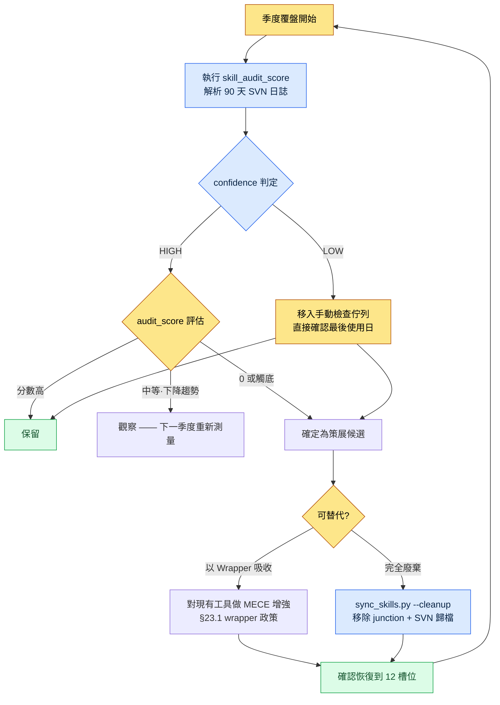

# Part 23 · 第3章. 工具策展 —— 用資料裁掉不用的工具

做季度覆盤時,我打開了全域性技能資料夾。一行一行數下來,wrapper 有 19 個。明明定好了只運營 12 個並這樣跑了一年,不知不覺卻又多出了 7 個。更離譜的是,其中一半光看名字根本想不起來是做什麼的工具。`migrate-legacy-enum`。這是什麼來著。上一次用它是什麼時候來著。

想不起來。只要依賴記憶,這個問題就永遠無法回答。於是我決定不看記憶,而是看日誌。工具策展不應是憑喜好去裁剪的工作,而應是用"上個季度呼叫了這個工具幾次"這樣的數字來裁剪的工作。

本章記錄的是:如何自動地把這個數字提取出來,如何用這個數字裁掉工具,以及如何從一開始就阻止工具暴增。

---

## 23.3.1 工具增多是一種自然現象

在談策展之前,必須先承認一件事。工具只要不加阻攔就一定會增多。這不是因為意志力薄弱。而是因為每次任務中"就這一次,為了快點處理"而寫一個小指令碼,本身是合理的選擇。而這種合理的選擇累積幾十次,就成了不合理的一堆廢物。

專案A 中運營的結構,是全域性的 12 個 wrapper 通過 junction 指向 workspace 中的 48 個本體。全域性這一側很輕,沉重的本體則放在用 SVN 管理的 workspace 裡。這個結構本身已在 §23.1 中講過。問題在於,這個 12 的數字並不會安分待著。

看看工具增多時還有什麼一起增多,就能清楚為什麼必須加以阻攔。

<svg viewBox="0 0 640 250" xmlns="http://www.w3.org/2000/svg" font-family="sans-serif" font-size="13">
  <rect x="0" y="0" width="640" height="250" fill="#fbfbfb"/>
  <text x="20" y="28" font-size="15" font-weight="bold" fill="#222">增加 1 個工具 → 隨之增長的 4 項成本</text>
  <!-- center node -->
  <rect x="270" y="100" width="100" height="46" rx="8" fill="#2b6cb0"/>
  <text x="320" y="128" fill="#fff" text-anchor="middle" font-weight="bold">新工具 +1</text>
  <!-- four cost nodes -->
  <rect x="40" y="55" width="160" height="40" rx="6" fill="#fff" stroke="#c53030"/>
  <text x="120" y="80" text-anchor="middle" fill="#c53030">上下文 token 佔用 ↑</text>
  <rect x="440" y="55" width="160" height="40" rx="6" fill="#fff" stroke="#c53030"/>
  <text x="520" y="80" text-anchor="middle" fill="#c53030">選擇疲勞 ↑</text>
  <rect x="40" y="155" width="160" height="40" rx="6" fill="#fff" stroke="#c53030"/>
  <text x="120" y="180" text-anchor="middle" fill="#c53030">維護表面積 ↑</text>
  <rect x="440" y="155" width="160" height="40" rx="6" fill="#fff" stroke="#c53030"/>
  <text x="520" y="180" text-anchor="middle" fill="#c53030">功能重複風險 ↑</text>
  <!-- lines -->
  <line x1="270" y1="115" x2="200" y2="75" stroke="#a0a0a0"/>
  <line x1="370" y1="115" x2="440" y2="75" stroke="#a0a0a0"/>
  <line x1="270" y1="131" x2="200" y2="175" stroke="#a0a0a0"/>
  <line x1="370" y1="131" x2="440" y2="175" stroke="#a0a0a0"/>
  <text x="320" y="232" text-anchor="middle" fill="#555" font-size="12">工具是 +1,成本卻是 +4。這正是策展屬於"做減法"的原因。</text>
</svg>

尤其是第一項,上下文 token 佔用,是進入 AI 工具時代後變得更為尖銳的成本。全域性 wrapper 一多,每個會話中 AI 讀取"我可用的工具清單"所需的 token 就會增多。為了讀 19 個工具的說明,真正能用在任務上的上下文反而減少了。因此專案A 的 `sync_skills.py` 帶有 `--cleanup` 選項,會自動清理 junction 已斷裂或本體已消失的 wrapper。這更接近一種為守住 token 預算而做的衛生工作。

但 `--cleanup` 能抓到的只有"斷裂"的工具。那些好端端活著、卻沒人用的工具,它抓不到。要抓這類工具,就需要使用頻率資料。

---

## 23.3.2 skill_audit_score —— 用 SVN 日誌測量使用頻率

核心思路很簡單。workspace 中的技能與工具全都在 SVN 裡。而且每次使用工具,該工具產出的產物(表格、文件、關係圖 HTML 等)都會提交到 SVN。也就是說,**只要看 SVN 日誌,哪個工具實際幹過活就會作為痕跡留下來。**

於是我寫了一個叫 `skill_audit_score` 的小測量指令碼。正如其名,它為每個技能打一個"審計分數"。做這個工具時,我並不是一開始就把程式碼全寫好,而是向 AI 說明測量邏輯、拿到初稿。這裡把那份實操記錄(worked transcript,完整保留的真實操作過程記錄)原樣留下。不做摘要,連走彎路的部分也一併寫下來。

### 提示詞(全文)

> 全域性技能 wrapper 定為 12 個,卻不知不覺膨脹到了 19 個。我想在季度覆盤時用資料挑出"不用的工具"。請按以下前提寫一個測量指令碼。
>
> - 每個技能工具都以子資料夾的形式存在於 workspace 資料夾中(例如 `tools/relation-map-gen/`)。
> - 這些工具產出的產物會提交到 SVN。提交資訊裡通常會帶上工具名稱或產物種類(例如 "relation-map regen"、"schema-doc update")。
> - 我想解析 SVN 日誌,統計最近 90 天裡每個工具參與的提交數。
> - 僅憑提交數還不夠。(a) 越近的加權越高,(b) 最後使用日越久則扣分,把這兩點合起來給出一個 0\~100 的 audit_score。
> - 輸出為按分數降序的表格。分數低的工具就是"策展候選"。
> - 假設 SVN 命令以 `svn log --xml -l 2000` 的形式獲取。只用 Python 標準庫。絕對路徑通過引數傳入。

### Claude 的原始輸出(原樣)

> 好的。不過有一點要先說明。**並不能保證提交資訊裡一定帶有工具名稱。**如果人隨意撰寫提交資訊,像"修改表格"這樣的資訊就無法判斷是哪個工具參與的。因此我會並行採用兩種匹配方式。
>
> 1. 在提交資訊中匹配工具名稱·別名關鍵詞(寬鬆)
> 2. 匹配變更的**檔案路徑**是否屬於對應工具的資料夾或該工具的產物模式(例如 `*_relation.html`)(嚴格)
>
> 第 2 種更可信,因此我會給它更高的權重。以下是初稿。

```python
# skill_audit_score.py  (Claude 初稿 —— 驗證前)
import subprocess, sys, datetime, xml.etree.ElementTree as ET
from collections import defaultdict

def svn_log_xml(repo_path, limit=2000):
    out = subprocess.run(
        ["svn", "log", "--xml", "-v", "-l", str(limit), repo_path],
        capture_output=True, text=True, check=True)
    return ET.fromstring(out.stdout)

def score_skills(repo_path, skills, window_days=90):
    root = svn_log_xml(repo_path)
    now = datetime.datetime.now(datetime.timezone.utc)
    hits = defaultdict(list)   # skill -> [days_ago, ...]
    for entry in root.findall("logentry"):
        date = datetime.datetime.fromisoformat(
            entry.find("date").text.replace("Z", "+00:00"))
        days_ago = (now - date).days
        if days_ago > window_days:
            continue
        msg = (entry.find("msg").text or "").lower()
        paths = [p.text for p in entry.findall("paths/path")]
        for sk in skills:
            name = sk["name"].lower()
            in_msg = name in msg or any(a in msg for a in sk.get("alias", []))
            in_path = any(name in (pp or "").lower() for pp in paths) \
                      or any(pat in (pp or "") for pp in paths
                             for pat in sk.get("artifact", []))
            if in_path:
                hits[sk["name"]].append((days_ago, 2.0))   # 嚴格匹配加權
            elif in_msg:
                hits[sk["name"]].append((days_ago, 1.0))   # 寬鬆匹配

    rows = []
    for sk in skills:
        h = hits[sk["name"]]
        if not h:
            rows.append((sk["name"], 0, None, len(h)))
            continue
        # 時近加權:越近越接近 1.0,90 天前則為 0.1
        recency = sum(w * (1 - 0.9 * (d / window_days)) for d, w in h)
        last_used = min(d for d, _ in h)
        # 最後使用日扣分
        stale_penalty = max(0, (last_used - 14)) * 0.5
        score = max(0, min(100, recency * 8 - stale_penalty))
        rows.append((sk["name"], round(score, 1), last_used, len(h)))

    rows.sort(key=lambda r: r[1])   # 分數升序 = 候選優先
    return rows

if __name__ == "__main__":
    REPO = sys.argv[1]
    SKILLS = [
        {"name": "relation-map-gen", "alias": ["relation", "관계도"],
         "artifact": ["_relation.html"]},
        {"name": "schema-doc", "alias": ["schema", "명세서"],
         "artifact": ["_schema.md"]},
        {"name": "gdd-gen", "alias": ["gdd"], "artifact": ["_gdd.md"]},
        {"name": "table-creator", "alias": ["table", "테이블"], "artifact": []},
        {"name": "excel-reader", "alias": ["xlsm", "vba"], "artifact": []},
        {"name": "migrate-legacy-enum", "alias": ["enum", "migrate"],
         "artifact": []},
    ]
    print(f"{'skill':22}{'score':>7}{'last_used(d)':>14}{'hits':>6}")
    for name, score, last, hits_n in score_skills(REPO, SKILLS):
        print(f"{name:22}{score:>7}{str(last):>14}{hits_n:>6}")
```

### 人工驗證 —— 執行後被否決的部分

我把指令碼在實際的 SVN 工作副本上跑了一遍。第一次輸出就很奇怪。`table-creator` 和 `excel-reader` 兩者的 `artifact` 模式都是空的,因此只有在提交資訊裡出現 "table" / "xlsm" 這兩個詞時才會被抓到。可這兩個工具的產物就是普通的 `.xlsm` 檔案,無法用模式加以區分。結果兩者的分數都異常地低 —— 儘管它們其實是每天都在用的工具。

這裡我做了一個重要判斷。**分數低並不意味著就可以一概裁掉。**分數低的原因,究竟是"真的沒在用",還是"測量沒能抓到這個工具",這要由人來區分。AI 給出的數字只能縮小候選範圍,最終決定由人來做。

於是我又向 AI 提出了請求。

### 二次請求提示詞

> artifact 模式為空的工具,其分數不可信,所以請在輸出裡增加一個 `confidence` 列。從未有過 artifact 匹配的工具標記為 `confidence=LOW`,並從自動策展候選中排除。把 LOW 的工具單獨歸為"無法測量 —— 手動檢查"一組。

經過這次二次請求,輸出被分成了兩組。一組是可以憑可信分數裁掉的工具,另一組是因測量偏弱而需要人親自檢視的工具。實際跑出來的結果大致是這樣(分數為作者工作副本上的實測值,部分工具名已做匿名化)。

| skill | audit_score | last_used(天前) | confidence | 判定 |
|---|---|---|---|---|
| relation-map-gen | 71.4 | 2 | HIGH | 保留 |
| schema-doc | 58.9 | 5 | HIGH | 保留 |
| gdd-gen | 22.1 | 31 | HIGH | 觀察 |
| migrate-legacy-enum | 0.0 | 未測得 | HIGH | **策展候選** |
| table-creator | 4.2 | 1 | LOW | 手動檢查 → 保留 |
| excel-reader | 6.0 | 1 | LOW | 手動檢查 → 保留 |

`migrate-legacy-enum` 的分數為 0,confidence 為 HIGH。這意味著在 90 天裡,這個工具的資料夾和產物一次都沒有出現在提交中。回想起來,那是去年把遺留 enum 遷移了一次就結束的、本該是一次性的工作,卻被我固化成了技能。這正是該裁掉的工具。反過來,`table-creator`·`excel-reader` 雖然分數低,但 confidence 是 LOW,而且最後使用日就在一天前。只是測量沒能抓到,實際上每天都在用。這不能裁。

> 注意:上表的分數算式(時近加權 × 8、stale 扣分)是作者針對自己工作副本調校過的數值。SVN 提交習慣·產物模式不同,係數也會不同。比起絕對分數,"工具間的相對排名"與"confidence 區分"才是這個工具的本質。

---

## 23.3.3 策展週期 —— 從測量到廢棄

`skill_audit_score` 只是一個測量工具。必須有一個把測量值嵌入季度覆盤、轉上一圈的週期,工具才會真正被整理。那個週期如下。



區分這個週期的兩個出口很重要。分數為 0 的工具並不是一律刪除。如果那項工作本身已經消失,就送去完全廢棄(`--cleanup`);如果那項工作仍然需要、只是沒有頻繁到值得單設一個工具,就把它吸收進現有工具。後者正是 §23.3.4 的 MECE 增強。

即便廢棄,SVN 歷史裡也會留下程式碼。收回的只是 junction 和全域性暴露,並不是把程式碼本身永遠抹掉。半年後那項工作再次出現,從 SVN 恢復即可。正因為有這張"可以撤回"的安全網,人才敢果斷地裁。

---

## 23.3.4 抑制 MECE 增殖 —— 在建立前先發問

比起測量後再裁,更好的是一開始就不去建立。如果說 `skill_audit_score` 是事後整理,那麼 MECE wrapper 政策就是事前抑制。

MECE 即 Mutually Exclusive, Collectively Exhaustive —— 彼此不重疊、無遺漏。每當想建立新工具,就把這個詞丟擲來。**新工具與現有工具是否重疊(違反 ME)?還是它真的填補了空白領域(貢獻 CE)?**專案A 的 wrapper 政策在這裡分成兩條路。

| 情形 | 政策 | 結果 |
|---|---|---|
| 新工作與現有工具的領域重疊 | **優先增強現有工具** | 在現有 wrapper 本體上新增功能,不佔用新槽位 |
| 新工作明確屬於不同領域 | **允許新增 wrapper** | 把 12 個槽位中的一個分配給新工具(同時附帶一個應裁掉的候選) |

關鍵在於"預設值是增強"。建立新工具是例外。要為這個例外正名,就得證明"現有任何工具都做不成這項工作"。正是這一個預設值,才是把膨脹到 19 個的工具重新拉回 12 個的真正原因。

這也與 §23.1 的 cascade 相連。像 check 這樣的 cascade,是把原本 4 種的檢查工具合併為一次呼叫的產物。它沒有設定 4 個獨立的 wrapper,而是從 MECE 的視角把"這些都屬於檢查這一個領域"看待、合併吸收為一個的例子。工具數量減少了,功能卻原封不動。這就是增強的典範。

AI 助手在這裡既是風險因素,也是解法。說它是風險,是因為只要對 AI 說"幫我寫個處理這項工作的指令碼",新工具就太容易冒出來。在點一下就生成一個工具的環境裡,若沒有 MECE 紀律,工具墳場轉眼就會堆成。說它是解法,是因為只要先把政策交給 AI,AI 就會自行提議"這個不如作為選項加到現有的 `relation-map-gen` 上更好"。要把製造工具的 AI,連同策展紀律一起交到它手裡。

---

## 23.3.5 不被分數欺騙的方法 —— 測量的侷限

在運營本章這個工具的過程中,我學到最多的一點是:絕不能盲信測量值。`skill_audit_score` 只看 SVN 日誌這一種訊號。因此它在結構上有必然會漏掉的東西。

- **抓不到只讀工具。**像 `excel-reader` 這種只讀取表格、不產出產物的工具不會留下提交。因此把 confidence 降為 LOW、轉入手動檢查的機制是必不可少的。
- **低估低頻高價值的工具。**有些工具一年只用兩次,但每次用都能省下半天。只看頻率是策展候選,論價值卻該保留。因此週期的最後判定始終由人來做。
- **受提交習慣左右。**把一批工作塞進一個提交的人,與拆得很細的人,分數會不一樣。因此不能讀絕對分數,而要讀同一個人的工具間相對排名。

概括來說,這個工具不是"做決定的工具",而是"縮小候選的工具"。它讓你一眼看清 19 個工具,1 秒內告訴你"該懷疑哪一個"。而驗證那份懷疑、並動手裁掉,則留給人來完成。測量並不取代人,只是指出人該去看的地方。

---

## 動手試試 —— skill_audit_score 一個週期

親自把工具策展週期轉上一圈的步驟。

**setup**
1. 確認工作區的技能與工具都在版本管理(SVN/Git)之內。產物也必須提交到同一個倉庫。
2. 製作待測量的工具清單。為每個工具寫上 `name`、`alias`(會出現在提交資訊裡的別名)、`artifact`(產物檔案模式,若有)。沒有 artifact 的只讀工具留空。

**prompt**(給 AI)
> 請按以下前提寫一個工具使用頻率測量指令碼。(1) 每個工具都以產物提交的形式在 [版本管理系統] 日誌裡留下痕跡。(2) 解析最近 90 天的日誌,統計各工具參與的提交數。(3) 用時近加權 + 最後使用日扣分,給出 0\~100 的分數。(4) 從未有過產物模式(artifact)匹配的工具標記為 confidence=LOW,從自動候選中排除,分入手動檢查。(5) 輸出為按分數升序的表格 —— 低分即策展候選。只用標準庫,倉庫路徑通過引數傳入。

**verify**
1. 如果每天都用的工具排到了表格頂部(低分),那就是測量錯了。請確認該工具的 confidence —— 若為 LOW 屬正常(無法測量),若 HIGH 卻分數低,就檢查 alias·artifact 的設定。
2. 只把分數 0 + confidence HIGH 的工具確定為策展候選。把最後使用日與記憶對照,由人判斷它是否真的已經死掉。
3. 把候選送往"完全廢棄"與"吸收進現有工具"之一。廢棄只收回 junction,程式碼留在倉庫裡。
4. 最後數一數 12 個槽位(或你自己設定的上限)是否已恢復。

### 單人精簡版

如果你是工具只有 6\~8 個、也沒有 SVN 的單人開發,就這樣精簡。版本管理用 Git 就夠了。用 `git log --since="90 days ago" --name-only` 拉出變更的檔案路徑,再按工具資料夾名 grep 一次,"哪個工具最近幹過活"就出來了。連打分指令碼都不必寫。關鍵不在於數字的精確,而在於**用看日誌代替憑記憶**這一個習慣。每季度一次,用 git 日誌拉出"過去 90 天一次都沒碰過的工具",盯住那個工具。那 5 分鐘就能擋住工具墳場。

---

### 本章要點
- 工具不加阻攔就會增多,策展不是做加法,而是做減法。
- skill_audit_score 用 SVN 日誌測量使用頻率,指出該裁掉的候選。
- 測量只能縮小候選,是否裁掉由人看 confidence 來決定。

### 下一章預告
- Part 23 · 第4章. 獨自做的解謎遊戲 —— 把同樣的工具·覆盤紀律應用到單人遊戲開發的實戰記(Critter Sort)。
