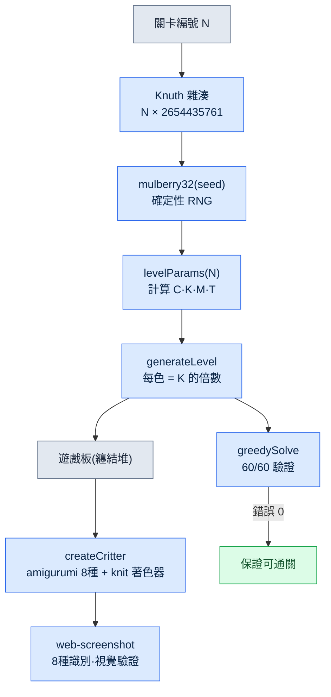

# Part 23 · 第4章. 獨自開發的益智遊戲 —— Critter Sort 實戰記

週六下午,妻子正用手機玩一款顏色分類的益智遊戲。那是一款名為 *Yarn Fever* 的遊戲,把纏結的毛線團按顏色分類到相應的籃子裡。一局結束,她就說"又是一樣的",然後關掉。因為沒有更新,很快就膩了。

那一刻的想法很簡單。那個迴圈有著經過驗證的上癮性,而機制本身不受著作權保護。換成動物主題,再把關卡程式化地無限生成,"又是一樣的"這個問題就消失了。一個人用直接在瀏覽器裡執行的 HTML 3D 來做,連裝到妻子手機上都不需要。

問題在於,我不是圖形工程師。雖然是 24年資歷的策劃,卻從沒用 Three.js 寫過著色器。所以這一章,是"和 AI 一起、獨自在幾天內讓一款遊戲跑起來"的真實記錄。它同時也是一份分離的記錄——使用與公司 MMORPG(以下稱專案A)工作相同的工具,卻一行領域內容都沒有摻入。

實際的遊戲在 `critter-sort/` 倉庫裡,git 標籤 v0.1\~v0.3 記錄著三天間的決策。這不是加工過的案例,而是直接引用那個倉庫。

---

## 23.4.1 用提示詞做逆向工程 —— 然後丟掉了標誌性手感

最先做的事,是把原作用語言拆解開、拋給 AI。第一個提示詞是這樣的。

> **提示詞（v0.1 啟動）：**
> "我想把 Yarn Fever 這款休閒益智遊戲的核心迴圈改編成動物主題,用 Three.js + Vite 來做。迴圈是這樣的:把纏結的顏色團塊按顏色分類到同色的桶裡,臨時槽位溢位就遊戲結束。以動物作為分類物件,點選纏結的動物堆,就把它們送進同色的巢(nest)。邏輯要用與 Three.js 無關的純 JS 狀態機來寫,以便進行 headless 測試。再加入程式化的無限關卡(基於種子)。"

AI 忠實地照做了。它把資料夾結構分成 `game/`(純邏輯)和 `render/`(Three.js),先寫好 `state.js`·`rules.js`·`generator.js`,再用上色的方塊 placeholder 把遊戲板顯示出來。不是幾天,而是一個會話就讓 v0.1 跑了起來。

可是,為了給妻子看而親自試玩的那一刻,違和感來了。它變成了一款常見的消除拼圖——動物在畫面上蹦跳著跳進籃子。原作的手感不見了。*Yarn Fever* 的核心特質不是"分類",而是**用手解開纏結毛線團的觸感**,以及**旋轉畫面、確認被遮住的顏色的行為**。我在提示詞裡把它壓平成了"點選動物就送進巢"這種普通的 sort,而 AI 只是忠實於我給出的定義罷了。

這就是逆向工程的第一個陷阱。一旦概括原作,標誌性手感就會蒸發。因為概括留下的是表面,而非本質。

這裡要說清楚一點。AI 並沒有給出錯誤的答案。是我的提示詞錯了。所以下一個迴圈不是修改程式碼,而是**修正定義**。

---

## 23.4.2 脊樑 —— 讓旋轉與解開毛線復活的修正迴圈

看過 v0.1 之後,我分兩次重新明確了核心。第一次修正針對行為,第二次修正針對觸感。

> **提示詞（第 1 次修正 —— 行為）：**
> "這個變成普通的消除拼圖了。Yarn Fever 的核心特質是'旋轉 3D 畫面、確認被遮住的顏色,並決定解開的順序'。不要把遊戲板平鋪開,而要在中間堆成高高的土丘,必須旋轉才能看到背面被遮住的顏色。用 OrbitControls 加入旋轉。可是旋轉和點選會衝突啊——你打算怎麼區分它們?"

> **Claude 的輸出（原始,未經概括）：**
> "沒錯。旋轉手勢和點選是同一個指標事件,所以會衝突。我建議用距離·時間閾值來區分。在 `pointerdown` 時記錄座標·時刻,在 `pointerup` 時,如果移動距離超過 9px 或按住時間超過 400ms,就判定為旋轉手勢並忽略點選。只有在這以下,才用 raycaster 拾取動物並呼叫 `state.tap()`。OrbitControls 的 azimuth 我會限制在 ±54° 左右,避免堆塊跑到畫面之外。不過在移動端 9px 可能太敏感,需要在真機上確認。"

那個 9px/400ms 的閾值至今仍原樣留在 `src/main.js` 裡。沒有多餘部分、可以直接驗證的程式碼。

```javascript
// src/main.js — 拖拽=旋轉(OrbitControls) / 短按=解開毛線
canvas.addEventListener('pointerup', (ev) => {
  if (!down || state.status !== 'playing') { down = null; return }
  const dist = Math.hypot(ev.clientX - down.x, ev.clientY - down.y)
  const dt = performance.now() - down.t
  down = null
  if (dist > 9 || dt > 400) return // 判定為旋轉手勢
  const rect = canvas.getBoundingClientRect()
  const x = ((ev.clientX - rect.left) / rect.width) * 2 - 1
  const y = -((ev.clientY - rect.top) / rect.height) * 2 + 1
  const id = view.pick(x, y, camera)
  if (id !== null) state.tap(id)
})
```

行為回來了。可是第二次試玩後,依然沒有"解開毛線團"的感覺。動物只是移動到巢裡,沒有解開的手感。第二次修正。

> **提示詞（第 2 次修正 —— 觸感）：**
> "旋轉變好了。可是還沒有'解開毛線'的感覺。加入這樣的表現:點選時,纏在動物身上的亂線股解開、消失,那些線再纏繞著進入籃子。動物的外觀也別用光滑的 GLB 鳥,而要用圓滾滾的針織毛絨玩偶(amigurumi)。加上惺忪的睡眼、腮紅這類溫馨的細節。外部素材不合適的話,去掉、改用程式化生成也可以。"

> **Claude 的輸出（原始）：**
> "我會拆成兩部分來實現。(1) 纏結的線:在每隻動物的身體上纏兩股略暗的同色 `TorusGeometry`,點選時把 scale 縮到 0.01,讓它解開、消失。(2) 線的纏繞:用 `TubeGeometry` 畫出動物→籃子路徑上的線,做一個朝籃子方向纏繞進去的補間動畫。毛絨玩偶外觀走程式化路線——給 `MeshStandardMaterial` 程式化生成 knit bump 貼圖,營造 niit 質感;惺忪的睡眼用扁平的 box,腮紅用半透明的粉色 sphere。現有的 GLB 起始素材(3種鳥)和針織色調不搭,所以移除,但會把動物包的載入管線作為後備保留下來。有一點要說明:程式化生成的動物在物種多樣性上不如 GLB——先用一個物種驗證、再增加物種會比較穩妥。"

最後那句警告('物種多樣性不如 GLB'——GLB 是 glTF Binary,一種從外部獲取即用的現成 3D 模型檔案格式)正是通向 v0.3 的種子。AI 先說出了下一個侷限,而我把它接過來作為下一個里程碑。

驗證每次都是兩步。先用 headless 確認邏輯沒有損壞(錯誤 0),然後在瀏覽器裡親自旋轉·點選,體會手感。v0.2 的提交資訊把這次驗證固化了下來:"headless 驗證:旋轉·解開毛線·自動通關正常,錯誤 0。"

纏結的兩股線如今這樣留在 `src/render/pieces.js` 裡。

```javascript
// src/render/pieces.js — 纏在身體上的兩股鬆散的線(略暗的同色)
const strandMat = new THREE.MeshStandardMaterial({ color: darken(hex, 0.7), roughness: 1 })
const strands = []
const orient = [[0.5, 0.2, 0.0], [1.25, 0.0, 0.6]]
for (let i = 0; i < 2; i++) {
  const s = addMesh(g, G.torus, strandMat, [0, byo + 0.02, 0], Math.max(bx, bz) + 0.02, orient[i])
  strands.push(s)
}
g.userData.strands = strands  // 點選時 view.js 會解開這些線股使其消失
```

把這裡得到的教訓用一句話記下來。

- 逆向工程一旦概括,標誌性手感就會消亡。
- 定義錯了,就修改定義,而不是程式碼。
- AI 說出的下一個侷限,就是下一個里程碑。

---

## 23.4.3 三天的決策歷史 —— 用 git 標籤讀懂修正

光靠語言描述只是"改了兩次",但 git 歷史連同精確的時間,把那些修正是何時、以何種形態進入的都留了下來。這在單人開發中替代了覆盤。即使沒有同事,提交也能為"為什麼會變成這樣"作證。

| 提交 | 時間 (2026-05-30) | 改動內容 | 標誌性手感狀態 |
|---|---|---|---|
| `2b2e3bc` v0.1 | 14:43 | Yarn Fever 逆向工程,純邏輯 + placeholder,60/60 求解器通過 | 缺失(被壓平為普通 sort) |
| `70a0117` v0.2 | 15:11 | 旋轉(OrbitControls ±54°)+ 點選/拖拽分離 + 解開毛線 + amigurumi | 復原(重新定義核心) |
| `160663c` 快照 | 15:31 | v0.2 畫廊快照 5張 + README 畫廊 | — |
| `59b0baf` v0.3 | 15:55 | 程式化 amigurumi 8種 + 鮮豔糖果色調色盤 | 強化(確保物種多樣性) |
| `c5b9a1b` 交接 | 16:20 | NEXT_SESSION 會話交接指標 | — |

v0.2 的提交資訊正文把決策本身固化了下來。"將遊戲的核心特質從'動物蹦跳'糾正為'旋轉畫面、解開可愛的毛線團(針織毛絨玩偶)送入同色籃子'。"這是一個半小時裡,遊戲的核心特質死了一次又被救活的記錄。

值得注意的一個細節。檢視 v0.2 的 `git show --stat` 會發現,起始的 3種 GLB 鳥(Flamingo·Parrot·Stork)被整個刪除了。理由是"美術和針織色調不搭"。外部免費素材不是免費就全都用,而是色調不搭就刪掉的決定。這是由人而非 AI 把守的審美關卡。

```
public/assets/animals/pack_starter/Flamingo.glb  | Bin 77428 -> 0 bytes
public/assets/animals/pack_starter/Parrot.glb    | Bin 97024 -> 0 bytes
public/assets/animals/pack_starter/Stork.glb     | Bin 76852 -> 0 bytes
```

---

## 23.4.4 程式化生成實證 —— 8種 amigurumi 與無限關卡

v0.2 留下的作業是"程式化動物的物種多樣性不如 GLB"。v0.3 解決了這個問題。沒有新增任何一個外部素材,用程式碼生成了 8種動物。

核心是 `src/render/pieces.js` 中的 `SPECIES` 表。為每個物種以引數定義身體比例·頭部·耳朵型別·口鼻·眼睛形狀,由一個函式讀取這些引數來組裝網格。

```javascript
// src/render/pieces.js — 各物種的輪廓引數
const SPECIES = {
  cat:      { body: [0.5,0.46,0.48,0.04], ears: 'cat',   snout: 0.13, tail: 'cat',  eyes: 'sleepy' },
  bear:     { body: [0.52,0.5,0.5,0.03],  ears: 'bear',  snout: 0.16, tail: 'none', eyes: 'round' },
  bunny:    { body: [0.46,0.5,0.46,0.02], ears: 'bunny', snout: 0.12, tail: 'puff', eyes: 'round' },
  fox:      { body: [0.5,0.44,0.48,0.04], ears: 'fox',   snout: 0.2,  tail: 'fox',  eyes: 'sleepy' },
  capybara: { body: [0.58,0.5,0.56,0.02], ears: 'tiny',  snout: 0.22, tail: 'none', eyes: 'sleepy' },
  pig:      { body: [0.54,0.5,0.52,0.03], ears: 'pig',   snout: 0.1,  nose: true,   eyes: 'round' },
  frog:     { body: [0.56,0.4,0.54,0.05], ears: 'none',  snout: 0.1,  topEyes: true, eyes: 'none' },
  chick:    { body: [0.42,0.44,0.42,0.05], ears: 'none', beak: true,  tail: 'none', eyes: 'round' },
}
export const SPECIES_IDS = Object.keys(SPECIES)  // 8種
```

僅憑耳朵形狀,輪廓就分了開來。貓·狐狸是尖尖的 cone,熊是圓圓的 sphere,兔子是細長的 sphere,豬是向前彎折的 cone。青蛙是頭頂凸出的眼睛(`topEyes`),小雞是喙(`beak`)。這些細小的分支造就了 8種的辨識度。外部素材 0,程式碼一個檔案。

不過程式化生成有個陷阱。"看起來像模像樣"的程式碼是否真的能生成可辨識的 8種,光看程式碼是不知道的。所以驗證再次分為兩步。先用 headless 確認 8種是否無錯誤地生成,然後用 web-screenshot 技能(headless Chrome)捕獲實際渲染,用眼睛確認 8種是否可區分。DEVLOG v0.3 裡有那個結果:"以耳朵/口鼻/鼻子/喙/尾巴/眼睛區分輪廓。外部素材 0,針織色調完全統一。"

### 一個種子決定整個遊戲板

關卡的無限性由種子 RNG 負責。`generator.js` 用 Knuth 乘法雜湊對關卡編號進行種子化,再用 `mulberry32` 抽取確定性隨機數。相同的關卡編號總是對應相同的遊戲板。

```javascript
// src/game/generator.js
export function generateLevel(level, animalPool = null) {
  const seed = (level * 2654435761) >>> 0  // Knuth multiplicative hash
  const rng = makeRng(seed)
  const { C, K, groupsPerColor, M, T } = levelParams(level)
  const colors = rng.shuffle(COLORS).slice(0, C)
  // ...
  for (const color of colors) {
    const count = K * groupsPerColor  // 始終是 K 的倍數 → 精確分解到巢(保證可解)
    // ...
  }
}
```

這裡的一行保證了遊戲的公平性。因為把每種顏色的動物數量強制設為**始終是 K(完成一個巢所需的數量,3)的倍數**,所以無論哪個遊戲板都能被巢精確整除。無法解開的關卡從根本上不會出現。

### 60 個關卡是否全部可解 —— greedySolve

設計上可解並不等於證明。在 `rules.js` 裡放入用於驗證的貪心求解器,用 `test-logic.mjs` 自動遊玩 60 個關卡,每次都確認是否真的全部通關。這是剛才寫這一章時重新執行的實測輸出。

```
$ node scripts/test-logic.mjs
[求解器] 60/60 關卡通關

[難度曲線] (C=顏色, K=完成, groups, M=巢, T=托盤, 總數量)
  Lv 1: C=3 K=3 grp=2 M=3 T=7 總=18
  Lv 8: C=4 K=3 grp=3 M=4 T=6 總=36
  Lv12: C=5 K=3 grp=3 M=4 T=5 總=45
  Lv20: C=5 K=3 grp=3 M=4 T=4 總=45

[亂點遊玩] 隨機點選時的失敗率 (確認難度存在)
  Lv 1: 隨機失敗率 0%
  Lv12: 隨機失敗率 1%
  Lv20: 隨機失敗率 3%
```

這個測試同時證明了兩件事。貪心求解器能通關 60/60,意味著**所有關卡都可解**(難度並非不可能);而隨機點選的失敗率隨關卡上升從 0% 升到 3%,意味著**難度真實存在**(隨便亂按也全都能通關的話就不是遊戲了)。托盤從 7 格收窄到 4 格的難度曲線,以失敗率的形式被測量出來。

這裡要誠實地指出。隨機失敗率 3% 是"胡亂按鍵的機器人"的失敗率,而不是人對難度的體感。人會通過旋轉事先確認顏色,所以失敗率更低。這個數字是"難度不為 0"的方向性證明,並不意味著妻子有 3% 的機率會輸。人的體感難度在 v0.3 這個時間點還未測量,已在 NEXT_SESSION 裡記為"收集妻子的試玩反饋(最優先)"。

### 程式化生成管線



從種子出發,分岔為引數·遊戲板·網格·驗證的這條流程,正是從結構上解決"因沒有更新而厭倦"這一最初問題的答案。

---

## 23.4.5 GLB 進來了怎麼辦? —— 自動縮放與後備

程式化的 8種動物是沒有 GLB 時的後備。為了以後弄到真正的 amigurumi GLB 時能優先使用,保留了動物包管線。把 GLB 拖進資料夾、只跑一下 `npm run scan` 就完成了。

問題在於每個 GLB 的尺寸都各不相同。有的模型是 0.5單位,有的是 200單位。要靠手動調 scale,新增動物包就成了體力活。於是 `scan-packs.mjs` 讀取 GLB 的包圍盒,自動計算出符合目標高度(0.95單位)的 scale。

```javascript
// scripts/scan-packs.mjs — 從 GLB 包圍盒自動計算 scale/yOffset
const maxDim = Math.max(max[0]-min[0], max[1]-min[1], max[2]-min[2])
const scale = +(TARGET_H / maxDim).toPrecision(3)        // TARGET_H = 0.95
const yOffset = +(-((min[1] + max[1]) / 2) * scale).toPrecision(3)
```

而 `assets.js` 在 packs.json 缺失或載入失敗時,會悄悄回退到程式化動物。

```javascript
// src/render/assets.js
createAnimal(species, hex) {
  const entry = this.models.get(species)
  if (!entry) return createCritter(hex, species)  // 程式化 amigurumi 後備
  // ... GLB 克隆 + 顏色著色
}
```

這兩行以不中斷的方式保證了"有 GLB 就用 GLB,沒有就用程式碼動物"。在妻子游玩期間,即使我丟進新的 GLB 包,遊戲也不會停下。

---

## 23.4.6 一個人卻像一支團隊 —— 我是如何使用 AI 的

在這個專案裡,我只是一名策劃,但工作是靠多種角色運轉起來的。AI 填補了那些角色。關鍵不在於"替我寫程式碼",而在於**填補我薄弱的位置**。

| 我薄弱的位置 | AI 做的事 | 人(我)把守的關卡 |
|---|---|---|
| Three.js 著色器 | knit bump 程式化貼圖、TubeGeometry 毛線表現 | 色調是否相配(刪除 3種 GLB 鳥的決定) |
| 輸入衝突的解決 | 提出 9px/400ms 閾值 | 移動端真機體感確認 |
| 迴歸安全性 | 用 greedySolve 做 60/60 自動驗證 | "難度真實存在"由人來定義 |
| 預測下一個侷限 | 警告"程式化動物的物種多樣性偏弱" | 將其採納為 v0.3 里程碑 |

尤其視覺驗證是單人開發中薄弱的一環。程式碼能跑,和"8種在肉眼中可區分"是兩回事。所以我把 web-screenshot 技能(用 headless Chrome 啟動 dev 伺服器、截圖 + 報告控制台錯誤)原樣從公司工作中借用了過來。即使沒有 claude-in-chrome 擴充套件,也能用眼睛確認移動端視口(iPhone 15 Pro 豎屏,393×852)的渲染。

這裡,一個最重要的原則在發揮作用。**工具從公司借用,但領域內容借用 0 件。**

- 借用的:web-screenshot 驗證模式、git 提交資訊的規範、headless 邏輯測試的習慣、JIT atom 注入 hook。
- 沒借用的:專案A 的戰鬥·技能·世界觀·資料表——一行都沒有。

這種分離經由 grep 得到驗證。記憶記錄裡留有"公司專案領域內容借用 0 件(驗證 grep PASS)"。Critter Sort 的顏色是粉紅·薄荷綠·黃色,動物是貓·熊·兔子。專案A(公司 MMORPG)的領域詞彙在這個倉庫裡的任何地方都找不到。

為什麼要分離到這種程度。是為了同時防止兩種事故。公司 IP 洩漏到個人愛好中的法律事故,以及 MMORPG 領域 atom 被錯誤注入到益智遊戲開發中、成為噪聲的上下文汙染。只讓工具流動、把內容攔住——兩者之間就是健康的分離。

---

## 23.4.7 小結 —— 一個人系統也照樣運轉

Critter Sort 是個小遊戲。三天、5 個提交、8種動物、60 個關卡。然而在公司裡用的那套方法,在 1/1000 的規模下也照樣奏效。

- 逆向工程必須保留標誌性手感。
- 定義錯了就修改定義。
- 驗證要分 headless + 肉眼兩步走。

最大的收穫是第一節的失敗。在 v0.1 裡把遊戲的核心特質殺死了一次,又靠兩次修正把它救活。在沒有同事的單人開發中,為這場死亡與復活作證的,是 git 提交。如果沒有覆盤,一個月後就會忘掉"為什麼在 v0.2 裡全部推翻重來了?"。

接下來的 Part 24 將討論如何把這樣的決策歷史,在大團隊·長期運營中固化為治理。

這一章從妻子玩膩後關掉的益智遊戲出發,記錄了獨自開發的遊戲重新回到她手中的過程。它確認了:系統不是規模的問題,而是紀律的問題。

---

## 動手試試 —— 今天就能做的一步

這一步是和 AI 一起把你喜歡的一款休閒遊戲的核心迴圈跑起來。但要注意,別丟掉標誌性手感。

**setup** —— 在裝好 Node 的環境裡新建一個空資料夾。`mkdir my-puzzle && cd my-puzzle`。

**prompt** —— 像這樣拋給 AI。關鍵是"不要概括,而要明確寫出標誌性手感"。

> "我想把 [遊戲名] 的核心迴圈改編成 [主題]。這款遊戲的標誌性手感是 [用一句話寫下手感——例如:'旋轉畫面、確認被遮住之物並解開的觸感']。絕對不要把它壓平成普通的消除拼圖。邏輯要與渲染分離,寫成能用 headless 測試的形式。"

**verify** —— 親自試玩第一版結果。問一句"我寫下的標誌性手感還在嗎?"。如果不在,就不要改程式碼,而要**重新寫定義**再提出請求。那正是我在 v0.1→v0.2 裡做的事。

### 面向單人·業餘愛好者讀者的精簡版

既不需要引擎,也不需要程式化生成。在一張紙上寫下"這款遊戲的標誌性手感一句話",讓 AI 做出原型,然後親自試玩,只看那一句話是否還活著。如果死了,就把那一句話寫得更具體些再來一次。守住標誌性手感這一句話的習慣,僅憑這一點,就能避開逆向工程的第一個陷阱。
