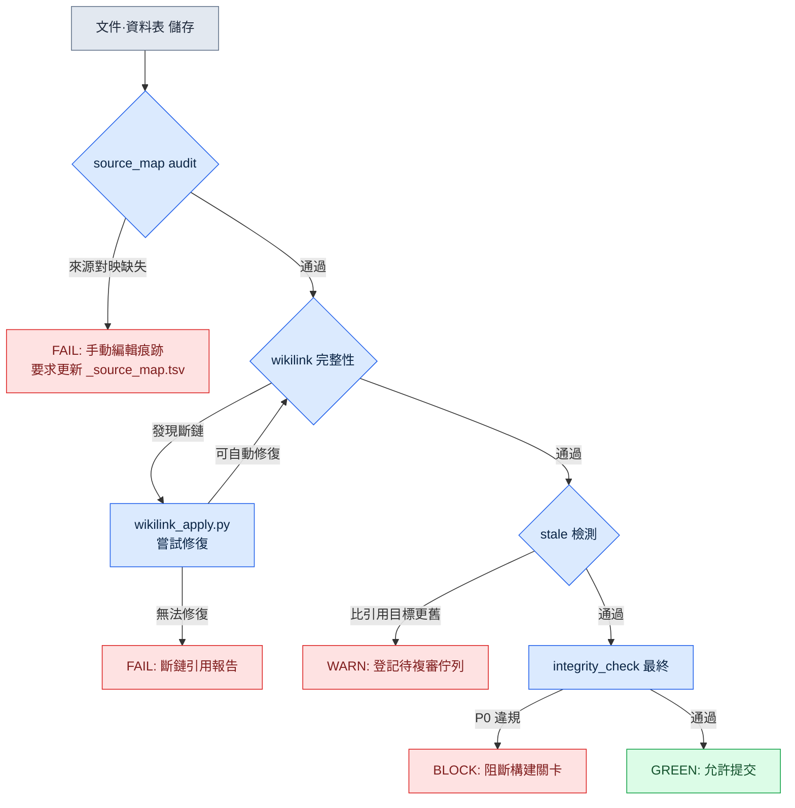

# 24.1 驗證系統 —— 用程式碼揪出一致性、連結與 stale 問題

週一早上站會剛結束,資料團隊的成員 A 用即時通訊工具發來一張截圖。那是一份 QA 報告,說遊戲內商店裡某個材料道具的說明是空白的。追查原因 30 分鐘後,真相浮出水面:兩週前有人在策劃文件裡把那個道具改名為 `재료_목재_상`,而資料表中的引用仍然指向舊名 `재료_목재_A`。文件更新了,資料表沒更新,連線二者的連結悄然斷開。沒有任何人說謊,遊戲卻在輸出謊言。

這類事故會隨著文件增多而以幾何級數變得越來越頻繁。人眼無法同時看清 50 份文件之間的相互引用。於是我們把驗證委託給程式碼。本章討論的系統,讓文件、資料、連結的一致性由指令碼而非人來檢查。核心有三點 —— 來源一致性(`_source_map.tsv` audit)、連結完整性(wikilink),以及 stale 檢測(揪出陳舊腐壞的引用)。

---

## 24.1.1 斷鏈為什麼是無聲的

文件與資料相互指向、彼此依存地存活。策劃案引用 enum,enum 引用資料表,資料表又引用另一份策劃案裡的決策。若由人手工管理這張網,一旦某個節點發生變化,就得靠人記住並逐一追蹤所有指向該節點的引用。而記憶會失效。

斷鏈之所以危險,是因為它**不會丟擲錯誤**。若是程式碼,引用不存在的變數時編譯器會攔住你。但在文件裡寫下的 `[[재료_목재_A]]` 這類 wikilink,即便目標消失,也只是留作一段普通文本。它不會變紅。遊戲照常構建、上線,直到玩家看到空白說明,才有人察覺。

因此,驗證系統的第一項工作,是**讓人眼看不見的東西顯現出來**。把一致性違規拉成文本輸出,再把這份輸出繫結到構建關卡上,那麼即便人忘了,指令碼也不會忘。

---

## 24.1.2 三路驗證的 cascade

驗證不是一整塊,而是分階段的。先跑最廉價的檢查,濾掉明顯的違規,只讓通過的進入下一階段。因為如果對所有輸入都跑昂貴的檢查,會慢到沒人願意跑。下面是筆者實際執行的驗證流程。



這個 cascade 的核心是**失敗越早越便宜**。`source_map audit` 只是 TSV 單行比對,毫秒級就結束。相反,最後的 `integrity_check` 要載入整張資料表來檢查 FK 關係,需要數秒。把廉價的檢查放在前面,明顯的錯誤就在那裡被截斷,昂貴的檢查只對通過它的少數輸入執行。

各階段的輸出不同,這一點也很重要。`audit` 給出 FAIL(編輯者手動改動過某處的證據),`wikilink` 在自動修復後給 FAIL,`stale` 給 WARN(不阻斷,但需複審),`integrity_check` 給 BLOCK(直接攔住構建)。同樣是「問題」,也要根據嚴重程度作出不同反應,人才能區分訊號與噪聲。

---

## 24.1.3 第一階段 —— `_source_map.tsv` audit

最先執行的檢查是來源一致性。筆者的文件生成管線,會把某份合成文件(例如 GDD,即遊戲設計文件的正文)是從哪些原始檔生成的,記錄到 `_source_map.tsv` 裡。每一行都釘死了「這一產出物的章節 = 這些原始檔的合成」這樣一條譜系(lineage)。

它之所以能成為驗證工具,是因為**只要有人手工編輯產出物,對映就會破裂**。若有人直接改動自動生成的 GDD 章節,那一節就不再是原始檔的忠實合成了。audit 指令碼會把產出物各章節的雜湊,與從原始檔重新合成得到的雜湊比對,不一致就給出 FAIL。「手動編輯即 audit FAIL」這條規則,就來自這裡。

這並非要阻止人去編輯,而是要**讓編輯顯式化**。如果必須修改產出物,就該二選一:要麼改原始檔再重新生成,要麼把那一節正式從對映中剝離出來(分離宣告)。把無聲的編輯變得吵鬧,這就是 audit 的工作。

---

## 24.1.4 第二階段 —— wikilink 完整性與自我修復

通過 audit 後,就進入連結檢查。筆者的文件用 Obsidian 式的 wikilink `[[目標]]` 來連線節點。`wikilink_apply.py` 做兩件事 —— 把 wikilink 解析為實際路徑並應用,以及在可能的範圍內修復斷鏈。

能夠修復的情形很明確:目標節點**只是改了名字、仍在原位存在**時。像前面 `재료_목재_A` → `재료_목재_상` 這樣的重新命名,只要別名對映(alias map)已更新,指令碼就會把舊名自動糾正為新名。反之,若目標被整個刪除、或無法追蹤去向,就放棄修復,並報告這條斷鏈引用。

這裡有一個設計判斷:**自動修復若過於激進則很危險。**如果去找「名字相似的」就擅自接上,連結會錯接到語義不同的節點上,釀成更糟的事故。因此 `wikilink_apply.py` 的修復是保守的 —— 只對有顯式別名對映的重新命名做自動糾正,需要猜測的情形則交給人。自動化的美德在於剋制:只把確定的事情自動做掉,而把含糊的事情誠實地交還給人。

---

## 24.1.5 第三階段 —— stale 檢測

即便連結活著,**引用也可能已經陳舊。**文件 A 引用資料表 B,若 B 比 A 更晚更新,那麼 A 的說明就有可能與當前的 B 相牴觸。連結本身完好無損 —— 因為指向的目標還在。可內容已經腐壞了。

stale 檢測會比較引用兩端的修改時間(或內容雜湊版本)。若引用方比被引用目標更舊,就丟擲 WARN,並把該節點登記到複審佇列。之所以是 WARN 而非 BLOCK,是因為更新並不總意味著內容衝突。若只是改了一個錯字的更新,引用依然完好。所以 stale 不是「攔截」,而是「標記出來讓你去檢視」。

來看這一階段如何抓住前面那起斷鏈事故。如果 `재료_목재` 資料表比文件更晚更新,那麼在自動修復之前,stale WARN 就已經先亮起了。也就是說,三道檢查是**相互重疊的安全網**。一張網漏掉的,由下一張網接住。cascade 之所以能抓住單一檢查抓不到的事故,原因正在於此。

---

## 24.1.6 實操記錄(worked transcript) —— 讓 Claude 編寫檢查指令碼

若讓人從零把驗證邏輯全部寫出來,會很累。筆者用自然語言描述檢查規則,執行指令碼則先向 AI 要初稿。下面是製作 stale 檢測指令碼的真實會話 —— 這是一段實操記錄(worked transcript,即完整保留的真實操作過程記錄),輸出不加修飾,失敗與拒絕的過程都原樣保留。

**[提示詞全文]**

> 文件資料夾裡的這些 Markdown 之間用 wikilink `[[目標]]` 相互連線。請寫一個 Python 指令碼,檢查每份文件自身是否比它所引用的目標檔案更舊(=stale)。條件:
> - 檔案的修改時間以 git 最後一次提交時間為準(檔案系統 mtime 會在 checkout 時被更新,不可信)
> - 斷鏈(目標不存在)從 stale 檢查中排除,單獨報告
> - 輸出為 TSV:`source<TAB>target<TAB>status`(status = OK / STALE / BROKEN)
> - WARN 不阻斷,退出碼保持為 0(不能擋住構建)

**[Claude 原始輸出 —— 第 1 次]**

> 下面的指令碼用 `git log -1 --format=%ct <file>` 取得每個檔案的最後提交時間,並用正則 `\[\[([^\]]+)\]\]` 提取 wikilink 後進行比較。
>
> ```python
> import subprocess, re, sys, pathlib
>
> def git_mtime(path):
>     out = subprocess.run(
>         ["git", "log", "-1", "--format=%ct", str(path)],
>         capture_output=True, text=True)
>     return int(out.stdout.strip())
>
> def resolve(link, root):
>     # [[目標]] -> root/目標.md
>     return root / f"{link}.md"
>
> root = pathlib.Path(sys.argv[1])
> for md in root.glob("*.md"):
>     src_t = git_mtime(md)
>     for link in re.findall(r"\[\[([^\]]+)\]\]", md.read_text(encoding="utf-8")):
>         tgt = resolve(link, root)
>         if not tgt.exists():
>             print(f"{md.name}\t{link}\tBROKEN")
>             continue
>         tgt_t = git_mtime(tgt)
>         status = "STALE" if src_t < tgt_t else "OK"
>         print(f"{md.name}\t{link}\t{status}")
> ```
>
> 這樣就能按你要求的 TSV 格式輸出。

**[人工驗證 / 拒絕]**

在這裡停住了。我看到三處缺陷。

第一,`git_mtime` 若返回空字串,就會在 `int("")` 處崩潰 —— 從未被提交過的新檔案正是如此。第二,`glob("*.md")` 看不到子資料夾,而筆者的文件散落在 `part*/` 之下。第三,也是最重要的 —— wikilink 有時會帶管道別名,例如 `[[目標|顯示名]]`,而第 1 版程式碼會把 `目標|顯示名` 整個誤當成檔名。這樣一來,完好的連結會全部被判為 BROKEN。照原樣用,就是一顆誤報炸彈。

我指出這三點,並重新提出了請求。

**[再次請求]**

> 請改三處:(1) 未提交的檔案讓 git_mtime 返回 None,這種情況暫緩 STALE 判定,status=UNTRACKED。(2) 不用 glob,改用 rglob 以包含子資料夾。(3) 處理 `[[目標|別名]]` 管道 —— 只取 `|` 前面的部分作為目標。另外,即使存在 BROKEN,退出碼也保持為 0(WARN 不阻斷原則)。

**[Claude 原始輸出 —— 第 2 次]**

> ```python
> import subprocess, re, sys, pathlib
>
> def git_mtime(path):
>     out = subprocess.run(
>         ["git", "log", "-1", "--format=%ct", str(path)],
>         capture_output=True, text=True)
>     s = out.stdout.strip()
>     return int(s) if s else None   # 無提交歷史則為 None
>
> def target_name(link):
>     return link.split("|", 1)[0].strip()   # [[目標|別名]] -> 目標
>
> root = pathlib.Path(sys.argv[1])
> for md in root.rglob("*.md"):
>     src_t = git_mtime(md)
>     text = md.read_text(encoding="utf-8")
>     for raw in re.findall(r"\[\[([^\]]+)\]\]", text):
>         name = target_name(raw)
>         hits = list(root.rglob(f"{name}.md"))
>         if not hits:
>             print(f"{md.name}\t{name}\tBROKEN")
>             continue
>         tgt_t = git_mtime(hits[0])
>         if src_t is None or tgt_t is None:
>             status = "UNTRACKED"
>         elif src_t < tgt_t:
>             status = "STALE"
>         else:
>             status = "OK"
>         print(f"{md.name}\t{name}\t{status}")
>
> sys.exit(0)   # WARN 不阻斷:一律為 0
> ```

這第 2 版輸出被採納了。不過有一處是人有意留下的決定 —— `rglob(f"{name}.md")` 若在多個資料夾裡找到同名檔案,只會用 `hits[0]`。這是一處潛在的歧義,但按筆者的文件命名規則,檔名是全域性唯一的,所以實務中不會衝突。這個 AI 沒有點出的假設,由人有意識地接受下來,並寫進了註釋。**即便是自動化寫出的程式碼,程式碼所依賴的假設也由人來負責。**

---

## 24.1.7 把檢查結果繫結到構建關卡

就算有指令碼,沒人跑也是白搭。驗證的最後一環設計,是**讓它無法不被執行**。筆者把這三個階段繫結到提交前鉤子(pre-commit)或構建管線上。audit FAIL 與 integrity_check P0 違規屬於 BLOCK,會擋住提交/構建;wikilink BROKEN 與 stale 屬於 WARN,放行但留下報告。

這套 BLOCK/WARN 的二分,決定了系統能否存活。若把一切都設為 BLOCK,一個微不足道的 stale 就能卡住提交,人們便會開始繞過驗證本身。被繞過的驗證等於不存在的驗證。反過來,若全設為 WARN,連真正該攔的資料完整性違規也會徑直通過。**該攔什麼、該只標記什麼,這條界線才是驗證系統真正的設計著力點。**

---

## 24.1.8 測量 —— 開啟程式碼驗證前後

這是筆者在自己所在的某 MMORPG 開發商 A 的專案A中,以約 90 份文件的規模為基準觀察到的方向。部分絕對數值為筆者估算(未經驗證),真正有意義的是趨勢。

| 條目 | 手動檢查時期 | 程式碼驗證 cascade |
|---|---|---|
| 斷鏈引用的發現時點 | 玩家·QA 報告之後 | 提交前(方向:事後 → 事前) |
| 單次一致性檢查耗時 | 數小時(筆者估算) | 數十秒(指令碼實測) |
| stale 累積潛伏 | 潛伏數週 | 下一次提交即 WARN |
| 錯誤自動修復導致的事故 | 不適用 | 靠保守修復,保持 0 起 |

與其照單全收這些數字,不如只相信「發現時點從事後被提前到了事前」這個方向。驗證系統真正的價值,與其說在於節省時間,不如說在於**事故在到達玩家之前就被攔下這一「位置的移動」**。

---

## 24.1.9 常見的失敗

| 模式 | 處方 |
|---|---|
| 把所有違規都設為 BLOCK,導致人們繞過驗證 | BLOCK/WARN 二分,只對資料完整性 P0 做阻斷 |
| 自動修復激進到連猜測也做 | 只對顯式別名的重新命名自動處理,含糊則交給人 |
| 只看斷鏈而忽視 stale | 用修改時間比對,單獨檢測陳舊引用 |
| 默許對產出物的手動編輯 | 用 source_map audit 把編輯顯現為 FAIL |
| 有指令碼卻沒繫結到鉤子 | 接入 pre-commit·構建關卡,使其無法不被執行 |

---

## 動手試試 —— 一套最小驗證 cascade

**setup.** 用 git 管理文件資料夾(作為提交時間比較的基準)。wikilink 統一採用 `[[目標]]` 或 `[[目標|別名]]` 的寫法。

**prompt.** 把上面實操記錄裡的提示詞全文原樣交給 AI,但絕不要直接採用它的第一次輸出。務必驗證並拒絕這三點後重新請求:(1) 未提交檔案的處理、(2) 子資料夾遍歷、(3) 管道別名解析。這是 AI 幾乎每次都會在第一版裡漏掉的地方。

**verify.** 執行指令碼,拿到 TSV。手動抽查 5 個樣本,確認 `BROKEN` 行是否真的是斷鏈。若出現假 BROKEN,說明別名/子資料夾解析還沒做到位。確認正常後,把它繫結到 pre-commit 鉤子,並按退出碼分流:WARN(STALE/BROKEN)放行、BLOCK(資料完整性 P0)阻斷。

**單人精簡版.** 如果你只是獨自寫一份小型 GDD,整套 cascade 就過頭了。**只取 stale 檢測這一步**即可。哪怕只用 git 時間比較文件是否比資料表更舊,也能抓住大多數「以為改了、其實沒改」的事故。等文件超過 30 份、手工追不過來時,再加上自動修復與 source_map audit 就行。

---

### 本章要點
- 斷鏈不會丟擲錯誤,因此把驗證移交給程式碼,讓人眼看不見的違規以輸出的形式顯現出來。
- 用「先跑廉價檢查」的 cascade 先切掉明顯錯誤,昂貴檢查只對少數執行。
- 劃分 BLOCK 與 WARN 的界線才是驗證系統真正的設計著力點;若全部攔截,就會被繞過。
