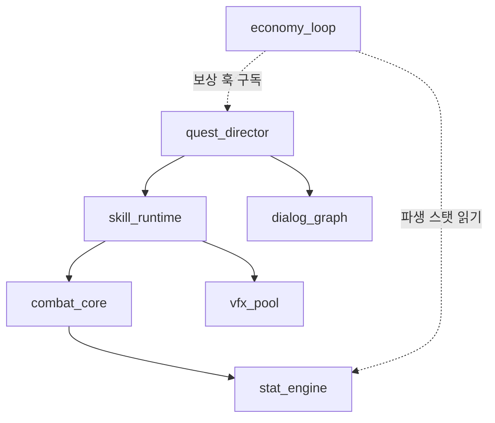
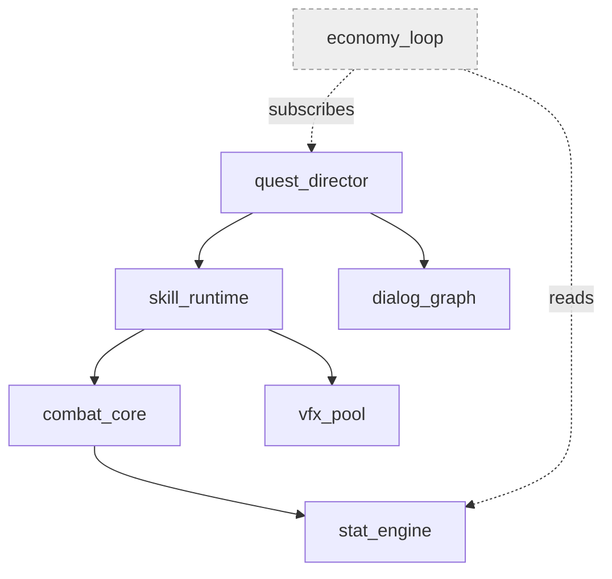
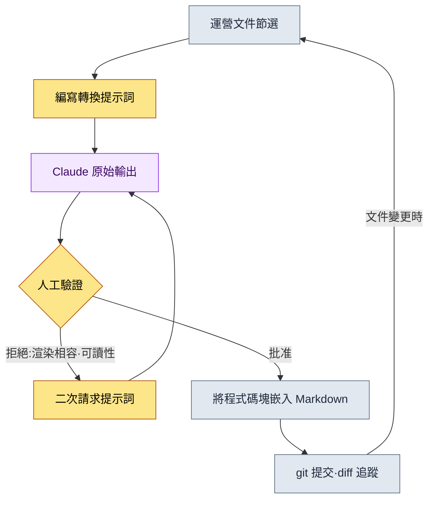
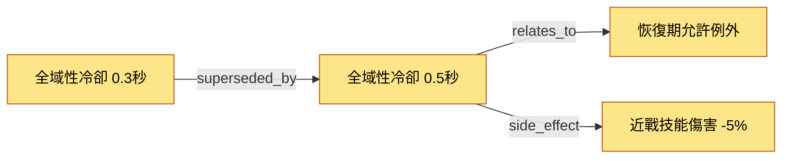

# 24.2 Mermaid 圖表自動化 —— 讓文件自己畫出自己的圖

一位新人策劃入職第三天問我:"前輩,這些系統之間以怎樣的順序相互影響,有沒有整理成圖的地方?"我猶豫了。圖是有的。半年前有人在白板上畫的照片,存在維基的某個角落裡。可那張圖裡,如今已經消失的兩個系統還活著,而其後新增的三個核心迴圈卻沒有畫進去。最終我答道:"別信圖,去讀文件。"這是個讓人羞愧的回答。當圖與文件不一致的那一刻,圖就不再是資訊,而成了錯誤資訊。

先把本章的結論說在前面:人手繪製的圖表,一兩個月內必定腐壞。因此必須把畫圖這件事從人的手上剝離,讓文件結構本身吐出自己的圖。本文用一次真實的操作記錄來展示這個過程。我把一段以文件為輸入、生成 Mermaid 程式碼的實操記錄(worked transcript,即完整保留的真實操作過程記錄)整段收錄,並在本頁真實渲染由此產出的圖表。也就是說,講解某種技法的文字,用這種技法的產物來證明它自己。

---

## 24.2.1 為什麼偏偏是 Mermaid

圖表工具很多。draw.io、Figma、Visio,甚至白板照片。這些工具有一個共同的陷阱:產物是圖片檔案(影像)。影像無法在 git 中逐行追蹤改動,處理文本的 LLM 無法直接生成或修改它,也無法以程式碼形式嵌入 Markdown 文件。從運營角度看,最致命的是第一點。一張無法追蹤誰在何時、為何改動的圖,時間一長就會變成無人負責的遺物。

Mermaid 一次解決這三點。把圖表寫成文本,渲染交給檢視器自行完成。因為是文本,`git diff` 連新增一個節點都能捕捉到。因為是文本,LLM 能讀能寫。因為是文本,它可以原樣放進 Markdown 程式碼塊。本章的正文正是明證。此刻你正在讀的這句話下面、即將出現的那些圖表,全都是 Markdown 裡的文本塊,會在本書構建過程中渲染成圖。

不過要防止誤解。完全沒有必要把所有運營資料都做成圖表。羅列條目用專案符號更快,比較數值用表格更快。Mermaid 勝出的場合只有三種:關係(什麼與什麼相連)、流程(什麼在什麼之後)、時序(誰在何時向誰傳送了什麼)。在這三者之外的場合硬塞圖表,反而會加重認知負擔。

---

## 24.2.2 主幹:從文件結構中抽取圖表的一次操作

從這裡開始,就是本章的主幹。這裡不做抽象講解,而是從頭到尾展示把一整塊真實文件轉換成 Mermaid 的過程。輸入是專案A運營文件中記錄系統依賴結構的一段 Markdown 片段(下面是經過匿名化的真實節選)。

````text
# 系統依賴備忘 (運營文件節選,匿名化)

- combat_core 依賴 stat_engine
- skill_runtime 依賴 combat_core
- skill_runtime 依賴 vfx_pool
- quest_director 依賴 skill_runtime
- quest_director 依賴 dialog_graph
- economy_loop 訂閱 quest_director 的獎勵鉤子
- economy_loop 讀取 stat_engine 的派生屬性
````

把它手工畫成圖表,是七個節點、七條箭頭。畫一次是畫得出來的。問題出在下週——當 `mail_box` 系統被加進來、`dialog_graph` 被拆成兩個的時候。手繪圖從那一刻起就開始說謊。所以,把這項轉換交給 LLM,而不是人。

### 第1步 —— 提示詞全文

下面是我實際投餵的提示詞。一個字都未加修飾,原樣收錄。

````text
請把下面的系統依賴備忘轉換成 Mermaid graph(自上而下,graph TB)。規則是:
1. 只把備忘中出現的系統作為節點,禁止新增系統。
2. "A 依賴 B" 寫作 A --> B。
3. "訂閱""讀取" 這類弱耦合,用虛線 -.-> 並標上關係名。
4. 節點 id 照用備忘中的英文名,不要加中文標籤。
只要程式碼塊,去掉說明和註釋。

[備忘]
- combat_core 依賴 stat_engine
- skill_runtime 依賴 combat_core
- skill_runtime 依賴 vfx_pool
- quest_director 依賴 skill_runtime
- quest_director 依賴 dialog_graph
- economy_loop 訂閱 quest_director 的獎勵鉤子
- economy_loop 讀取 stat_engine 的派生屬性
````

規則 1 和 4 是關鍵。把圖表交給 LLM 時,最常見的事故是"熱心的幻覺"。它會加上沒讓它加的節點("一般都會有登入系統,所以我加上了"),擅自貼上中文標籤,讓 ID 與正文檢索對不上。用規則來切斷這份熱心。

### 第2步 —— Claude 的原始輸出(無摘要)

下面是模型第一次返回的響應。不加提煉,原樣搬來。其中混著一個小問題,連這個問題一併收錄。

````text

````

語法沒問題,節點也正好七個。它沒有編造新系統。規則 1、4 都遵守了。可有一處讓我在意:虛線標籤裡用了韓文(`보상 훅 구독`、`파생 스탯 읽기`)。這並不算違反規則。規則 3 要求"標上關係名",模型忠實地照做了。只是我憑經驗知道,在 Mermaid 中,韓文標籤一旦含有空格,一些舊版渲染器就會渲染失敗。而這一點,模型無從知曉。

### 第3步 —— 人工驗證與拒絕

這一步在自動化中最常被省略,卻最重要。我沒有原樣接受輸出,而是拒絕了。拒絕理由有兩條。

第一,要把虛線標籤裡帶空格的韓文換成英文單詞(token),以確保渲染相容性。第二,弱耦合(虛線)和強耦合(實線)混在同一張圖裡,卻沒有顏色或樣式上的區分,一眼看不出來。我帶著這兩點重新提出了請求。

### 第4步 —— 二次請求的提示詞

````text
基本可以了。只改兩處。

1. 把虛線箭頭的標籤換成一個英文單詞(不含空格)。
   "보상 훅 구독" -> subscribes,"파생 스탯 읽기" -> reads
   原因:部分渲染器在韓文+空格的邊標籤上會渲染失敗。
2. 為了在視覺上區分虛線(弱耦合)節點與實線(強耦合)節點,
   給像 economy_loop 這樣只有弱耦合的節點,用 classDef 加上淺灰色樣式。
3. 其餘保持不變。
````

### 第5步 —— 二次請求得到的原始輸出

````text

````

這次我接受了。標籤換成了單個英文 token,只有 `economy_loop` 被單獨標成灰色,"這個系統不是直接依賴,而是僅通過訂閱、讀取相連的邊緣系統"這一資訊由顏色傳達了出來。如果我一行提示詞都不碰、純手工去畫,很可能連這個 classDef 都想不到。

### 主幹的產物 —— 就在此處真實渲染

上述實操記錄的最終輸出,不經手工謄抄,以程式碼塊原樣收進本書頁面。本書構建會把它畫成圖。這就是"用自己的技法證明自己"的實物。


一段文件節選,經過五輪往返,變成了進入 git、可由 LLM 更新、並在本頁渲染的運營資產。下週若加入 `mail_box`,只需在備忘裡寫一行,再投一次同樣的提示詞即可。用不著人動筆。

---

## 24.2.3 第二張圖:畫出這條自動化流水線本身

如果說前一張圖是"轉換的結果",這一張就是"轉換的過程"。我把剛才分五步走完的實操流程做成了流程圖。這張圖同樣是用相同方式交給 LLM 抽取的,並經過了相同的驗證。我把結果原樣收錄。



這張流程圖想說的有一點。我想強調的——不是用虛線,而是用粗箭頭——是中間那個菱形,也就是 `人工驗證`。若沉醉於"自動化"這個詞而把這個節點刪掉,第1步那種熱心的幻覺就會原樣寫進運營文件。自動化把人從畫圖中解放出來,卻不把人從判斷中解放出來。迴圈裡最後那條箭頭(`文件變更時` → `運營文件節選`)是關鍵。有了這條反饋迴路,圖表才不是一次性資料,而是與文件一同、不衰老而共同成長的資產。

---

## 24.2.4 轉換指令碼:不用 LLM 也能跑的確定性路徑

LLM 轉換很靈活,但當關系已經以結構化資料形式存在時,就沒必要專門去叫模型了。像專案A的決策卡這種欄位固定的資料,一個小小的 Python 指令碼更快也更誠實(幻覺從根源上就不可能發生)。下面是把決策卡列表轉換成決策圖 Mermaid 的實際指令碼的核心部分。

````python
# decision_graph_to_mermaid.py
# 決策卡（結構化資料）-> 轉換為 Mermaid graph。無需 LLM，確定性。

def to_mermaid(decisions):
    lines = ["graph LR"]
    # 1) 宣告節點:id 與標題照搬。不編造。
    for d in decisions:
        safe_title = d.title.replace('"', "'")   # 只對引號做 escape
        lines.append(f'    {d.id}["{safe_title}"]')
    # 2) 邊:把關係型別作為箭頭標籤。
    for d in decisions:
        for rel in d.relations:
            lines.append(f'    {d.id} -->|{rel.type}| {rel.target}')
    return "\n".join(lines)
````

關鍵在於只用兩步就結束。宣告節點,連線邊。輸入裡沒有的節點,絕不會出現在輸出裡。這個指令碼接收三張決策卡,就會得到下面這樣的圖。



一個決策被另一個決策取代(superseded_by),連由此派生的副作用(side_effect)也用一條箭頭呈現出來。不必讀完幾十行文本記錄的決策日誌,只要這一張圖,"為什麼現在冷卻時間是 0.5秒"的來龍去脈五分鐘內就能弄清。

何時用 LLM、何時用指令碼?判斷標準很簡單。輸入是結構化資料(欄位固定的卡片、表格)就用指令碼,輸入是自由文本(會議記錄、備忘、對話)就用 LLM。對結構化資料用 LLM,只會平白背上不必要的幻覺風險;對自由文本用指令碼,解析規則會無止境地膨脹。

---

## 24.2.5 四個陷阱與對策

這些是在運營圖表自動化的過程中實際踩過的雷。

第一,過於複雜的陷阱。節點超過五十個,圖就不再幫助認知,反而妨礙認知。對策是把一屏限制在二十到三十個之間,再大就用 subgraph 把區域圈起來,或者乾脆把圖一分為二。

第二,更新中斷的陷阱。人們容易以為這隻發生在手繪圖上,但即便做了自動化,只要不改輸入文件,一樣會腐壞。對策就是前面流程圖裡的那條反饋迴路。讓輸入文件成為單一事實來源(single source of truth),圖表始終從那裡重新生成。

第三,過於抽象的陷阱。"系統大致是這樣連在一起的"這種程度的圖很好看,卻沒用。對策是在節點裡填入真實 ID(`skill_runtime`、`D_B`),而不是抽象名詞。正文檢索與圖表共享同一識別符號,才能從圖直接跳到程式碼。

第四,不經稽核就直接使用 LLM 輸出的陷阱。正如主幹第3步所見,模型可以在遵守規則的同時,做出會導致渲染失敗的標籤。對策是絕不把人工驗證節點從流水線中拿掉。

---

## 24.2.6 效果 —— 誠實地講述變化

很想拿出數字,但這裡只講方向。下面的對比是作者在自己帶過的團隊裡體感到的變化,並非精確測量值,而是作者的估計(未經驗證)。

變化最鮮明的,是新人理解系統的速度。入職頭幾天才能搞清的"這些系統是怎麼連在一起的",在一張自動生成的依賴圖面前,縮短到了一小時上下。會議資料的準備也輕鬆了。以前開會前一天總得有人手工重畫一遍,現在把文件轉換一次就完事。最重要的是,過去當圖表與實際不符時冒出的"這張圖能信嗎"這個問題本身,幾乎消失了。輸入文件即是圖,文件對了,圖也就對了。

反過來老實說,自動化並非萬能。結構化程度還不高的早期階段的想法草圖,依然是白板更快。自動化要在結構大致定型之後才會發光。

---

## 本章要點

- 人手繪製的圖表必定腐壞,所以把畫圖這件事甩給文件結構。
- 自由文本用 LLM、結構化資料用指令碼來轉換,而驗證由人來做。
- 圖表與正文共享同一 ID,才能從圖跳到程式碼。

---

## 動手試試

**setup.** 一個儲存文件的 Markdown 倉庫,加上一個渲染 Mermaid 的檢視器(大多數 Markdown 檢視器和 git 託管都已內建),就夠了。從待轉換的文件中挑一段屬於"關係、流程、時序"的片段(例如系統依賴備忘)。

**prompt.** 把這段片段套進正文主幹第1步的提示詞模板,投給 LLM。務必加入兩條規則:"不要新增備忘裡沒有的節點""ID 照用原文英文名"。若是結構化資料,就別用 LLM,改用 `decision_graph_to_mermaid.py` 這類確定性指令碼來轉換。

**verify.** 把輸出的程式碼塊貼進 Markdown,實際渲染一遍。確認三點:(1) 有沒有冒出輸入裡沒有的節點,(2) 邊標籤有沒有渲染失敗,(3) 正文裡用的 ID 與圖表 ID 是否一致。只要有一處對不上,就用二次請求的提示詞拒絕掉、重新獲取。通過了就提交到 git —— 現在改動都會由 diff 追蹤。

### 單人精簡版

如果你是既沒有團隊也沒有指令碼的單人作業者,就這樣精簡。在筆記應用裡,把系統、待辦、想法之間的關係,用"A 依賴 B"格式的專案符號記下來。每週一次,把整份列表整個複製過去,丟一句"把這個轉換成 Mermaid graph TB,不要新增列表裡沒有的節點"。把返回的程式碼塊貼到筆記最上方。就這樣。因為不用手畫,沒有更新負擔;只要輸入列表還活著,圖就永遠是最新的。
