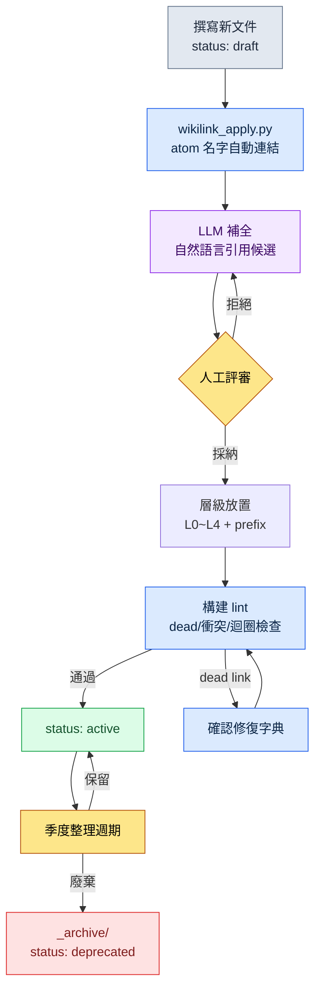

# 24.3 Wikilink 與文件層級 —— 連線與分類,檢索的兩個入口

> 連線(wikilink)與分類(層級)是同一個問題的兩個入口。一個回答"這個決策會牽連到哪裡",另一個回答"這份文件住在哪裡"。

新加入的策劃在第二天早上問道:"戰鬥的全域性冷卻值是 0.5 秒,對嗎?依據在哪份文件裡?"我答不上來。決策記錄肯定在某個地方,可我記不清那是戰鬥規則手冊、會議記錄,還是季度報告了。我們三個人湊在一起,用 grep 把整個資料夾翻了個遍。同一個數字在六處出現,可其中哪個是"原始決策"、哪個是"引用副本",根本分不清。我們花了 40 分鐘。最後找到的,是埋在會議記錄裡的一行字。

那天晚上,我意識到缺了兩樣東西。第一,文件之間沒有**顯式的連線**。同一個數字出現在六處,卻沒有任何地方寫下"這個是從那裡引用來的"這根線。第二,文件沒有安身的**層級**。決策記錄散落在規則手冊、會議記錄、報告裡,沒有"決策就住在這裡"的約定。

這兩樣東西就是本章的主題。wikilink 把連線寫成文本,層級把分類約定成資料夾。二者看似是分開的技法,實則是檢索這一個問題的兩面。

---

## 24.3.1 連線缺失時,什麼會崩塌

文件只有 30 份時,靠腦子全能記住。一旦超過 100 份,人的記憶就當不了索引了。這時能依靠的只有兩條路之一:用 grep 把全部掃一遍(慢且不準確),或者順著文件裡寫下的顯式連線走(快且準確)。

grep 不準確的原因很簡單。檢索 `combat_global_cooldown_constant` 這個字串時,**決定**了這個值的文件,和只是**提到**這個值的文件,會被一視同仁地撈出來。哪個是原始的,grep 並不知道。反過來,如果約定在文件裡寫 `[[combat_global_cooldown_constant]]` 這樣的雙方括號表記,那麼"這裡是有意引用那個 atom"的訊號就留在了字串本身。用 `\[\[combat_global_cooldown` 模式縮小範圍,偶然的提及就被排除,只剩下有意的引用。

這個一行的表記約定,就成了圖的一條邊(edge)。文件 A 寫下 `[[atom_X]]`,就產生了 A→X 方向的邊。200 份文件各自寫下幾條,不用誰去畫,圖就在文本里累積起來。

下面是我們專案裡 atom、決策、文件被 wikilink 串聯起來的一個片段。節點顏色表示種類,箭頭表示引用方向。

<svg viewBox="0 0 720 360" xmlns="http://www.w3.org/2000/svg" font-family="sans-serif" font-size="12">
  <defs>
    <marker id="arrow" markerWidth="9" markerHeight="9" refX="8" refY="3" orient="auto" markerUnits="strokeWidth">
      <path d="M0,0 L8,3 L0,6 Z" fill="#555"/>
    </marker>
  </defs>
  <!-- edges -->
  <g stroke="#888" stroke-width="1.4" marker-end="url(#arrow)" fill="none">
    <line x1="180" y1="80" x2="350" y2="150"/>
    <line x1="180" y1="240" x2="350" y2="160"/>
    <line x1="430" y1="150" x2="560" y2="90"/>
    <line x1="430" y1="170" x2="560" y2="240"/>
    <line x1="180" y1="80" x2="180" y2="220"/>
  </g>
  <!-- doc nodes (blue) -->
  <g>
    <rect x="90" y="58" width="180" height="44" rx="6" fill="#dbeafe" stroke="#2563eb"/>
    <text x="180" y="84" text-anchor="middle" fill="#1e3a8a">[[CombatFormula_v3]]</text>
    <rect x="90" y="218" width="180" height="44" rx="6" fill="#dbeafe" stroke="#2563eb"/>
    <text x="180" y="244" text-anchor="middle" fill="#1e3a8a">[[Meeting_W21]]</text>
  </g>
  <!-- atom node (green) -->
  <g>
    <rect x="350" y="134" width="180" height="48" rx="6" fill="#dcfce7" stroke="#16a34a"/>
    <text x="440" y="155" text-anchor="middle" fill="#14532d">[[combat_global_</text>
    <text x="440" y="171" text-anchor="middle" fill="#14532d">cooldown_constant]]</text>
  </g>
  <!-- decision nodes (amber) -->
  <g>
    <rect x="560" y="68" width="150" height="44" rx="6" fill="#fef3c7" stroke="#d97706"/>
    <text x="635" y="94" text-anchor="middle" fill="#92400e">[[D2026_Q2_017]]</text>
    <rect x="560" y="218" width="150" height="44" rx="6" fill="#fef3c7" stroke="#d97706"/>
    <text x="635" y="244" text-anchor="middle" fill="#92400e">[[D2026_Q2_018]]</text>
  </g>
  <!-- legend -->
  <g font-size="11">
    <rect x="90" y="312" width="14" height="14" fill="#dbeafe" stroke="#2563eb"/>
    <text x="110" y="324" fill="#333">文件</text>
    <rect x="170" y="312" width="14" height="14" fill="#dcfce7" stroke="#16a34a"/>
    <text x="190" y="324" fill="#333">atom</text>
    <rect x="250" y="312" width="14" height="14" fill="#fef3c7" stroke="#d97706"/>
    <text x="270" y="324" fill="#333">決策</text>
  </g>
</svg>

這個小片段展示的是:新策劃那個問題的答案,其實早已在圖裡。順著進入 `combat_global_cooldown_constant` atom 的箭頭反向追溯,就能找到決策 `D2026_Q2_017`。不是 40 分鐘,而是一次反向引用。

---

## 24.3.2 表記約定 —— 四種類型,一種格式

我們把用 wikilink 串聯的物件只定為四種。種類一多,格式就會鬆動;格式一鬆動,grep 又會變得不準確。

- **atom 引用** —— `[[combat_global_cooldown_constant]]`。指向單文件單決策單元的 atom。
- **決策引用** —— `[[D2026_Q2_017]]`。以季度和編號標識的決策記錄。
- **文件引用** —— `[[CombatFormula_v3]]`。規則手冊、規格文件等大型文件。
- **人員引用** —— `[[團隊成員 A]]`。負責人、決策者。

四種全部是 `[[name]]` 一種格式。name 必須全域性唯一。如果 atom 名字在兩處衝突,就會在圖裡合併成同一個節點,釀成"戰鬥的 cooldown"和"UI 的 cooldown"變成一個節點的事故。所以在 atom 命名規則裡,強制加上領域 prefix(`combat_`、`ui_`)。

---

## 24.3.3 wikilink_apply.py —— 應用與修復

只有表記約定還不夠。讓人手工給 200 份文件一個個加方括號是不現實的,就算加好了,只要 atom 名字一改就全斷了。所以我們執行一個做兩件事的指令碼。第一是**應用**(apply)——把正文中出現的已知 atom 名字自動轉成 wikilink。第二是**修復**(heal)——找出被改名或斷掉的連結,加以更新和上報。

`wikilink_apply.py` 的核心部分長這樣。

```python
# wikilink_apply.py — 將正文中的 atom 名字應用為 [[wikilink]],並修復斷掉的連結
import re
from pathlib import Path

WIKILINK = re.compile(r"\[\[([A-Za-z0-9_]+)\]\]")
# 只捕獲尚未成為連結、以裸名出現的 atom 名字(前面沒有 [[ 的情況)
BARE_NAME = lambda name: re.compile(rf"(?<!\[\[)(?<![A-Za-z0-9_])({re.escape(name)})(?![A-Za-z0-9_])(?!\]\])")

def load_known_atoms(registry: Path) -> set[str]:
    # _atom_registry.tsv:第一列是當前有效的 atom name
    return {ln.split("\t")[0].strip()
            for ln in registry.read_text(encoding="utf-8").splitlines()
            if ln.strip() and not ln.startswith("#")}

def apply_links(text: str, known: set[str]) -> tuple[str, int]:
    applied = 0
    for name in sorted(known, key=len, reverse=True):  # 長名字優先:防止部分匹配汙染
        text, n = BARE_NAME(name).subn(rf"[[{name}]]", text)
        applied += n
    return text, applied

def heal_links(text: str, known: set[str], aliases: dict[str, str]) -> tuple[str, list[str]]:
    dead = []
    def repl(m):
        ref = m.group(1)
        if ref in known:
            return m.group(0)              # 存活 → 原樣保留
        if ref in aliases:                  # 已改名的 atom → 修復為新名字
            return f"[[{aliases[ref]}]]"
        dead.append(ref)                    # 真正的 dead link → 上報
        return m.group(0)
    return WIKILINK.sub(repl, text), dead
```

這裡有兩個設計選擇,是正文的脊椎。

第一,`apply_links` **先替換長名字**。當存在 `combat_cooldown` 和 `combat_cooldown_global` 兩個 atom 時,如果先替換短的那個,長的那個的前半部分就會被汙染。按長度降序排序的這一行,擋住了這個事故。這是我第一次寫的時候漏掉的地方,直到真的出現了 `[[combat_cooldown]]_global` 這樣斷掉的結果,才補上。

第二,`heal_links` **經由改名字典**(aliases)來修復。當 atom 名字從 `combat_gcd` 改成 `combat_global_cooldown_constant` 時,把舊名字自動替換成新名字,只有在字典裡也找不到時,才作為 dead link 上報。名字每改一次,不用手工去改 200 份文件,只需加一行 alias。

---

## 24.3.4 實操記錄 —— 把 wikilink 補全交給 Claude

自動 apply 只會給"已知的 atom 名字"加連結。但正文裡不寫 atom 名字、而是用自然語言展開的句子("戰鬥的全域性冷卻是 0.5 秒")它抓不到。把這類自然語言引用轉成 wikilink 候選,LLM 比人快。下面是實際往來的完整實操記錄(worked transcript,即完整保留的真實操作過程記錄)——輸出沒有做摘要,連我拒絕的部分也原樣保留。

**我的提示詞(全文):**

```
我給你一段戰鬥規則手冊和一份已登記的 atom 清單。請在正文中找出指向這些
atom 的自然語言表達,以表格形式提出 [[wikilink]] 候選。只在確定時提出,模糊
時只標註"模糊"即可。不要重寫正文,只說哪個語句改成哪個連結。未登記的
概念請單獨歸入"新增 atom 候選"。

[已登記的 atom]
combat_global_cooldown_constant
combat_skill_cast_interrupt_rule
combat_resource_regen_rate

[正文]
戰鬥的全域性冷卻為 0.5 秒,對所有主動技能通用。
施法過程中被擊中,施法會被打斷。但恢復類技能除外。
資源再生只有在非戰鬥狀態下才以正常速度恢復。
```

**Claude 輸出(原始未加工):**

```
建議的 wikilink:

| 正文語句                          | 候選連結                                | 確信 |
|----------------------------------|----------------------------------------|------|
| "戰鬥的全域性冷卻為 0.5 秒"          | [[combat_global_cooldown_constant]]    | 高   |
| "施法過程中被擊中,施法會被打斷"    | [[combat_skill_cast_interrupt_rule]]   | 高   |
| "資源再生只有在非戰鬥狀態下"        | [[combat_resource_regen_rate]]         | 中   |

新增 atom 候選:
- "恢復類技能除外" → 這條例外規則在已登記的 atom 中任何一處都
  沒有明確寫出。看來需要一個像 combat_skill_cast_interrupt_heal_exception
  這樣的獨立 atom。(模糊:它也可能是 interrupt_rule 的下位條款,
  無法判定是否為獨立 atom)

注意:"資源再生"這一行,由於沒看到 atom 定義,無法確定
combat_resource_regen_rate 指的是"再生速度"還是"非戰鬥條件",故確信為中。
```

**我的驗證與拒絕:**

三行裡我接受了兩行。全域性冷卻和施法中斷與 atom 定義完全一致。第三行"資源再生"這一行,Claude 自己把確信降到"中"是對的 —— `combat_resource_regen_rate` atom 只定義了**速度值**,而"只有在非戰鬥狀態下"這個**條件**歸另一個 atom 管轄。如果照樣加連結,就會釀成把"條件"錯誤連到"速度" atom 上的事故。**我拒絕了。**

新增 atom 候選的指摘是準確的。"恢復類例外"確實在任何地方都沒有 atom。只是 Claude 說模糊的那部分("是 interrupt_rule 的下位條款,還是獨立 atom")屬於人來判斷的範疇,我決定把它拆分為獨立 atom。

**再次請求:**

```
"資源再生"這一行不要加連結。改為把 [[combat_resource_regen_rate]] 只
限定為"速度","非戰鬥條件"拆分為新增 atom。請分別為這兩個 atom 各寫
一行定義。恢復例外也作為獨立 atom 寫一行定義。
```

在這一來一回中,LLM 做的不是"從 0 造出候選",而是"幫我挑選候選"。關鍵在於,**人有明確可以拒絕之處**。若是自動釋出,一個錯誤的連結就會永久留在圖裡。

---

## 24.3.5 lint —— 在構建階段擋住斷掉的連線

連結隨時間會斷。atom 被廢棄、名字被改、錯別字混進來。所以每次構建都跑一遍 wikilink lint。檢查項與處理如下。

- **dead link** —— `[[name]]` 的 name 不在登錄檔裡 → 構建警告,確認修復字典
- **格式違規** —— 違反 snake_case、prefix 規則 → 阻斷
- **名字衝突** —— 同一個 name 出現在兩個 atom 上 → 阻斷(全域性唯一性被打破)
- **迴圈引用** —— A→B→A → 警告(有意為之則列入允許清單)
- **過度引用** —— 一份文件對同一個 atom 引用 10 次以上 → 警告(疑似噪聲)

只把 dead link 設為警告而非阻斷,是有意的。在給 atom 改名的中間狀態會短暫出現 dead,如果把這個當成構建失敗來擋,作業就停了。取而代之,讓它先確認修復字典。格式違規和名字衝突則立即阻斷 —— 這兩者會汙染整張圖。

> 這個 lint 是自我證明的。wikilink_apply.py 造出的連結,由同一套系統的 lint 來檢查,其結果又作為另一個 atom 決策留存。工具用自己的標準驗證自己的產物,這個閉環是運營的基本骨架。

---

## 24.3.6 分類 —— 文件安身的層級

到這裡是連線。現在是分類。如果說 wikilink 回答"這個決策會牽連到哪裡",那麼層級回答"這份文件住在哪裡"。兩者都缺,新策劃的 40 分鐘檢索就會重演。

我們的文件資料夾分為四層。這個層級與資訊架構的 Layer 統合共享同一套骨架 —— 願景、系統、內容、元資訊各佔一層。

```
docs/
├── L0_vision/              願景(5 份以下,幾乎不變)
├── L1_systems/             各領域規則手冊
│   ├── combat/
│   ├── narrative/
│   └── ui/
├── L2_content/             單個內容
│   ├── characters/
│   └── quests/
└── L4_meta/                運營·決策·會議·原子
    ├── decisions/
    ├── meetings/
    ├── reports/
    └── atoms/
```

L3 空著,是因為資料表和 DB 佔了那個位置(是表格而非文件)。新策劃要找的決策住在 `L4_meta/decisions/` —— 單單有這一個約定,40 分鐘檢索本可以用"決策就在那裡"這一句話結束。

要讓層級作為檢索入口發揮作用,得同時守住五點。缺任何一點,分類都會崩。

1. **按語義分類,禁止按時間。** `combat/`、`narrative/` 能被檢索到,但 `2026-Q1/`、`2026-Q2/` 六個月後沒人會開啟。時間由 git 記錄,沒理由再用資料夾分一遍。
2. **深度不超過 4。** `L1_systems/combat/skills/active/single_target/attack.md` 是 5 層。路徑一超過一屏,人就沒法把位置裝進腦子。
3. **檔名 prefix。** 用 `spec_`、`report_`、`decision_`、`char_` 把種類放進檔名。不看資料夾也能看出種類。
4. **每個資料夾都有 README。** 每個資料夾的定義、內容、命名規則由 README 寫下。這是新加入者的第一個入口。
5. **`_` prefix 元資訊資料夾。** `_archive/`、`_TEMPLATES/`、`_NAMING/` 在自動排序中會排到上面,不與正式內容混在一起。

文件不會停在一個位置。撰寫期間以 `status: draft` 住在正式資料夾裡,啟用後變成 `status: active`,廢棄時**不是刪除**而是移到 `_archive/` 並標上 `status: deprecated`。不刪除廢棄資料是鐵律。六個月後有人問"那個決策為什麼被推翻了?"時,答案只在廢棄資料裡。若是刪掉了,就沒有辦法事後重新找回決策的依據。

大的變更不只交給 git,還在 frontmatter 裡以 change_log 留存。

```yaml
---
title: combat_global_cooldown_rule
version: v3
last_modifier: teammate_a
change_log:
  - v1 (2025): 初稿
  - v2 (2025): cooldown 0.3 → 0.5  ([[D2026_Q2_017]])
  - v3 (2026): 新增恢復例外        ([[D2026_Q2_018]])
---
```

請注意,change_log 裡的決策 ID 是用 wikilink 寫的。連線與分類在這裡相遇。文件住在層級中的一個位置(分類),但它的變更歷史連向決策圖(連線)。一份 frontmatter 同時開啟兩個入口。

---

## 24.3.7 每季度一次,整理週期

層級放著不管就會腐爛。空資料夾冒出來,擱了六個月的 draft 越堆越多,深度悄悄增加。所以每季度整理一次。刪掉空資料夾,給超過六個月的 draft 決定啟用還是廢棄,把深度 5 以上的平攤,給沒有 README 的資料夾補寫或廢棄,`_archive` 超過一半就壓縮儲存。沒有這個週期,層級就會被噪聲塞滿,訊號與噪聲的區分隨之消失。

把整個流程看成一張圖就是這樣。文件進來、被連線、被分類、被驗證、直到被廢棄,是一個閉環。



在這個閉環裡,連線(B·C·D·F)與分類(E·I·J)交替運作。二者不是各轉各的,而是在一份文件的生命週期裡相互咬合。

---

## 24.3.8 效果 —— 什麼發生了怎樣的改變

這些數字是作者在自己專案裡對比引入前後的**方向性**。不是精密測量值,而是同一件工作在兩種環境下做時,體感到的差異大小(作者觀察,未精密計量)。

在連線和層級立起來之前,新策劃的決策追溯問題,像開頭那個 40 分鐘的例子一樣,長的時候要花一兩個小時。引入之後,一次 atom 反向引用 —— 是分鐘量級。文件檢索從 5\~10 分鐘縮短到 30 秒上下,這是層級的語義分類與 prefix 一起作用的結果。因錯誤引用導致的事故(把已廢棄的值誤當作現行值那一類)從每季度好幾件減到一兩件 —— wikilink 明示了"這裡引用的是那個 atom",複製的值和原始的值不再混淆。

變化最大的是**新加入者的適應**。沒有層級,光是熟悉哪個資料夾裡有什麼就要花好幾天;沒有連線,就無從把握各系統之間如何交織。兩者齊備之後,靠資料夾 README 熟悉位置,順著 wikilink 圖自行探索系統間的關係。"只有問才知道的東西"變成了"順著走就看得見的東西"。

這個效果只有在兩個入口**同時**存在時才出現。只有連線沒有分類,圖是有了,卻不知道文件住在哪裡;只有分類沒有連線,資料夾是乾淨的,卻不知道決策牽連向何處。

---

## 24.3.9 常見失敗與處方

連線這一側最常見的失敗是**噪聲連結**。以為 wikilink 好,就給所有名詞都加方括號,圖就會被無意義的邊塞滿,視覺化工具隨之失靈。原則是隻留下能提出並回答"這份文件與那份文件是什麼關係"的連結。其次是**自動釋出** —— 把 LLM 造的連結不經評審就提交,就會像實操記錄裡"資源再生"那一行那樣,把錯誤的連線永久留下。apply 是自動的,釋出則由人來做。

分類這一側的失敗大多是五條原則的違反。按時間分資料夾、深度 5 以上、檔名無規則、缺 README。還有最難挽回的 —— **刪除廢棄資料**。被刪掉的決策依據無法重建。送往 `_archive` 的那一行,守住了六個月後的學習資料。

---

### 本章要點

- 連線與分類是檢索的兩個入口,只有一個,新加入者的 40 分鐘檢索就會重演。
- wikilink 自動應用 atom 名字,但 LLM 候選必須給人留下拒絕的餘地才安全。
- 廢棄資料不是刪除,而是儲存到 `_archive`,決策的依據才能事後存活。

---

## 動手試試 —— wikilink + 層級的最小引入

**setup.** 在文件資料夾裡建 `L0_vision/` `L1_systems/` `L2_content/` `L4_meta/` 四個資料夾,給每個資料夾放一行 README。把 atom 名字清單彙集到 `_atom_registry.tsv` 一個檔案裡(第一列 = atom name)。

**prompt.** 把正文一段和已登記的 atom 清單交給 LLM,這樣請求 —— "在正文中找出指向這些 atom 的自然語言表達,以表格形式提出 `[[wikilink]]` 候選。只在確定時提出,模糊時只標註'模糊'。不要重寫正文。未登記的概念歸入'新增 atom 候選'。"

**verify.** 對每個被提議的連結,都與 atom 定義對照。只有當 atom 指向的物件與正文指向的物件**完全**相同時才採納,條件、屬性、例外一旦不符就拒絕。採納後用 `grep "\[\[name\]\]"` 確認連結是否真的輸入了、有沒有 dead link。

**單人精簡版.** 想不用指令碼也不用 lint 就開始,兩行規則就夠。(1)決策一律放在 `decisions/` 一個資料夾裡,以 `decision_*.md` 命名。(2)其他文件提到那個決策時,寫作 `[[decision_id]]`。只守住這兩行,"那個決策在哪兒?"這個問題就能用一次 `grep "\[\[decision_"` 回答。工具在文件超過 100 份之後再引入也不遲。
