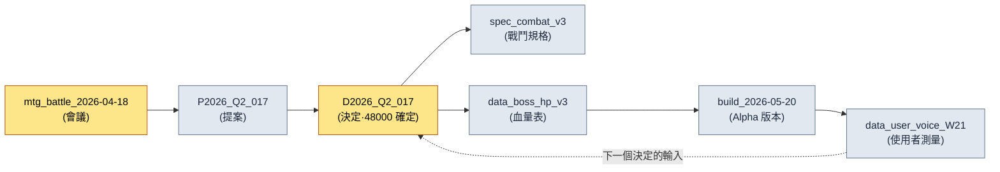

# 24.4 來源追蹤·data lineage

> 懷疑資料的那一刻,總是來得太晚。往往要等到錯誤的數值已經錄入線上構建之後,才會開始追問"這個數字到底是從哪兒來的"。

---

Alpha 版本釋出前的那個週五傍晚,組員 B 走到我工位旁。他手裡的筆記型電腦上開著一份戰鬥數值電子表格。"總監,Boss 第一階段的血量,表裡寫的是 48,000,可進到構建裡的值卻是 52,000。這兩個到底哪個對?"

我不知道。準確地說——在那個當下,沒有人知道。表裡的 52,000 可能是反映了幾天前會議決定的最新值,也可能是有人把未經驗證的值臨時填了進去。48,000 也可能是那次會議之前的共識值。兩個數字都很像那麼回事。像那麼回事並不等於有依據。

要回答這個問題,就得沿著來源一路回溯。是在哪次會議上決定的,那次會議的輸入是什麼,是誰把它謄進了表裡。然而,一旦這條追蹤的鏈條只存在於人的記憶裡,答案就會變成"我明天去問一下組員 A"。運營(LiveOps)進行到第六個月時,這類懸而未決的問題會堆積如山。data lineage——資料的譜系——正是讓這座山根本不會形成的基礎設施。

核心只有一條:來源不能靠手寫。由人事後補錄的來源記錄,撐不過一個月。只有在資料被建立的那一刻自動記錄下來的來源,才能存活下來。

---

## 24.4.1 資料來源斷裂的五種代價

自動記錄 `_source_map.tsv` 中的一行,成本只是幾毫秒。而當這一行缺失時,要付出的代價會朝五個方向蔓延開來。

<svg viewBox="0 0 720 300" xmlns="http://www.w3.org/2000/svg" font-family="sans-serif">
  <rect x="280" y="120" width="160" height="60" rx="8" fill="#1f2933" stroke="#0b3d2e"/>
  <text x="360" y="148" fill="#ffffff" font-size="15" text-anchor="middle">來源斷裂</text>
  <text x="360" y="168" fill="#9fb3c8" font-size="12" text-anchor="middle">(未記錄 source)</text>

  <rect x="20" y="20" width="170" height="44" rx="6" fill="#e8f0fe" stroke="#1967d2"/>
  <text x="105" y="40" fill="#1a1a1a" font-size="12.5" text-anchor="middle">無法驗證</text>
  <text x="105" y="56" fill="#5f6368" font-size="11" text-anchor="middle">"這個數值從哪來?"</text>

  <rect x="530" y="20" width="170" height="44" rx="6" fill="#e8f0fe" stroke="#1967d2"/>
  <text x="615" y="40" fill="#1a1a1a" font-size="12.5" text-anchor="middle">變更遺漏</text>
  <text x="615" y="56" fill="#5f6368" font-size="11" text-anchor="middle">原始更新→衍生擱置</text>

  <rect x="20" y="236" width="170" height="44" rx="6" fill="#fce8e6" stroke="#c5221f"/>
  <text x="105" y="256" fill="#1a1a1a" font-size="12.5" text-anchor="middle">法務暴露</text>
  <text x="105" y="272" fill="#5f6368" font-size="11" text-anchor="middle">外部資產依據丟失</text>

  <rect x="530" y="236" width="170" height="44" rx="6" fill="#fce8e6" stroke="#c5221f"/>
  <text x="615" y="256" fill="#1a1a1a" font-size="12.5" text-anchor="middle">事故診斷延遲</text>
  <text x="615" y="272" fill="#5f6368" font-size="11" text-anchor="middle">無法反向追溯錯誤值</text>

  <rect x="275" y="236" width="170" height="44" rx="6" fill="#fef7e0" stroke="#f29900"/>
  <text x="360" y="256" fill="#1a1a1a" font-size="12.5" text-anchor="middle">交接損失</text>
  <text x="360" y="272" fill="#5f6368" font-size="11" text-anchor="middle">"為何如此決定?"無答案</text>

  <line x1="280" y1="135" x2="190" y2="55" stroke="#5f6368" stroke-width="1.5"/>
  <line x1="440" y1="135" x2="530" y2="55" stroke="#5f6368" stroke-width="1.5"/>
  <line x1="280" y1="165" x2="190" y2="245" stroke="#c5221f" stroke-width="1.5"/>
  <line x1="440" y1="165" x2="530" y2="245" stroke="#c5221f" stroke-width="1.5"/>
  <line x1="360" y1="180" x2="360" y2="236" stroke="#f29900" stroke-width="1.5"/>
</svg>

陷阱在於:這五種代價,沒有任何一種會在建立資料的那一刻顯現出來。它們全都是在幾周後、幾個月後、經手人換了之後,賬單才寄到。所以來源絕不能成為"以後再整理"的物件,它必須在被建立的那一刻就記錄下來。

---

## 24.4.2 _source_map.tsv —— 來源對映的標準骨架

專案A 運營中的來源對映檔案只有 `_source_map.tsv` 一個。用製表符分隔的文本,理由很簡單:人可以一眼讀完一行,指令碼用一次 `split('\t')` 就能解析,git diff 也能幹淨地展示單行的變更。CSV 一旦正文裡混入逗號就會出錯,JSON 則讓人難以一行讀完。

```tsv
asset_id	source_type	source	created	creator	notes
spec_combat_v3	internal	mtg_battle_2026-04-18	2026-04-18	teammate_a	decision_D2026_Q2_017 依據
data_boss_hp_v3	internal	decision_D2026_Q2_017	2026-04-18	teammate_b	第一階段 48000 確定
asset_K_001_concept	internal_ai_assisted	imagegen + teammate_b 整理	2026-04-20	teammate_b	legal_review 完成
data_user_voice_W21	external_aggregated	forum + community + sns	2026-05-25	auto_collect	13.1 管線產出
ref_visual_tone_a	external_reference	refgame (2024)	2026-04-15	teammate_c	視覺基調參考，無直接借用
```

六個欄位的角色都很明確。`asset_id` 是資料的唯一鍵,`source_type` 是分類(下文詳述),`source` 是來源的位置——會議 ID、決定 ID、採集管線、外部作品名,`created`/`creator` 是何時·由誰,`notes` 是供人閱讀的一行上下文。

回頭再看第二行和第三行,上一節裡組員 B 的問題就有了答案。`data_boss_hp_v3` 的來源是 `decision_D2026_Q2_017`,notes 裡填的是"第一階段 48000 確定"。構建裡的 52,000 並不在這條 lineage 中。也就是說,52,000 是未經驗證的臨時值,正確答案是 48,000。這個問題在 1\~2 分鐘內就能了結——不必調動任何人的記憶,也不必毀掉一個週五的傍晚。

不過,這個檔案上還掛著另一條規則。只要有人用手工方式編輯 `_source_map.tsv`,`integrity_check` 的 audit 就會給出 FAIL。理由留到下一節講——因為來源只應由自動方式記錄。

---

## 24.4.3 source_type 五種 —— 分類即處理規則

把來源分成五類,並不是出於整理癖,而是因為每一種 source_type 所附帶的運營規則各不相同。

<svg viewBox="0 0 720 270" xmlns="http://www.w3.org/2000/svg" font-family="sans-serif">
  <rect x="20" y="20" width="210" height="48" rx="6" fill="#e6f4ea" stroke="#137333"/>
  <text x="32" y="40" fill="#1a1a1a" font-size="13" font-weight="bold">internal</text>
  <text x="32" y="58" fill="#5f6368" font-size="11">會議·proposal·決定 → 僅追蹤</text>

  <rect x="20" y="76" width="210" height="48" rx="6" fill="#e6f4ea" stroke="#137333"/>
  <text x="32" y="96" fill="#1a1a1a" font-size="13" font-weight="bold">internal_ai_assisted</text>
  <text x="32" y="114" fill="#5f6368" font-size="11">AI 生成+人工整理 → 標明來源</text>

  <rect x="20" y="132" width="210" height="48" rx="6" fill="#fef7e0" stroke="#f29900"/>
  <text x="32" y="152" fill="#1a1a1a" font-size="13" font-weight="bold">external_aggregated</text>
  <text x="32" y="170" fill="#5f6368" font-size="11">使用者測量 → 標明採集日·樣本</text>

  <rect x="20" y="188" width="210" height="48" rx="6" fill="#fce8e6" stroke="#c5221f"/>
  <text x="32" y="208" fill="#1a1a1a" font-size="13" font-weight="bold">external_reference</text>
  <text x="32" y="226" fill="#5f6368" font-size="11">第三方作品 → legal_review 必需</text>

  <rect x="20" y="244" width="210" height="22" rx="6" fill="#e8f0fe" stroke="#1967d2"/>
  <text x="32" y="259" fill="#1a1a1a" font-size="12" font-weight="bold">self_measured</text>

  <rect x="280" y="20" width="420" height="246" rx="8" fill="#f8f9fa" stroke="#dadce0"/>
  <text x="300" y="48" fill="#1a1a1a" font-size="13" font-weight="bold">分類 → 處理規則對映</text>
  <text x="300" y="78" fill="#3c4043" font-size="12">internal 系列：能用決定 ID 反向追溯即通過</text>
  <text x="300" y="104" fill="#3c4043" font-size="12">ai_assisted：notes 必須寫明用了哪個工具·哪段提示詞</text>
  <text x="300" y="130" fill="#3c4043" font-size="12">aggregated：沒有采集時間就無法解讀數值</text>
  <text x="300" y="156" fill="#c5221f" font-size="12">reference：legal_review 為空則 audit FAIL ← 強制</text>
  <text x="300" y="182" fill="#3c4043" font-size="12">self_measured：模擬/KPI，建議在 notes 寫明覆現條件</text>
  <text x="300" y="222" fill="#5f6368" font-size="11.5">→ source_type 不是標籤，而是</text>
  <text x="300" y="242" fill="#5f6368" font-size="11.5">  檢查器讀取並據此分支的開關</text>
</svg>

來看 `external_reference` 這一行。如果某個資產把 refgame 當作視覺基調的參考,那麼這個資產在未經法務審查前就不能進入構建。source_type 是 `external_reference`,而 legal_review 記錄為空時,audit 就會攔下它。這正是標籤不止步於標籤、而成為檢查器所讀取的開關的地方。所謂五種分類是運營信任的骨架,指的就是這種強制力。

---

## 24.4.4 自動記錄 —— 在建立的那一刻留下的一行

現在是核心。來源必須在資料生成的時刻被自動記錄。專案A 的 `source_tracker.py` 掛在資產生成的鉤子(hook)上。

```python
# source_tracker.py
import time, getpass, csv
from pathlib import Path

SOURCE_MAP = Path("_source_map.tsv")
VALID_TYPES = {
    "internal", "internal_ai_assisted",
    "external_aggregated", "external_reference", "self_measured",
}

def track_source(asset_id: str, source_type: str, source: str, notes: str = ""):
    if source_type not in VALID_TYPES:
        raise ValueError(f"unknown source_type: {source_type}")
    if source_type == "external_reference" and "legal_review" not in notes:
        raise ValueError(f"{asset_id}: external_reference 資產必須標註 legal_review")

    record = [
        asset_id,
        source_type,
        source,
        time.strftime("%Y-%m-%d"),
        getpass.getuser(),
        notes,
    ]
    with SOURCE_MAP.open("a", encoding="utf-8", newline="") as f:
        csv.writer(f, delimiter="\t").writerow(record)
```

只要這個函式掛在資產生成管線上——在表格被 export 時、概念資產被登記時、使用者資料被彙總時——就會自動 append 一行來源。沒有任何一個環節需要人去記著做,事後補錄的負擔趨近於 0。

用 `getpass.getuser()` 自動填充 `creator` 欄位這一點雖小,卻是決定性的。讓人自己填名字,就會出現空格;讓系統來填,就不會有空格。而且,`external_reference` 一旦缺少 legal_review,記錄本身就會被直接拒絕——這就堵死了沒有來源的外部資產進入系統的通道。

這裡我要點出 AI 應用的真實樣貌。這個 `track_source` 函式的初稿,是我讓 Claude 給的。下面是那段實操記錄(worked transcript,完整保留的真實操作過程記錄)的一條主幹。

**我的提示詞(全文):**

```
寫一個往 _source_map.tsv 裡 append 一行來源的 Python 函式。
列:asset_id、source_type、source、created(今天的日期)、
creator(當前 OS 使用者)、notes。用製表符分隔。
source_type 限定為 5 種:internal、internal_ai_assisted、
external_aggregated、external_reference、self_measured。
```

**Claude 的原始輸出(未作概括):**

```python
import csv, datetime, os

def track_source(asset_id, source_type, source, notes=""):
    record = [asset_id, source_type, source,
              datetime.date.today().isoformat(),
              os.getlogin(),          # ← 當前使用者
              notes]
    with open("_source_map.tsv", "a", newline="") as f:
        csv.writer(f, delimiter="\t").writerow(record)
```

> 如果您想加上 source_type 的校驗,可以建一個 VALID_TYPES 集合,
> 在函式開頭做檢查即可。需要的話,我幫您加進去嗎?

**我的驗證與否決:**

這段輸出能跑,但在兩處不符合我們的運營。第一,`os.getlogin()` 在 cron 或 CI 中被呼叫時,會因環境不同而丟擲空字串或丟擲異常。我們的 export 管線也會以無人值守的排程執行。所以我把它換成了 `getpass.getuser()`——它讀取環境變數,能更穩定地取到使用者。第二,Claude 把 source_type 校驗作為"需要的話幫您加"的選項留著,但對我們來說,那不是選項,而是必需。一旦沒有校驗,拼寫錯誤的 source_type 就會混進來,分類隨之崩塌。

**我的再次請求:**

```
換成 getpass.getuser()。另外,source_type 校驗不要作為選項,
而要作為必需固化進函數里。此外,當型別是 external_reference,
而 notes 裡沒有 legal_review 字串時,請丟擲 ValueError。
我想從源頭杜絕沒有經過法務審查的外部資產被記錄下來。
```

這次再請求的結果,就是上面給出的最終版 `source_tracker.py`。要點在於,並不是 Claude 的第一版輸出錯了,而是因為我知道 AI 所不瞭解的運營約束——無人值守的排程、legal_review 強制——才需要否決與再請求。AI 通常能快速給出一般意義上正確的程式碼,而人負責驗證"在我們的環境裡對不對"。那個驗證點,恰恰成了來源追蹤系統的設計決策。

---

## 24.4.5 audit FAIL —— 阻止手工編輯的完整性檢查

前面說過,只要有人用手工編輯 `_source_map.tsv`,`integrity_check` 就會給出 FAIL。它是怎麼抓到的?

原理很簡單。每當 `track_source` append 一行,就把該行的核心欄位(asset_id、source_type、source、created、creator)序列化後生成雜湊,累積到單獨的 `.source_map.audit` 檔案裡。audit 檢查會重新讀取 `_source_map.tsv`,用同樣的方式重新計算雜湊,再比對兩份雜湊列表。

```python
# integrity_check 中 source_map audit 部分
def audit_source_map():
    fails = []
    rows = read_tsv(SOURCE_MAP)
    expected = read_lines(AUDIT_FILE)   # append 時累積的雜湊

    for i, row in enumerate(rows):
        h = row_hash(row["asset_id"], row["source_type"],
                     row["source"], row["created"], row["creator"])
        if i >= len(expected) or h != expected[i]:
            fails.append(f"L{i+1} {row['asset_id']}: 疑似手工編輯（雜湊不一致）")

    if len(rows) != len(expected):
        fails.append(f"行數不一致: tsv={len(rows)} audit={len(expected)}")
    return fails
```

假設有人在表格裡把 `data_boss_hp_v3` 的 source 手工改成了 `decision_D2026_Q2_099`。這一行的雜湊便與 audit 中累積的原始雜湊對不上,檢查會輸出如下內容。

```
[FAIL] source_map audit
  L3 data_boss_hp_v3: 疑似手工編輯（雜湊不一致）
  → 未經過 track_source() 的變更。來源只能通過程式碼路徑記錄。
```

這種強制為什麼重要?一旦允許手工編輯,終究會有人在趕時間時把來源"看似合理地"填進去。那一刻,lineage 就從真相淪為一份裝著某人猜測的檔案。audit FAIL 給"來源只能走自動路徑"這條規則裝上了牙齒。§24.1 的 verification 系統會把這個 audit 與其他檢查捆在一起,在 CI 中執行。

---

## 24.4.6 變更傳播 —— 源頭一變,喚醒衍生

自動記錄來源的真正理由,在於反向查詢:"源頭 X 變了,哪些會受影響?"

```python
def find_derivatives(source_id: str):
    return [
        row for row in read_tsv(SOURCE_MAP)
        if row["source"] == source_id
    ]

# 用法：decision_D2026_Q2_017 在會議上被推翻
deps = find_derivatives("decision_D2026_Q2_017")
# → [spec_combat_v3, data_boss_hp_v3, ...]
```

假設 `decision_D2026_Q2_017` 在下一次會議上被推翻,Boss 第一階段的血量從 48,000 改成了 50,000。呼叫 `find_derivatives`,就會立刻列出掛在這個決定上的所有衍生資產——戰鬥規格文件、血量資料表。通知會發送給各資產的負責人,而"仍盯著舊決定的資產"殘留在構建裡的事故,便從每季度數起減少到幾乎為 0。

靠手寫的來源,這種反向查詢根本無法成立。來源若是自由文本,`decision_D2026_Q2_017` 在某一行會被寫成"Q2 017 決定",在另一行又寫成"第二季度第 17 次會議決定",匹配就此破裂。唯有具備 `_source_map.tsv` 的標準格式與 `track_source` 的自動記錄,變更傳播才能真正運轉起來。

---

## 24.4.7 lineage 圖 —— 一屏之內的資料譜系

`_source_map.tsv` 逐行來看是平面的,但當一個 source 成為另一個資產的 source 時,資料的譜系便串成了鏈條。把這條鏈條鋪展到一屏之內,決定所依據的輸入的可信度就一目瞭然。這張 mermaid 圖,是由 §24.2 的圖表自動生成管線讀取 `_source_map.tsv` 後直接產出的——相當於用自身的技法來證明自身的資產。



迴圈會自然而然地出現。構建產出使用者資料,使用者資料又成為下一個決定的輸入。一旦看得見這個迴圈,"這個數值從哪來"就變成了螢幕上的一條路徑。組員 B 那個週五的問題,在這張圖裡,不過是沿著 `Data → Decision` 回溯一步而已。

---

## 24.4.8 度量 —— lineage 運營的成效

在專案A,我比較了引入 lineage 系統前後的情況。下表中的時間數值是作者估算(未經驗證),應當看方向與比例的差異,而非絕對值。件數則是從每季度的 audit 日誌中統計出的實測值。

| 專案 | 無 lineage | lineage 運營 | 性質 |
|---|---|---|---|
| 掌握資料來源的時間 | 1\~2 小時 | 1\~2 分鐘 | 作者估算(未經驗證) |
| 資料可信度的驗證依據 | 資深者記憶 | 即時查詢來源 | 定性 |
| 源頭變更時的衍生遺漏 | 每季度 5\~8 件 | 0\~1 件 | audit 日誌實測 |
| 外部資產法務審查遺漏 | 可能發生 | 0 件(強制記錄) | audit 日誌實測 |
| 每季度 audit 耗時 | 1\~2 天 | 2\~3 小時 | 作者估算(未經驗證) |

最硬的數字是"源頭變更時的衍生遺漏"這一行。因為 audit 日誌裡原樣留有決定 ID 和被遺漏的衍生資產,所以能數得出來。時間數值受測量環境(團隊規模·資產數量)影響很大,因此明確標註為估算。方向是清楚的——一旦來源被自動記錄,追蹤就從記憶變成了查詢。

---

## 24.4.9 常見失敗與處方

| 失敗模式 | 處方 |
|---|---|
| 事後用手工填補來源 | 用 `track_source` 在生成時刻自動記錄 |
| 來源格式各行不一 | `_source_map.tsv` 製表符標準 + 強制格式 |
| 外部資產法務審查遺漏 | 在 source_type 校驗中強制 legal_review |
| 手工編輯 `_source_map.tsv` | 用 `integrity_check` audit 做雜湊比對 FAIL |
| 源頭變更時放任衍生 | `find_derivatives` 反向查詢 + 通知 |
| 只用文字說明譜系 | 用 mermaid 自動生成,一屏視覺化 |

六條處方的共同點是,它們都不依賴人的自覺。自動記錄·格式強制·雜湊比對·反向查詢,全都由系統來做。因為來源追蹤之所以崩潰,唯一的原因就是"人會忘"。

---

## 24.4.10 第 24 部分收尾

第 24 部分是用自動化來支撐運營信任的四條支線。第 1 章用 verification 把驗證收攏到一個點,第 2 章用 mermaid 自動生成畫出結構,第 3 章用 wikilink 與 document hierarchy 把文件連線並分層,最後在這第 4 章,用來源與譜系為資料的信任加上了封印。

貫穿這四章的一句話是這樣的。**運營的信任,來自系統的記錄,而非人的記憶。** 正如 verification 自動追問"這份產出物是否合乎規則",lineage 也自動回答"這份資料從何而來"。二者的關鍵都在於:即便人忘了,它們也不會崩塌。

這套運營經驗,與全書的 Layer 統一設計哲學同出一脈。願景(資產化·信任)落到系統(來源規則),系統落到資料(`_source_map.tsv`),資料再落到構建·QA(audit·自動更新)——這是一條自上而下的鏈條。這條鏈條本身,就是 lineage。

---

### 本章要點
- 來源必須在建立的那一刻自動記錄,事後補錄的來源撐不過一個月。
- `_source_map.tsv` 標準與 source_type 五種,是變更傳播與法務強制的骨架。
- 只有用 audit FAIL 攔住手工編輯,lineage 才能作為真相留存。

---

## 動手試試(setup → prompt → verify)

**setup.** 在專案根目錄下建立 `_source_map.tsv`,以一行表頭(`asset_id\tsource_type\tsource\tcreated\tcreator\tnotes`)起頭,並放入上面的 `source_tracker.py`。在資產 export·登記指令碼的末尾掛上 `track_source(...)` 呼叫。

**prompt.** 如果需要來源自動記錄函式,可以這樣請求 Claude。

```
寫一個往 _source_map.tsv(製表符分隔,列:asset_id、source_type、source、
created、creator、notes)裡 append 一行的 Python 函式。
source_type 限定為 5 種,並且當型別是 external_reference 而 notes 裡
沒有 legal_review 時,丟擲 ValueError。creator 用 getpass.getuser()。
```

**verify.** 親自確認兩件事。(1) 用 `external_reference` 呼叫但把 notes 留空,看是否丟擲 ValueError。(2) 用文本編輯器把 `_source_map.tsv` 的 source 欄位改動一個字元,再執行 `integrity_check` 的 source_map audit,看是否出現 FAIL。兩處都被攔住,就說明來源通道已經封閉。

### 單人精簡版
如果是一個人工作,`_source_map.tsv` 一個檔案加 `track_source` 一個函式就夠了。integrity audit·反向查詢·mermaid 自動化,可以等到資產超過幾十個、來源開始變得容易混淆時,再一個一個加上去。起點只是"在填寫數值時,把一行來源自動留在同一個位置"這一個習慣。
