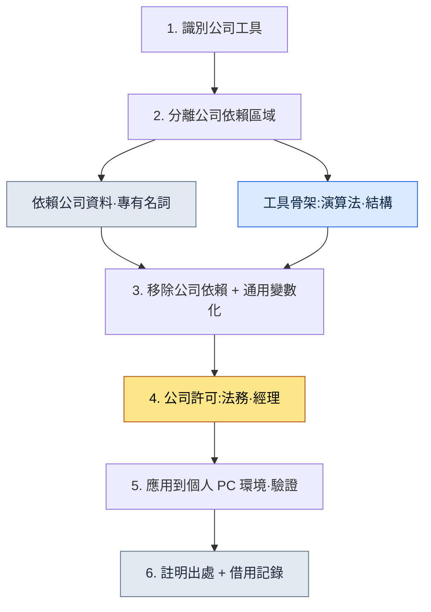

# 附錄 B. 工具借用流程(從公司到個人的通用化)

> 本附錄整理了作者把在公司專案A中構建並運營的工具·技能,拿到個人 PC 和一般性工作中重新使用的流程。核心問題只有一個:"如何在不侵犯公司知識資產的前提下,只合法地借用從中學到的工具骨架?"本附錄展示瞭如何劃定這條邊界,把什麼拿了過來、又把什麼留在原處,以及如何將這些決定留存為記錄。

本附錄的使用方法如下:先對照自己的處境閱讀 B.1 的五條原則,再把 B.3 的流程原樣走一遍。然後複製 B.4 的記錄模板,按照自己想借用的工具填寫即可。既然處理的是公司資產,那麼比起"快",能"留下記錄"更為優先,整篇附錄都是以這一視角構建的。

---

## B.1 借用的五條原則

這是在拿取工具之前已達成共識的五條原則。這五條不是順序,而是必須同時滿足的條件——只要其中一條崩塌,就擱置借用本身。前三條是關於"拿取什麼"的技術邊界,後兩條是關於"如何堂堂正正地拿取"的流程邊界。

| 原則 | 說明 |
|---|---|
| 1. 不包含公司 IP | 移除公司名·實名·專有名詞 |
| 2. 只拿取工具骨架 | 遮蔽公司領域資料 |
| 3. 通用化重構 | 重新構建為一般使用場景 |
| 4. 引用·出處明確 | 註明為從公司借用的工具 |
| 5. 法務·人事共識 | 走完公司的許可流程 |

最常動搖的一行是第 2 條。演算法與結構(骨架)可以拿取,但如果連那套骨架所預設的公司資料格式也一併帶過來,那一刻就等於把 IP 也拿走了。把骨架與資料剝離開來的工作,才是借用的主體。

---

## B.2 借用的六種工具·技能

按照原則實際拿到個人 PC 的工具共有六種(截至 2026 年 5 月)。它們有一個共同點——都是處理資料的工具,而這並非偶然。因為資料處理工具的骨架(解析·轉換·視覺化邏輯)與領域(公司表格的具體格式)相對更容易剝離。

| 工具 | 公司原版 | 個人通用版 |
|---|---|---|
| excel-reader | xlsm 表格·VBA 提取 | 通用 Excel 處理 |
| relation-map-gen | FK 關係 HTML | 通用資料關係圖 |
| schema-doc | 從表格生成 Markdown 模式(schema) | 通用模式文件化 |
| table-creator | 批次生成資料表格 | 通用表格生成 |
| gdd-gen | 自動生成 GDD | 通用文件生成 |
| gdd-export | 從 Markdown 轉換為多表格 xlsx | 通用 xlsx 轉換 |

對比表格的中間與右側兩欄,就能看出通用化意味著什麼。左邊那欄是"公司表格""GDD"這類帶有領域的名稱,右邊那欄是"通用 Excel""通用文件"這類剝掉領域的名稱。名稱中公司消失,正是通用化的第一個訊號。

---

## B.3 借用流程

把原則(B.1)落到實際操作上,就是下面六個步驟。最關鍵的分岔點是第 2 步和第 4 步。若在第 2 步沒能把骨架與領域乾淨地分開,後面所有步驟都會被汙染;若跳過第 4 步的公司許可,那麼無論做得多好,都會成為一件無法使用的工具。



六個步驟中最耗時的一環,不是編碼工作(第 2·3 步),而是第 4 步——公司達成共識與法務通過。這意味著最大的關卡不是技術,而是信任;因此借用總是按照先談妥共識、再打磨程式碼的順序推進。

---

## B.4 借用記錄

對借用的工具,必須一併留下記錄。因為日後可能會有人追問"這件工具從哪裡來、移除了什麼、得到了誰的許可"。下面是以 excel-reader 為例的記錄模板,你可以直接複製這個框架,按照自己的工具填寫。

```yaml
---
tool: excel-reader (個人通用版)
original_source: 公司專案A
adopted: 2026-05
permission: 公司經理 + 法務通過
modifications:
  - 移除對公司表格格式的依賴
  - 移除公司領域函式(xlsm VBA)
  - 泛化為通用 csv/xlsx 處理
  - 全面移除公司名·實名引用
usage_in_book: 本書的工具案例引用 (Part 1·5·6·8 等)
---
```

模板中的日期欄(`adopted`)要像 `2026-05` 這樣寫成確定的年-月。"2026 年 5 月前後"之類的隨意寫法看起來像是留待日後填寫的空格,因此要當場把確定借用的時點釘死。

這份記錄中最有價值的兩行是 `permission` 和 `modifications`。前一行證明借用是正當的,後一行證明剝離了什麼。有了這兩行,即使日後有人提出疑問,也留有可供追溯的依據。

---

## B.5 未借用的工具

拿走了什麼固然重要,留下了什麼同樣重要。這裡記下了公司工具中被有意不予借用的部分及其理由。這些被留下的工具有一個共同點:要麼是公司的核心 IP,要麼深深繫結在公司組織結構上,以致無法把骨架與領域剝離開來。

| 工具 | 未借用理由 |
|---|---|
| 公司戰鬥系統工具 | 公司核心 IP,公司獨佔 |
| 公司敘事文件工具 | 依賴公司世界觀 |
| 公司戰鬥 TF 工具 | 依賴公司組織結構 |
| 公司人事·財務工具 | 不適配外部環境 |

這與 B.2 中拿走的工具全部是"資料處理"形成了鮮明對比。拿走的是能與領域分離的工具,留下的是與領域渾然一體的工具。可分離性決定了可借用性。

---

## B.6 讀者參考 —— 借用前的自查表

最後,這是在拿取工具之前必須讓自己逐一通過的五個專案。這張表是一份判定合格/不合格的檢查清單——只有五項全部通過才借用,只要有一項卡住就擱置。沒有"大體上還行"這回事。因為處理公司資產的工作,容不得部分通過。

| 檢查專案 | 通過標準 |
|---|---|
| 是否已獲得公司許可 | 經理·法務的明確同意 |
| 是否通過法務審查 | 書面或有記錄的確認 |
| 是否已完全移除公司 IP | grep watchlist 檢查為 0 件 |
| 是否驗證了通用性 | 確認在其他環境中也能執行 |
| 是否有事故應對流程 | 定義了追蹤·回收路徑 |

請不要把這五項讀作五格的通過,而要讀作五道鎖。把在公司學到的東西正當地變為個人的資產,這件事確實可行,但那份正當性只有在這五道鎖全部扣上時才成立。
