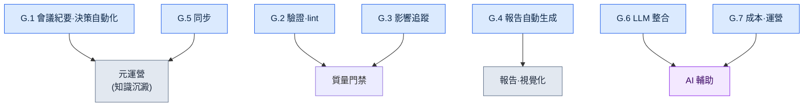

# 附錄 G. 運營指令碼案例集

本附錄是把正文中提到的運營自動化指令碼彙集到一處的案例集。正文在行文中說明了每個指令碼"為什麼需要",但真要動手做類似的工具時,還需要一張能一眼看清"哪些指令碼以什麼角色歸為一組"的地圖。本附錄就是這張地圖。

這裡一併寫出了指令碼名稱、一句話說明,以及正文在哪一節討論過它。對於能夠乾淨利落地一般化的核心指令碼(G.1.1 格式檢查·G.2.1 一致性檢查·G.3.1 關係圖·G.7.1 成本追蹤器),以及 G.8 的測試·hook 示例,我們用與公司資料無關的通用骨架重新編寫,並驗證其可直接執行,收錄的是實測程式碼。輸入示例、輸出乃至退出碼,都是實際執行確認過的值。其餘條目只寫了名稱、角色和關聯的正文小節,其中緣由會在附錄 G.9 中如實說明。讀者可以把實測程式碼條目當作範本,自行做出適合自己環境的實現。

用法如下。先確定想要自動化的工作性質(是驗證,是生成報告,還是同步),然後翻到對應的小節(G.1\~G.7)。在那裡選出最接近的指令碼,再前往括號中的正文小節編號,確認其背景與設計意圖。最後對照 G.8 的運營原則,檢查自己的指令碼是否遵守了這些原則。

按角色把全部指令碼歸組,如下所示。



---

## G.1 會議紀要·決策自動化

讓會議中產生的決策不致散失、而是沉澱為知識資產的一組指令碼。從會議紀要驗證到 atom 提取,再到正式升格,一脈相連。

### G.1.1 meeting_lint.py

檢查會議紀要是否具備既定格式(必需的頭部·必需的章節)的指令碼。格式散亂的會議紀要會導致後續自動提取失效,因此在入口處攔截(17.2.2)。

下面是與公司資料無關的通用骨架。只用標準庫(僅 sys),可直接執行。它檢查 Markdown 會議紀要的頭部(由 `---` 包裹的塊)鍵與正文章節標題(`## ...`)是否齊全。若有缺失就報出 violation 並 exit 1,全部齊全則 exit 0。

```python
#!/usr/bin/env python3
"""meeting_lint.py

檢查 Markdown 會議紀要是否具備既定格式。
- 頭部(--- 塊)中是否包含全部必需鍵。
- 正文中是否包含全部必需的章節標題(## ...)。
若有缺失項就輸出 violation 並 exit 1,沒有則 exit 0。
只使用標準庫。

用法:
    python meeting_lint.py meeting.md
"""
import sys

REQUIRED_FRONTMATTER = ["type", "date", "category", "attendees"]
REQUIRED_SECTIONS = ["## 議題", "## 決策", "## 行動項", "## 下次會議"]


def lint(text):
    """接收會議紀要正文字串,返回缺失項列表(violation)。"""
    violations = []

    # 頭部:若首行是 ---,則把到下一個 --- 之間視為頭部。
    lines = text.splitlines()
    front = []
    if lines and lines[0].strip() == "---":
        for line in lines[1:]:
            if line.strip() == "---":
                break
            front.append(line)
    front_keys = [ln.split(":", 1)[0].strip() for ln in front if ":" in ln]
    for key in REQUIRED_FRONTMATTER:
        if key not in front_keys:
            violations.append({"kind": "frontmatter", "missing": key})

    # 章節:正文中是否原樣包含相應的標題行。
    body_lines = [ln.strip() for ln in lines]
    for section in REQUIRED_SECTIONS:
        if section not in body_lines:
            violations.append({"kind": "section", "missing": section})

    return violations


def main(argv=None):
    argv = sys.argv[1:] if argv is None else argv
    if len(argv) != 1:
        sys.stderr.write("用法: python meeting_lint.py meeting.md\n")
        return 2
    with open(argv[0], encoding="utf-8") as f:
        violations = lint(f.read())

    for v in violations:
        print(f"[VIOLATION] {v['kind']}: {v['missing']}")
    if violations:
        sys.stderr.write(f"[FAIL] 格式違規 {len(violations)}處\n")
        return 1
    sys.stderr.write("[PASS] 格式合格\n")
    return 0


if __name__ == "__main__":
    sys.exit(main())
```

兩個常量就是檢查基準。例如,把一份頭部缺少 `attendees`、正文沒有 `## 下次會議` 的會議紀要傳入,就會像下面這樣報出兩處,退出碼為 1。

```text
[VIOLATION] frontmatter: attendees
[VIOLATION] section: ## 下次會議
```

### G.1.2 decision_parser.py

讀取會議紀要的"決策"章節,自動抽取知識 atom 候選的指令碼。替代過去由人逐條謄抄的工作(17.2.3)。

### G.1.3 promote.py

把待審(pending)狀態的 atom 升格到正式 atom 資料夾的指令碼。在自動提取與正式資產之間設一道人工評審關卡(17.2.6)。

---

## G.2 驗證·lint

自動查出資料與內容是否違反規則的質量門禁。讓機器先過濾掉人眼容易遺漏的一致性錯誤。

### G.2.1 integrity_check_id_uniqueness.py

驗證資料項的 ID 是否唯一、無重複的指令碼。ID 衝突是要到執行時才爆發的事故,因此在資料階段就加以攔截(10.1.2)。

下面是與公司資料無關的通用骨架。只用標準庫(csv·json·sys·argparse),原樣儲存即可直接執行。輸入採用任何遊戲資料都可能具備的簡單格式,即帶 `id` 列的 CSV。

```python
#!/usr/bin/env python3
"""integrity_check_id_uniqueness.py

檢查 CSV 資料的 id 列是否唯一。
- 若存在重複 id,就輸出 violation 列表並 exit 1。
- 全部唯一則 exit 0。
只使用標準庫。

用法:
    python integrity_check_id_uniqueness.py data.csv
    python integrity_check_id_uniqueness.py data.csv --id-column quest_id
"""
import argparse
import csv
import json
import sys


def find_duplicate_ids(rows, id_column):
    """在 rows(字典列表)中查詢 id_column 值的重複項。

    返回:violation 列表。每一項形如
    {"id": 值, "row_numbers": [從 1 開始的行號, ...]}。
    把表頭算作第 1 行,資料首行從 2 開始計數。
    """
    seen = {}  # id 值 -> 出現過的行號列表
    for index, row in enumerate(rows):
        row_number = index + 2  # 從表頭(第 1 行)之後開始
        key = row.get(id_column, "")
        seen.setdefault(key, []).append(row_number)

    violations = []
    for key, row_numbers in seen.items():
        if len(row_numbers) > 1:
            violations.append({"id": key, "row_numbers": row_numbers})
    violations.sort(key=lambda v: v["row_numbers"][0])
    return violations


def load_rows(csv_path):
    with open(csv_path, newline="", encoding="utf-8") as f:
        return list(csv.DictReader(f))


def main(argv=None):
    parser = argparse.ArgumentParser(description="CSV id 唯一性檢查")
    parser.add_argument("csv_path", help="要檢查的 CSV 檔案路徑")
    parser.add_argument("--id-column", default="id", help="用作 id 的列名(預設: id)")
    args = parser.parse_args(argv)

    rows = load_rows(args.csv_path)
    violations = find_duplicate_ids(rows, args.id_column)

    # G.8 輸出標準:把 violation_list 以 JSON 形式輸出到標準輸出。
    print(json.dumps({"violation_list": violations}, ensure_ascii=False, indent=2))

    if violations:
        sys.stderr.write(f"[FAIL] 發現重複 id {len(violations)}處\n")
        return 1
    sys.stderr.write("[PASS] 無重複 id\n")
    return 0


if __name__ == "__main__":
    sys.exit(main())
```

輸入示例(`data.csv`):

```text
id,name
Q001,初次委託
Q002,遺失的佩飾
Q001,初次委託(重複)
```

執行結果如下。`Q001` 在第 2 行和第 4 行出現了兩次,因此報出一處 violation,退出碼為 1。

```json
{
  "violation_list": [
    {
      "id": "Q001",
      "row_numbers": [2, 4]
    }
  ]
}
```

### G.2.2 voice_lint.py

檢查 NPC 臺詞的"聲音"(voice,即語氣·性格)一致性的指令碼。抓出同一角色在各章使用不同語氣的偏差(5.2·5.4)。

### G.2.3 visual_regression.py

在資源(美術·UI 等)發生變化時,比對是否產生了非預期視覺變化的迴歸檢查指令碼(12.1.5)。

---

## G.3 影響追蹤

追蹤"改動一處會牽動什麼"的一組指令碼。沿著文件·決策·資源之間的連線,展示變更的波及範圍。

### G.3.1 wikilink_graph.py

抓取文件間的 Wikilink(`[[目標]]`)、自動構建連線圖的指令碼。讓人一眼看清哪個文件引用了哪個文件(24.3.4)。

下面是與公司資料無關的通用骨架。只用標準庫(os·re·json·argparse)。它讀取一個資料夾中的 `.md` 檔案,把檔名(去掉副檔名)當作節點,把 `[[...]]` 連結當作邊。結果會一併輸出鄰接表與 Mermaid 圖示程式碼。

```python
#!/usr/bin/env python3
"""wikilink_graph.py

把資料夾中 .md 文件的 [[Wikilink]] 連線構建為圖。
- 節點:去掉副檔名的檔名。
- 邊:文件正文中的 [[目標]] 標記。若為 [[目標|顯示]] 形式,只取目標。
只使用標準庫。

用法:
    python wikilink_graph.py ./docs
    python wikilink_graph.py ./docs --format mermaid
"""
import argparse
import json
import os
import re
import sys

WIKILINK = re.compile(r"\[\[([^\]|#]+)")  # [[目標]] / [[目標|顯示]] / [[目標#錨點]]


def extract_links(text):
    """從正文中按出現順序、去重地提取連結目標名稱。"""
    result = []
    for match in WIKILINK.findall(text):
        target = match.strip()
        if target and target not in result:
            result.append(target)
    return result


def build_graph(doc_dir):
    """遍歷資料夾中的 .md,構建 {文件名: [連結目標, ...]} 鄰接表。"""
    graph = {}
    for name in sorted(os.listdir(doc_dir)):
        if not name.endswith(".md"):
            continue
        node = name[:-3]
        path = os.path.join(doc_dir, name)
        with open(path, encoding="utf-8") as f:
            graph[node] = extract_links(f.read())
    return graph


def to_mermaid(graph):
    """把鄰接錶轉換為 Mermaid flowchart 程式碼字串。"""
    lines = ["flowchart LR"]
    for node, targets in graph.items():
        if not targets:
            lines.append(f'    {_id(node)}["{node}"]')
        for target in targets:
            lines.append(f'    {_id(node)}["{node}"] --> {_id(target)}["{target}"]')
    return "\n".join(lines)


_ID_CACHE = {}


def _id(name):
    """Mermaid 節點 id 必須是 ASCII。非 ASCII 名稱(如中文)會按首次出現的
    順序賦予 n1、n2、…… 這樣的短 ASCII id,並在標籤[...]中保留原名。"""
    if name not in _ID_CACHE:
        _ID_CACHE[name] = "n%d" % (len(_ID_CACHE) + 1)
    return _ID_CACHE[name]


def main(argv=None):
    parser = argparse.ArgumentParser(description="Wikilink 連線圖構建器")
    parser.add_argument("doc_dir", help="存放文件(.md)的資料夾")
    parser.add_argument("--format", choices=["json", "mermaid"], default="json")
    args = parser.parse_args(argv)

    graph = build_graph(args.doc_dir)
    if args.format == "mermaid":
        print(to_mermaid(graph))
    else:
        print(json.dumps(graph, ensure_ascii=False, indent=2))
    return 0


if __name__ == "__main__":
    sys.exit(main())
```

輸入示例(資料夾 `docs/` 中的三個檔案):

```text
docs/世界觀.md      正文中有 [[地區_漢陽]] 和 [[勢力_義禁府]] 連結
docs/地區_漢陽.md   正文中有 [[勢力_義禁府]] 連結
docs/勢力_義禁府.md  無連結
```

以 `--format mermaid` 執行,會得到下面的圖示程式碼。節點按檔名順序(世界觀 → 勢力_義禁府 → 地區_漢陽)處理,標籤中原樣保留原本的名稱。哪個文件伸向何處、終點(`勢力_義禁府`)是什麼,都一目瞭然。

```text
flowchart LR
    n1["世界觀"] --> n2["地區_漢陽"]
    n1["世界觀"] --> n3["勢力_義禁府"]
    n3["勢力_義禁府"]
    n2["地區_漢陽"] --> n3["勢力_義禁府"]
```

### G.3.2 decision_impact.sh

分析某個決策卡會影響哪些文件·資源的指令碼。在推翻決策之前,先確認其波及範圍(18.4.3)。

### G.3.3 find_skills_using.py

反向找出使用某個資源的技能的指令碼。在修改·刪除資源之前,先弄清依賴它的地方(11.2.4)。

---

## G.4 報告自動生成

把散落的資料彙整為人可閱讀的報告·圖示的指令碼。將反覆的定期彙報自動化,減少費手的工作。

### G.4.1 alpha_gap_report_generator.py

彙總 Alpha 階段相對目標的缺口(gap),自動生成周報的指令碼(10.3.3)。

### G.4.2 decision_graph_to_mermaid.py

把決策卡之間的連線關係轉換為 Mermaid 圖示程式碼的指令碼。用圖來看決策流(24.2.3)。

### G.4.3 weekly_kpi_summary.py

按周彙總主要指標(KPI)的指令碼(13.2)。

---

## G.5 同步

高效地對齊分散在多處的資料的指令碼。不必每次複製全部,只挑出變更的部分進行同步。

### G.5.1 incremental_sync.py

只挑出會議紀要的變更部分、而非全部進行同步的指令碼。資料越積越多,全量複製就越慢,因此採用增量方式(17.5.4)。

### G.5.2 基於 git diff 的變更檢測

利用 git 的 diff 高效檢測發生了哪些變更的做法。無需額外的追蹤裝置,直接把 git 本身當作變更檢測器(17.5.4.1)。

---

## G.6 LLM 整合

把分類·呼叫這類需要判斷的工作交給 LLM 的指令碼。用 LLM 輔助來處理規則無法乾淨拆解的事情。

### G.6.1 faq_classifier.py

把收到的 FAQ 按類別自動分類的指令碼(13.1.3)。

### G.6.2 meeting_classifier.py

把會議按性質類別自動分類的指令碼。用於填充會議紀要頭部的 category(17.3.6)。

### G.6.3 prompt_library_loader.py

從預先整理好的提示詞庫中載入所需提示詞的指令碼。避免每次重複編寫相同的提示詞(22.1.2)。

---

## G.7 成本·運營

管理自動化本身,使其不致製造成本與資料追蹤盲區的指令碼。

### G.7.1 llm_cost_tracker.py

追蹤 LLM 呼叫成本並施加上限(cap)的指令碼。在事前而非事後阻止成本暴漲(22.3.5)。

下面是與公司資料無關的通用骨架。只用標準庫(json·os·argparse)。它記錄每次呼叫的 token 數並計算累計成本,超過上限就發出拒絕訊號(exit 2)。單價是程式碼中的常量,實際值可替換為各自所用模型的單價表(下面的值是用於說明的佔位值)。

```python
#!/usr/bin/env python3
"""llm_cost_tracker.py

累計記錄 LLM 呼叫 token 並檢查每日成本上限。
- record:把單次呼叫(輸入/輸出 token)累加到 ledger 檔案。
- 累計成本超過 cap 時以 exit 2 阻止呼叫(事前攔截)。
只使用標準庫。

用法:
    python llm_cost_tracker.py --ledger ledger.json --in 1200 --out 800
    python llm_cost_tracker.py --ledger ledger.json --in 1200 --out 800 --cap-usd 5.0
"""
import argparse
import json
import os
import sys

# 單價:每 1,000 token 的 USD。用於說明的佔位值——請替換為實際模型的單價表。
PRICE_PER_1K_INPUT = 0.003
PRICE_PER_1K_OUTPUT = 0.015


def cost_of(in_tokens, out_tokens):
    """用輸入/輸出 token 計算單次呼叫的成本(USD)。"""
    return (in_tokens / 1000) * PRICE_PER_1K_INPUT + (out_tokens / 1000) * PRICE_PER_1K_OUTPUT


def load_ledger(path):
    if os.path.exists(path):
        with open(path, encoding="utf-8") as f:
            return json.load(f)
    return {"calls": 0, "in_tokens": 0, "out_tokens": 0, "total_usd": 0.0}


def save_ledger(path, ledger):
    with open(path, "w", encoding="utf-8") as f:
        json.dump(ledger, f, ensure_ascii=False, indent=2)


def main(argv=None):
    parser = argparse.ArgumentParser(description="LLM 成本追蹤·上限")
    parser.add_argument("--ledger", required=True, help="累計記錄 JSON 檔案路徑")
    parser.add_argument("--in", dest="in_tokens", type=int, required=True, help="本次呼叫的輸入 token")
    parser.add_argument("--out", dest="out_tokens", type=int, required=True, help="本次呼叫的輸出 token")
    parser.add_argument("--cap-usd", type=float, default=None, help="累計成本上限(USD)。超過則攔截")
    args = parser.parse_args(argv)

    ledger = load_ledger(args.ledger)
    this_cost = cost_of(args.in_tokens, args.out_tokens)

    ledger["calls"] += 1
    ledger["in_tokens"] += args.in_tokens
    ledger["out_tokens"] += args.out_tokens
    ledger["total_usd"] = round(ledger["total_usd"] + this_cost, 6)
    save_ledger(args.ledger, ledger)

    print(json.dumps({"this_call_usd": round(this_cost, 6), "ledger": ledger}, ensure_ascii=False, indent=2))

    if args.cap_usd is not None and ledger["total_usd"] > args.cap_usd:
        sys.stderr.write(f"[CAP] 累計 {ledger['total_usd']} USD > 上限 {args.cap_usd} USD —— 攔截\n")
        return 2
    return 0


if __name__ == "__main__":
    sys.exit(main())
```

輸入示例與結果。在空狀態下記錄輸入 1,200·輸出 800 token,本次呼叫成本為 `1200/1000*0.003 + 800/1000*0.015 = 0.0036 + 0.012 = 0.0156` USD。

```json
{
  "this_call_usd": 0.0156,
  "ledger": {
    "calls": 1,
    "in_tokens": 1200,
    "out_tokens": 800,
    "total_usd": 0.0156
  }
}
```

若一併給出 `--cap-usd 0.01`,累計 0.0156 超過上限 0.01,於是以退出碼 2 阻止下一次呼叫。這就是"在事前而非事後阻止"的實際行為。

### G.7.2 source_tracker.py

自動記錄引用·參考資料出處的指令碼。留存下來,以便日後回溯出處(24.5.4)。

---

## G.8 指令碼運營原則

比起多造指令碼,讓造出的指令碼可靠地運轉更重要。下面五條原則通用於上述所有指令碼。

| 原則 | 說明 |
|---|---|
| 簡單 | 迴避複雜的庫 |
| 測試 | 所有指令碼單元測試 |
| 輸出標準 | violation_list 等標準(10.1.7) |
| 版本管理 | git |
| 人工評審關卡 | 自動化也須人工評審 |

尤其最後一條原則很重要。自動化不是替代人,而是縮減人做判斷之前的環節。無論是驗證、提取還是生成,在最終應用之前都務必設一道由人過目一次的關卡。

### G.8.1 單元測試示例

"測試"原則不只停留在口頭,這裡給出用標準庫 `unittest` 驗證 G.2.1 核心函式 `find_duplicate_ids` 的實際測試。沒有外部依賴,原樣儲存即可用 `python -m unittest test_integrity_check -v` 執行。關鍵在於:待驗證的函式要與檔案輸入輸出分離,才能這樣輕鬆地測試(所以 G.2.1 中把檢查邏輯與 `load_rows` 分開了)。

```python
# test_integrity_check.py
import unittest

from integrity_check_id_uniqueness import find_duplicate_ids


class TestFindDuplicateIds(unittest.TestCase):
    def test_no_duplicates_returns_empty(self):
        rows = [{"id": "Q001"}, {"id": "Q002"}]
        self.assertEqual(find_duplicate_ids(rows, "id"), [])

    def test_one_duplicate_reports_row_numbers(self):
        rows = [{"id": "Q001"}, {"id": "Q002"}, {"id": "Q001"}]
        self.assertEqual(
            find_duplicate_ids(rows, "id"),
            [{"id": "Q001", "row_numbers": [2, 4]}],
        )

    def test_missing_column_treated_as_empty_string(self):
        rows = [{"name": "a"}, {"name": "b"}]
        result = find_duplicate_ids(rows, "id")
        self.assertEqual(result, [{"id": "", "row_numbers": [2, 3]}])


if __name__ == "__main__":
    unittest.main()
```

執行後,三個測試全部通過。

```text
test_missing_column_treated_as_empty_string ... ok
test_no_duplicates_returns_empty ... ok
test_one_duplicate_reports_row_numbers ... ok

----------------------------------------------------------------------
Ran 3 tests in 0.000s

OK
```

### G.8.2 hook 的靜默失敗(exit 0)

上述原則中容易被漏掉的是 hook 的失敗處理。在提交前或儲存時自動執行的 hook,本應是主作業(提交·儲存)的旁支。可一旦 hook 因內部錯誤返回非 0 退出碼,繫結該 hook 的整個主作業也會被徹底卡住。這等於輔助裝置把主體挾持為人質。因此,輔助性質的 hook 無論內部發生什麼,都只把警告寫入標準錯誤(stderr),並返回退出碼 0,從而不阻塞主作業。下面就是它的最小形態,即便內部丟擲異常,退出碼也是 0。

```python
import sys

def run_hook():
    raise RuntimeError("發生內部錯誤")

def main():
    try:
        run_hook()
    except Exception as exc:
        sys.stderr.write(f"[hook] 警告: {exc} —— 不阻塞主作業\n")
    return 0  # 輔助 hook 無論如何都不阻塞主作業

if __name__ == "__main__":
    sys.exit(main())
```

執行後,警告會顯示,但退出碼為 0。也就是說,人能知道哪裡出了岔子,而作業流程不會中斷。

```text
[hook] 警告: 發生內部錯誤 —— 不阻塞主作業
(退出碼 0)
```

不過,這種"靜默失敗"只用於輔助 hook。像 G.2 的質量門禁那樣、以是否通過本身為目的的驗證,反過來必須在失敗時返回非 0 碼(前面見過的 exit 1),讓流水線停下。要區分:同樣是 hook 的位置,視其為"輔助"還是"門禁",退出碼策略正好相反。

### G.8.3 如何察覺並復原靜默失敗

上一節的 exit 0 策略有一個代價。輔助 hook 無論如何都不阻塞主作業,反過來說就意味著 **hook 悄然死掉,主作業照樣正常運轉**。像上下文自動注入這類在旁支上執行的 hook,即便好幾天不執行,作業流程也不會亮起紅燈。因此,輔助 hook 除了"失敗也不攔截",還必須配上"讓人哪怕遲一些也能看到失敗"這個搭檔裝置。缺了這個搭檔,你會在某天覆盤時發現"這個 atom 最近一次都沒彈出過",這才意識到 hook 已經死了一個星期。

這個搭檔就是日誌。別讓上一節最小形態(`sys.stderr.write(...)`)留下的警告白白揮發,而要把它落到檔案裡:正常呼叫留一行,失敗呼叫連同緣由留一行。在作者的環境中,這些痕跡積累在 `~/.claude/hooks/_injection_log.txt`(同一份日誌在 §21.3.4 的觸發驗證中也會被讀取)。運營迴圈並不宏大。走一遍三個步驟的檢查·恢復流程就夠了。

| 階段 | 看什麼 | 做什麼 |
|---|---|---|
| 檢測 | 日誌中最近的正常注入行是否中斷,或同一緣由的失敗行是否反覆出現 | 在周覆盤中掃一眼日誌尾部(自動捕獲一行即可) |
| 隔離 | 失敗緣由是 hook 自身的 bug,還是輸入資料(損壞的 manifest·缺失的 atom 檔案) | 用 stderr 緣由字串把兩者區分開——程式碼問題就查程式碼,資料問題就查 manifest |
| 恢復 | 觸發後能否再次出現正常注入 | 修好後在新會話中輸入一次預期的觸發詞,確認日誌裡是否重新留下正常行(與 §21.3.4 的觸發驗證相同) |

關鍵在於:把"檢測"交給的不是人的注意力,而是 **一份日誌檔案和一行復盤**。exit 0 擋住的是主作業的中斷,而非對失敗的掩蓋。失敗經由 stderr→日誌暴露出來,覆盤定期檢視這份日誌,恢復則原樣複用平時使用的觸發驗證。唯有當"不攔截 + 暴露 + 定期檢視 + 以同樣方式復原"成為一個整體時,靜默失敗才不會固化為靜默放任。

---

## G.9 讀者參考

本案例集的程式碼有兩類。一類是像 G.1.1·G.2.1·G.3.1·G.7.1·G.8 這樣,用與公司資料無關的通用骨架重新編寫、並驗證可直接執行的程式碼。它們只用標準庫,上面所寫的輸入示例·輸出·退出碼,都是實際執行確認過的結果。可以直接複製貼上使用,只需把單價表或列名之類的佔位值換成適合自己環境的即可。

另一類是像其餘各節那樣,只寫了名稱·角色·關聯正文小節的條目。沒有把這一類以完整程式碼收錄,坦白說有兩個理由。第一,公司運營指令碼的原件屬於公司 IP,無法原樣搬來。第二,其邏輯相當一部分繫結在公司特有的資料模式·資料夾結構·決策卡格式上,一旦抽走這些前提,就不會剩下對一般讀者直接有用的程式碼。因此,只把能夠乾淨利落地一般化的四個(格式檢查·一致性檢查·關係圖·成本追蹤器)升格為實測程式碼,其餘留作骨架。讀者可以把這四個當作範本,以同樣的方式——分離檢查邏輯與輸入輸出、以標準輸出報出 violation 列表、附上單元測試——自行做出適合自己環境的實現。

把既有工具拿來做變奏的步驟,參見附錄 B。
