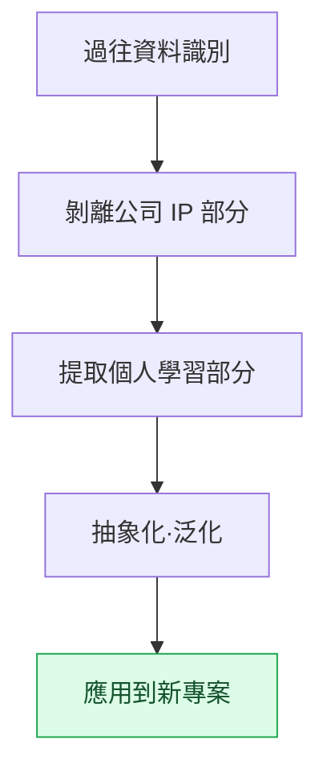

# 附錄 H. 過往工作資料的複用

從業多年的策劃會積累下數十年的工作資料。會議記錄、決策記錄、覆盤、學習筆記,乃至從失敗中得到的教訓。本附錄討論如何把這些資料重新用於新專案。核心張力只有一個:這些資料的很大一部分屬於公司 IP,不能隨意搬走,但其中同時又夾雜著在任何地方都通用的個人學習。區分這兩者,正是複用的起點。

如何使用本附錄,取決於你所處的位置。如果你正想把舊資料引入新專案,請依次閱讀 H.2(分離原則)和 H.3(流程)。如果你擔心搬運過程中會出事故,請先閱讀 H.5(五個陷阱),提前規避。如果你還處於職業生涯早期、可積累的資料不多,請參考 H.6,從現在起決定要留下什麼、如何留下。

這裡講的原則並非什麼宏大的資產管理理論。它可以壓縮成一句話:"把具體的東西留在公司,只帶走抽象的模式。"其餘內容都是把這句話應用到實際情形中的方法。

---

## H.1 過往資料的價值

首先來看會積累哪些資料,以及各自的留存許可權有何不同。因為留存許可權不同,可複用的範圍也會隨之不同。

| 資料 | 留存 |
|---|---|
| 會議記錄(公司資料) | 公司許可權內 |
| 決策卡(公司資料) | 公司許可權內 |
| 季度覆盤(個人+公司) | 可保留個人副本 |
| 學習筆記(個人) | 個人永久 |
| 事故記錄(個人學習) | 個人永久 |

會議記錄和決策卡留在公司許可權之內。覆盤可以保留個人副本,而學習筆記和事故記錄則完全屬於個人資產。長期積累的資料本身就是巨大的學習資產,但絕不能模糊公司 IP 領域與個人領域的邊界。邊界越清晰,就越能安心地複用。

---

## H.2 公司 IP 與個人學習的分離

分離的標準是"具體還是抽象"。具體的產出屬於公司,而產生它的思考模式屬於個人。同一項工作會同時帶出這兩個方面——這一點是關鍵。

| 領域 | 公司 IP | 個人學習 |
|---|---|---|
| 決策內容 | 公司 | — |
| 決策模式(某種情形下適合某種決策) | — | 個人 |
| 遊戲資料 | 公司 | — |
| 運營經驗(規則手冊·工具運營) | — | 個人 |
| 程式碼 | 公司 | — |
| 演算法·結構 | — | 個人 |

"做了什麼決策"屬於公司 IP,而"在這種情形下這種決策更奏效"這樣的模式則是個人學習。遊戲資料的數值本身屬於公司,但運營這些資料的訣竅屬於個人。把具體資料留在公司,只帶走抽象模式——這就是分離的原則。

---

## H.3 複用流程

把分離原則落實到實際工作中,就成了以下五個步驟。識別資料、剝離 IP、提取學習、加以泛化,然後應用到新專案。

這一流程務必在經過公司許可權確認與法務稽核之後再推進。即便抽象化已經足夠,只要起點是公司資料,按流程留一份確認會更安全。

---

## H.4 複用案例——本書

最切近的複用案例就是本書本身。正文各處都源自作者過往的工作,是經過上述流程加以泛化、匿名化後的結果。

| 領域 | 出處 | 複用 |
|---|---|---|
| Layer 整合設計(第 6 部分) | 作者多年運營 | 個人學習 → 泛化 |
| 會議記錄系統(第 17 部分) | 作者的專案A運營 | 公司模式 → 匿名化 |
| 運營經驗(第 24 部分) | 多年積累 | 個人學習 → 泛化 |
| 附錄 A 清單 | 公司專案A | 匿名化 + 部分加工 |

Layer 設計與運營經驗是把個人學習加以泛化,會議記錄系統與附錄 A 則是把公司模式匿名化。所有條目都通過了公司的許可,公司 IP 全部無一遺漏地做了匿名化。本書這一產出本身,可以說就是 H.3 流程的實證。

---

## H.5 複用的 5 個陷阱

複用做得好是資產,做不好就是事故。下面這五個陷阱都是實際中經常踩的點,針對每一個都給出了對策。

### H.5.1 陷阱 1 —— 未通過公司許可

未經公司許可就使用資料,會演變成糾紛。對策很簡單:使用之前先取得公司許可。

### H.5.2 陷阱 2 —— 匿名化遺漏

只要公司名或真實姓名殘留在任何一處,就會釀成 IP 事故。對策是自動 grep 檢查。把公司名·真實姓名·路徑做成 watchlist,讓機器無一遺漏地掃一遍。

### H.5.3 陷阱 3 —— 原樣套用過往

把很久以前的經驗原封不動地拿來用,就會與當下的時點脫節。對策是順應時代重新構建。保留原理,但把工具與語境更新到當前。

### H.5.4 陷阱 4 —— 抽象化不足

只搬運具體案例,就很難套用到其他環境。對策是把抽象模式與具體示例放在一起。用模式獲得普適性,用示例獲得理解。

### H.5.5 陷阱 5 —— 根本不做學習

資料再多,若不再翻看,就等於沒有。對策是定期的學習週期。像日·周·月覆盤那樣,建立一個重新接觸資料的週期。

---

## H.6 讀者參考——複用自己的資料

這一原則並非作者專屬。讀者也可以用同樣的方式複用自己職業生涯的資料。下面是從現在起就能開始的推薦習慣。

| 推薦做法 | 理由 |
|---|---|
| 每季度覆盤自己的決策 | 發現模式 |
| 單獨儲存學習筆記 | 與公司 IP 分離 |
| 明確寫出抽象模式 | 便於未來複用 |
| 指導他人·對外演講 | 分享模式 |
| 出書·部落格(取得公司許可後) | 讓學習永存 |

每季度覆盤自己的決策,就能看出模式;把學習筆記與公司資料分開儲存,日後就能安心地取用。把這些模式通過指導他人、演講、寫作輸出出去,學習就不會用過一次即消失,而會長久留存。歸根結底,自己的學習就是自己的資產。
