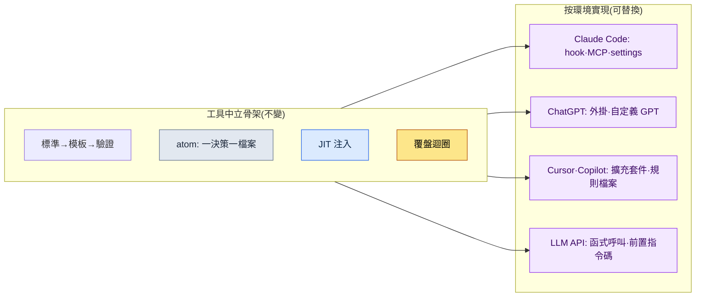

# 附錄 K. 移植到其他 LLM·驅動框架(harness)

本書的案例與工具幾乎全部以一種環境——即 Claude Code——為前提寫成。因此在審批場合或外部評審中,幾乎每次都少不了一條質疑:"這會不會被綁死在某家公司的特定工具上?"策劃負責人對審批依賴單一供應商的決策感到有負擔,懷疑論者擔心一旦工具更換,本書的方法便會整體崩塌,而評估海外版權的一方則會問:當對方國家以別的工具為標準時,本書是否還有用。三者的表述各異,本質卻相同——都是對供應商鎖定(vendor lock-in),即被一種工具困住的不信任。

本附錄的目的就是回應這種不信任。先說結論:本書所倡導的工作骨架是工具中立的。它既不綁定於某個特定的模型名稱,也不綁定於某個特定的命令列工具。Claude Code 只是把這套骨架實現得最為順暢的容器而已,同樣的骨架可以換裝到別的容器中。本附錄將(1)用表格呈現什麼才是與工具無關的骨架,(2)把 Claude Code 的各個要素與移植到其他環境後所對應之物一一配對,(3)在"模型世代會不斷更替"這一前提下,確立一條確認最新狀態的原則,(4)坦率寫下移植時會失去什麼、又能守住什麼。

---

## K.1 與工具無關的骨架

貫穿本書全書的工作方式,可以概括為五根支柱。這五者中沒有任何一個是某個特定模型或命令列工具的功能名稱,而都是對"人與人工智慧協同工作時,如何反覆穩定地產出可信結果"這一問題的回答。因此即便工具更換,它們依然留存。

| 骨架 | 是什麼 | 為何工具中立 |
|---|---|---|
| 標準 → 模板 → 驗證關卡 | 把達成共識的規則(標準)固化為填空式的框架(模板),並設定一道自動篩查結果是否遵守了規則的關卡(門禁) | 規則、框架、檢查這些概念,在任何工具中都能用文字或指令碼表達 |
| atom = 一決策一檔案 | 把一個決策寫進一個小檔案,需要時取出使用,修改時只改那一處 | 把決策拆細放進檔案,只需有檔案系統即可 |
| JIT 注入 | 只把當前對話真正需要的決策,即時(Just-In-Time)挑選出來餵給模型 | 這是"只注入必要上下文"的原則,注入方式不過因工具而異 |
| 覆盤迴圈 | 以日、周、月為單位回顧所做的工作,把反覆出現的模式提升為下一次工作的規則 | 回顧與改進的流程靠的是習慣與文件,而非工具 |
| 工具借用邊界 | 借來的只有骨架(演算法、結構),領域資料留在原處(附錄 B) | 借什麼、留什麼的判斷,在任何工具中都相同 |

這張表最右一欄才是關鍵。五根骨架的定義之中,沒有一次出現某個特定產品的名稱。出現的只有規則、檔案、上下文、習慣、邊界這類任何工作環境裡都存在的普適概念。因此,"要是不能再用 Claude Code 該怎麼辦"這個問題,實際上就轉化成了"如何在別的工具裡實現這五個概念"這個遠為好答的問題。答案就在下一節。

---

## K.2 要素對應表(Claude Code → 其他環境)

Claude Code 裡有一些具體裝置,能方便地實現上述骨架。hook(在特定時點自動執行的指令碼)、MCP(把外部工具與資料連線到模型的規約)、settings 檔案(許可權與環境設定)、斜槓命令(把常用流程用一行呼叫的快捷命令)、技能(可複用的工作組合)等。這些雖是 Claude Code 特有的名稱,但其角色在其他環境中幾乎都有對應物。下面這張表就是它們的配對。

| Claude Code | ChatGPT(網頁·應用) | Cursor / Copilot | 通用 LLM API |
|---|---|---|---|
| hook(時點自動執行) | 對話前後的手動流程 / 自定義 GPT 指令 | 編輯器操作前後的任務·pre-commit 鉤子 | 在呼叫前後插入的前置·後置指令碼 |
| MCP(外部連線規約) | 外掛 / 動作(Action) / 程式碼直譯器 | 擴充套件(extension) / 內建工具呼叫 | 函式呼叫(function calling) / 自建 API 封裝 |
| settings 檔案(許可權·環境) | 自定義 GPT 設定介面 / 專案設定 | `.cursor`·工作區設定檔案 | 程式碼內的設定物件 / `.env`·YAML 設定檔案 |
| 斜槓命令(流程快捷) | 儲存的提示詞 / 自定義 GPT | 程式碼片段(snippet) / 使用者自定義命令 | 提示詞模板函式 |
| 技能(可複用工作組合) | 自定義 GPT / 提示詞集合 | 規則檔案 + 指令碼 | 模組化的提示詞·程式碼函式 |
| CLAUDE.md / 記憶 | 自定義指令 / 記憶功能 | 專案規則檔案(rules) | 系統提示詞 + 外部記憶儲存 |
| atom 檔案集合 | (與工具無關)Markdown 檔案 | (與工具無關)倉庫內的 Markdown | (與工具無關)檔案·資料庫記錄 |

看這張表,有一點會變得清晰:越往右走,即越靠近通用 LLM API 一側,"原本自動替你完成的",就越變成"必須自己動手搭建才能插入的"。在 Claude Code 中一行 hook 就能搞定的自動注入,到了通用 API 裡就成了呼叫前親手編寫的前置指令碼。自動化的便利雖有減少,但骨架本身照原樣遷移。也就是說,移植不是"失去功能",而是"用自己的雙手把便利重新鋪設一遍"。

這張圖就是整篇附錄的一頁概要。上方的方框(骨架)無論箭頭指向哪個環境,內容都不改變;只有下方的方框(實現)會隨環境替換。審批中一旦有人說出"供應商鎖定",你只需攤開這一張圖,回答"被綁住的是下面那一欄,不是上面那一欄"即可。

---

## K.3 "模型名稱會變"這一前提

談到移植,最快過時的資訊就是模型名稱。若把寫作本書時最新的模型名稱釘死在正文裡,那麼下一代模型問世的那一刻,那句話就成了錯誤資訊。因此本書從一開始就遵循一條原則:不依賴某個特定模型的名稱與世代編號來講解,而依賴模型所承擔的角色(推理、摘要、程式碼生成之類的功能)來講解。

| 會變的(不要釘死) | 不變的(可以依賴) |
|---|---|
| 模型產品名·世代編號 | 諸如"擅長推理的模型""能接收長上下文的模型"這類角色區分 |
| 上下文上限的具體數值 | "既有上限,就只注入必要上下文"的 JIT 原則 |
| 價格·速度的具體數值 | "昂貴的作業只執行通過了關卡的那部分"的成本意識 |
| 某項功能的開關方法 | "該功能所承擔的角色"以及可替代它的骨架 |

在實務中確認最新模型與功能的方法,每種工具也只需一行。在 Claude Code 中,用 `/model` 命令即可立即檢視當前所用的模型及可選項;ChatGPT、Cursor 之類的工具,也會在設定介面或模型選擇下拉選單中給出同樣的資訊。因此,如果本書的某句話看上去與模型名稱不符,那不是那句話錯了,而是模型已過了一代。只要角色相同,方法便照舊適用。讀書時若覺得模型名稱陌生,請不要懷疑正文,而應先用 `/model` 之類的命令,確認你手中工具的最新狀態。

---

## K.4 移植時失去的與守住的

換工具一定會失去一些東西。若掩蓋這一事實,反而會失去信任,所以我先坦率寫下會失去什麼。不過,失去的幾乎都屬於"便利"的範疇,守住的則屬於"骨架"的範疇。也就是說,失去的是重新鋪設便可找回的,守住的則本就不曾繫結在工具上。

| 類別 | 專案 | 說明 |
|---|---|---|
| 失去的(便利) | 自動執行的順暢 | 原本像 hook 那樣自動介入的自動化,如今得靠前置·後置指令碼親手搭建 |
| 失去的(便利) | 一體化的單一介面 | 原本命令、工具、檔案匯聚於同一流程,如今可能得分散到多個工具上 |
| 失去的(便利) | 即取即用的技能·命令 | 斜槓命令與技能得按那個工具的方式重新註冊 |
| 守住的(骨架) | 標準·模板·驗證關卡 | 規則、框架與檢查都是文字或指令碼,在任何地方都照原樣存活 |
| 守住的(骨架) | atom·JIT·覆盤迴圈 | 靠檔案與習慣運轉,故工具更換也依舊維持 |
| 守住的(骨架) | 工具借用邊界(附錄 B) | 借什麼、留什麼的判斷標準與環境無關 |

把這張表壓成一句話便是:移植中失去的,是花些時間就能復原的自動化便利;守住的,則是本書從一開始就竭力置於工具之外的工作骨架。因此,對"這不是供應商鎖定嗎"之問,最誠實的回答是:確有被綁住的部分,但那是可以替換的容器,而真正的價值——內容物——從一開始就不曾綁定於任何容器。願這一篇附錄,能在審批場合替你給出這個答案。
