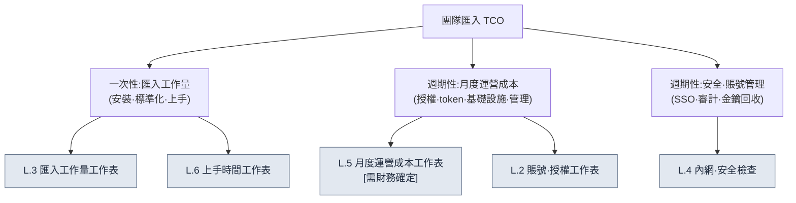

# 附錄 L. 團隊匯入 TCO·上手工作表

> 本附錄是一份填空式工作表,用來回答工作室 PD·負責人的這樣一個問題:"當把單人六個月的系統擴充套件到中等規模團隊時,匯入工作量·運營成本·賬號·內網安全該用什麼、如何估算?"如果說正文 19.3(AI 匯入策略與說服管理層)講的是"不要粉飾 ROI",那麼本附錄就是把這一原則同樣應用到匯入成本一側。也就是說,**本附錄不提供任何數字。**所有單元格都是空白,填寫它們靠的是你所在團隊的測量·估算;凡標註 `[需財務確定]` 的單元格,在財務填寫之前任何人都不得憑估算填補。

本附錄的使用方法如下。首先在 L.1 中,用一張圖把 TCO(Total Cost of Ownership,總擁有成本)拆分為哪些專案理清楚。接著把 L.2\~L.6 的五張工作表按自己團隊規模所在的行,以空白狀態打印出來,自己去測量,或用一行問題交給財務·資訊安全負責人。最後用 L.7 的自查清單確認沒有遺漏的單元格即可。本附錄的價值不在於填好的數字,而在於**把容易遺漏的成本專案預先做成單元格**。

---

## L.1 TCO 不等於授權費用

PD 最常掉進的陷阱,是隻把匯入成本看作"訂閱費 × 人數"。實際的總擁有成本要比這寬得多。它分成一次性投入即結束的**匯入工作量**(安裝·標準化·上手(onboarding))與每月週期性的**運營成本**(授權·token·基礎設施·管理人力),在此之上再疊加看不見的**安全·賬號管理**成本。

這三條分支中,PD 容易低估的是左側(匯入工作量)與右側(安全·賬號)。授權費用會寫在報價單上,而"把單人六個月裡手工積累的標準·技能整理成團隊可共享形態的工作量"與"決定內網中允許外部 LLM 呼叫到何種程度的安全評審",報價單上都沒有,因此它們總是讓工期與預算超支。本附錄的工作表,目的正是先把這些看不見的成本哪怕以空白的形式揭示出來。

> 正文 19.3.6 說過:"成本的絕對值不寫進書裡——它是要從財務那裡拿來填的空白。"本附錄就是把這些空白該放在何處,逐項鋪開。

---

## L.2 賬號·授權工作表

這是最先填寫的表。把誰使用哪個工具、這些許可權如何發放·回收,連同人數一併記錄。人數欄用你團隊的實際人頭填,單價欄從報價單或公開價目表取來填。本書不寫單價。

| 專案 | 填寫什麼 | 由誰填寫 | 本團隊值 |
|---|---|---|---|
| 各工具席位數 | 每個工具所需的賬號(席位)數 | 主管 | ______ 席位 |
| 許可權等級分佈 | full / 按任務 cap / 外包一次性人員(附錄 C.1.2) | 主管 | full __人 / 一般 __人 / 外包 __人 |
| 席位單價 | 各工具的每月席位費用 | 財務·採購 | ______ /席位·月 |
| 是否公用金鑰 | 團隊公用 API 金鑰 vs 個人金鑰 | 資訊安全 | □ 公用 □ 個人 |
| 發放流程 | 新入職者賬號的發放路徑·耗時 | 主管 | ______ |
| 回收流程 | 離職·外包結束時金鑰/席位的回收路徑 | 資訊安全 | ______ |

規則有兩條。第一,**外包·短期人員不要常設發放席位,而應按任務單位開通並回收**(附錄 C.1.2)。第二,**回收流程欄為空時,不啟動發放。**最常見的事故是離職者賬號未被回收,導致成本與金鑰洩露一併外洩,因此要先設計回收、再設計發放。

---

## L.3 按團隊規模的匯入工作量工作表

這是一張按規模估算"單人六個月"擴充套件為團隊時新增的一次性工作量的表。工作量欄以**人日(一個人工作一天的量)**為單位,由你團隊實際測量或估算填寫。本書不提供人日數——因為它隨團隊的熟練度·既有標準的整理程度而大幅變化。

| 匯入工作量專案 | 1\~3 人 | 4\~10 人 | 11\~30 人 | 31\~50 人 | 測量/估算主體 |
|---|---|---|---|---|---|
| 環境安裝·配置(工具·hook·許可權) | ___人日 | ___人日 | ___人日 | ___人日 | 主管/基礎設施 |
| 單人資產的團隊共享化(技能·標準·atom 整理) | ___人日 | ___人日 | ___人日 | ___人日 | 主管 |
| 團隊標準的建立(命名·前置後設資料·規則手冊,附錄 D) | ___人日 | ___人日 | ___人日 | ___人日 | 主管 |
| 驗證關卡搭建(lint·規則手冊自動化) | ___人日 | ___人日 | ___人日 | ___人日 | QA/主管 |
| 上手資料製作(與 L.6 聯動) | ___人日 | ___人日 | ___人日 | ___人日 | 主管 |
| 合計(匯入一次性工作量) | ___人日 | ___人日 | ___人日 | ___人日 | — |

填這張表時容易漏掉的是第二行。單人在六個月裡積累在腦中與個人資料夾裡的資產,若要團隊共享,就需要有人把它取出、整理並做成文件的額外工作量。若把這份工作量當作"0",匯入進度必然拖延。此外,表格的單元格形狀也預先呈現出:規模越大,比起安裝工作量,**標準建立·驗證關卡(verification gate)**的工作量增長得更陡——因為人一多,需要達成一致的標準數量就會增加。

> 遵循正文 19.3.1 的分階段匯入(由保守到進取),就不必在一個季度內把這份工作量用盡,而可以從第 1 階段(上下文注入)的試點開始分散投入。不要試圖一次性把表中的合計報批,而是先把第 1 階段的工作量單獨拆出來報批,這才現實。

---

## L.4 內網·安全檢查工作表

這是 PD·負責人最直接懼怕的領域。逐項檢查有什麼會流向外部 LLM、內網中允許外部呼叫到何種程度。這張表是一份判定合格/暫緩的檢查清單(與附錄 C.6 安全聯動),只要有一項未定,就暫緩該範圍的匯入。

| 檢查專案 | 通過標準 | 負責 | 狀態 |
|---|---|---|---|
| 向外部 LLM 傳輸的資料範圍 | 敏感資料用佔位符(placeholder)/自託管(C.6) | 資訊安全 | □ 通過 □ 暫緩 |
| 支付·個人資訊傳輸 | 明文規定無例外禁止傳輸 | 資訊安全 | □ 通過 □ 暫緩 |
| 內網外部呼叫策略 | 定義允許域名·代理·日誌保留期 | 基礎設施 | □ 通過 □ 暫緩 |
| 是否需要自託管 | 決定核心 IP 是否用自託管模型處理 | 負責人/資訊安全 | □ 已決定 □ 未定 |
| 金鑰洩露事故應對 | 立即更換 + 使用記錄審查路徑(C.7) | 資訊安全 | □ 通過 □ 暫緩 |
| 審計日誌 | 記錄·儲存誰·何時·呼叫了什麼 | 基礎設施 | □ 通過 □ 暫緩 |
| 公司 IP 外洩檢查 | grep watchlist 等事前檢查流程(附錄 B.6) | 主管 | □ 通過 □ 暫緩 |
| 外包訪問隔離 | 外包賬號阻斷核心資產訪問·按任務隔離 | 資訊安全 | □ 通過 □ 暫緩 |

這張表中成本差距最大的一欄是第四行(是否需要自託管)。一旦決定核心 IP 絕不能發往外部 LLM,自託管的基礎設施成本就會整塊疊加到 L.5 的運營成本上。因此這一決定不該由主管、而應由**負責人·資訊安全共同**作出;在決定之前,L.5 的基礎設施欄無法確定。兩張工作表通過這一欄相連。

---

## L.5 月度運營成本工作表 [需財務確定]

這是一張把每月週期性成本逐項分解的表。**本表的金額欄全部為空白;凡標註 `[需財務確定]` 的單元格,在財務填寫之前任何人都不得憑估算填補。**token 單價·訂閱費·基礎設施費用會隨模型·呼叫量·合同每月變化,因此本書不寫絕對值。

| 運營成本專案 | 計算方式 | 由誰填寫 | 每月金額 |
|---|---|---|---|
| 授權·訂閱 | 席位數 × 席位單價(L.2) | 財務 | [需財務確定] |
| LLM token 成本 | 呼叫量 × token 單價,各工具上限(cap)之和 | 財務 | [需財務確定] |
| 基礎設施(自託管時) | 依 L.4 決定的伺服器·GPU·儲存 | 財務·基礎設施 | [需財務確定] |
| 備份·同步 | 儲存庫·備份儲存(附錄 C.5) | 財務 | [需財務確定] |
| 運營管理人力 | 工具·金鑰·日誌管理負責人的時間折算 | 主管·財務 | [需財務確定] |
| 每月合計 | 上述專案之和 | 財務 | [需財務確定] |

這張表的規則只有一條,**讓空白保持空白**。請回想正文 19.3.2 中 AI 把運營成本欄煞有介事地捏造成 `$4,500` 的失敗——無論人還是 AI,一旦憑估算填補這一欄,那份報告在第一個提問下就會崩塌。真正控制成本的機制不是金額,而是**各工具設有每月上限(cap)、超額會自動上報的結構**(19.3.6)。報批時要向管理層展示的,不是填好的金額,而是"設有上限、超額會上報"的結構,以及交給財務去填的空白清單。

> 第五行(運營管理人力)最常被遺漏。工具裝好並非就此了事,它每月都在吃掉那個回收金鑰、檢視日誌、調整上限的人的時間。若把這一欄置為 0,那份工作就會藏進主管看不見的加班裡。

---

## L.6 上手時間工作表

這是一張分階段估算一名新成員在系統之上做到獨當一面所需時間的表。時間欄最準確的做法,是在你團隊裡實際讓人上手一次再測量(與正文 19.3.7 的基線測量方法同一做法)。測量之前,保持空白。

| 上手階段 | 做什麼 | 測量時間 | 備註 |
|---|---|---|---|
| 環境安裝 | 直到工具·hook·賬號配置完成 | ___小時 | 與 L.2 發放流程聯動 |
| 標準學習 | 熟悉命名·前置後設資料·規則手冊(附錄 D) | ___小時 | 有資料則可縮短 |
| 首個任務(保守) | 用上下文注入產出首個成果·通過評審 | ___小時 | 19.3.1 的第 1 階段 |
| 適應驗證關卡 | 按 lint·規則手冊關卡開展工作 | ___小時 | — |
| 達到獨立工作 | 無需監督即可工作·作出採納判定 | ___天 | 上手完成標準 |

填完這張表,就會顯出匯入工作量(L.3)中"上手資料製作"一欄為何重要。上手資料整理得越好,第二·第三行的時間就越短;新成員越多,這份節省就越是累積。也就是說,上手資料製作是一次性工作量,而回收則按成員數量反覆發生。正文 19.3.3 所說的"JIT 自動注入 221 條——新成員也在同一套規則之上工作",在這張表裡體現為第三行的時間縮短。

> 最後一行(達到獨立工作)才是上手的真正完成標準。若把環境安裝完成誤當作上手完成,監督成本就會不斷堆積在主管身上。標準應當是"無需監督即可作出採納判定"。

---

## L.7 匯入前自查清單

最後,是把這些工作表拿給管理層之前,自己必須先通過的專案。秉持與附錄 B.6(借用前檢查)相同的精神,只要有一項為空,就推遲報批,先填那一欄。

| 檢查專案 | 通過標準 |
|---|---|
| 是否已定義賬號回收流程 | L.2 的回收流程欄不為空 |
| 安全檢查是否全部通過/已決定 | L.4 中 □暫緩·□未定 為 0 項 |
| 運營成本的空白是否已交給財務 | L.5 的 [需財務確定] 已作為問題發出 |
| 是否把匯入工作量拆成了階段 | 不按 L.3 合計,而從第 1 階段的工作量開始報批 |
| 上手完成標準是否為"獨立工作" | 以 L.6 最後一行判定完成 |
| 是否未把估算值寫成斷言 | 在所有估算欄標註"估算·樣本數" |

請不要把這張表讀作五欄的合格,而請把它讀作六道鎖。把單人系統擴充套件為團隊這件事確實可行,但這一擴充套件的成本並非授權費用;唯有誠實地填滿這六欄空白,整體圖景才會顯現。而且,任何一欄都不要交給 AI 去填——AI 會像正文 19.3.2 那樣,用煞有介事的數字填補空白。AI 的位置,止於接過你測量的值、整理成報批幻燈片的文句。
