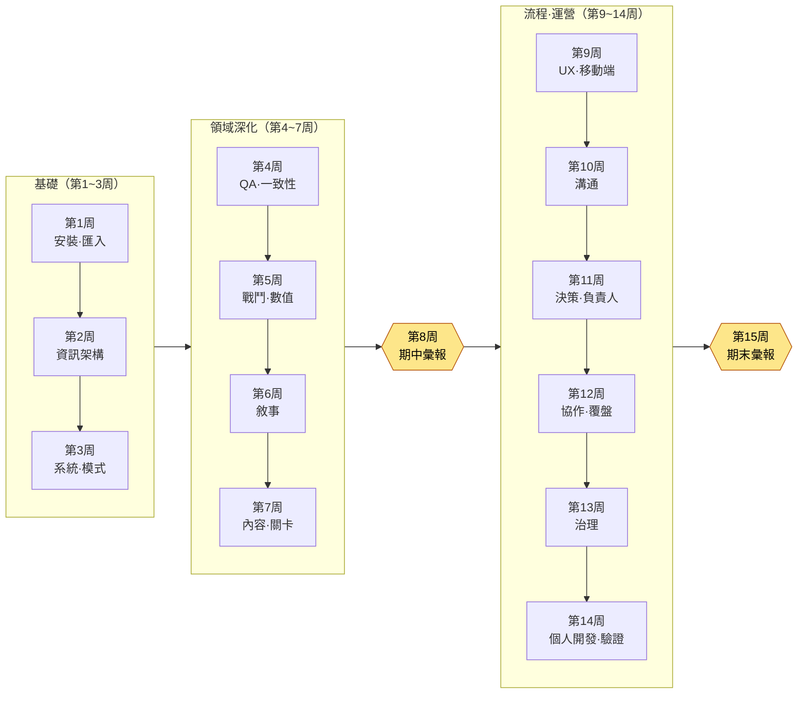

# 附錄 N. 教學用 15 周進度表·難度指南

本附錄面向想把本書用作一學期課程教材的讀者——大學、專科院校、培訓機構的授課教師，企業內訓負責人，學習小組的組織者。要把一本近1,000頁的大部頭按學期切分，比想象中更讓人無從下手。哪一部分放在第幾周、如何把正文中的「動手試試」轉化為作業、以什麼標準為提交物評分——這三點一旦卡住，再好的書也難以被選作教材。本附錄把這三件事做成可以照搬使用的工具。

本附錄的使用方法如下。首先，結合自己的教學日程閱讀 N.1 的 15周進度表（16周與短學期的變體另見 N.2），再用 N.3 的難度徽章與先修知識表衡量學員水平。接著，複製 N.4 的評分量規(rubric)，按自己的作業只替換其中的條目即可。所有表格都編排成可以直接列印、貼進教學大綱(syllabus)的形式。

有一點需要先說明。本書每一章都以「動手試試」收尾。讓讀者不是讀完就合上，而是當天就動手——這正是正文的目標；而在教學中，這個「動手試試」正好成為作業的第一手素材。本附錄的進度表之所以一併寫明如何把正文的「動手試試」轉化為各周作業，原因就在這裡。

---

## N.1 15周標準進度表

這是按最常見的15周制（每週1次、每次3小時）學期編排的標準進度表。本書的24個部分不會在一個學期內全部講完——硬塞進去的話，哪一部分都不會真正留在手上。取而代之，我們選擇了這樣的結構：**先把基礎（第1·2部分）夯實，從各領域中挑出有代表性的5\~6個深入講解，再從流程·運營中只選取核心內容收尾**。未講解而留下的部分標註為「延伸閱讀」，引導感興趣的學員自行展開。

學習目標全部以“學員能做到什麼”的動詞來寫。不是“知道”，而是“做出·驗證·選出”。全書反覆強調“AI 給出候選，人來篩選”這一句話，因此目標的動詞也遵循這一分工。

| 周次 | 涉及的部分·章節 | 學習目標（結課後能做到） | 轉化為作業的「動手試試」 |
|---|---|---|---|
| 1 | 1.0 開始之前 + 第1部分（匯入） | 講解終端·賬號·計費結構，在自己的 PC 上安裝 AI 工具並開啟第一個會話 | 1.0 安裝「動手試試」——提交安裝截圖 + 第一次的提示詞與輸出 |
| 2 | 第2部分（資訊架構） | 用 YAML frontmatter 將文件資料化，設計資料夾·命名規範 | 2.1 frontmatter「動手試試」——為自己的3份文件新增 frontmatter |
| 3 | 第3部分（系統策劃） | 以模式優先(schema-first)原則，先定義資料表的 $스키마 | 3.2 模式「動手試試」——為一種迷你資料表編寫規格書 |
| 4 | 第10部分（QA·一致性） | 跟著做出用程式碼檢查30張資料表 FK 一致性的工具 | 10.1 一致性驗證「動手試試」——**用 N.4 量規評分的核心作業** |
| 5 | 第4部分（戰鬥） + 第8部分（數值） | 將戰鬥數值按 Layer 分解，把確定性的數值平衡公式沉澱為規則手冊 | 8.1 數值公式「動手試試」——一種傷害公式 + 模擬 |
| 6 | 第5部分（敘事） | 製作 NPC 臺詞的 voice_profile，用 voice_lint 抓出語氣偏離 | 5.2 voice_profile「動手試試」——為一名角色編寫語氣檔案(voice profile) |
| 7 | 第6部分（內容） + 第7部分（關卡） | 區分程式化生成的兩條軸（規則·AI），批次產出並評審內容候選 | 6.2 生成器「動手試試」——生成10條內容候選 + 評審日誌 |
| 8 | **期中檢查·彙報** | 整合第1\~7周的作業，以自己的迷你專案進行演示 | 期中作業彙報（整合第3\~6周產出的演示） |
| 9 | 第9部分（UX·UI） + 第14部分（移動端） | 用 lint 檢查 HUD，抓出視線偏移·對比度不足，並把 PC 端 HUD 壓縮到移動端 | 9.1 HUD lint「動手試試」——一種介面的 lint 報告 |
| 10 | 第16部分（溝通者） + 第17部分（會議紀要） | 在隔離的工作空間中只將決定定為正本，並把會議紀要結構化 | 17.x 會議紀要「動手試試」——將1份真實會議錄音結構化 |
| 11 | 第18部分（決策） + 第19部分（團隊負責人） | 把決定留存為可追溯的卡片，把願景轉化為決策的評分表 | 18.1 決策追溯「動手試試」——編寫3張決策卡 |
| 12 | 第20部分（協作記憶） + 第21部分（自我改進） | 把協作上下文作為記憶來運營，讓覆盤運轉成自我改進的迴圈 | 第21章 覆盤「動手試試」——1份周覆盤 + 1條抽取規則 |
| 13 | 第22部分（治理） | 檢查提示詞·幻覺·成本·法務·倫理的邊界並訂立規則 | 22.1 提示詞「動手試試」——1份工作指示書 + 幻覺檢查流程 |
| 14 | 第23部分（個人開發） + 第24部分（運營進階） | 用單人精簡版遷移工具，用程式碼驗證一致性·連結·stale | 24.1 驗證「動手試試」——一種針對自己專案的驗證指令碼 |
| 15 | **期末專案彙報·評估** | 設計·演示·驗證一條貫穿整個學期的個人工作流 | 期末作業彙報（以 N.4 擴充套件量規評估） |

> **延伸閱讀（不含在課程內，建議自主學習）：** 第11部分（角色·寵物·坐騎）、第12部分（美術指導）、第13部分（資料·KPI）、第15部分（運營）。這四個部分領域針對性很強，故留給感興趣的學員結合自身領域自行展開。以附錄 F（案例索引）為嚮導，便可從貼近自己環境的案例開始反向檢索進入。

進度流程一目瞭然，如下所示。這是一個具有兩座高峰（期中·期末）的結構：基礎 → 領域深化 → 期中整合 → 流程·運營 → 期末整合。

---

## N.2 學期長度變體（16周 / 短學期8周）

各學校的學期長度不盡相同。除標準的15周外，這裡給出最常遇到的兩種變體的調整方案。無論採用哪種變體，都建議保留核心作業（第4周的一致性檢查）與兩座彙報高峰——因為這裡正是本書誠實原則（“展示的不是效果，而是結構”）體現得最充分的地方。

| 學期形態 | 調整方法 |
|---|---|
| 16周制 | 標準15周 + 第16周增設 **補強·再評估周**。給予期末作業重新提交的機會，或從「延伸閱讀」4個部分中由學員投票選定1個部分開設專題講座 |
| 短學期8周（每週2次或集中授課） | 第1周（安裝·匯入） → 第2周（資訊·模式） → 第3周（一致性，核心作業） → 第4周（戰鬥·數值·敘事合併） → 第5週期中彙報 → 第6周（會議·決策·協作） → 第7周（治理·驗證） → 第8週期末彙報。領域縮減為有代表性的3個，「動手試試」在課堂上作為實操吸收消化 |
| 翻轉課堂(flipped classroom) | 把通讀正文放到課前作業，課堂時間全部分配給「動手試試」實操與量規互評。本書的程式碼無需外部依賴即可直接執行，適合以實操為中心的教學 |

---

## N.3 章節難度徽章·先修知識

即便在同一本書裡，各章所要求的背景知識也不相同。有些章即使是初次接觸終端的大一學生也能跟上，有些章則需要具備資料庫鍵的概念或統計基礎才能完全消化。為便於按學員水平調整進度、或指引先修課程，這裡用三級徽章加以歸納。

各徽章的含義如下。

| 徽章 | 等級 | 含義 |
|---|---|---|
| 🟢 入門 | 入門 | 非專業、大一學生也能跟上。程式碼只需達到複製·執行的程度即可 |
| 🟡 實務 | 實務 | 需要能讀懂程式碼並按自己的資料加以修改。建議理解策劃實務的語境 |
| 🔴 進階 | 進階 | 處於設計·擴充套件演算法與結構的階段。若無先修知識，消化難度較高 |

各周核心部分的徽章與先修知識如下。“先修知識”是指為順利跟上該周而最好提前具備的背景，並非沒有它就無法修讀。

| 周次 | 核心部分 | 徽章 | 先修知識 |
|---|---|---|---|
| 1 | 1.0·第1部分 匯入 | 🟢 入門 | 無（以初次接觸終端為前提） |
| 2 | 第2部分 資訊架構 | 🟢 入門 | 使用文本編輯器 |
| 3 | 第3部分 系統·模式 | 🟡 實務 | 表格/電子表格基礎，資料型別概念 |
| 4 | 第10部分 一致性驗證 | 🔴 進階 | **Python 基礎**（函式·迴圈），關係鍵(FK)概念 |
| 5 | 第4·8部分 戰鬥·數值 | 🟡 實務 | 四則運算式，**表格計算**（Excel 函式） |
| 6 | 第5部分 敘事 | 🟢 入門 | 角色·劇本寫作的感覺 |
| 7 | 第6·7部分 內容·關卡 | 🟡 實務 | 程式化生成概念（建議），座標·網格的感覺 |
| 9 | 第9·14部分 UX·移動端 | 🟡 實務 | 屏幕布局·解析度概念 |
| 10 | 第16·17部分 溝通 | 🟢 入門 | 無（有協作經驗更有利） |
| 11 | 第18·19部分 決策·負責人 | 🟡 實務 | 團隊協作·專案管理經驗（建議） |
| 12 | 第20·21部分 協作·覆盤 | 🟡 實務 | 修完第2周資訊架構 |
| 13 | 第22部分 治理 | 🟡 實務 | **基礎統計**（平均值·分佈，幻覺檢測語境），著作權基礎 |
| 14 | 第23·24部分 個人·運營 | 🔴 進階 | Python 基礎，git 基礎，修完第4週一致性 |

> **先修課程一句話說明（供教學大綱使用）：** “建議具備 Python 入門或與之相當的程式設計基礎，但並非必需。第4·14周的進階章節以 Python 函式·迴圈的水平為前提；未修讀者可通過第1\~3周的入門軌道充分跟上，為此將作業分軌運營。”

根據學員構成的運營建議如下。

- **非專業·通識課：** 若把 🔴 進階（第4·14周）以“讓 AI 生成程式碼、由人評審結果”的形式運營，即使是未修讀 Python 的學員也能達成學習目標。本書正文所展示的“人守住評審者的位置”這一分工，便可直接成為教學設計。
- **專業·實務培養課程：** 在 🔴 進階章節中，讓學員親自逐行閱讀並講解 AI 生成的程式碼，評審能力本身便成為評估物件（與 N.4 量規第4項相連）。

---

## N.4 評分量規示例 —— 一致性檢查工具的動手試試（第4周核心作業）

沒有量規，「動手試試」的提交物很容易只按“能跑/不能跑”的二分法來評分。這樣一來，本書最為看重的東西——**評審並拒絕 AI 輸出的過程**——就會在評估中消失。因此，這裡以第4周核心作業（10.1 一致性驗證 atom「動手試試」）為例，給出一份不僅評判成果、還評判其過程的量規。其他各周的作業也只需替換條目名稱即可照搬使用。

**作業定義：** 針對自己製作的（或提供的）多種資料表，與 AI 一起做出檢查表間外部索引鍵(FK)一致性的工具，並演示該工具能否抓出故意埋入的錯誤。提交物包括：① 工具程式碼 ② 檢查執行結果（通過/失敗報告） ③ 向 AI 輸入的提示詞全文，以及其中被拒絕·修改的輸出的記錄。

量規由4個條目、每項25分（共100分）構成。關鍵在於：與“工具能跑”（第2項）相區別，**如何駕馭 AI**（第3·4項）以一半的權重來評估。

| # | 評估條目 | 分值 | 欠缺（0\~12） | 一般（13\~19） | 優秀（20\~25） |
|---|---|---|---|---|---|
| 1 | **一致性規則定義** —— 是否明確了檢查哪些 FK 關係、為何檢查 | 25 | 檢查物件關係不明確或隨意 | 識別出主要 FK 關係，但依據說明不足 | 將表間關係連同圖示·依據一併定義，並說明檢查的優先順序 |
| 2 | **工具執行·錯誤檢出** —— 是否真正抓出埋入的錯誤 | 25 | 無法執行，或漏掉明顯的錯誤 | 抓出大部分錯誤，但有部分遺漏·誤報 | 抓出所有埋入的錯誤，且無誤報，報告以人可讀的形式輸出 |
| 3 | **AI 使用過程的透明度** —— 提示詞全文與輸出是否以可復現的方式記錄 | 25 | 無提示詞·輸出記錄，或僅附結果 | 有提示詞，但缺少拒絕·修改的過程 | 將輸入的提示詞全文、原始輸出、拒絕·再指示的過程按時間順序留存 |
| 4 | **評審·拒絕的判斷** —— 拒絕·修改了 AI 輸出的什麼、為什麼 | 25 | 原樣接受輸出（無評審痕跡） | 做了部分修改，但判斷依據薄弱 | 指出並拒絕錯誤·幻覺·過度設計，並用自己的話說明其判斷依據 |

> **評分運營備註：** 第3·4項（合計50分）是這份量規的脊樑。即便工具執行得完美無缺（第2項滿分），若對 AI 輸出不加批判地接受（第4項欠缺），則視為未達本作業的學習目標——“人守住評審者的位置”。反過來，即使工具尚有不完善之處，只要拒絕·再指示的過程紮實，也能拿到高分。評估的不是效果（能跑出的結果）而是結構（如何駕馭），本書的這一原則在評分中同樣適用。

對於期末作業，建議在上述4項之上再加 **⑤ 工作流泛化（說明如何移植到自己的領域）** 1項，構成5項、每項20分的擴充套件量規。能否把整學期講過的工具遷移到自己的專案中——這正是本書在最後所提出的問題，而課程的最終評估也用同一個問題就足夠了。

---

## N.5 教學運營一頁速覽

最後，把本附錄濃縮為一頁，就是這樣。

- **做取捨，不要全塞進去。** 不要試圖把24個部分全部講完，而是用基礎（第1·2部分）+ 一致性（第10部分）+ 領域代表5\~6個 + 流程·運營核心來編排一個學期。其餘留作「延伸閱讀」。
- **把「動手試試」轉化為作業。** 正文本就設計成讓人動手，因此作業設計的一半已在書中。
- **評分的是評審，而不是結果。** 把量規的重心放在“如何駕馭 AI”上。這正是讓本書自始至終反覆強調的那句話——AI 給出候選，最後的決定由人來做——在課堂上保持鮮活的方法。

這份進度表是起點，而非標準答案。請結合自己學員的水平與教學日程，調整週次、更換作業。把本書整本餵給 AI 工具，讓它“按我課程的16周安排和學員水平重新編排這份進度表”——正如本書最快的用法那樣——也是一條敞開的路。
